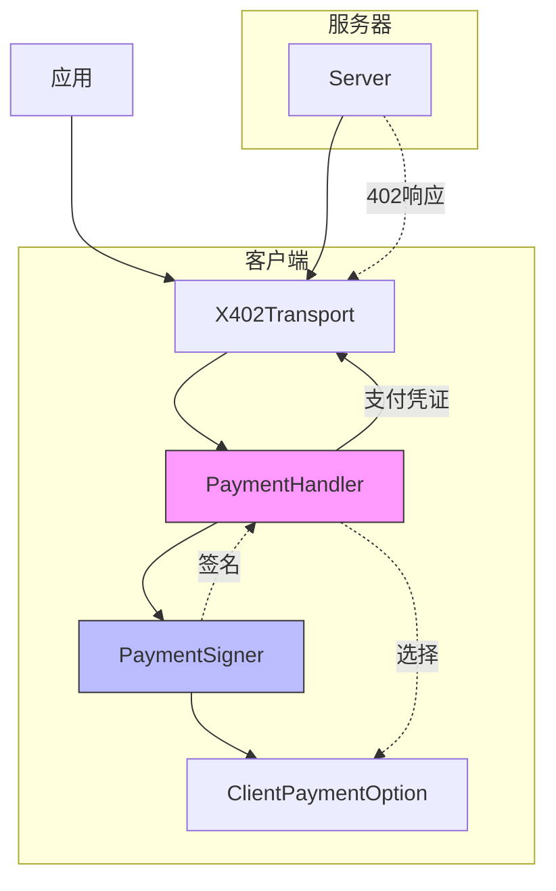
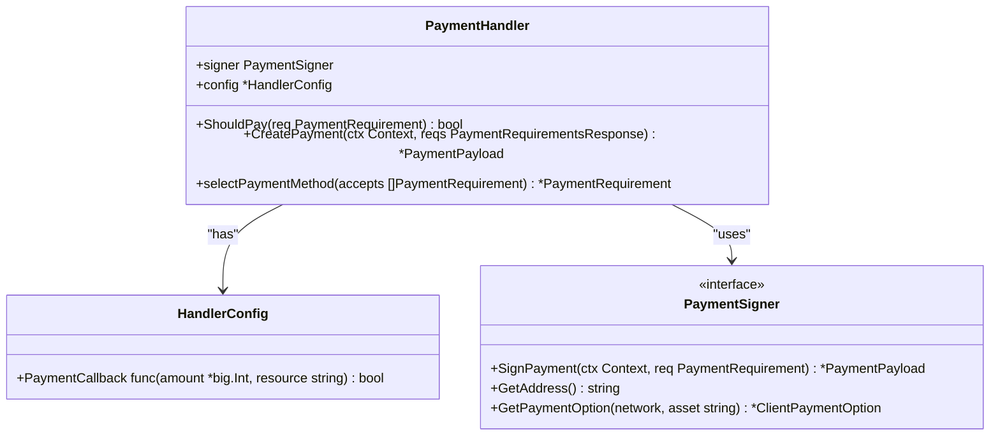
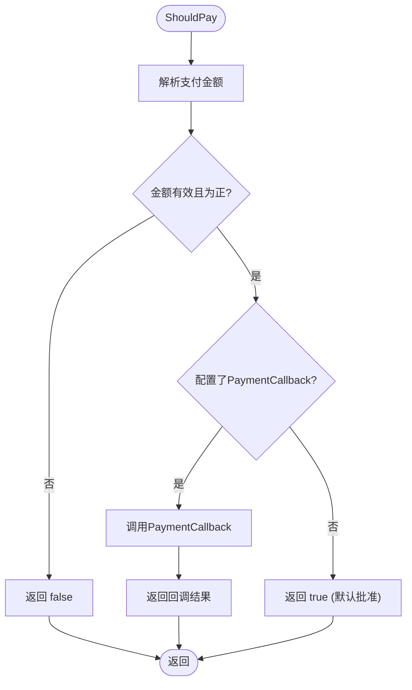
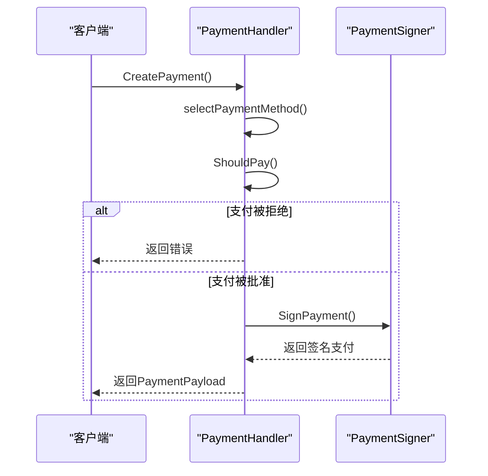
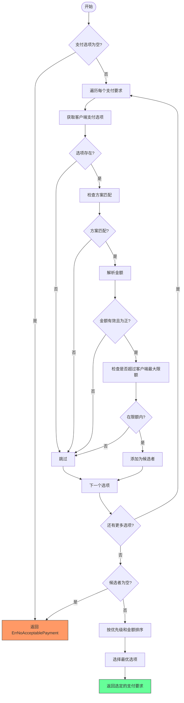
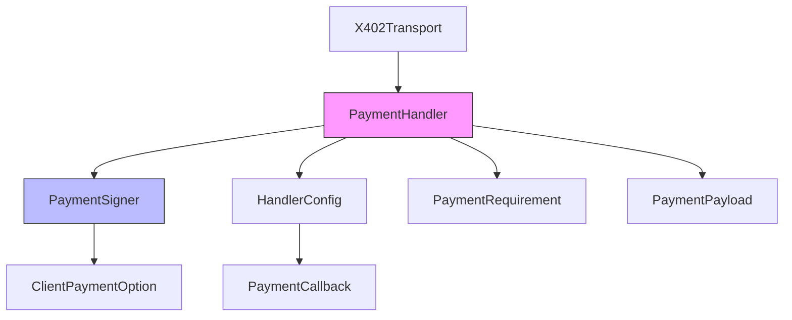

# PaymentHandler支付处理器

<cite>
**Referenced Files in This Document**   
- [handler.go](file://handler.go)
- [signer.go](file://signer.go)
- [types.go](file://types.go)
- [client_options.go](file://client_options.go)
- [errors.go](file://errors.go)
- [transport.go](file://transport.go)
- [examples/client/main.go](file://examples/client/main.go)
</cite>

## 目录
1. [简介](#简介)
2. [核心组件](#核心组件)
3. [架构概述](#架构概述)
4. [详细组件分析](#详细组件分析)
5. [依赖分析](#依赖分析)
6. [性能考虑](#性能考虑)
7. [故障排除指南](#故障排除指南)
8. [结论](#结论)

## 简介
PaymentHandler是mcp-go-x402客户端的核心支付处理组件，负责处理HTTP 402支付要求响应。它在客户端与服务器的支付交互中扮演关键角色，根据服务器返回的支付要求决策是否支付，并创建相应的支付凭证。该处理器实现了完整的支付流程，包括支付决策、支付方式选择和支付签名。通过灵活的配置选项，特别是PaymentCallback回调机制，应用层可以完全控制支付授权策略。PaymentHandler与PaymentSigner紧密协作，确保支付的安全性和正确性，是整个x402支付协议实现的关键部分。

## 核心组件
PaymentHandler是x402支付系统的核心，封装了处理402响应的完整逻辑。它通过NewPaymentHandler函数创建，需要一个PaymentSigner实例和HandlerConfig配置。PaymentHandler的主要职责包括：使用ShouldPay方法根据配置和回调决定是否进行支付；通过selectPaymentMethod方法从服务器提供的多个支付选项中选择最优方案；最后调用CreatePayment方法完成支付创建和签名。该处理器与transport层集成，当客户端收到402错误时，由X402Transport触发PaymentHandler的支付流程。PaymentHandler的设计体现了关注点分离原则，将支付决策、选择和执行逻辑清晰地划分，同时通过接口依赖(PaymentSigner)实现了灵活性和可测试性。

**Section sources**
- [handler.go](file://handler.go#L10-L152)
- [transport.go](file://transport.go#L213-L309)

## 架构概述

**Diagram sources**
- [handler.go](file://handler.go#L10-L152)
- [signer.go](file://signer.go#L23-L38)
- [transport.go](file://transport.go#L36-L36)

## 详细组件分析

### PaymentHandler结构分析
PaymentHandler结构体是支付处理的核心，包含两个关键字段：signer和config。signer字段实现了PaymentSigner接口，负责实际的支付签名操作和支付选项管理。config字段指向HandlerConfig，包含可选的PaymentCallback，用于自定义支付决策逻辑。这种设计通过依赖注入实现了高度的灵活性，允许不同的签名实现和配置策略。PaymentHandler通过NewPaymentHandler工厂函数创建，该函数验证输入参数并提供合理的默认值，体现了健壮的构造模式。

**Diagram sources**
- [handler.go](file://handler.go#L10-L18)
- [handler.go](file://handler.go#L16-L18)
- [signer.go](file://signer.go#L23-L38)

### NewPaymentHandler函数分析
NewPaymentHandler是PaymentHandler的构造函数，负责创建和初始化PaymentHandler实例。该函数接受两个参数：PaymentSigner和HandlerConfig。它首先验证signer参数不为nil，这是确保支付功能正常工作的基本要求。如果config参数为nil，则创建一个空的HandlerConfig实例，这提供了合理的默认行为，避免了空指针异常。函数成功时返回一个指向新创建的PaymentHandler的指针和nil错误。这种设计遵循了Go语言的错误处理惯例，通过返回错误而不是panic来处理无效输入，使调用者能够优雅地处理错误情况。

**Section sources**
- [handler.go](file://handler.go#L21-L34)

### ShouldPay方法决策逻辑
ShouldPay方法实现了支付授权的决策逻辑，是应用层控制支付策略的关键入口。该方法首先解析支付要求中的金额，将其转换为*big.Int类型以支持大数运算，并验证金额为正数。如果HandlerConfig中配置了PaymentCallback，则调用该回调函数，将解析后的金额和资源标识传递给应用层，由应用层决定是否批准支付。如果未配置回调，则默认批准支付。这种设计模式允许应用根据业务逻辑、用户偏好或安全策略动态决定支付行为，例如基于金额大小、资源类型或用户余额进行条件支付。

**Diagram sources**
- [handler.go](file://handler.go#L37-L55)

### CreatePayment方法流程
CreatePayment方法执行完整的支付创建流程，是PaymentHandler的核心功能。该方法首先调用selectPaymentMethod从服务器提供的支付选项中选择最佳方案。然后，它调用ShouldPay方法检查是否应该进行此支付。如果决策为否，则返回支付被拒绝的错误。如果决策为是，则调用signer的SignPayment方法对选定的支付要求进行签名，生成最终的支付凭证。整个流程体现了清晰的顺序执行和错误传播机制，确保了支付操作的原子性和安全性。该方法的上下文参数(ctx)支持超时和取消，增强了系统的响应性。

**Diagram sources**
- [handler.go](file://handler.go#L58-L82)

### selectPaymentMethod筛选逻辑
selectPaymentMethod方法实现了复杂的支付方式筛选和排序逻辑。该方法遍历服务器提供的所有支付选项，对每个选项执行一系列过滤检查：验证客户端是否支持该网络和资产；确认支付方案(scheme)匹配；解析并验证支付金额为正数；检查所需金额是否在客户端为此选项配置的最大支付限额内。通过这些检查的选项被收集为候选者。最后，候选者按优先级升序排序，优先级相同时按金额升序排序，选择第一个（最优）选项。这种多级筛选和排序机制确保了支付选择的最优性和安全性。

**Diagram sources**
- [handler.go](file://handler.go#L85-L152)

### PaymentCallback自定义策略示例
PaymentCallback机制允许应用层实现自定义的支付策略。在示例代码中，可以通过配置OnPaymentAttempt、OnPaymentSuccess和OnPaymentFailure回调来实现详细的支付控制和监控。例如，可以实现一个策略，仅当支付金额低于某个阈值时才自动批准，否则需要用户确认。或者，可以根据资源类型决定支付行为，对特定服务优先支付。这些回调不仅用于决策，还可用于日志记录、监控和用户体验反馈，使应用能够全面掌控支付流程。

**Section sources**
- [examples/client/main.go](file://examples/client/main.go#L70-L86)

### 错误处理与ErrNoAcceptablePayment
错误处理是PaymentHandler的重要组成部分。ErrNoAcceptablePayment错误在selectPaymentMethod方法中产生，当没有找到可接受的支付方式时返回。这可能由多种原因引起：服务器提供的支付选项与客户端配置不匹配（网络、资产、方案不匹配）；所有选项的金额超出客户端配置的最大限额；或服务器未提供任何支付选项。解决方案包括检查客户端的PaymentSigner配置，确保支持服务器要求的网络和资产，调整最大支付限额，或联系服务器管理员确认支付要求。其他关键错误如支付签名失败或金额无效也得到妥善处理，确保了系统的健壮性。

**Section sources**
- [errors.go](file://errors.go#L10-L10)
- [handler.go](file://handler.go#L87-L87)
- [handler.go](file://handler.go#L140-L140)

## 依赖分析

**Diagram sources**
- [handler.go](file://handler.go#L11-L12)
- [signer.go](file://signer.go#L23-L38)
- [client_options.go](file://client_options.go#L10-L10)

## 性能考虑
PaymentHandler的设计考虑了性能因素。支付选择和决策逻辑在内存中快速执行，不涉及I/O操作，确保了低延迟。金额解析和比较使用高效的big.Int运算。排序操作的时间复杂度为O(n log n)，在典型场景下（少量支付选项）性能良好。通过在NewPaymentHandler中预验证依赖项，避免了运行时的昂贵检查。与PaymentSigner的交互（主要是签名操作）是潜在的性能瓶颈，但被合理地隔离在单独的组件中，允许独立优化。整体设计平衡了功能完整性与执行效率。

## 故障排除指南
常见问题包括支付失败、选择不到支付方式或签名错误。对于ErrNoAcceptablePayment错误，应检查客户端配置的PaymentSigner是否支持服务器要求的网络和资产，确认ClientPaymentOption的配置正确。对于支付被拒绝，检查PaymentCallback的逻辑是否意外拒绝了有效支付。签名失败通常与私钥或链ID配置有关。使用示例中的日志回调可以帮助诊断问题。确保客户端有足够的余额和正确的网络连接也是成功支付的前提。

**Section sources**
- [errors.go](file://errors.go#L5-L59)
- [examples/client/main.go](file://examples/client/main.go#L70-L86)

## 结论
PaymentHandler是mcp-go-x402客户端中一个设计精良、功能完整的支付处理组件。它通过清晰的接口和模块化设计，有效地管理了从支付决策到支付创建的整个流程。其核心优势在于灵活性和可扩展性，通过PaymentSigner接口和PaymentCallback机制，允许无缝集成不同的签名方案和自定义支付策略。该组件正确处理了各种边界情况和错误条件，确保了系统的健壮性。结合提供的示例，开发者可以轻松地在自己的应用中集成和定制支付行为，充分利用x402协议的优势。