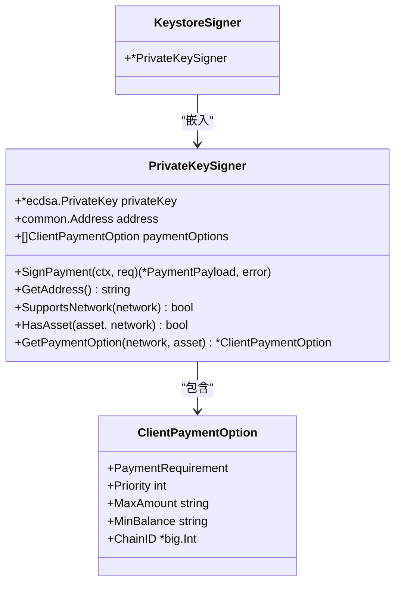

# Keystore签名器

<cite>
**本文档中引用的文件**  
- [signer.go](file://signer.go)
- [client_options.go](file://client_options.go)
- [types.go](file://types.go)
</cite>

## 目录
1. [简介](#简介)
2. [核心组件](#核心组件)
3. [KeystoreSigner实现细节](#keystoresigner实现细节)
4. [内部解密流程](#内部解密流程)
5. [代码示例](#代码示例)
6. [安全注意事项](#安全注意事项)
7. [使用场景](#使用场景)

## 简介
KeystoreSigner是mcp-go-x402库中的一个关键组件，用于通过加密的Keystore JSON文件进行支付授权签名。该实现允许客户端使用标准的以太坊Keystore文件（通常由Geth或MetaMask等钱包导出）来安全地进行身份验证和交易签名，而无需直接暴露私钥。本文档详细说明了`NewKeystoreSigner`函数的参数、内部工作流程、结构设计以及最佳实践。

## 核心组件

`KeystoreSigner`的核心功能围绕`NewKeystoreSigner`函数构建，该函数负责从加密的Keystore文件中解密并提取私钥，然后创建一个能够执行支付签名的签名器实例。该组件依赖于`github.com/ethereum/go-ethereum/accounts/keystore`包来处理Keystore文件的解密逻辑，并复用`PrivateKeySigner`的底层签名功能。

**Section sources**
- [signer.go](file://signer.go#L305-L330)
- [signer.go](file://signer.go#L300-L302)

## KeystoreSigner实现细节

`KeystoreSigner`在结构上是一个包装器，它嵌入了`PrivateKeySigner`结构体，从而继承了其所有的签名功能和接口实现。这种设计模式实现了功能复用，避免了代码重复。

`NewKeystoreSigner`函数接受三个主要参数：
1. **keystoreJSON** (`[]byte`): 加密的Keystore JSON文件的原始字节内容。
2. **password** (`string`): 用于解密Keystore文件的密码。
3. **options** (`...ClientPaymentOption`): 一个或多个`ClientPaymentOption`配置，定义了签名器支持的网络、资产和优先级等。

函数首先调用`keystore.DecryptKey`函数来解密提供的Keystore数据。如果密码错误，会返回`ErrWrongPassword`错误；如果Keystore文件本身无效，则返回`ErrInvalidKeystore`错误。在成功解密后，函数会验证至少配置了一个支付选项，并按优先级对选项进行排序，最后返回一个初始化好的`KeystoreSigner`实例。



**Diagram sources**
- [signer.go](file://signer.go#L300-L302)
- [signer.go](file://signer.go#L41-L45)
- [client_options.go](file://client_options.go#L3-L59)
- [types.go](file://types.go#L85-L102)

**Section sources**
- [signer.go](file://signer.go#L305-L330)

## 内部解密流程

`KeystoreSigner`的内部解密流程完全依赖于`github.com/ethereum/go-ethereum/accounts/keystore`包。当调用`NewKeystoreSigner`时，其核心操作是执行`keystore.DecryptKey(keystoreJSON, password)`。

该函数的内部流程如下：
1. **解析JSON**: 首先，函数会解析输入的`keystoreJSON`字节流，将其反序列化为一个Go结构体，该结构体包含了加密的私钥（通常在`crypto`字段中）、加密算法参数（如盐值`salt`、迭代次数`n`等）以及公钥信息（地址）。
2. **密钥派生**: 使用提供的`password`和Keystore文件中指定的密钥派生函数（KDF，如scrypt或pbkdf2），生成一个密钥派生密钥（derived key）。
3. **解密私钥**: 使用上一步生成的派生密钥和Keystore中指定的对称加密算法（如AES-128-CTR），对加密的私钥进行解密。
4. **验证与返回**: 解密后，函数会验证得到的私钥是否有效，并将其与从Keystore中提取的地址一起封装到一个`Key`对象中返回。

此流程确保了私钥在内存中解密后，可以立即用于签名操作，而不会以明文形式持久化存储。

**Section sources**
- [signer.go](file://signer.go#L305-L330)

## 代码示例

以下代码示例展示了如何加载一个Keystore文件并创建一个`KeystoreSigner`实例。

```go
// 1. 从文件系统读取Keystore JSON内容
keystoreData, err := os.ReadFile("path/to/your/keystore.json")
if err != nil {
    log.Fatal(err)
}

// 2. 定义支付选项，例如接受Base网络上的USDC
paymentOption := AcceptUSDCBaseSepolia()

// 3. 使用Keystore数据、密码和支付选项创建签名器
signer, err := NewKeystoreSigner(keystoreData, "your_password_here", paymentOption)
if err != nil {
    log.Fatal(err)
}

// 4. 签名器现在可以用于签署支付请求
address := signer.GetAddress()
fmt.Printf("Signer address: %s\n", address)
```

**Section sources**
- [signer.go](file://signer.go#L305-L330)
- [client_options.go](file://client_options.go#L20-L29)

## 安全注意事项

使用`KeystoreSigner`时，密码安全至关重要：
- **密码保护**: 用于解密Keystore的密码必须被视为最高机密。绝不能在代码中硬编码，而应通过安全的输入方式（如环境变量、命令行提示或安全的密钥管理服务）提供。
- **内存安全**: 一旦Keystore被解密，私钥将以明文形式存在于进程内存中。应确保运行环境的安全，并在不再需要时尽快释放相关资源。
- **文件权限**: 存储Keystore文件的系统必须设置严格的文件权限（如`chmod 600`），以防止未授权访问。

## 使用场景

`KeystoreSigner`特别适用于以下场景：
- **Geth钱包集成**: 可以直接使用Geth通过`personal.newAccount`创建并导出的Keystore文件。
- **MetaMask迁移**: 用户可以将MetaMask中的账户导出为Keystore文件（UTC格式），然后在后端服务中使用`KeystoreSigner`进行自动化支付。
- **服务器端自动化**: 在需要服务器代表用户进行支付的自动化系统中，Keystore文件提供了一种标准化且相对安全的私钥管理方式。