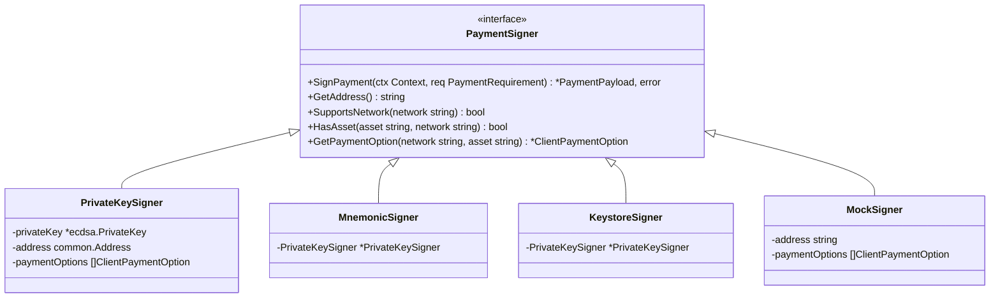
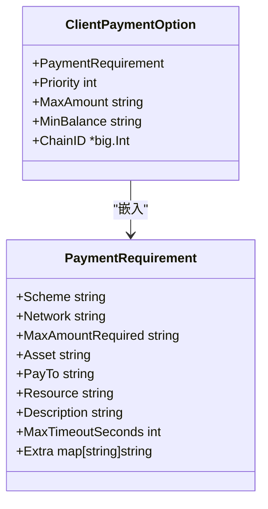
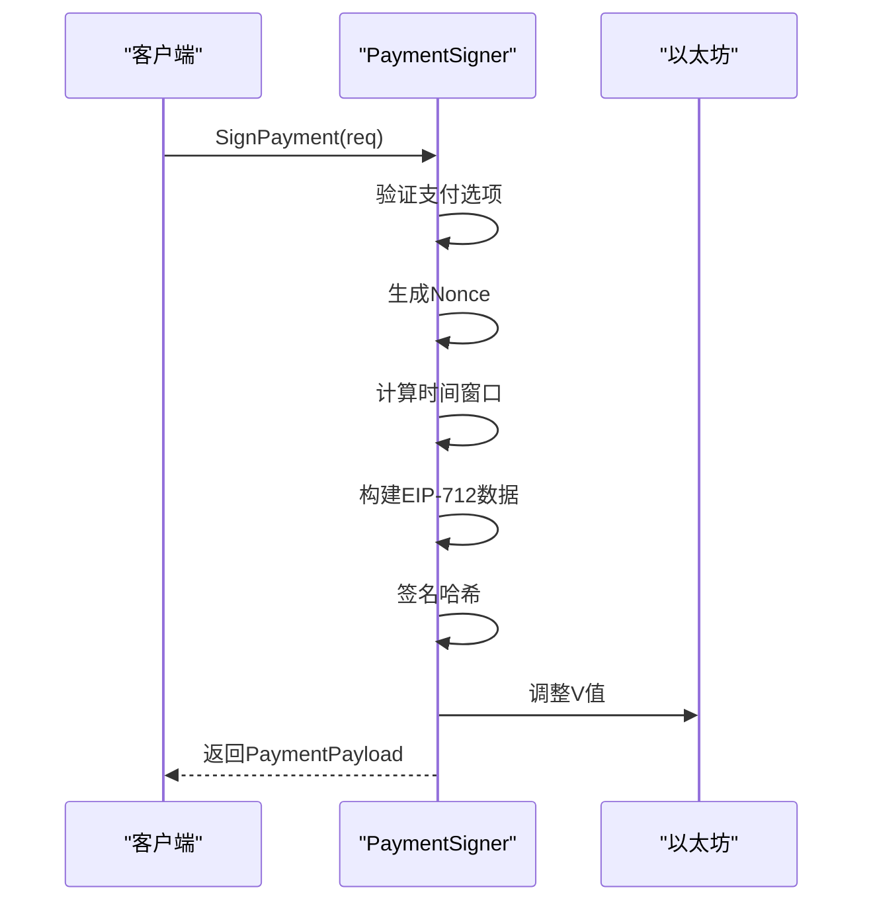

# PaymentSigner签名器

<cite>
**Referenced Files in This Document**   
- [signer.go](file://signer.go)
- [types.go](file://types.go)
- [client_options.go](file://client_options.go)
- [signer_test.go](file://signer_test.go)
- [client_options_test.go](file://client_options_test.go)
</cite>

## 目录
1. [PaymentSigner接口](#paymentsigner接口)
2. [PrivateKeySigner实现](#privatekeysigner实现)
3. [MnemonicSigner实现](#mnemonicsigner实现)
4. [KeystoreSigner实现](#keystoresigner实现)
5. [MockSigner实现](#mocksigner实现)
6. [ClientPaymentOption详解](#clientpaymentoption详解)
7. [EIP-712签名流程](#eip-712签名流程)
8. [使用示例](#使用示例)

## PaymentSigner接口

`PaymentSigner`接口定义了mcp-go-x402客户端进行支付授权签名的核心契约。该接口为所有具体签名器实现提供了统一的API，确保了支付流程的标准化和可扩展性。



**Diagram sources**
- [signer.go](file://signer.go#L23-L38)
- [signer.go](file://signer.go#L41-L45)
- [signer.go](file://signer.go#L250-L252)
- [signer.go](file://signer.go#L300-L302)
- [signer.go](file://signer.go#L333-L336)

**Section sources**
- [signer.go](file://signer.go#L23-L38)

### 核心方法

#### SignPayment
`SignPayment`方法是接口的核心，负责对支付授权进行数字签名。它接收一个`PaymentRequirement`对象，该对象包含了服务器要求的支付信息，如网络、资产、金额等。方法返回一个`PaymentPayload`对象，其中包含EIP-712标准的签名数据。

#### GetAddress
`GetAddress`方法返回签名器关联的以太坊地址。该地址用于标识支付方，在支付授权中作为`from`字段。

#### SupportsNetwork
`SupportsNetwork`方法检查签名器是否支持指定的区块链网络。这允许客户端根据服务器要求的网络条件来选择合适的支付方式。

#### HasAsset
`HasAsset`方法验证签名器是否支持指定网络上的特定资产。这对于多资产支持的客户端非常重要。

#### GetPaymentOption
`GetPaymentOption`方法根据网络和资产返回匹配的`ClientPaymentOption`。该选项包含了签名所需的链ID等内部信息。

## PrivateKeySigner实现

`PrivateKeySigner`是基于原始私钥的签名器实现，适用于生产环境中的直接密钥管理。

**Section sources**
- [signer.go](file://signer.go#L48-L78)
- [signer.go](file://signer.go#L80-L221)

### NewPrivateKeySigner函数

`NewPrivateKeySigner`函数通过十六进制编码的私钥字符串创建签名器实例。参数包括：
- `privateKeyHex`: 十六进制格式的私钥，可选带`0x`前缀
- `options`: 可变参数，指定一个或多个`ClientPaymentOption`

该函数首先验证私钥格式，然后解析为ECDSA私钥对象。所有支付选项按优先级排序，确保高优先级选项优先被选择。

### 内部工作原理

`PrivateKeySigner`结构体包含三个核心字段：
- `privateKey`: ECDSA私钥对象，用于签名操作
- `address`: 从私钥派生的以太坊地址
- `paymentOptions`: 客户端支持的支付选项列表

所有查询方法（如`SupportsNetwork`、`HasAsset`）都基于`paymentOptions`列表进行匹配。

## MnemonicSigner实现

`MnemonicSigner`基于BIP-39助记词的HD钱包签名器，提供更安全的密钥管理方案。

**Section sources**
- [signer.go](file://signer.go#L255-L297)

### NewMnemonicSigner函数

`NewMnemonicSigner`函数通过助记词创建签名器实例。参数包括：
- `mnemonic`: BIP-39标准的助记词短语
- `derivationPath`: BIP-32派生路径，默认为`m/44'/60'/0'/0/0`（以太坊路径）
- `options`: 可变参数，指定一个或多个`ClientPaymentOption`

该函数首先验证助记词的有效性，然后使用`bip39`库生成种子，再通过`bip32`库和`go-ethereum`的路径解析器进行HD派生。

### 内部工作原理

`MnemonicSigner`采用组合模式，内嵌`*PrivateKeySigner`指针。这意味着它继承了`PrivateKeySigner`的所有功能，但使用从助记词派生的私钥。这种设计实现了代码复用，同时保持了接口的一致性。

## KeystoreSigner实现

`KeystoreSigner`基于加密keystore文件的签名器，适用于Geth或MetaMask导出的密钥文件。

**Section sources**
- [signer.go](file://signer.go#L305-L330)

### NewKeystoreSigner函数

`NewKeystoreSigner`函数通过加密的keystore JSON创建签名器实例。参数包括：
- `keystoreJSON`: keystore文件的JSON内容
- `password`: 解密keystore的密码
- `options`: 可变参数，指定一个或多个`ClientPaymentOption`

该函数使用`go-ethereum`的`keystore`包解密keystore文件。如果密码错误，返回`ErrWrongPassword`；如果keystore格式无效，返回`ErrInvalidKeystore`。

### 内部工作原理

与`MnemonicSigner`类似，`KeystoreSigner`也采用组合模式，内嵌`*PrivateKeySigner`。解密后的私钥和地址被传递给`PrivateKeySigner`，实现了功能的无缝集成。

## MockSigner实现

`MockSigner`是用于测试的模拟签名器，生成确定性的假签名。

**Section sources**
- [signer.go](file://signer.go#L339-L358)
- [signer.go](file://signer.go#L360-L390)

### NewMockSigner函数

`NewMockSigner`函数创建测试用签名器。参数包括：
- `address`: 模拟的以太坊地址
- `options`: 可变参数，指定一个或多个`ClientPaymentOption`

如果未提供选项，则默认使用`AcceptUSDCBaseSepolia()`选项，适用于Base Sepolia测试网。

### 内部工作原理

`MockSigner`不包含私钥，因此无法进行真实签名。它的`SignPayment`方法生成固定的假签名（65个00字节），但保留了真实签名器的时间窗口和nonce生成逻辑，确保测试环境与生产环境行为一致。

## ClientPaymentOption详解

`ClientPaymentOption`结构体定义了客户端支持的支付能力，是连接客户端配置与支付逻辑的关键。



**Diagram sources**
- [types.go](file://types.go#L93-L101)
- [types.go](file://types.go#L9-L21)

**Section sources**
- [types.go](file://types.go#L93-L101)
- [client_options.go](file://client_options.go#L7-L58)

### 核心字段

- `PaymentRequirement`: 嵌入的基础支付要求，定义了支付方案、网络、资产等
- `Priority`: 优先级，数值越低优先级越高
- `MaxAmount`: 客户端愿意支付的最大金额
- `MinBalance`: 最小余额，低于此值时不使用该选项
- `ChainID`: 链ID，用于EIP-712签名，不序列化到JSON

### 辅助函数

`client_options.go`提供了多个辅助函数：
- `AcceptUSDCBase()`: 创建Base主网USDC支付选项
- `AcceptUSDCBaseSepolia()`: 创建Base Sepolia测试网USDC支付选项
- `WithPriority()`: 设置优先级的流式API
- `WithMaxAmount()`: 设置最大金额的流式API
- `WithMinBalance()`: 设置最小余额的流式API

## EIP-712签名流程

`SignPayment`方法使用EIP-712标准对支付授权进行结构化签名，确保了跨链兼容性和安全性。



**Diagram sources**
- [signer.go](file://signer.go#L112-L221)

**Section sources**
- [signer.go](file://signer.go#L112-L221)

### 核心步骤

1. **支付选项验证**: 通过`GetPaymentOption`找到匹配的选项，获取链ID
2. **Nonce生成**: 使用时间戳、资源和地址的Keccak256哈希生成唯一nonce
3. **时间窗口计算**: 
   - `validAfter`: 当前时间减去30秒时钟偏移缓冲
   - `validBefore`: 当前时间加上请求的超时时间（60秒到1小时之间）
4. **EIP-712数据构建**: 创建符合`TransferWithAuthorization`类型的结构化数据
5. **签名**: 使用私钥对数据哈希进行签名，并将V值调整为27或28

## 使用示例

### 生产环境使用PrivateKeySigner

```go
// 创建私钥签名器
signer, err := NewPrivateKeySigner(
    "your-private-key-hex",
    AcceptUSDCBase().WithPriority(1),
    AcceptUSDCBaseSepolia().WithPriority(2),
)
if err != nil {
    log.Fatal(err)
}
```

### 测试环境使用MockSigner

```go
// 创建模拟签名器
signer := NewMockSigner(
    "0xTestAddress",
    AcceptUSDCBaseSepolia(),
)
```

### 使用MnemonicSigner

```go
// 创建助记词签名器
signer, err := NewMnemonicSigner(
    "your twelve word mnemonic phrase",
    "", // 使用默认路径
    AcceptUSDCBase(),
)
if err != nil {
    log.Fatal(err)
}
```

### 使用KeystoreSigner

```go
// 读取keystore文件
keystoreJSON, err := ioutil.ReadFile("path/to/keystore")
if err != nil {
    log.Fatal(err)
}

// 创建keystore签名器
signer, err := NewKeystoreSigner(
    keystoreJSON,
    "your-password",
    AcceptUSDCBase(),
)
if err != nil {
    log.Fatal(err)
}
```

**Section sources**
- [signer.go](file://signer.go#L48-L78)
- [signer.go](file://signer.go#L255-L297)
- [signer.go](file://signer.go#L305-L330)
- [signer.go](file://signer.go#L339-L358)
- [client_options.go](file://client_options.go#L7-L21)
- [client_options.go](file://client_options.go#L24-L38)