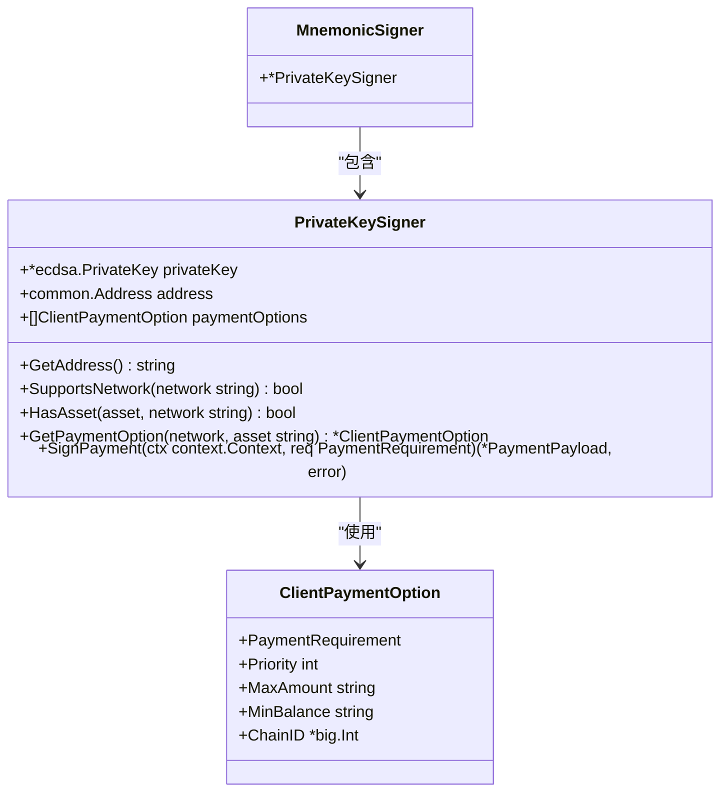
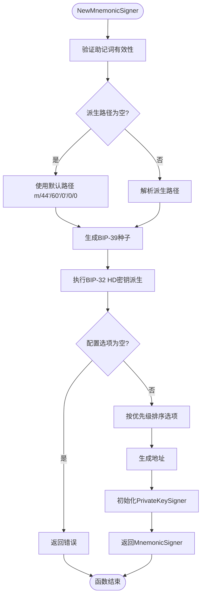
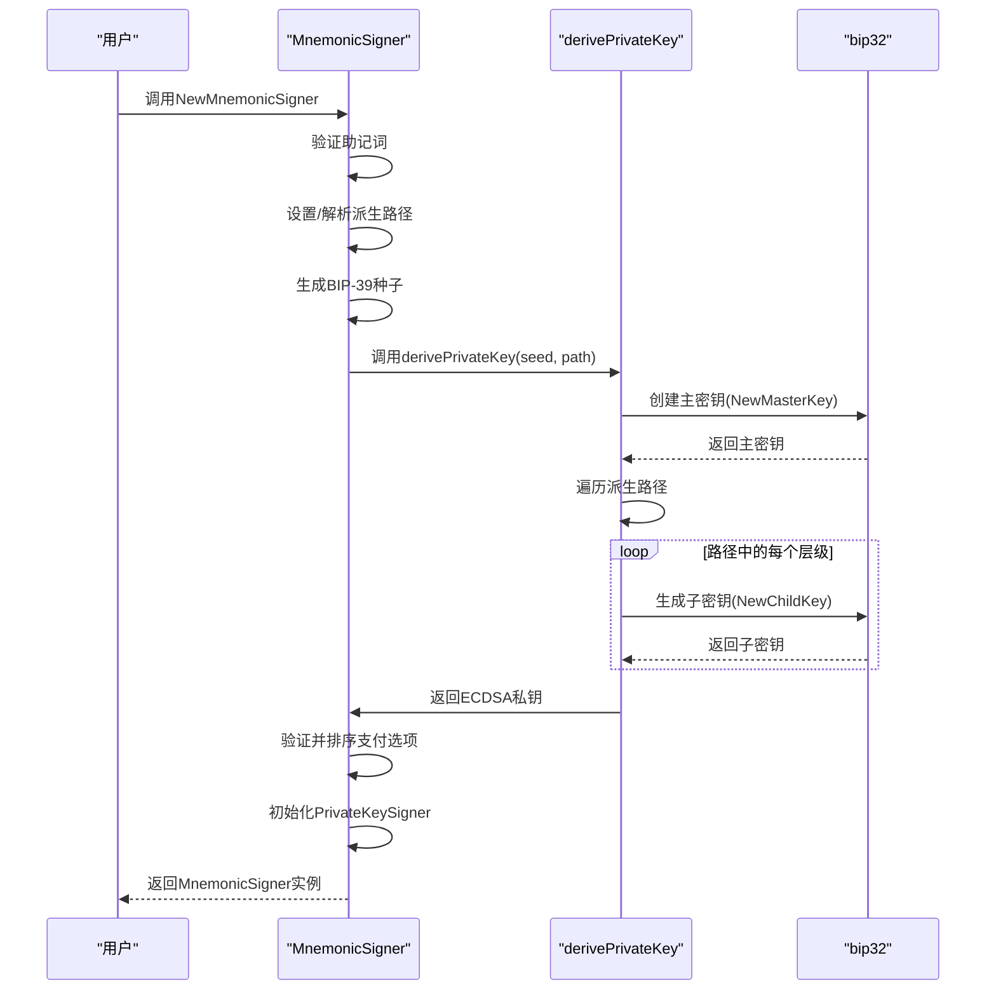
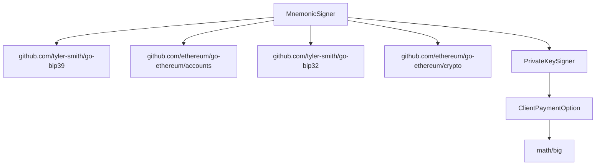

# 助记词签名器

<cite>
**Referenced Files in This Document**   
- [signer.go](file://signer.go)
- [client_options.go](file://client_options.go)
- [signer_test.go](file://signer_test.go)
- [types.go](file://types.go)
</cite>

## 目录
1. [简介](#简介)
2. [核心组件](#核心组件)
3. [架构概述](#架构概述)
4. [详细组件分析](#详细组件分析)
5. [依赖分析](#依赖分析)
6. [性能考虑](#性能考虑)
7. [故障排除指南](#故障排除指南)
8. [结论](#结论)

## 简介
助记词签名器（MnemonicSigner）是mcp-go-x402库中的一个关键组件，它提供了一种基于BIP-39标准助记词的安全密钥管理方案。该签名器通过分层确定性（HD）钱包技术，允许用户从一组易于记忆的单词派生出加密密钥，从而简化了密钥管理和恢复流程。与直接使用私钥相比，这种方法显著提高了用户体验和安全性。

**Section sources**
- [signer.go](file://signer.go#L250-L297)

## 核心组件
`MnemonicSigner`结构体是本实现的核心，它通过组合`PrivateKeySigner`实现了所有签名和查询功能。`NewMnemonicSigner`函数负责初始化该签名器，接受BIP-39助记词、可选的BIP-44派生路径以及必需的`ClientPaymentOption`配置作为参数。内部工作原理包括使用`bip39.NewSeed`生成种子，并结合`derivePrivateKey`函数与go-ethereum的`DerivationPath`进行BIP-32 HD密钥派生。

**Section sources**
- [signer.go](file://signer.go#L250-L297)
- [signer.go](file://signer.go#L224-L247)

## 架构概述
助记词签名器采用包装器模式，将`PrivateKeySigner`嵌入到`MnemonicSigner`结构体中，从而继承其所有功能。这种设计实现了功能复用，同时保持了接口的一致性。

**Diagram sources**
- [signer.go](file://signer.go#L250-L252)
- [signer.go](file://signer.go#L41-L45)
- [types.go](file://types.go#L93-L101)

## 详细组件分析

### MnemonicSigner 实现分析
`MnemonicSigner`通过嵌入`PrivateKeySigner`实现了功能继承，其主要职责是根据助记词和派生路径生成私钥，并初始化底层签名器。

#### 内部工作流程

**Diagram sources**
- [signer.go](file://signer.go#L255-L297)

#### 密钥派生过程

**Diagram sources**
- [signer.go](file://signer.go#L255-L297)
- [signer.go](file://signer.go#L224-L247)

**Section sources**
- [signer.go](file://signer.go#L255-L297)
- [signer.go](file://signer.go#L224-L247)

## 依赖分析
助记词签名器依赖于多个外部库和内部组件来实现其功能。

**Diagram sources**
- [signer.go](file://signer.go#L250-L297)
- [types.go](file://types.go#L93-L101)

**Section sources**
- [signer.go](file://signer.go#L1-L30)
- [types.go](file://types.go#L93-L101)

## 性能考虑
助记词签名器的性能主要受BIP-32密钥派生过程的影响。该过程涉及多次加密操作，但通常在初始化时只执行一次。一旦签名器创建完成，后续的签名操作性能与`PrivateKeySigner`相同。建议在应用启动时创建签名器实例并重用，以避免重复的密钥派生开销。

## 故障排除指南
使用助记词签名器时可能遇到以下常见问题：

1. **助记词无效错误**：确保提供的助记词符合BIP-39标准，包含正确的单词数量和校验和。
2. **派生路径错误**：检查派生路径格式是否正确，应遵循`m/44'/60'/0'/0/0`这样的标准格式。
3. **缺少支付选项**：必须至少配置一个`ClientPaymentOption`，否则签名器创建将失败。
4. **链ID未配置**：确保`ClientPaymentOption`中包含了正确的链ID，这对于EIP-712签名至关重要。

**Section sources**
- [signer.go](file://signer.go#L255-L297)
- [client_options.go](file://client_options.go#L1-L60)

## 结论
助记词签名器为mcp-go-x402库提供了一种安全、用户友好的密钥管理方案。通过BIP-39和BIP-44标准的结合，它实现了从助记词到私钥的安全派生，同时保持了与现有`PrivateKeySigner`接口的兼容性。这种设计不仅简化了密钥恢复流程，还提高了整体安全性。开发者在使用时应确保妥善保管助记词，因为其泄露将导致账户完全暴露。