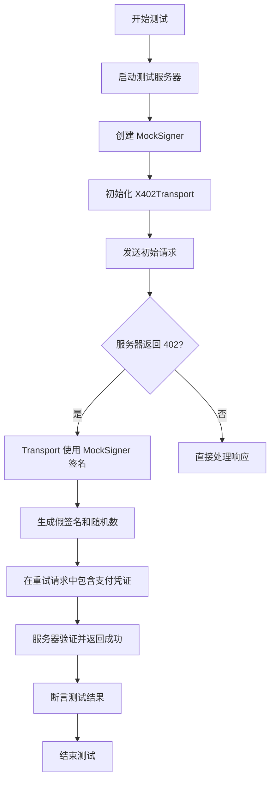

# 模拟签名器

<cite>
**本文档引用的文件**  
- [signer.go](file://signer.go)
- [transport_test.go](file://transport_test.go)
- [client_options.go](file://client_options.go)
- [types.go](file://types.go)
</cite>

## 目录
1. [简介](#简介)
2. [核心组件](#核心组件)
3. [API 详细说明](#api-详细说明)
4. [设计与用途](#设计与用途)
5. [测试用例分析](#测试用例分析)
6. [使用示例](#使用示例)
7. [结论](#结论)

## 简介
`MockSigner` 是 `mcp-go-x402` 库中专为测试和开发环境设计的模拟签名器实现。它实现了 `PaymentSigner` 接口，允许在不依赖真实私钥或区块链网络的情况下，对支付流程进行单元测试和集成测试。该组件通过生成格式正确但无效的假签名，使开发者能够验证支付逻辑的正确性，而无需处理真实的加密签名或支付成本。本文档详细阐述了 `MockSigner` 的 API、设计原理、具体用途和使用方法。

## 核心组件

`MockSigner` 的核心功能围绕其结构体和 `NewMockSigner` 构造函数展开。它通过实现 `PaymentSigner` 接口，为测试环境提供了一个安全、可预测的替代方案。

**Section sources**
- [signer.go](file://signer.go#L333-L358)
- [types.go](file://types.go#L93-L101)

## API 详细说明

### NewMockSigner 函数
`NewMockSigner` 是创建 `MockSigner` 实例的构造函数，其函数签名为：
```go
func NewMockSigner(address string, options ...ClientPaymentOption) *MockSigner
```

该函数接受两个参数：
1.  **地址 (address)**：一个表示以太坊钱包地址的字符串。该函数会自动检查并为不以 `0x` 开头的地址添加此前缀。
2.  **可选的客户端支付选项 (options)**：一个可变参数，接受零个或多个 `ClientPaymentOption` 配置。这些选项定义了模拟签名器“支持”的支付方式。

**关键行为**：
-   **地址处理**：如果传入的地址字符串不包含 `0x` 前缀，函数会自动为其添加，确保地址格式的统一性。
-   **默认配置**：如果调用者未提供任何 `ClientPaymentOption`，函数将自动使用 `AcceptUSDCBaseSepolia()` 作为默认配置。这意味着模拟签名器将默认支持在 Base Sepolia 测试网上的 USDC 支付。
-   **优先级排序**：所有传入的支付选项会根据其 `Priority` 字段进行排序，优先级数值越低，优先级越高。

**Section sources**
- [signer.go](file://signer.go#L339-L358)
- [client_options.go](file://client_options.go#L24-L38)

### SignPayment 方法
`SignPayment` 方法是 `MockSigner` 的核心，用于生成模拟的支付凭证。其方法签名为：
```go
func (m *MockSigner) SignPayment(ctx context.Context, req PaymentRequirement) (*PaymentPayload, error)
```

**关键行为**：
-   **金额验证**：尽管是模拟器，它仍会验证 `req.MaxAmountRequired` 是否为有效的正数，以确保测试的严谨性。
-   **假签名生成**：生成一个格式正确但无效的假签名。该签名是一个由 `00` 重复65次组成的十六进制字符串（即 `65*2=130` 个字符），然后加上 `0x` 前缀。这确保了签名在长度和格式上符合以太坊标准，但其内容是全零填充，不具备任何加密意义。
-   **确定性随机数 (Nonce)**：生成一个确定性的随机数，值为 `0x` 后跟32个 `11` 字节（即 `64` 个字符）。这种确定性使得测试结果可重复。
-   **时间窗口**：使用与真实签名器相同的逻辑来计算 `ValidAfter` 和 `ValidBefore` 时间戳，确保测试环境与生产环境的行为一致性。

**Section sources**
- [signer.go](file://signer.go#L392-L432)
- [types.go](file://types.go#L31-L36)

## 设计与用途

`MockSigner` 的设计目的非常明确：**仅用于测试和开发**。

### 设计目的
-   **隔离依赖**：在单元测试中，将支付逻辑与复杂的加密签名过程解耦。开发者可以专注于验证业务逻辑（如金额检查、超时处理、支付选项匹配等），而不必担心私钥管理和网络交互。
-   **可预测性**：生成的签名和随机数是确定性的，这保证了测试的可重复性和稳定性。
-   **安全性**：由于生成的是无效签名，即使在测试中意外泄露，也不会对真实资产构成任何风险。

### 主要用途
`MockSigner` 主要用于以下场景：
-   **单元测试**：测试 `PaymentHandler` 或其他依赖 `PaymentSigner` 接口的组件。
-   **集成测试**：在 `TestX402Transport` 系列测试中，验证整个支付流程的逻辑，包括：
    -   服务器返回 402 状态码后，客户端是否能正确发起支付。
    -   支付回调函数 (`PaymentCallback`) 是否按预期工作。
    -   不同支付场景（如支付超限、多次请求）的处理逻辑。

**Section sources**
- [signer.go](file://signer.go#L23-L38)
- [transport_test.go](file://transport_test.go#L66-L799)

## 测试用例分析

通过对 `transport_test.go` 文件的分析，可以清晰地看到 `MockSigner` 在实际测试中的应用。



**Diagram sources**
- [transport_test.go](file://transport_test.go#L66-L799)
- [signer.go](file://signer.go#L392-L432)

该流程图展示了 `TestX402Transport_Basic` 等测试用例的典型流程。`MockSigner` 在流程中的关键作用是，在服务器返回 402 错误后，由 `X402Transport` 调用其 `SignPayment` 方法来生成支付凭证，从而完成支付流程的模拟。

**Section sources**
- [transport_test.go](file://transport_test.go#L66-L156)

## 使用示例

以下是在测试代码中使用 `MockSigner` 的典型示例：

```go
// 创建一个支持 Base Sepolia USDC 的模拟签名器
signer := NewMockSigner("0xTestWallet", AcceptUSDCBaseSepolia())

// 或者使用默认配置（效果相同）
signer := NewMockSigner("TestWallet") // 自动添加 0x 前缀

// 在 Transport 配置中使用
trans, err := New(Config{
    ServerURL: server.URL,
    Signer:    signer, // 将 MockSigner 注入 Transport
})
require.NoError(t, err)
```

**重要警告**：`MockSigner` **绝对不能用于生产环境**。因为它生成的签名是无效的，任何依赖真实签名验证的系统都会拒绝这些支付，导致交易失败。

**Section sources**
- [transport_test.go](file://transport_test.go#L66-L799)
- [signer.go](file://signer.go#L339-L358)

## 结论
`MockSigner` 是 `mcp-go-x402` 库中一个至关重要的测试工具。它通过提供一个简单、安全且可预测的 `PaymentSigner` 实现，极大地简化了支付相关功能的测试工作。通过自动处理地址前缀、提供默认支付选项、生成格式正确的假签名和确定性随机数，它确保了测试的便捷性和可靠性。开发者应充分利用 `MockSigner` 来验证支付逻辑，但必须牢记其仅限于测试和开发用途，严禁在生产环境中使用。