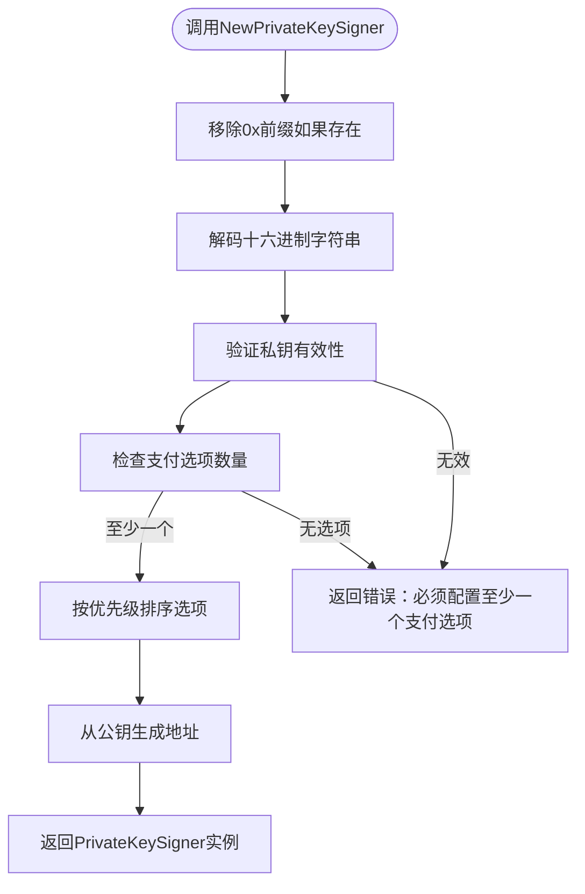
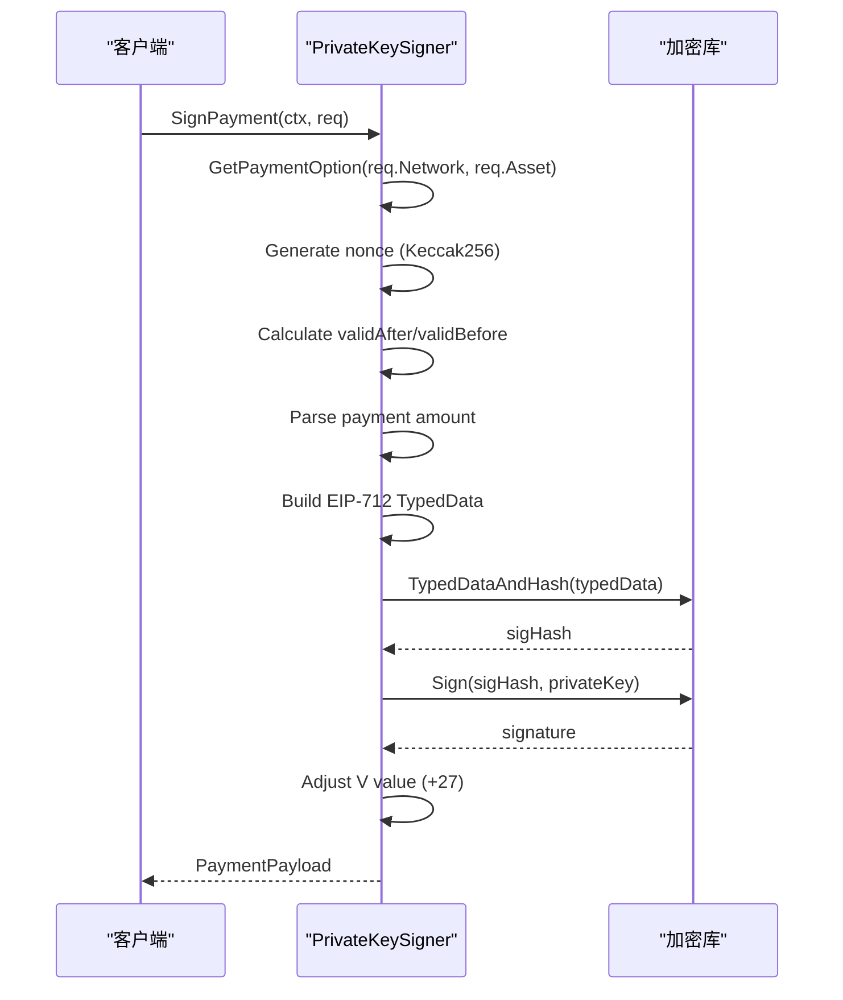

# 私钥签名器

<cite>
**本文档引用的文件**   
- [signer.go](file://signer.go)
- [types.go](file://types.go)
- [client_options.go](file://client_options.go)
- [signer_test.go](file://signer_test.go)
- [examples/client/main.go](file://examples/client/main.go)
</cite>

## 目录
1. [简介](#简介)
2. [NewPrivateKeySigner函数参数要求](#newprivatekeysigner函数参数要求)
3. [PrivateKeySigner内部字段](#privatekeysigner内部字段)
4. [SignPayment方法详解](#signpayment方法详解)
5. [使用示例](#使用示例)
6. [安全注意事项](#安全注意事项)

## 简介
`PrivateKeySigner`是mcp-go-x402库中的一个核心组件，用于通过原始私钥对x402支付授权进行签名。它实现了`PaymentSigner`接口，提供了签名支付、获取地址、检查网络支持等功能。该签名器允许客户端配置一个或多个支付选项，以支持在不同网络和资产上的支付。

**Section sources**
- [signer.go](file://signer.go#L23-L38)
- [signer.go](file://signer.go#L41-L45)

## NewPrivateKeySigner函数参数要求
`NewPrivateKeySigner`函数用于创建一个基于十六进制编码私钥的签名器，并配置支付选项。

### 私钥参数
- **格式**：接受十六进制格式的私钥字符串。
- **前缀**：支持或不支持`0x`前缀。函数内部会自动移除`0x`前缀（如果存在）。
- **验证**：函数会验证私钥字符串是否为有效的十六进制编码，并能成功转换为ECDSA私钥对象。如果私钥无效，将返回`ErrInvalidPrivateKey`错误。

### 支付选项参数
- **必需性**：必须至少配置一个`ClientPaymentOption`。如果未提供任何支付选项，函数将返回错误。
- **排序**：提供的支付选项会根据其`Priority`字段进行排序，优先级数值越低，优先级越高。



**Diagram sources**
- [signer.go](file://signer.go#L48-L78)

**Section sources**
- [signer.go](file://signer.go#L48-L78)
- [client_options.go](file://client_options.go#L7-L38)

## PrivateKeySigner内部字段
`PrivateKeySigner`结构体包含以下三个内部字段：

- **privateKey**：`*ecdsa.PrivateKey`类型，存储从十六进制字符串解析出的原始ECDSA私钥。这是签名操作的核心，必须严格保密。
- **address**：`common.Address`类型，表示与私钥对应的以太坊地址。该地址在创建签名器时由私钥的公钥生成。
- **paymentOptions**：`[]ClientPaymentOption`类型，存储配置的支付选项列表。每个`ClientPaymentOption`定义了签名器支持的网络、资产、链ID等信息。

这些字段共同定义了签名器的身份和能力。

**Section sources**
- [signer.go](file://signer.go#L41-L45)

## SignPayment方法详解
`SignPayment`方法使用EIP-712标准对支付授权进行签名，其核心流程如下：

### nonce生成机制
nonce是防止重放攻击的关键。其生成机制基于：
- **时间戳**：使用`time.Now().UnixNano()`获取当前纳秒级时间戳。
- **资源**：支付请求中的`Resource`字段。
- **地址**：签名器的以太坊地址。
三者通过`fmt.Sprintf("%d-%s-%s", time.Now().UnixNano(), req.Resource, s.address.Hex())`连接，然后进行Keccak256哈希运算，最后将结果编码为十六进制字符串并添加`0x`前缀。

### 时间窗口计算
- **validAfter**：有效开始时间。考虑30秒的时钟偏移，设置为当前时间减去30秒（`const clockSkewBuffer = 30 * time.Second`），以确保在不同步的系统上也能验证。
- **validBefore**：有效结束时间。基于请求的`MaxTimeoutSeconds`，但限制在60秒到1小时之间。如果请求的超时小于60秒，则使用60秒；如果大于3600秒，则使用3600秒。

### 签名格式
签名过程遵循EIP-712标准：
1. 构建`TypedData`对象，包含`EIP712Domain`和`TransferWithAuthorization`类型。
2. 计算待签名数据的哈希值。
3. 使用`crypto.Sign`函数和私钥进行签名。
4. **V值调整**：为了符合以太坊签名标准，将签名的V值（第65个字节）增加27。



**Diagram sources**
- [signer.go](file://signer.go#L112-L221)

**Section sources**
- [signer.go](file://signer.go#L112-L221)
- [types.go](file://types.go#L9-L21)
- [types.go](file://types.go#L31-L36)

## 使用示例
以下是一个使用`PrivateKeySigner`的代码示例：

```go
// 从环境变量获取私钥
privateKey := os.Getenv("WALLET_PRIVATE_KEY")

// 创建签名器，配置Base主网和Base Sepolia测试网的支付选项
signer, err := x402.NewPrivateKeySigner(
    privateKey,
    x402.AcceptUSDCBase().WithPriority(1),           // Base主网优先
    x402.AcceptUSDCBaseSepolia(),                    // Base Sepolia测试网
)
if err != nil {
    log.Fatal("Failed to create signer:", err)
}

// 使用签名器进行支付
payment, err := signer.SignPayment(context.Background(), paymentRequirement)
if err != nil {
    log.Fatal("Failed to sign payment:", err)
}
```

此示例展示了如何从环境变量加载私钥，创建签名器，并配置多个支付选项。

**Section sources**
- [examples/client/main.go](file://examples/client/main.go#L30-L65)

## 安全注意事项
在生产环境中使用`PrivateKeySigner`时，必须注意以下安全事项：

- **私钥保密**：私钥是资产安全的核心。绝不能硬编码在代码中或提交到版本控制系统。应使用环境变量、密钥管理服务（KMS）或硬件安全模块（HSM）来安全地存储和访问私钥。
- **安全存储**：确保运行应用程序的服务器具有严格的安全措施，防止私钥被未授权访问。
- **最小权限原则**：为签名器配置的支付选项应遵循最小权限原则，仅授予完成任务所必需的网络和资产权限。
- **监控与审计**：实施监控和审计机制，以检测任何异常的支付活动。

**Section sources**
- [README.md](file://README.md#L247-L258)