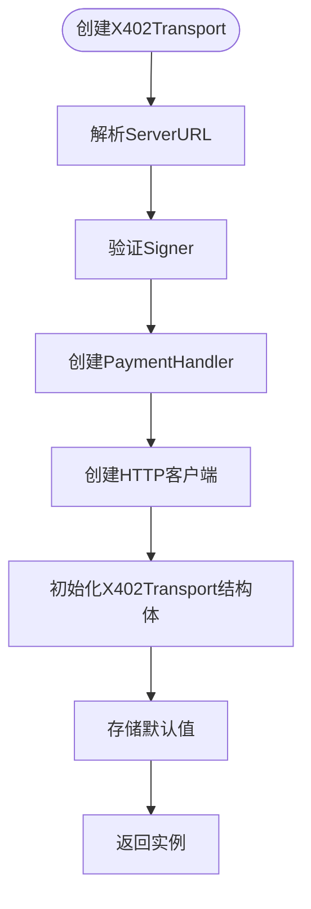
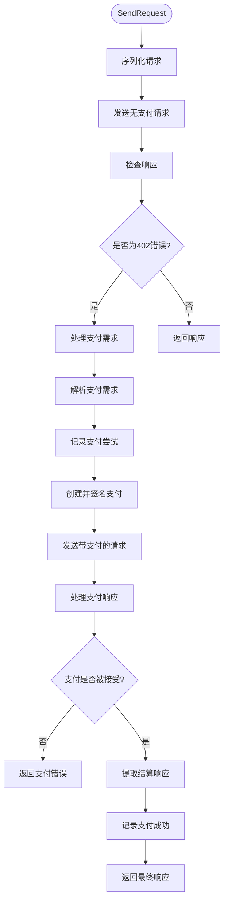
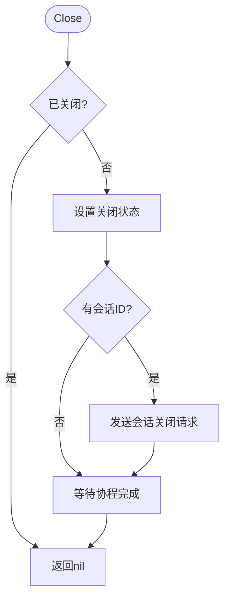
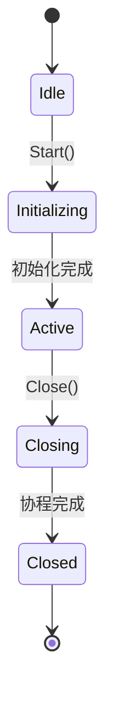
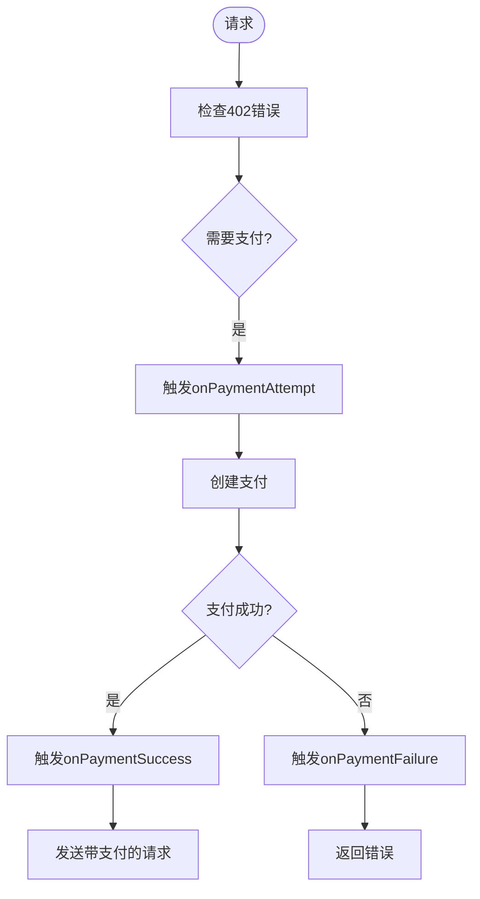

# X402Transport传输层

<cite>
**本文档引用的文件**
- [transport.go](file://transport.go)
- [types.go](file://types.go)
- [handler.go](file://handler.go)
- [signer.go](file://signer.go)
- [client_options.go](file://client_options.go)
- [examples/client/main.go](file://examples/client/main.go)
</cite>

## 目录
1. [简介](#简介)
2. [X402Transport结构体](#x402transport结构体)
3. [Config配置结构体](#config配置结构体)
4. [核心方法](#核心方法)
5. [内部状态管理](#内部状态管理)
6. [事件回调机制](#事件回调机制)
7. [错误处理](#错误处理)
8. [使用示例](#使用示例)

## 简介
X402Transport是mcp-go-x402客户端的核心传输层实现，它包装了基础HTTP传输并自动处理402支付响应。该结构体实现了MCP客户端的transport.Interface接口，为需要支付验证的API调用提供了无缝的支付处理能力。当服务器返回402 Payment Required响应时，X402Transport会自动拦截该错误，创建相应的支付凭证，并重试请求，从而对上层应用透明地处理支付流程。

**Section sources**
- [transport.go](file://transport.go#L33-L63)

## X402Transport结构体
X402Transport结构体是整个支付传输系统的核心，它封装了与MCP服务器通信所需的所有组件和状态。该结构体不仅处理常规的HTTP请求，还专门处理402支付相关的逻辑。

主要字段包括：
- **serverURL**: 目标MCP服务器的URL
- **httpClient**: 用于发送HTTP请求的客户端实例
- **handler**: 支付处理器，负责创建和签名支付凭证
- **sessionID**: 原子性存储的会话ID，用于维护会话状态
- **protocolVersion**: 协议版本信息
- **notificationHandler**: 通知处理函数
- **requestHandler**: 请求处理函数，支持双向通信
- **onPaymentAttempt**: 支付尝试时的回调函数
- **onPaymentSuccess**: 支付成功时的回调函数
- **onPaymentFailure**: 支付失败时的回调函数
- **closed**: 通道，用于标记传输层是否已关闭
- **paymentRecorder**: 测试支持，用于记录支付事件

**Section sources**
- [transport.go](file://transport.go#L33-L63)

## Config配置结构体
Config结构体用于配置X402Transport实例的创建参数，定义了客户端如何与MCP服务器交互以及如何处理支付请求。

```go
type Config struct {
	ServerURL        string
	Signer           PaymentSigner
	PaymentCallback  func(amount *big.Int, resource string) bool
	HTTPClient       *http.Client
	OnPaymentAttempt func(PaymentEvent)
	OnPaymentSuccess func(PaymentEvent)
	OnPaymentFailure func(PaymentEvent, error)
}
```

各配置项的用途如下：

**ServerURL**
- 类型: string
- 作用: 指定MCP服务器的URL地址
- 必需: 是
- 示例: "http://localhost:8080"

**Signer**
- 类型: PaymentSigner接口
- 作用: 负责签名支付授权的签名器
- 必需: 是
- 实现: 可以是PrivateKeySigner、MnemonicSigner或KeystoreSigner等

**PaymentCallback**
- 类型: func(amount *big.Int, resource string) bool
- 作用: 支付回调函数，用于决定是否批准特定金额的支付
- 用途: 允许客户端根据支付金额和资源类型做出支付决策
- 默认行为: 如果未提供，将自动批准所有支付

**HTTPClient**
- 类型: *http.Client
- 作用: 自定义HTTP客户端
- 用途: 允许用户配置超时、代理等HTTP客户端设置
- 默认: 如果未提供，将使用默认的HTTP客户端，超时时间为2分钟

**事件回调函数**
- OnPaymentAttempt: 支付尝试时调用
- OnPaymentSuccess: 支付成功时调用
- OnPaymentFailure: 支付失败时调用

**Section sources**
- [transport.go](file://transport.go#L68-L75)

## 核心方法

### New函数
New函数用于创建新的X402Transport实例，是整个系统的入口点。



**Diagram sources**
- [transport.go](file://transport.go#L77-L114)

### SendRequest方法
SendRequest方法实现了transport.Interface接口，是处理请求生命周期的核心方法。它负责发送JSON-RPC请求并处理402支付响应。



**Diagram sources**
- [transport.go](file://transport.go#L175-L208)
- [transport.go](file://transport.go#L213-L309)

### Close方法
Close方法用于关闭传输层连接，清理相关资源。



**Diagram sources**
- [transport.go](file://transport.go#L123-L164)

### SetProtocolVersion方法
SetProtocolVersion方法用于设置协议版本，该版本信息将作为请求头发送到服务器。

**Section sources**
- [transport.go](file://transport.go#L167-L169)

## 内部状态管理
X402Transport通过多种机制管理内部状态，确保在并发环境下的线程安全和状态一致性。

**会话管理**
- 使用atomic.Value存储sessionID和protocolVersion，确保原子性操作
- initialized通道用于标记初始化完成状态
- initializedOnce sync.Once确保初始化只执行一次

**并发控制**
- 使用sync.RWMutex保护notificationHandler和requestHandler的读写操作
- wg sync.WaitGroup用于等待后台协程完成
- closed chan struct{}用于通知所有相关协程传输层已关闭

**状态转换**


**Diagram sources**
- [transport.go](file://transport.go#L39-L40)
- [transport.go](file://transport.go#L41-L42)
- [transport.go](file://transport.go#L58-L59)

## 事件回调机制
X402Transport提供了完整的事件回调机制，允许客户端监控支付生命周期的各个阶段。

### onPaymentAttempt
- **触发时机**: 在尝试创建支付之前
- **使用场景**: 
  - 记录支付尝试日志
  - 更新UI显示支付状态
  - 进行额外的支付前检查
- **参数**: PaymentEvent，包含支付相关信息

### onPaymentSuccess
- **触发时机**: 支付成功并收到服务器确认后
- **使用场景**:
  - 记录成功支付日志
  - 更新钱包余额显示
  - 发送支付成功通知
- **参数**: PaymentEvent，包含支付成功信息

### onPaymentFailure
- **触发时机**: 支付创建失败或服务器拒绝支付后
- **使用场景**:
  - 记录支付失败原因
  - 显示错误消息给用户
  - 触发重试逻辑或备用支付方式
- **参数**: PaymentEvent和error，包含失败详情



**Diagram sources**
- [transport.go](file://transport.go#L751-L788)
- [transport.go](file://transport.go#L790-L821)

## 错误处理
X402Transport实现了全面的错误处理机制，能够处理各种网络和支付相关的错误。

### 常见错误类型
- **连接超时**: 当HTTP请求超时时抛出
- **会话终止(404)**: 当服务器返回404状态码时，表示会话已终止
- **支付拒绝**: 当PaymentCallback返回false或服务器拒绝支付时
- **签名失败**: 当无法使用提供的签名器创建有效签名时

### 会话终止处理
当服务器返回404状态码时，X402Transport会自动处理会话终止情况：

```go
if resp.StatusCode == http.StatusNotFound {
    var sessionID string
    if sessionIDVal := t.sessionID.Load(); sessionIDVal != nil {
        sessionID, _ = sessionIDVal.(string)
    }
    t.sessionID.CompareAndSwap(sessionID, "")
    resp.Body.Close()
    return nil, ErrSessionTerminated
}
```

此机制确保会话ID被清除，并返回ErrSessionTerminated错误，提示客户端需要重新初始化会话。

**Section sources**
- [transport.go](file://transport.go#L172)
- [transport.go](file://transport.go#L511-L564)

## 使用示例
以下是一个完整的使用示例，展示如何创建X402Transport实例并集成到MCP客户端中。

```go
// 创建签名器
signer, err := x402.NewPrivateKeySigner(
    privateKey,
    x402.AcceptUSDCBaseSepolia(),
)
if err != nil {
    log.Fatal("Failed to create signer:", err)
}

// 创建传输层配置
config := x402.Config{
    ServerURL: "http://localhost:8080",
    Signer:    signer,
    OnPaymentAttempt: func(event x402.PaymentEvent) {
        log.Printf("Attempting payment of %s %s to %s",
            event.Amount, event.Asset, event.Recipient)
    },
    OnPaymentSuccess: func(event x402.PaymentEvent) {
        log.Printf("Payment successful! Transaction: %s", event.Transaction)
    },
    OnPaymentFailure: func(event x402.PaymentEvent, err error) {
        log.Printf("Payment failed: %v", err)
    },
}

// 创建X402Transport实例
x402transport, err := x402.New(config)
if err != nil {
    log.Fatal("Failed to create transport:", err)
}

// 创建MCP客户端
mcpClient := client.NewClient(x402transport)

// 使用客户端进行操作...
```

**Section sources**
- [examples/client/main.go](file://examples/client/main.go#L1-L177)