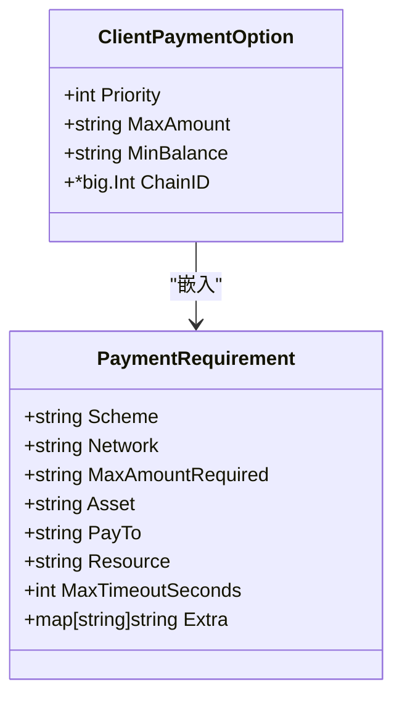
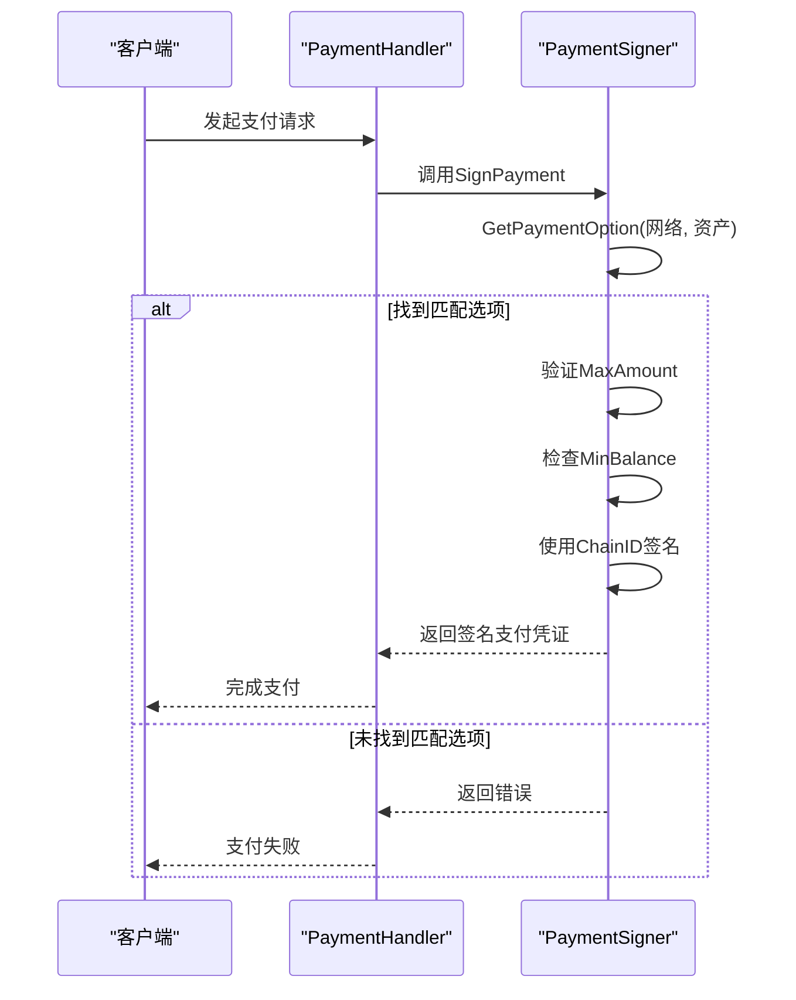
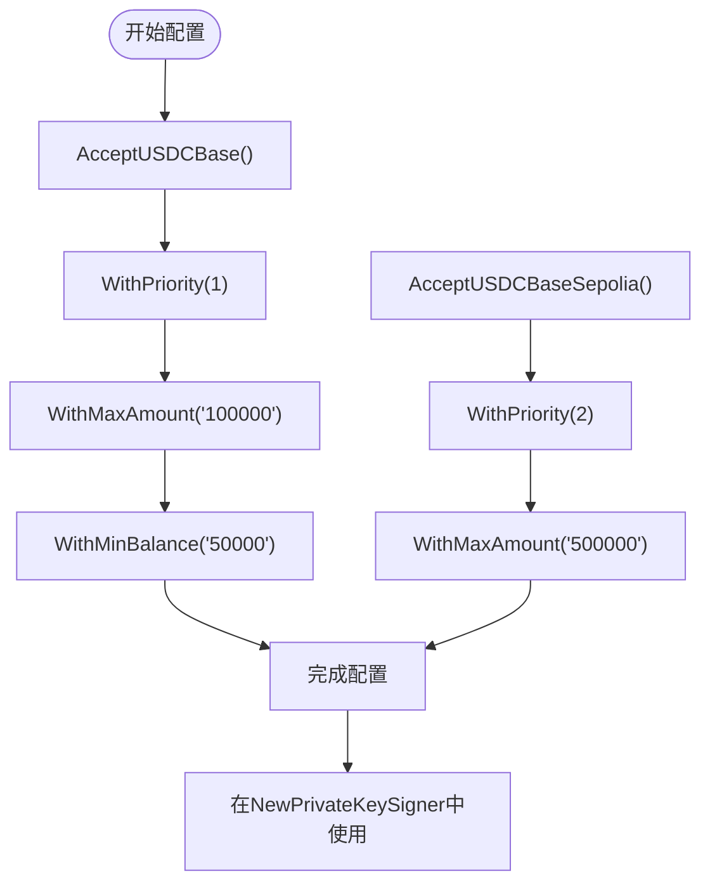
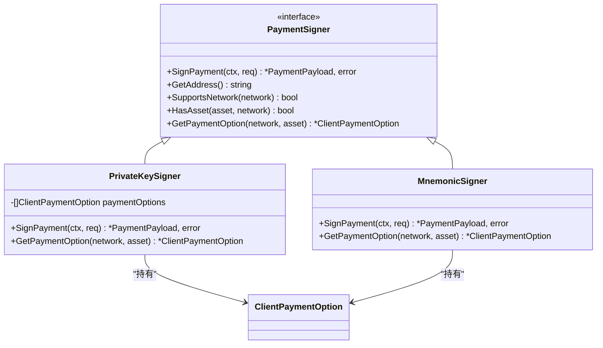

# ClientPaymentOption

<cite>
**Referenced Files in This Document**   
- [types.go](file://types.go#L93-L101)
- [client_options.go](file://client_options.go#L7-L58)
- [signer.go](file://signer.go#L48-L221)
- [handler.go](file://handler.go#L10-L13)
</cite>

## Table of Contents
1. [简介](#简介)
2. [数据模型结构](#数据模型结构)
3. [核心字段详解](#核心字段详解)
4. [支付决策逻辑](#支付决策逻辑)
5. [配置示例与使用模式](#配置示例与使用模式)
6. [依赖关系与集成](#依赖关系与集成)

## 简介
`ClientPaymentOption` 结构体是客户端支付偏好配置的核心数据模型，用于定义客户端在进行支付时的策略和限制。该结构体通过嵌入 `PaymentRequirement` 继承服务器端的支付要求，并扩展了客户端特有的配置字段，使客户端能够根据自身需求灵活地管理支付行为。这些扩展字段包括优先级排序、支付上限、余额阈值和链标识，共同构成了一个完整的客户端支付决策系统。

**Section sources**
- [types.go](file://types.go#L93-L101)

## 数据模型结构
`ClientPaymentOption` 结构体采用组合模式，将服务器端的支付要求与客户端的个性化配置相结合。其结构设计体现了分层配置的思想，基础层继承自 `PaymentRequirement`，包含网络、资产、支付金额等基本支付信息；扩展层则定义了客户端特有的控制参数。这种设计既保证了与服务器端要求的兼容性，又提供了客户端自主配置的能力。

**Diagram sources **
- [types.go](file://types.go#L9-L21)
- [types.go](file://types.go#L93-L101)

**Section sources**
- [types.go](file://types.go#L93-L101)

## 核心字段详解
`ClientPaymentOption` 的客户端特有字段为其提供了精细化的支付控制能力。`Priority` 字段用于多选项排序，数值越低表示优先级越高，在存在多个可用支付选项时，系统将优先选择高优先级的选项。`MaxAmount` 定义了客户端愿意支付的上限金额，任何超过此金额的支付请求都将被拒绝，这为客户端提供了重要的财务保护。`MinBalance` 设置了触发支付的最低余额阈值，当账户余额低于此值时，即使其他条件满足也不会进行支付，防止账户透支。`ChainID` 用于内部签名链的标识，确保交易在正确的区块链网络上执行，这是多链环境下的关键安全参数。

**Section sources**
- [types.go](file://types.go#L97-L100)

## 支付决策逻辑
`PaymentHandler` 利用 `ClientPaymentOption` 的字段进行自动支付决策，其核心逻辑体现在 `SignPayment` 方法中。当收到支付请求时，系统首先通过 `GetPaymentOption` 方法查找匹配的支付选项。决策过程遵循严格的优先级规则：系统会优先选择 `Priority` 值最低的选项，同时检查请求金额是否小于等于 `MaxAmount`。如果客户端配置了 `MinBalance`，还会验证支付后余额是否仍高于该阈值。整个决策流程确保了支付行为既符合服务器要求，又满足客户端的安全和财务策略。

**Diagram sources **
- [signer.go](file://signer.go#L112-L221)
- [handler.go](file://handler.go#L10-L13)

**Section sources**
- [signer.go](file://signer.go#L112-L221)

## 配置示例与使用模式
客户端可以通过预定义的辅助函数或自定义方式配置 `ClientPaymentOption`。项目提供了 `AcceptUSDCBase` 和 `AcceptUSDCBaseSepolia` 等便捷函数，用于快速配置主流网络的支付选项。这些函数不仅设置了基本的支付要求，还包含了正确的 `ChainID`。开发者可以使用流畅的API链式调用，通过 `WithPriority`、`WithMaxAmount` 和 `WithMinBalance` 方法对选项进行个性化定制。例如，可以为测试网设置较低的优先级和较高的支付上限，为主网设置较高的优先级和严格的财务限制，从而实现不同环境下的差异化支付策略。

**Diagram sources **
- [client_options.go](file://client_options.go#L7-L38)
- [client_options.go](file://client_options.go#L43-L58)

**Section sources**
- [client_options.go](file://client_options.go#L7-L58)

## 依赖关系与集成
`ClientPaymentOption` 与 `PaymentSigner` 接口紧密集成，是 `PrivateKeySigner`、`MnemonicSigner` 等具体实现类的核心配置。在 `NewPrivateKeySigner` 等构造函数中，`ClientPaymentOption` 数组被作为必需参数传入，并按 `Priority` 排序存储。`Signer` 实现类通过 `GetPaymentOption` 方法根据网络和资产查找匹配的选项，这一机制确保了支付决策的准确性和效率。整个系统通过这种依赖关系，实现了支付策略的集中管理和动态应用。

**Diagram sources **
- [signer.go](file://signer.go#L48-L78)
- [signer.go](file://signer.go#L102-L110)

**Section sources**
- [signer.go](file://signer.go#L48-L78)
- [signer.go](file://signer.go#L102-L110)