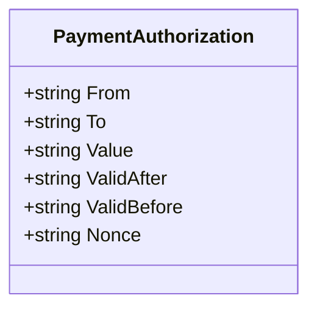
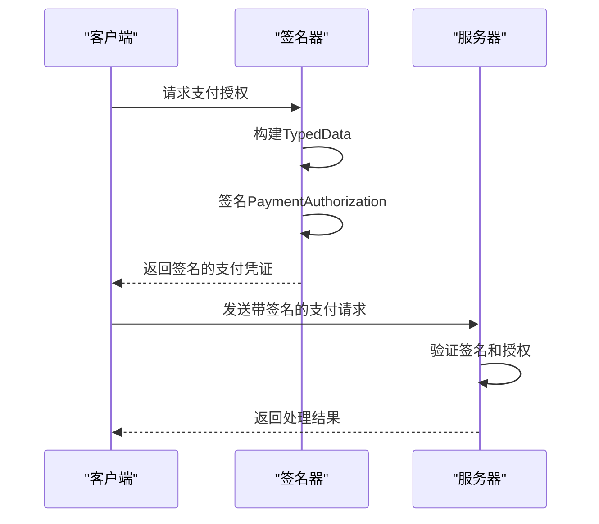
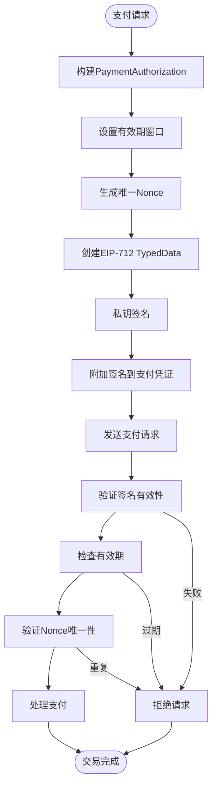

# PaymentAuthorization

<cite>
**Referenced Files in This Document**   
- [types.go](file://types.go)
- [signer.go](file://signer.go)
</cite>

## 目录
1. [简介](#简介)
2. [核心结构体分析](#核心结构体分析)
3. [EIP-712签名集成](#eip-712签名集成)
4. [安全支付流程](#安全支付流程)
5. [验证策略](#验证策略)

## 简介
`PaymentAuthorization` 结构体是实现EIP-3009兼容的链下支付授权凭证的核心数据结构。它定义了支付指令的所有必要参数，确保在去中心化应用中实现安全、可验证的支付流程。该结构体作为支付有效载荷的一部分，与数字签名共同构成完整的支付凭证。

## 核心结构体分析
`PaymentAuthorization` 结构体定义了支付授权的完整信息，其字段设计遵循EIP-3009标准，确保与以太坊生态系统的兼容性。

**Diagram sources**
- [types.go](file://types.go#L45-L52)

**Section sources**
- [types.go](file://types.go#L45-L52)

### 字段说明
- **From**: 支付方地址，标识交易的发起者。
- **To**: 收款方地址，指定资金的接收者。
- **Value**: 支付金额，以字符串形式表示的BigInt，确保大数值的精确处理。
- **ValidAfter**: 授权生效时间戳，定义支付指令的最早执行时间。
- **ValidBefore**: 授权失效时间戳，定义支付指令的最晚执行时间。
- **Nonce**: 防重放攻击的唯一随机数，确保每笔交易的唯一性。

## EIP-712签名集成
`PaymentAuthorization` 结构体与EIP-712签名标准深度集成，通过结构化数据签名确保支付指令的完整性和不可否认性。

**Diagram sources**
- [signer.go](file://signer.go#L112-L221)
- [types.go](file://types.go#L45-L52)

**Section sources**
- [signer.go](file://signer.go#L112-L221)

### 签名数据结构
在EIP-712 typedData签名中，`PaymentAuthorization` 映射到 `TransferWithAuthorization` 类型，其域（domain）和消息（message）结构如下：

#### 域（Domain）
- **name**: 协议或应用名称
- **version**: 协议版本
- **chainId**: 区块链网络ID
- **verifyingContract**: 验证合约地址

#### 消息（Message）
消息字段直接对应 `PaymentAuthorization` 的各个属性，确保签名覆盖所有关键参数。

## 安全支付流程
`PaymentAuthorization` 在安全支付流程中扮演关键角色，通过多层安全机制保护交易。

**Diagram sources**
- [signer.go](file://signer.go#L112-L221)
- [types.go](file://types.go#L45-L52)

**Section sources**
- [signer.go](file://signer.go#L112-L221)

## 验证策略
系统实施严格的验证策略，确保 `PaymentAuthorization` 的安全性和有效性。

### 金额验证
- 确保 `Value` 字段为有效的正数
- 验证金额不超过支付要求中指定的最大限额
- 使用 `big.Int` 进行精确的数值计算和比较

### 有效期验证
- 检查当前时间是否在 `ValidAfter` 和 `ValidBefore` 定义的时间窗口内
- 实施合理的时钟偏移缓冲区（默认30秒），以应对网络延迟和系统时钟差异
- 确保 `ValidBefore` 不超过合理上限（如1小时），防止长期有效的授权凭证

### Nonce验证
- 服务器端维护已使用Nonce的记录，防止重放攻击
- 通过加密哈希函数生成唯一Nonce，结合时间戳、资源标识和地址信息
- 验证Nonce的格式和长度符合预期标准

**Section sources**
- [signer.go](file://signer.go#L112-L221)