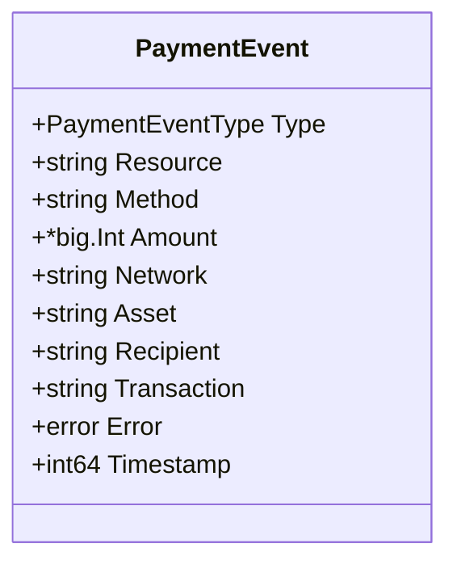
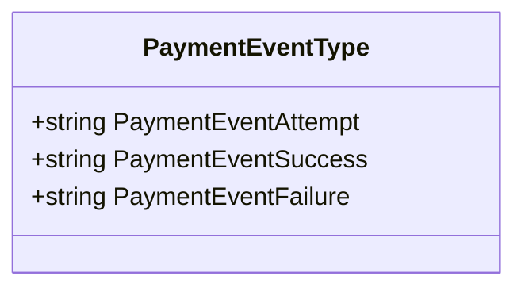
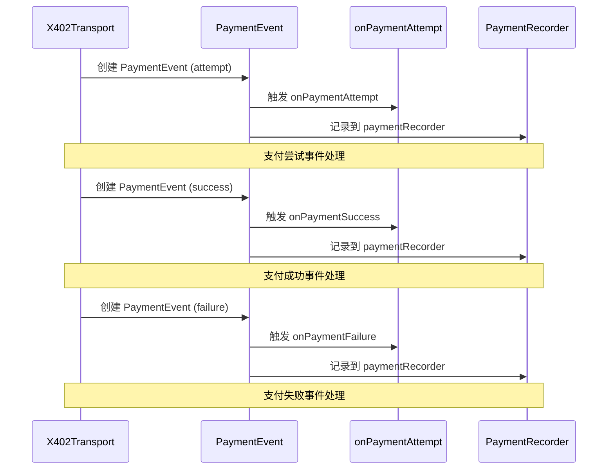
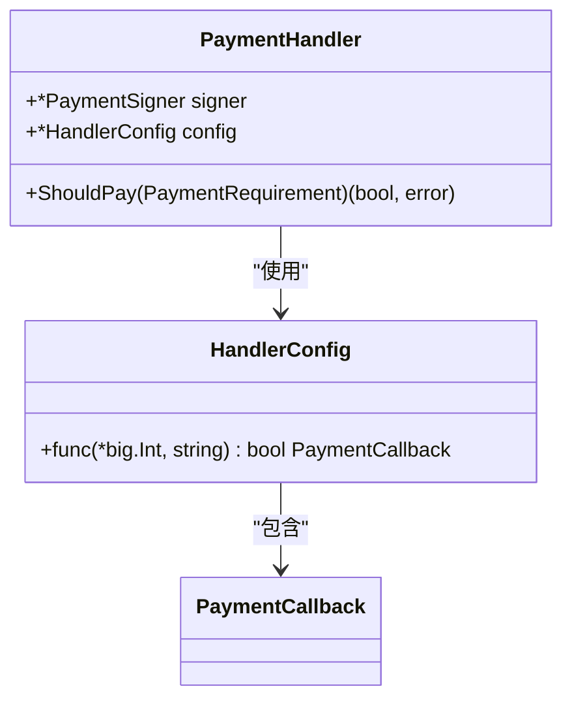
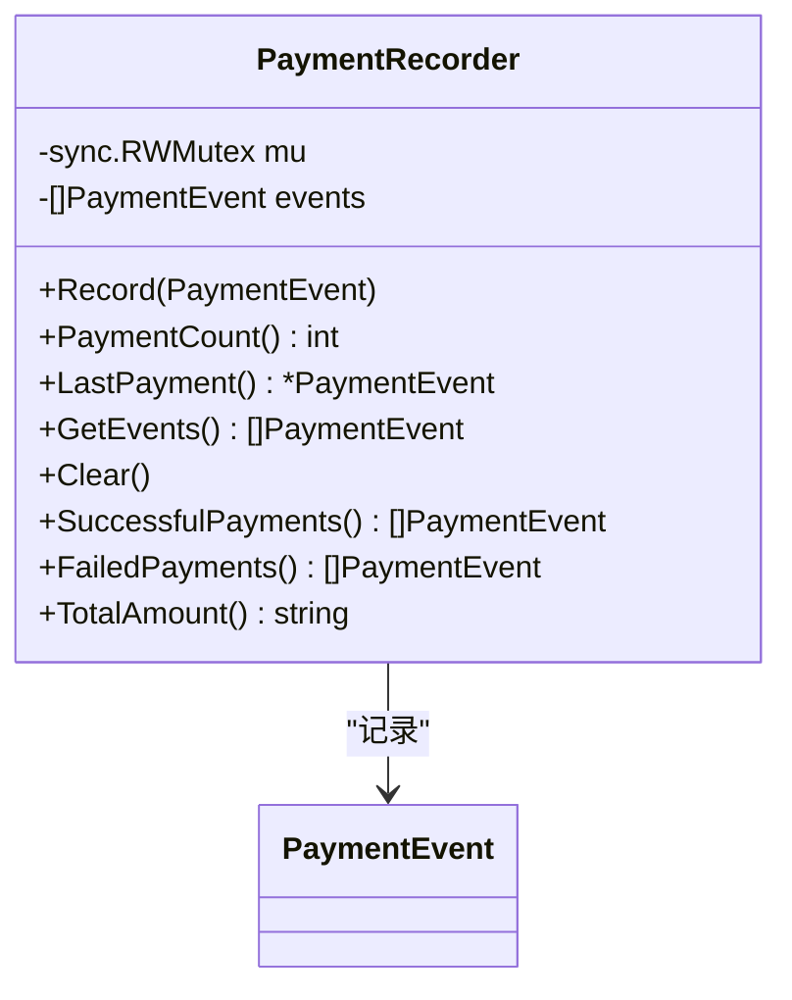
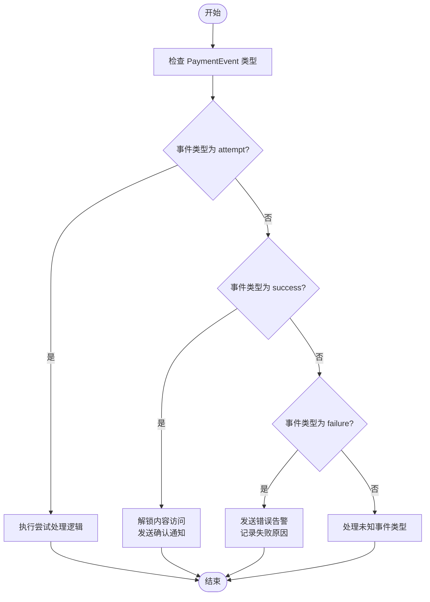

# PaymentEvent

<cite>
**Referenced Files in This Document**   
- [types.go](file://types.go#L70-L84)
- [transport.go](file://transport.go#L750-L805)
- [handler.go](file://handler.go#L50-L101)
- [test_utils.go](file://test_utils.go#L8-L126)
</cite>

## 目录
1. [简介](#简介)
2. [核心结构](#核心结构)
3. [事件类型](#事件类型)
4. [事件处理机制](#事件处理机制)
5. [回调函数](#回调函数)
6. [事件记录器](#事件记录器)
7. [使用示例](#使用示例)

## 简介
`PaymentEvent` 结构体在客户端支付生命周期监控中扮演着关键角色，用于表示支付生命周期中的各种事件。该结构体通过 `Type` 字段使用 `PaymentEventType` 枚举来标识事件阶段（尝试、成功、失败），`Resource` 和 `Method` 字段记录关联的 MCP 工具调用，`Amount` 和 `Asset` 表示实际支付金额和资产，`Network` 和 `Recipient` 提供链上信息，`Transaction` 包含交易哈希（成功时），`Error` 携带失败原因，`Timestamp` 记录事件时间戳。开发者可以通过 `PaymentCallback` 利用此事件实现支付日志、状态追踪和错误告警。

**Section sources**
- [types.go](file://types.go#L70-L84)

## 核心结构
`PaymentEvent` 结构体定义了支付事件的所有必要属性，包括事件类型、资源标识、方法名称、支付金额、网络信息、资产类型、接收方地址、交易哈希、错误信息和时间戳。这些字段共同构成了一个完整的支付事件记录，为后续的分析和处理提供了丰富的上下文信息。

**Diagram sources**
- [types.go](file://types.go#L70-L81)

**Section sources**
- [types.go](file://types.go#L70-L81)

## 事件类型
`PaymentEventType` 是一个字符串类型的枚举，定义了三种支付事件类型：`attempt`（尝试）、`success`（成功）和`failure`（失败）。这些类型通过常量 `PaymentEventAttempt`、`PaymentEventSuccess` 和 `PaymentEventFailure` 进行标识，为支付流程的不同阶段提供了清晰的分类。

**Diagram sources**
- [types.go](file://types.go#L84-L87)

**Section sources**
- [types.go](file://types.go#L84-L87)

## 事件处理机制
支付事件的处理主要在 `X402Transport` 结构体中实现，通过 `recordPaymentEvent` 和 `recordPaymentError` 方法来记录不同类型的支付事件。当支付尝试、成功或失败时，系统会创建相应的 `PaymentEvent` 实例并触发相应的回调函数。这种机制确保了支付流程的每个关键节点都能被准确记录和响应。

**Diagram sources**
- [transport.go](file://transport.go#L750-L805)

**Section sources**
- [transport.go](file://transport.go#L750-L805)

## 回调函数
`PaymentCallback` 是一个函数类型，定义在 `HandlerConfig` 结构体中，用于在支付决策过程中进行回调。它接收支付金额和资源标识作为参数，并返回一个布尔值来决定是否执行支付。这个回调机制允许开发者根据业务逻辑自定义支付策略，例如基于金额大小或资源类型来批准或拒绝支付请求。

**Diagram sources**
- [handler.go](file://handler.go#L17-L17)
- [handler.go](file://handler.go#L50-L55)

**Section sources**
- [handler.go](file://handler.go#L17-L17)
- [handler.go](file://handler.go#L50-L55)

## 事件记录器
`PaymentRecorder` 是一个专门用于测试的组件，实现了对支付事件的记录和查询功能。它可以记录所有支付事件，并提供方法来获取成功或失败的支付事件列表，以及计算成功支付的总金额。这个记录器在单元测试中非常有用，可以验证支付流程的正确性和完整性。

**Diagram sources**
- [test_utils.go](file://test_utils.go#L8-L11)
- [test_utils.go](file://test_utils.go#L14-L126)

**Section sources**
- [test_utils.go](file://test_utils.go#L8-L126)

## 使用示例
开发者可以利用 `PaymentEvent` 和相关机制来实现各种业务逻辑。例如，在 `success` 事件后解锁内容访问，或者在 `failure` 事件时发送错误告警。通过配置 `onPaymentSuccess` 回调，可以在支付成功后执行特定操作，如更新用户权限或发送确认通知。同时，使用 `PaymentRecorder` 可以方便地进行支付数据的统计和分析。

**Diagram sources**
- [transport.go](file://transport.go#L750-L805)
- [test_utils.go](file://test_utils.go#L8-L126)

**Section sources**
- [transport.go](file://transport.go#L750-L805)
- [test_utils.go](file://test_utils.go#L8-L126)