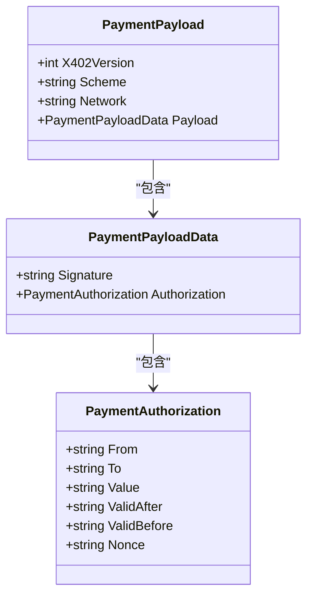
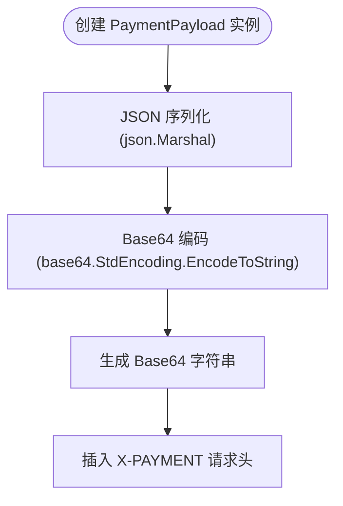
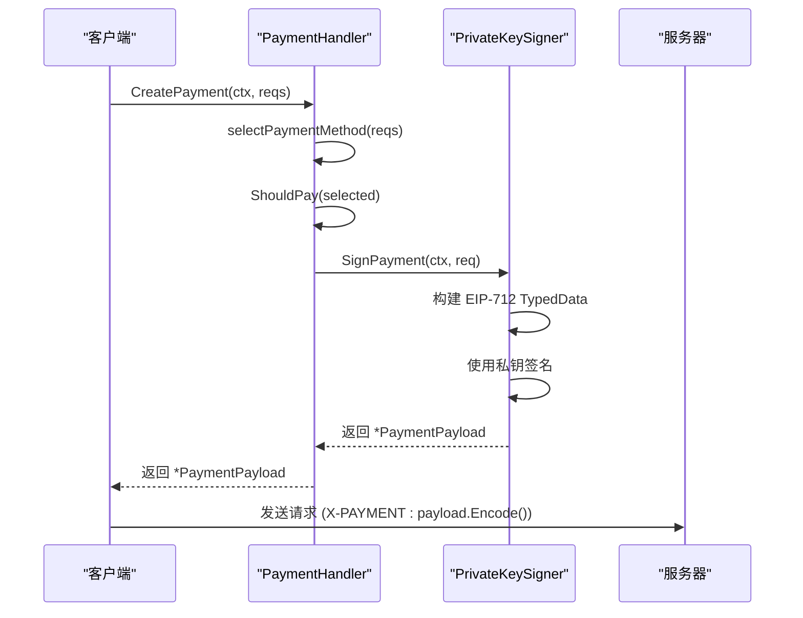

# PaymentPayload

<cite>
**Referenced Files in This Document**  
- [types.go](file://types.go#L31-L58)
- [signer.go](file://signer.go#L112-L432)
- [transport.go](file://transport.go#L213-L309)
- [handler.go](file://handler.go#L58-L82)
</cite>

## 目录
1. [简介](#简介)
2. [核心结构分析](#核心结构分析)
3. [数据编码与传输](#数据编码与传输)
4. [端到端使用示例](#端到端使用示例)
5. [序列化与编码流程](#序列化与编码流程)

## 简介
`PaymentPayload` 结构体是 X402 协议中用于表示客户端支付凭证的核心数据结构。它作为客户端在发起支付请求时的签名授权凭证，通过 `X-PAYMENT` 请求头进行传输。该结构体设计确保了支付数据的完整性、安全性和协议兼容性，是实现自动化支付流程的关键组件。

## 核心结构分析

`PaymentPayload` 结构体定义了支付凭证的顶层结构，包含协议版本、支付方案、网络标识和具体的签名数据载荷。



**Diagram sources**
- [types.go](file://types.go#L31-L36)
- [types.go](file://types.go#L39-L42)
- [types.go](file://types.go#L45-L52)

**Section sources**
- [types.go](file://types.go#L31-L58)

### 字段说明

- **X402Version**: 协议版本号，确保客户端与服务器之间的协议兼容性。当前版本为 `1`。
- **Scheme**: 支付方案标识符，用于匹配服务器在 `PaymentRequirement` 中声明的支付方式，如 `exact` 表示精确金额支付。
- **Network**: 网络标识符，用于指定支付所使用的区块链网络，如 `ethereum-mainnet` 或 `base-mainnet`，确保与 `PaymentRequirement` 中的网络要求匹配。
- **Payload**: 封装了具体的签名数据和授权信息，是支付凭证的核心内容。

`Payload` 字段的类型为 `PaymentPayloadData`，它进一步封装了 EIP-712 签名数据的嵌套结构：

- **Signature**: 包含对 `Authorization` 数据进行 EIP-712 签名后生成的十六进制签名字符串。
- **Authorization**: 包含具体的支付授权信息，其结构与 EIP-3009 标准兼容，确保了跨应用的互操作性。

`PaymentAuthorization` 结构体定义了支付授权的详细信息：

- **From**: 支付发起方的以太坊地址。
- **To**: 支付接收方的合约或钱包地址。
- **Value**: 支付金额，以资产的最小单位（如 wei）表示，为字符串格式。
- **ValidAfter**: 授权生效的时间戳（Unix 秒），用于防止重放攻击。
- **ValidBefore**: 授权失效的时间戳（Unix 秒），定义了授权的有效期。
- **Nonce**: 一次性随机数，用于确保每笔支付的唯一性，防止重放攻击。

## 数据编码与传输

`PaymentPayload` 结构体通过 `Encode()` 方法进行序列化和编码，以适应 HTTP 头部的传输要求。



**Diagram sources**
- [types.go](file://types.go#L55-L58)
- [transport.go](file://transport.go#L213-L309)

**Section sources**
- [types.go](file://types.go#L55-L58)

### Encode() 方法详解

`Encode()` 方法是 `PaymentPayload` 结构体的关键方法，负责将结构体实例转换为适合在 HTTP 头部传输的字符串。

1.  **JSON 序列化**: 首先，使用 `json.Marshal()` 函数将整个 `PaymentPayload` 结构体（包括其嵌套的 `Payload`、`Authorization` 等字段）转换为一个 JSON 格式的字节数组。
2.  **Base64 编码**: 由于 HTTP 头部对字符有严格限制（不能包含换行符等），直接传输 JSON 字符串是不安全的。因此，将上一步得到的 JSON 字节数组通过 `base64.StdEncoding.EncodeToString()` 进行 Base64 编码，生成一个纯 ASCII 字符串。
3.  **返回结果**: 最终返回这个 Base64 编码后的字符串，该字符串可以安全地作为 `X-PAYMENT` 头部的值进行传输。

此方法确保了复杂的嵌套数据结构能够被完整、无损地打包，并通过标准的 HTTP 机制进行传输。

## 端到端使用示例

以下流程展示了 `PaymentPayload` 从创建到最终在 HTTP 头部中使用的完整过程。



**Diagram sources**
- [handler.go](file://handler.go#L58-L82)
- [signer.go](file://signer.go#L112-L432)
- [transport.go](file://transport.go#L213-L309)

**Section sources**
- [handler.go](file://handler.go#L58-L82)

### 流程说明

1.  **请求支付**: 当客户端收到服务器返回的 `402 Payment Required` 错误时，会调用 `PaymentHandler.CreatePayment()` 方法，并传入从错误中解析出的 `PaymentRequirementsResponse`。
2.  **选择与决策**: `PaymentHandler` 会根据客户端配置的支付选项，从 `reqs.Accepts` 列表中选择最合适的 `PaymentRequirement`，并通过 `ShouldPay()` 方法（可能调用用户回调）决定是否进行支付。
3.  **签名生成**: 决策通过后，`PaymentHandler` 会调用其内部 `signer` 的 `SignPayment()` 方法。`PrivateKeySigner` 会根据 `PaymentRequirement` 中的信息（如网络、资产、金额、接收方等）构建符合 EIP-712 标准的 `TypedData` 对象，然后使用客户端的私钥对其进行签名，最终构造并返回一个完整的 `*PaymentPayload` 实例。
4.  **编码与传输**: 客户端获取到 `*PaymentPayload` 后，调用其 `Encode()` 方法，得到一个 Base64 编码的字符串。最后，将此字符串作为 `X-PAYMENT` 头部的值，重新发送原始请求。

## 序列化与编码流程

结合 `PaymentPayload`、`PaymentPayloadData` 和 `PaymentAuthorization` 的结构，完整的序列化和编码流程如下：

1.  **构建 Authorization**: 首先填充 `PaymentAuthorization` 结构体，包含 `From`, `To`, `Value`, `ValidAfter`, `ValidBefore`, `Nonce` 等字段。
2.  **构建 PayloadData**: 将上一步的 `Authorization` 和生成的 `Signature` 组合成 `PaymentPayloadData`。
3.  **构建 PaymentPayload**: 将 `X402Version`, `Scheme`, `Network` 和上一步的 `PayloadData` 组合成最终的 `PaymentPayload` 结构体。
4.  **JSON 序列化**: 调用 `json.Marshal()` 将整个 `PaymentPayload` 结构体转换为 JSON 字符串。例如：
    ```json
    {"x402Version":1,"scheme":"exact","network":"base-mainnet","payload":{"signature":"0x...","authorization":{"from":"0x...","to":"0x...","value":"500000","validAfter":"1700000000","validBefore":"1700003600","nonce":"0x..."}}}
    ```
5.  **Base64 编码**: 将上述 JSON 字符串进行 Base64 编码，生成最终的头部值。例如：
    ```
    eyJ4NDAyVmVyc2lvbiI6MSwic2NoZW1lIjoiZXhhY3QiLCJub2R3b3JrIjoiYmFzZS1tYWlubmV0IiwicGF5bG9hZCI6eyJzaWduYXR1cmUiOiIweC4uLiIsImF1dGhvcml6YXRpb24iOnsiZnJvbSI6IjB4Li4uIiwidG8iOiIweC4uLiIsInZhbHVlIjoiNTAwMDAwIiwidmFsaWRBZnRlciI6IjE3MDAwMDAwMDAiLCJ2YWxpZEJlZm9yZSI6IjE3MDAwMDM2MDAiLCJub25jZSI6IjB4Li4uIn19fQ==
    ```
    此字符串即为 `X-PAYMENT` 头部的最终值。