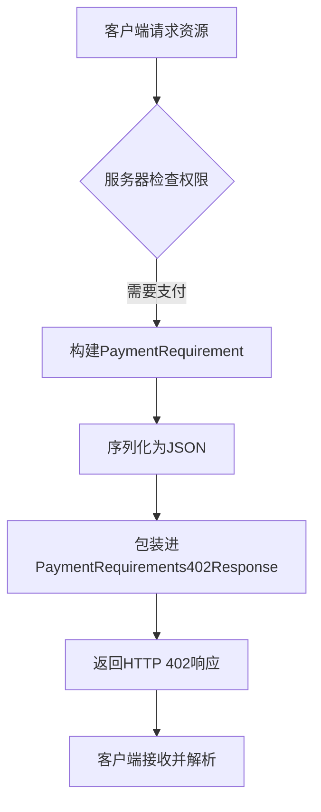
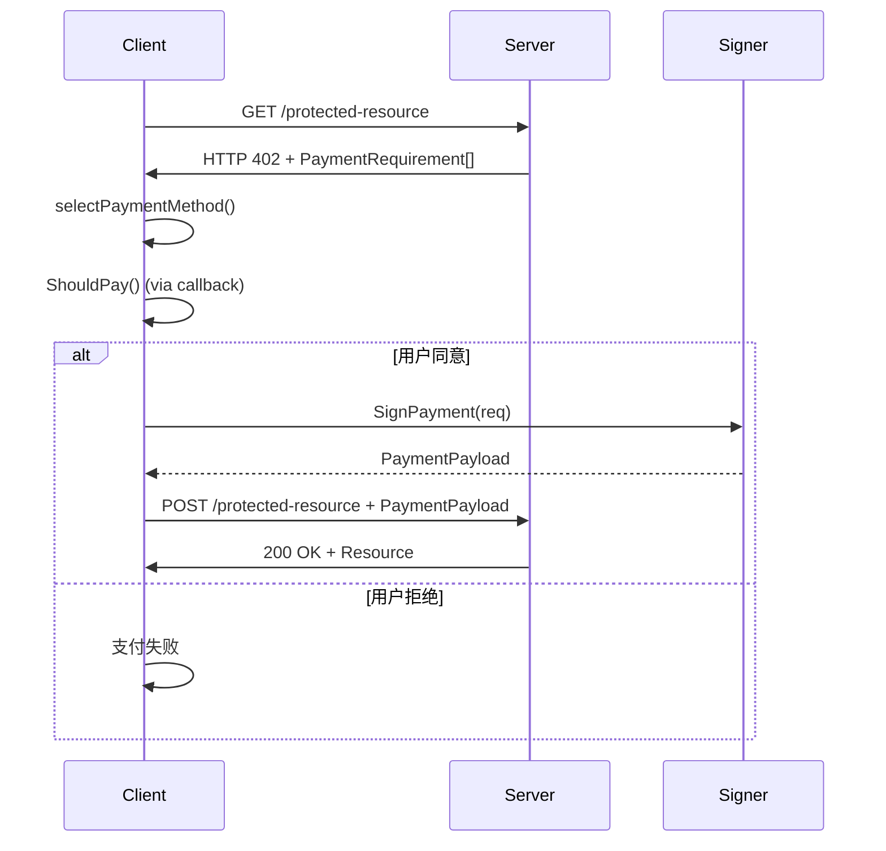

# PaymentRequirement

<cite>
**Referenced Files in This Document**   
- [types.go](file://types.go)
- [server/types.go](file://server/types.go)
- [server/requirements.go](file://server/requirements.go)
- [server/handler.go](file://server/handler.go)
- [handler.go](file://handler.go)
- [signer.go](file://signer.go)
- [transport.go](file://transport.go)
</cite>

## 目录
1. [简介](#简介)
2. [结构体定义](#结构体定义)
3. [字段详解](#字段详解)
4. [序列化与HTTP响应](#序列化与http响应)
5. [字段约束与验证规则](#字段约束与验证规则)
6. [实际应用示例](#实际应用示例)
7. [客户端决策流程](#客户端决策流程)

## 简介

`PaymentRequirement` 结构体是 x402 支付协议中的核心组件，用于在服务器端描述对特定资源的支付需求。当客户端请求受保护的资源时，服务器会通过 HTTP 402 响应返回一个或多个 `PaymentRequirement`，明确告知客户端完成访问所需的支付条件。该结构体定义了支付方案、网络、资产、金额、收款方等关键信息，是实现自动化支付决策的基础。

**Section sources**
- [types.go](file://types.go#L9-L21)
- [server/types.go](file://server/types.go#L4-L16)

## 结构体定义

`PaymentRequirement` 是一个 Go 语言结构体，其定义在 `types.go` 和 `server/types.go` 文件中。该结构体通过 JSON 标签（`json:"..."`）定义了其在序列化为 JSON 格式时的字段名称，确保了跨语言和跨平台的兼容性。

```go
type PaymentRequirement struct {
	Scheme            string            `json:"scheme"`
	Network           string            `json:"network"`
	MaxAmountRequired string            `json:"maxAmountRequired"`
	Asset             string            `json:"asset"`
	PayTo             string            `json:"payTo"`
	Resource          string            `json:"resource"`
	Description       string            `json:"description"`
	MimeType          string            `json:"mimeType,omitempty"`
	OutputSchema      interface{}       `json:"outputSchema,omitempty"`
	MaxTimeoutSeconds int               `json:"maxTimeoutSeconds"`
	Extra             map[string]string `json:"extra,omitempty"`
}
```

**Section sources**
- [types.go](file://types.go#L9-L21)
- [server/types.go](file://server/types.go#L4-L16)

## 字段详解

`PaymentRequirement` 结构体包含以下字段，每个字段都承载着特定的支付信息：

### Scheme (支付方案)
- **描述**: 指定支付所使用的方案或协议。常见的值是 `"eip712"`，表示使用 EIP-712 标准进行签名授权。
- **作用**: 客户端根据此方案选择相应的签名算法和流程。
- **示例**: `"eip712"`

### Network (区块链网络)
- **描述**: 标识交易将要执行的区块链网络。例如 `"ethereum-sepolia"` 表示以太坊 Sepolia 测试网。
- **作用**: 确保支付在正确的网络上进行，避免资产错付。
- **示例**: `"base-sepolia"`

### Asset (支付资产类型)
- **描述**: 指定支付所使用的资产，通常为代币的合约地址。
- **作用**: 明确支付的货币种类，如 USDC、DAI 等。
- **示例**: `"0x833589fCD6eDb6E08f4c7C32D4f71b54bdA02913"` (Base 网络上的 USDC)

### MaxAmountRequired (最大需支付金额)
- **描述**: 定义客户端需要支付的最大金额。使用字符串形式的 BigInt 以避免浮点数精度问题。
- **作用**: 设定支付上限，保护客户端利益。
- **示例**: `"1000000"` (表示 1 USDC)

### PayTo (收款方地址)
- **描述**: 接收支付的区块链地址。
- **作用**: 指明资金的最终去向。
- **示例**: `"0x209693Bc6afc0C5328bA36FaF03C514EF312287C"`

### Resource (被请求资源)
- **描述**: 标识被请求访问的资源，通常是一个 URI。
- **作用**: 将支付与具体的资源访问权限绑定。
- **示例**: `"mcp://tools/get_weather"`

### Description (人类可读说明)
- **描述**: 提供关于支付需求的简要说明，便于用户理解。
- **作用**: 增强用户体验，让用户知晓支付目的。
- **示例**: `"获取天气信息"`

### MimeType (响应格式)
- **描述**: 指定成功支付后，服务器响应体的 MIME 类型。
- **作用**: 告知客户端如何解析后续的响应数据。
- **示例**: `"application/json"`

### OutputSchema (响应格式描述)
- **描述**: 一个可选的接口（`interface{}`），用于描述成功支付后响应数据的 JSON Schema。
- **作用**: 提供更详细的响应结构信息，便于客户端进行数据验证和处理。
- **示例**: `{ "type": "object", "properties": { "temperature": { "type": "number" } } }`

### MaxTimeoutSeconds (支付有效期)
- **描述**: 限制支付的有效期，以秒为单位。超过此时间，支付授权将失效。
- **作用**: 防止支付授权被无限期使用，增加安全性。
- **示例**: `60`

### Extra (协议扩展)
- **描述**: 一个可选的字符串映射（`map[string]string`），用于支持协议的未来扩展。
- **作用**: 允许在不修改核心结构体的情况下添加自定义字段。
- **示例**: `{"name": "USD Coin", "version": "2"}`

**Section sources**
- [types.go](file://types.go#L9-L21)
- [server/types.go](file://server/types.go#L4-L16)

## 序列化与HTTP响应

`PaymentRequirement` 结构体在服务器端被序列化为 JSON 格式，并作为 HTTP 402 响应的一部分返回给客户端。通常，它会被包装在 `PaymentRequirements402Response` 结构体中，该结构体包含一个 `Accepts` 字段，其值为 `PaymentRequirement` 的数组。



**Diagram sources**
- [server/types.go](file://server/types.go#L22-L22)
- [server/handler.go](file://server/handler.go#L217-L235)

## 字段约束与验证规则

为了确保支付流程的正确性和安全性，`PaymentRequirement` 的各个字段遵循严格的约束和验证规则：

- **MaxAmountRequired**: 必须是一个有效的非负整数字符串。在客户端和服务器端都会进行验证，如 `signer.go` 中的 `SignPayment` 方法会检查金额是否为正数。
- **MaxTimeoutSeconds**: 有合理的范围限制。在 `signer.go` 的 `SignPayment` 方法中，如果该值小于 60 秒，则会被调整为 60 秒；如果大于 3600 秒（1小时），则会被调整为 3600 秒。
- **Scheme, Network, Asset, PayTo**: 这些字段不能为空，且必须与服务器配置的支付选项相匹配。`handler.go` 中的 `selectPaymentMethod` 方法会验证客户端是否支持这些网络和资产。
- **Resource**: 必须唯一标识一个受保护的资源。

**Section sources**
- [signer.go](file://signer.go#L112-L221)
- [handler.go](file://handler.go#L85-L152)

## 实际应用示例

以下是一个 `PaymentRequirement` 在 HTTP 响应中的实际 JSON 示例：

```json
{
  "jsonrpc": "2.0",
  "id": 1,
  "error": {
    "code": 402,
    "message": "Payment required",
    "data": {
      "x402Version": 1,
      "error": "Payment required to access this resource",
      "accepts": [
        {
          "scheme": "exact",
          "network": "base-sepolia",
          "maxAmountRequired": "10000",
          "asset": "0x036CbD53842c5426634e7929541eC2318f3dCF7e",
          "payTo": "0x209693Bc6afc0C5328bA36FaF03C514EF312287C",
          "resource": "mcp://tools/get_weather",
          "description": "获取天气信息",
          "mimeType": "application/json",
          "maxTimeoutSeconds": 60,
          "extra": {
            "name": "USDC",
            "version": "2"
          }
        }
      ]
    }
  }
}
```

此示例展示了一个请求天气信息工具的支付需求，要求在 Base Sepolia 网络上支付最多 0.01 USDC。

**Section sources**
- [server/handler.go](file://server/handler.go#L217-L235)
- [transport.go](file://transport.go#L234-L237)

## 客户端决策流程

客户端在收到 `PaymentRequirement` 后，会启动一个决策流程来决定是否支付以及如何支付。这个流程主要由 `PaymentHandler` 控制：

1.  **选择支付方式**: `selectPaymentMethod` 方法会遍历服务器提供的所有 `PaymentRequirement`，并根据客户端的 `PaymentOption`（优先级、最大支付额等）选择最合适的支付方案。
2.  **确认支付**: `ShouldPay` 方法会调用用户提供的 `PaymentCallback` 回调函数，询问用户是否同意此次支付。
3.  **签名支付**: 如果用户同意，`SignPayment` 方法会使用私钥对支付授权进行签名，生成 `PaymentPayload`。
4.  **提交支付**: 最后，客户端将签名后的支付信息重新发送给服务器以完成交易。



**Diagram sources**
- [handler.go](file://handler.go#L85-L152)
- [handler.go](file://handler.go#L37-L55)
- [signer.go](file://signer.go#L112-L221)