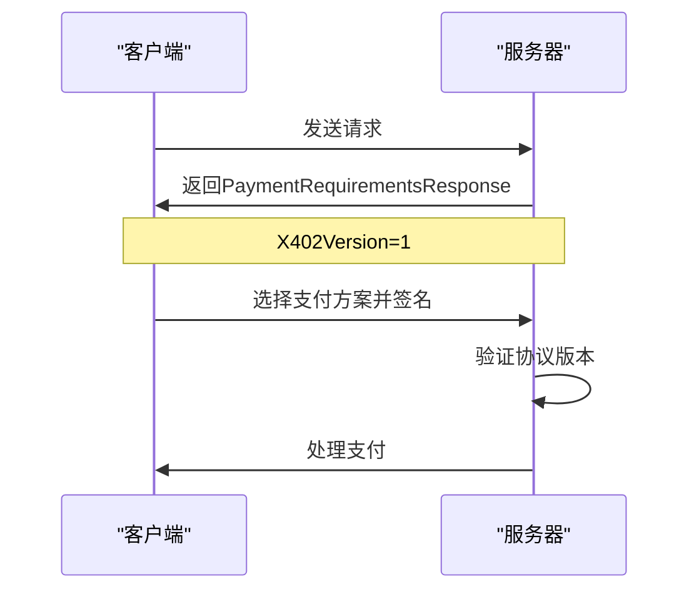
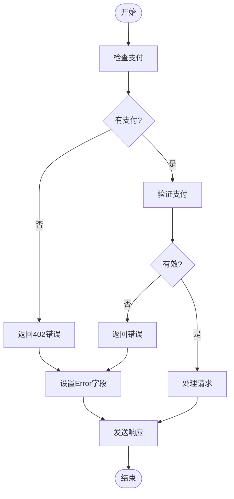
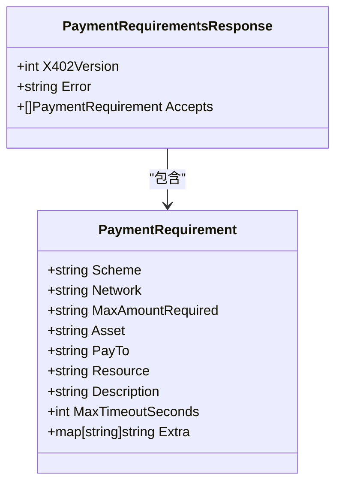
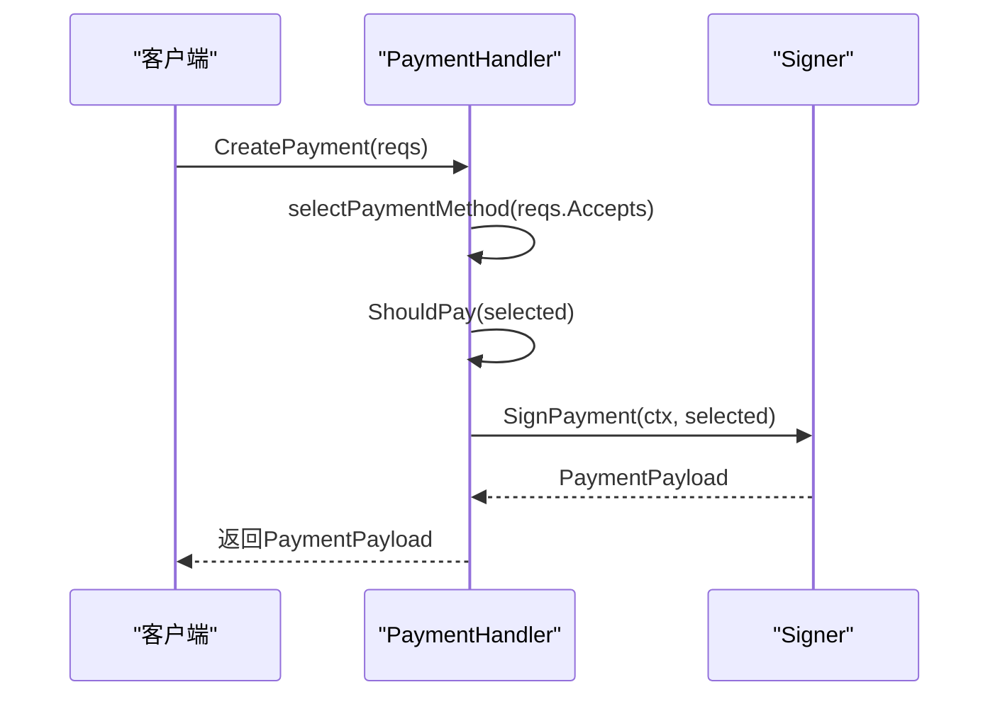
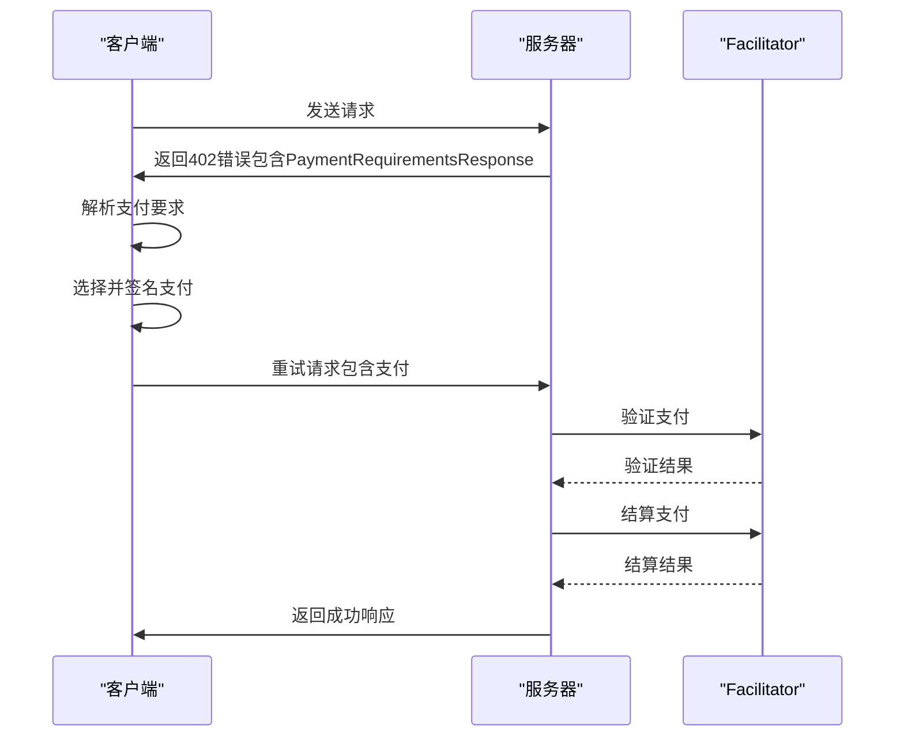
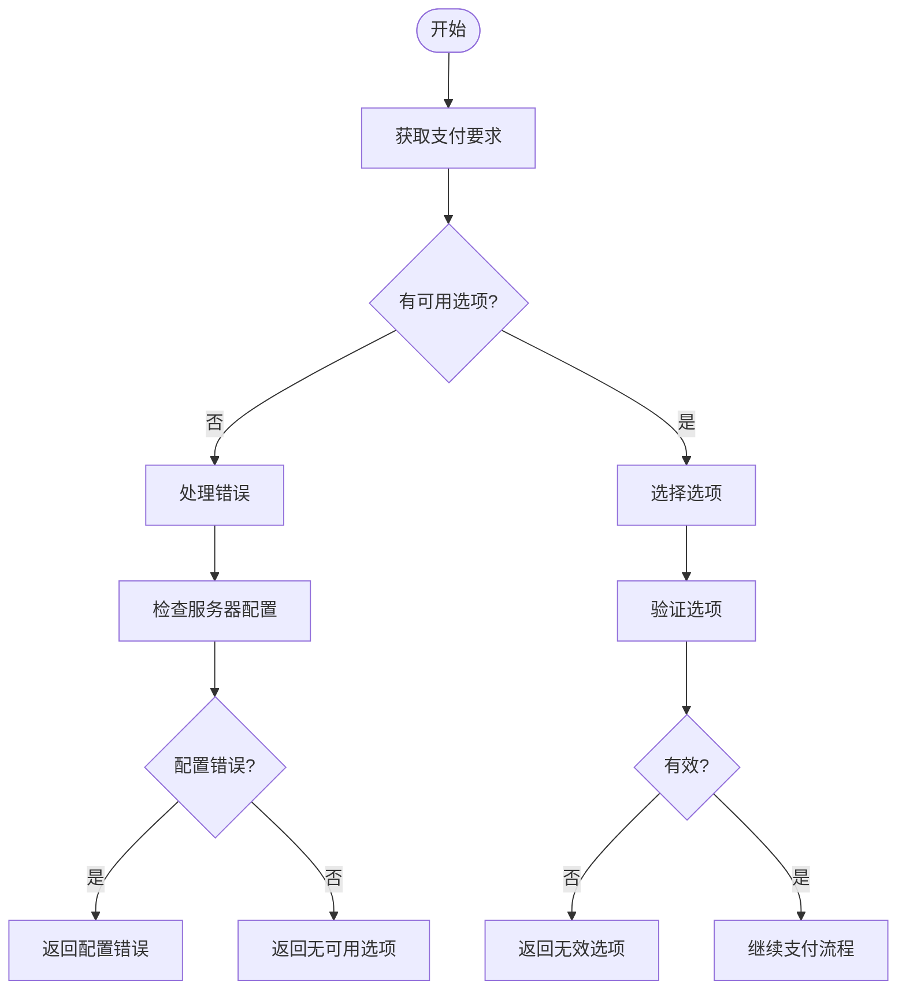

# PaymentRequirementsResponse

<cite>
**本文档中引用的文件**   
- [types.go](file://types.go#L24-L28)
- [transport.go](file://transport.go#L347-L386)
- [transport.go](file://transport.go#L751-L788)
- [transport.go](file://transport.go#L790-L821)
- [transport.go](file://transport.go#L389-L406)
- [handler.go](file://handler.go#L58-L82)
- [transport_test.go](file://transport_test.go#L501-L578)
- [transport_test.go](file://transport_test.go#L771-L819)
- [transport_test.go](file://transport_test.go#L66-L156)
- [transport_test.go](file://transport_test.go#L580-L661)
- [transport_test.go](file://transport_test.go#L158-L211)
- [transport_test.go](file://transport_test.go#L213-L279)
- [transport_test.go](file://transport_test.go#L281-L391)
- [client_options.go](file://client_options.go#L5-L59)
- [client_options_test.go](file://client_options_test.go#L116-L212)
- [signer.go](file://signer.go#L112-L221)
- [signer.go](file://signer.go#L392-L432)
- [server/types.go](file://server/types.go#L22-L22)
- [server/handler.go](file://server/handler.go#L217-L235)
- [server/facilitator.go](file://server/facilitator.go#L49-L118)
- [server/facilitator.go](file://server/facilitator.go#L120-L156)
- [server/requirements.go](file://server/requirements.go#L5-L20)
- [server/requirements.go](file://server/requirements.go#L23-L38)
</cite>

## 目录
1. [简介](#简介)
2. [结构体定义](#结构体定义)
3. [字段说明](#字段说明)
4. [协议版本协商](#协议版本协商)
5. [错误信息处理](#错误信息处理)
6. [支付方式列表](#支付方式列表)
7. [客户端解析流程](#客户端解析流程)
8. [JSON序列化示例](#json序列化示例)
9. [MCP协议错误处理集成](#mcp协议错误处理集成)
10. [无可用支付方式场景](#无可用支付方式场景)
11. [反序列化代码示例](#反序列化代码示例)

## 简介
`PaymentRequirementsResponse` 结构体作为HTTP 402响应体的数据封装角色，用于在MCP（Monetized Content Protocol）协议中传递支付要求。当客户端请求需要支付的资源时，服务器通过此结构体返回可用的支付方案、协议版本信息和错误详情。该结构体是实现x402支付流程的核心组件，协调客户端与服务器之间的支付协商过程。

**Section sources**
- [types.go](file://types.go#L24-L28)

## 结构体定义
`PaymentRequirementsResponse` 结构体定义了HTTP 402响应体的数据结构，包含协议版本、错误信息和可接受的支付要求列表。该结构体用于在JSON-RPC 402错误中作为`data`字段的值，或在HTTP 402响应中作为响应体。

```go
type PaymentRequirementsResponse struct {
	X402Version int                  `json:"x402Version"`
	Error       string               `json:"error"`
	Accepts     []PaymentRequirement `json:"accepts"`
}
```

**Section sources**
- [types.go](file://types.go#L24-L28)

## 字段说明
`PaymentRequirementsResponse` 结构体包含三个核心字段，分别用于协议版本协商、错误信息传递和支付方式列举。

### X402Version 字段
`X402Version` 字段表示x402协议的版本号，用于客户端和服务器之间的协议版本协商。当前实现中固定为1，确保双方使用兼容的协议版本进行通信。该字段在签名和验证过程中也用于确保协议一致性。

**Section sources**
- [types.go](file://types.go#L25-L25)

### Error 字段
`Error` 字段包含人类可读的错误消息，解释为什么需要支付或支付失败的原因。该字段提供上下文信息给客户端用户，例如"Payment required"或"X-PAYMENT header is required"。错误信息在服务器配置错误或支付验证失败时尤为重要。

**Section sources**
- [types.go](file://types.go#L26-L26)

### Accepts 字段
`Accepts` 字段是`PaymentRequirement`对象的数组，列出服务器接受的所有支付方式。每个`PaymentRequirement`包含支付方案、网络、资产、收款地址、金额要求等详细信息。客户端根据此列表选择合适的支付方案进行支付。

**Section sources**
- [types.go](file://types.go#L27-L27)

## 协议版本协商
`X402Version` 字段在支付流程中起到关键的协议版本协商作用。当服务器返回`PaymentRequirementsResponse`时，`X402Version`字段确保客户端使用正确的协议版本进行后续操作。在签名生成、验证和结算过程中，协议版本被包含在请求中，确保整个支付流程的一致性。



**Diagram sources **
- [types.go](file://types.go#L25-L25)
- [signer.go](file://signer.go#L112-L221)
- [signer.go](file://signer.go#L392-L432)

## 错误信息处理
`Error` 字段在MCP协议的错误处理机制中扮演重要角色。当服务器需要支付或支付验证失败时，通过`Error`字段传递详细的错误信息。客户端可以根据错误信息决定如何处理，例如提示用户支付要求或显示错误详情。



**Diagram sources **
- [transport.go](file://transport.go#L790-L821)
- [server/handler.go](file://server/handler.go#L217-L235)

## 支付方式列表
`Accepts` 字段包含的`PaymentRequirement`数组详细描述了服务器接受的支付方式。每个支付要求包含方案类型、网络、最大金额、资产地址、收款地址、资源标识、描述和超时时间等信息。客户端通过分析此列表选择最合适的支付方案。



**Diagram sources **
- [types.go](file://types.go#L27-L27)
- [server/types.go](file://server/types.go#L22-L22)

## 客户端解析流程
客户端解析`PaymentRequirementsResponse`的流程包括选择支付方案、验证支付能力和生成支付签名。`PaymentHandler`负责此流程，首先调用`selectPaymentMethod`选择最佳支付方案，然后通过`ShouldPay`策略检查是否应该支付，最后使用`Signer`生成支付签名。



**Diagram sources **
- [handler.go](file://handler.go#L58-L82)
- [handler.go](file://handler.go#L85-L152)
- [handler.go](file://handler.go#L37-L55)

## JSON序列化示例
以下是一个完整的JSON序列化示例，展示多支付方案选择场景。服务器提供两种支付方案：Base主网和Base Sepolia测试网的USDC支付，客户端可以根据网络状况和费用选择合适的方案。

```json
{
  "x402Version": 1,
  "error": "Payment required to access this resource",
  "accepts": [
    {
      "scheme": "exact",
      "network": "base",
      "maxAmountRequired": "1000",
      "asset": "0x833589fCD6eDb6E08f4c7C32D4f71b54bdA02913",
      "payTo": "0x209693Bc6afc0C5328bA36FaF03C514EF312287C",
      "resource": "mcp://tools/data-access",
      "description": "Access to premium data",
      "maxTimeoutSeconds": 60,
      "extra": {
        "name": "USD Coin",
        "version": "2"
      }
    },
    {
      "scheme": "exact",
      "network": "base-sepolia",
      "maxAmountRequired": "1000",
      "asset": "0x036CbD53842c5426634e7929541eC2318f3dCF7e",
      "payTo": "0x209693Bc6afc0C5328bA36FaF03C514EF312287C",
      "resource": "mcp://tools/data-access",
      "description": "Access to premium data",
      "maxTimeoutSeconds": 60,
      "extra": {
        "name": "USDC",
        "version": "2"
      }
    }
  ]
}
```

**Section sources**
- [transport_test.go](file://transport_test.go#L501-L578)
- [transport_test.go](file://transport_test.go#L66-L156)
- [transport_test.go](file://transport_test.go#L580-L661)

## MCP协议错误处理集成
`PaymentRequirementsResponse`与MCP协议的错误处理机制深度集成。当服务器返回402错误时，`PaymentRequirementsResponse`作为错误数据包含在JSON-RPC错误响应中。客户端在收到402错误后，解析`PaymentRequirementsResponse`并执行支付流程，然后重试原始请求。



**Diagram sources **
- [transport.go](file://transport.go#L347-L386)
- [server/facilitator.go](file://server/facilitator.go#L49-L118)
- [server/facilitator.go](file://server/facilitator.go#L120-L156)

## 无可用支付方式场景
当服务器配置错误或没有可用支付方式时，`PaymentRequirementsResponse`的典型响应模式会反映这一情况。如果`Accepts`数组为空或客户端不支持任何支付方案，客户端将无法完成支付流程。服务器可能返回空的`Accepts`数组或配置错误的支付要求，导致支付失败。



**Diagram sources **
- [transport.go](file://transport.go#L751-L788)
- [transport.go](file://transport.go#L790-L821)
- [transport_test.go](file://transport_test.go#L771-L819)

## 反序列化代码示例
以下是在Go中处理`PaymentRequirementsResponse`反序列化的代码示例。客户端收到402错误后，从错误数据中反序列化`PaymentRequirementsResponse`，然后选择合适的支付方案。

```go
func (t *X402Transport) handlePaymentRequired(ctx context.Context, rpcError *mcp.JSONRPCErrorDetails, originalRequest transport.JSONRPCRequest, useHTTPHeaders bool) (*transport.JSONRPCResponse, error) {
	// Parse payment requirements from error.data
	requirementsData, err := json.Marshal(rpcError.Data)
	if err != nil {
		return nil, fmt.Errorf("failed to marshal payment requirements: %w", err)
	}

	var requirements PaymentRequirementsResponse
	if err := json.Unmarshal(requirementsData, &requirements); err != nil {
		return nil, fmt.Errorf("failed to parse payment requirements: %w", err)
	}

	// Record payment attempt
	t.recordPaymentEvent(PaymentEventAttempt, originalRequest.Method, requirements)

	// Create and sign payment
	payment, err := t.handler.CreatePayment(ctx, requirements)
	if err != nil {
		t.recordPaymentError(PaymentEventFailure, originalRequest.Method, requirements, err)
		return nil, fmt.Errorf("failed to create payment: %w", err)
	}
	
	// ... 继续支付流程
}
```

**Section sources**
- [transport.go](file://transport.go#L347-L386)
- [transport.go](file://transport.go#L751-L788)
- [transport.go](file://transport.go#L790-L821)