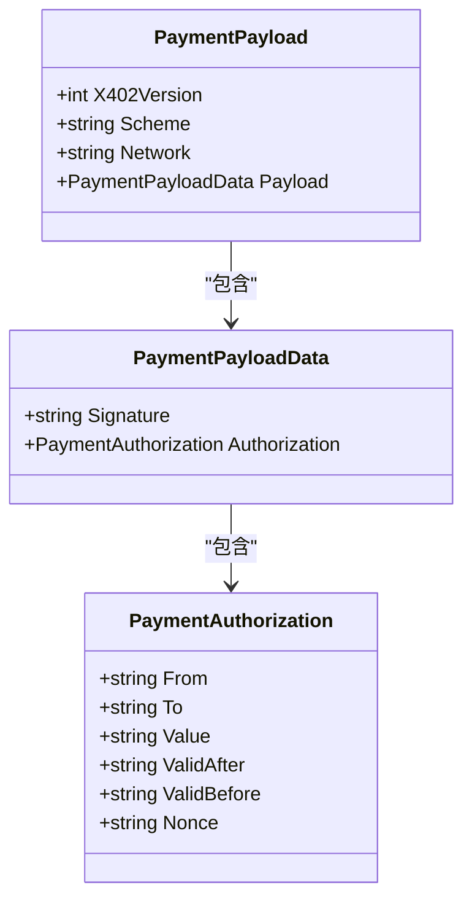
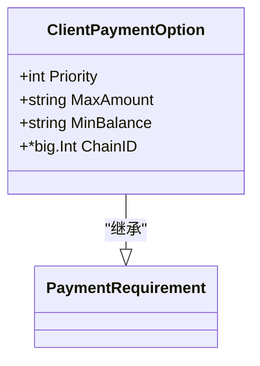
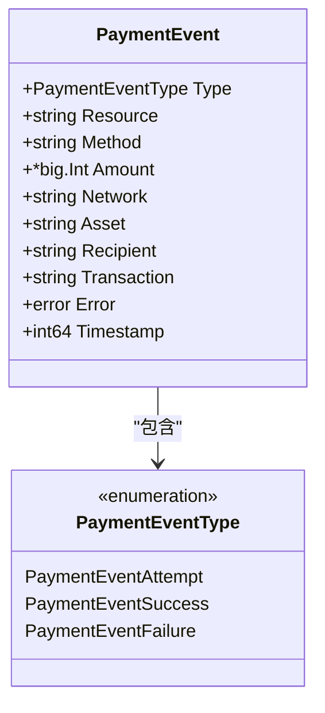

# 数据类型与模型

<cite>
**Referenced Files in This Document**   
- [types.go](file://types.go)
- [client_options.go](file://client_options.go)
- [signer.go](file://signer.go)
- [transport.go](file://transport.go)
- [server/types.go](file://server/types.go)
</cite>

## 目录
1. [核心数据结构](#核心数据结构)
2. [支付需求](#支付需求)
3. [支付载荷](#支付载荷)
4. [客户端支付选项](#客户端支付选项)
5. [支付事件与回调](#支付事件与回调)
6. [序列化示例](#序列化示例)

## 核心数据结构

mcp-go-x402客户端定义了一套完整的数据类型系统，用于处理基于x402规范的支付流程。这些结构体构成了客户端与服务器之间通信的基础，涵盖了从支付需求、支付授权到事件回调的完整生命周期。

**Section sources**
- [types.go](file://types.go#L9-L102)
- [server/types.go](file://server/types.go#L4-L105)

## 支付需求

`PaymentRequirement` 结构体定义了服务器对支付的要求，是客户端决定如何支付的核心依据。该结构体包含了支付所需的所有关键信息。

```mermaid
classDiagram
class PaymentRequirement {
+string Scheme
+string Network
+string MaxAmountRequired
+string Asset
+string PayTo
+string Resource
+string Description
+string MimeType
+interface{} OutputSchema
+int MaxTimeoutSeconds
+map[string]string Extra
}
```

**Diagram sources**
- [types.go](file://types.go#L9-L21)

### 字段详解

- **Scheme (支付方案)**: 定义支付的验证方案，如 "exact" 表示精确金额支付。该字段决定了支付的验证方式和流程。
- **Network (网络)**: 指定支付所使用的区块链网络，如 "base" 或 "base-sepolia"。客户端根据此字段选择相应的链进行交易。
- **Asset (资产)**: 指定支付所使用的代币合约地址，如 USDC 在 Base 网络上的合约地址 "0x833589fCD6eDb6E08f4c7C32D4f71b54bdA02913"。
- **MaxAmountRequired (所需最大金额)**: 以字符串形式表示的支付金额，使用整数表示以避免浮点数精度问题。例如 "5000" 表示 5000 个最小单位。
- **PayTo (支付目标)**: 接收支付的地址，通常是服务器或资金接收方的钱包地址。
- **MaxTimeoutSeconds (最大超时秒数)**: 定义支付授权的有效时间窗口，客户端会根据此值设置签名的有效期。系统会确保该值在60秒到3600秒之间。
- **Extra (扩展信息)**: 包含额外的元数据，如代币名称和版本，用于EIP-712签名的域分隔符（domain separator）。

**Section sources**
- [types.go](file://types.go#L9-L21)
- [server/types.go](file://server/types.go#L4-L16)

## 支付载荷

`PaymentPayload` 结构体封装了客户端创建的支付凭证，包含了EIP-712签名数据，用于证明支付授权。



**Diagram sources**
- [types.go](file://types.go#L31-L36)
- [types.go](file://types.go#L38-L52)

### 结构解析

`PaymentPayload` 的设计遵循EIP-712规范，将签名数据与授权信息分离：

- **X402Version**: x402协议的版本号，当前为1。
- **Scheme** 和 **Network**: 与 `PaymentRequirement` 中的对应字段保持一致，确保支付方案和网络的匹配。
- **Payload**: 包含实际的签名数据和授权信息。

`PaymentPayloadData` 中的 `Authorization` 字段是EIP-3009授权的核心，包含：
- **From**: 支付发起方的地址
- **To**: 支付接收方的地址
- **Value**: 支付金额
- **ValidAfter** 和 **ValidBefore**: 授权的有效时间窗口
- **Nonce**: 防重放攻击的随机数

通过 `Encode()` 方法，`PaymentPayload` 可以被序列化为JSON并进行Base64编码，以便在HTTP头部（如X-PAYMENT）中传输。

**Section sources**
- [types.go](file://types.go#L31-L58)
- [server/types.go](file://server/types.go#L27-L42)

## 客户端支付选项

`ClientPaymentOption` 结构体定义了客户端支持的支付方式及其配置，继承自 `PaymentRequirement` 并添加了客户端特定的字段。



**Diagram sources**
- [types.go](file://types.go#L93-L101)

### 配置项说明

- **Priority (优先级)**: 整数优先级，数值越小优先级越高。在服务器提供多种支付选项时，客户端会优先选择优先级最高的选项。
- **MaxAmount (最大支付金额)**: 客户端愿意为此支付方式支付的最大金额。如果服务器要求的金额超过此值，该选项将被忽略。
- **MinBalance (最小余额)**: 使用此支付方式时需要保持的最小余额。当余额低于此值时，客户端将不会使用该选项。
- **ChainID (链ID)**: 签名时使用的区块链链ID，用于EIP-712签名的域分隔符，确保签名在正确的链上有效。

客户端通过 `AcceptUSDCBase()` 和 `AcceptUSDCBaseSepolia()` 等辅助函数创建预配置的支付选项，并可通过 `WithPriority()`、`WithMaxAmount()` 等方法链式调用进行自定义。

**Section sources**
- [types.go](file://types.go#L93-L101)
- [client_options.go](file://client_options.go#L7-L58)

## 支付事件与回调

`PaymentEvent` 结构体和 `PaymentEventType` 枚举定义了支付生命周期中的事件系统，允许客户端监控支付状态。



**Diagram sources**
- [types.go](file://types.go#L70-L81)
- [types.go](file://types.go#L84-L92)

### 事件类型

- **PaymentEventAttempt ("attempt")**: 支付尝试事件，在客户端开始创建支付时触发。
- **PaymentEventSuccess ("success")**: 支付成功事件，在服务器确认支付并返回成功响应时触发。
- **PaymentEventFailure ("failure")**: 支付失败事件，在支付过程中发生错误时触发。

`X402Transport` 通过 `onPaymentAttempt`、`onPaymentSuccess` 和 `onPaymentFailure` 回调函数将这些事件通知给客户端，使开发者能够实现自定义的支付监控和日志记录。

**Section sources**
- [types.go](file://types.go#L70-L92)
- [transport.go](file://transport.go#L751-L821)

## 序列化示例

以下是关键数据类型在HTTP请求/响应中的JSON序列化表现形式：

### PaymentRequirementsResponse 示例
```json
{
  "x402Version": 1,
  "error": "",
  "accepts": [
    {
      "scheme": "exact",
      "network": "base",
      "maxAmountRequired": "5000",
      "asset": "0x833589fCD6eDb6E08f4c7C32D4f71b54bdA02913",
      "payTo": "0x742d35Cc6634C0532925a3b844Bc9e7595f0bEb6",
      "resource": "/tools/usdc-payment",
      "description": "USDC Payment",
      "mimeType": "application/json",
      "maxTimeoutSeconds": 60,
      "extra": {
        "name": "USD Coin",
        "version": "2"
      }
    }
  ]
}
```

### PaymentPayload 示例
```json
{
  "x402Version": 1,
  "scheme": "exact",
  "network": "base",
  "payload": {
    "signature": "0x...",
    "authorization": {
      "from": "0x...",
      "to": "0x...",
      "value": "5000",
      "validAfter": "1700000000",
      "validBefore": "1700003600",
      "nonce": "0x..."
    }
  }
}
```

**Section sources**
- [types.go](file://types.go#L23-L36)
- [server/types.go](file://server/types.go#L18-L22)