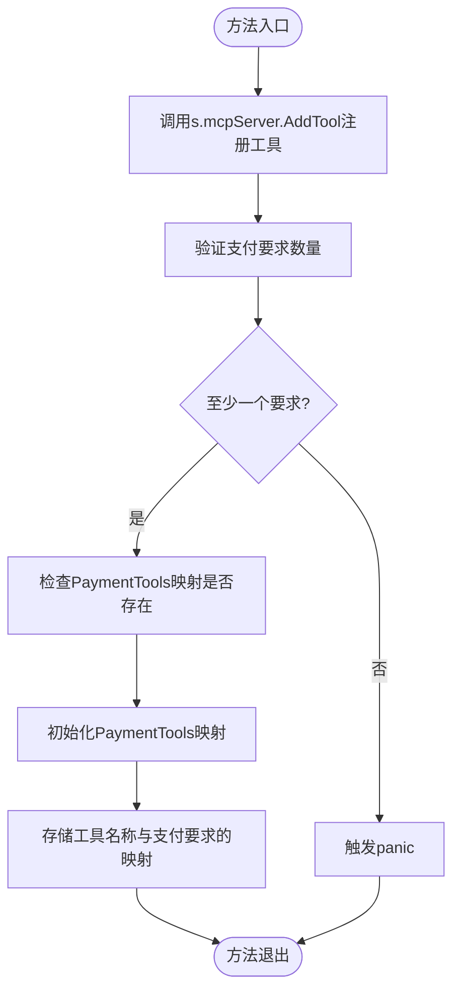
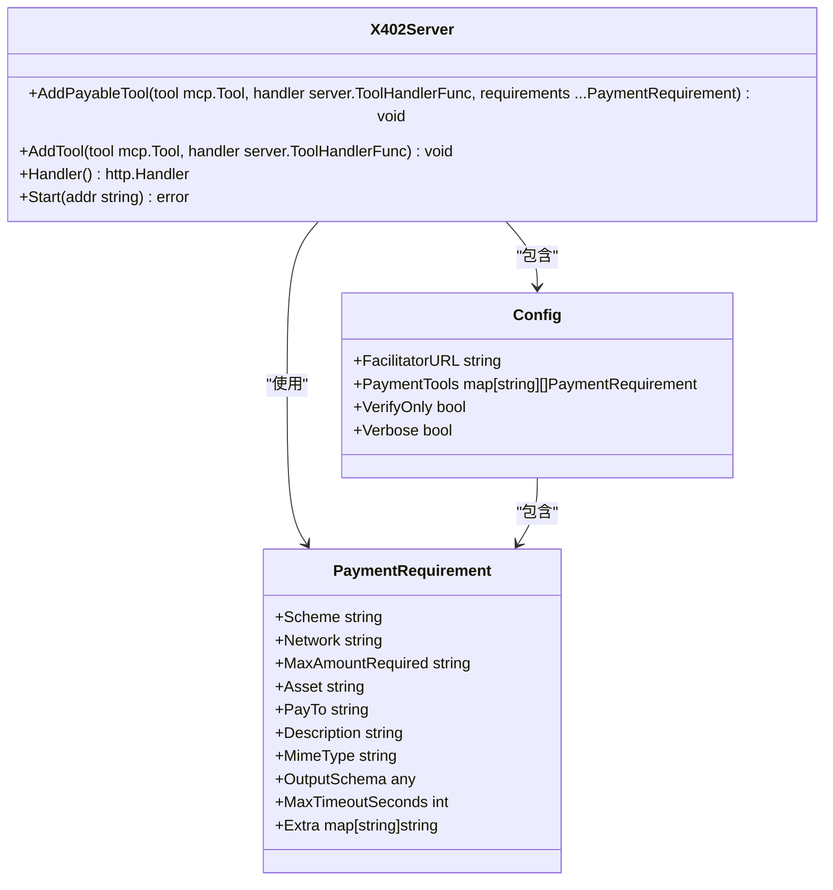
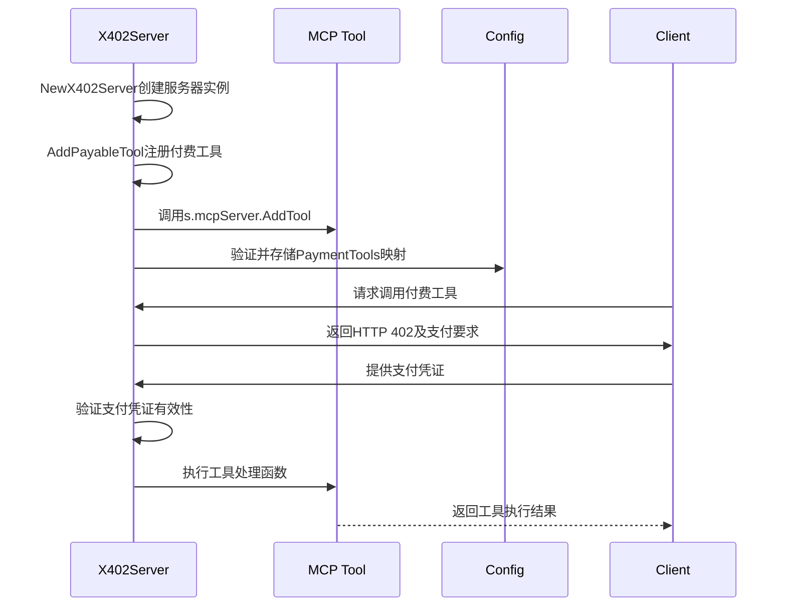
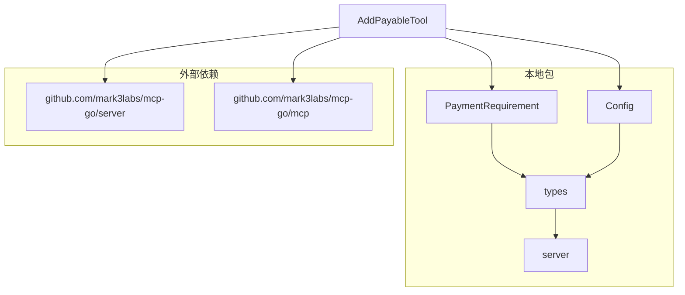

# AddPayableTool方法

<cite>
**Referenced Files in This Document**  
- [server.go](file://server/server.go)
- [types.go](file://server/types.go)
- [requirements.go](file://server/requirements.go)
- [examples/server/main.go](file://examples/server/main.go)
</cite>

## 目录
1. [简介](#简介)
2. [核心组件](#核心组件)
3. [详细组件分析](#详细组件分析)
4. [依赖分析](#依赖分析)
5. [性能考虑](#性能考虑)
6. [故障排除指南](#故障排除指南)
7. [结论](#结论)

## 简介
`AddPayableTool`方法是x402支付系统的核心接口，用于将普通MCP工具注册为支持x402支付的付费工具。该方法通过结合工具定义、处理函数和支付要求，实现了在MCP服务器上构建付费API服务的能力。本文档系统性地分析该方法的接口设计、业务逻辑和实现流程，重点说明其在服务启动阶段的调用时机、错误处理策略以及实际使用模式。

**Section sources**
- [server.go](file://server/server.go#L35-L53)

## 核心组件
`AddPayableTool`方法是`X402Server`结构体的关键方法，负责将普通MCP工具升级为支持x402支付的付费工具。该方法接收三个主要参数：`tool`（工具定义）、`handler`（处理函数）和可变参数`requirements`（支付要求列表）。方法首先调用底层`MCPServer.AddTool`注册工具，然后验证至少存在一个支付要求，最后将工具名称与支付要求映射存储在配置的`PaymentTools`字典中。当`requirements`为空时，方法会触发panic，这是一种防御性编程设计，确保每个付费工具都必须有明确的支付要求。

**Section sources**
- [server.go](file://server/server.go#L35-L53)
- [types.go](file://server/types.go#L4-L16)

## 详细组件分析

### AddPayableTool方法分析
`AddPayableTool`方法实现了将普通MCP工具注册为支持x402支付的付费工具的完整流程。该方法的实现流程分为三个关键步骤：首先调用底层`MCPServer.AddTool`方法注册工具及其处理函数，使工具能够响应MCP协议的调用；然后验证`requirements`参数至少包含一个支付要求，这是通过检查切片长度实现的；最后将工具名称与支付要求列表的映射关系存储在服务器配置的`PaymentTools`字典中，为后续的支付验证提供依据。

**Diagram sources**
- [server.go](file://server/server.go#L35-L53)

#### 接口设计
`AddPayableTool`方法的接口设计体现了清晰的职责分离和类型安全。方法接收`mcp.Tool`类型的`tool`参数，该参数定义了工具的名称、描述和输入参数；`server.ToolHandlerFunc`类型的`handler`参数，该函数负责处理工具调用并返回结果；以及可变数量的`PaymentRequirement`类型的`requirements`参数，这些要求定义了使用该工具所需满足的支付条件。

**Diagram sources**
- [server.go](file://server/server.go#L11-L14)
- [types.go](file://server/types.go#L4-L16)

#### 业务逻辑
`AddPayableTool`方法的业务逻辑围绕着构建付费工具生态系统展开。当客户端尝试调用已注册的付费工具时，服务器会返回HTTP 402状态码及支付要求，客户端必须提供有效的支付凭证才能继续执行。该方法通过将支付要求与工具名称关联，实现了灵活的定价策略，允许为不同工具配置不同的支付要求，甚至为同一工具提供多种支付选项。

**Section sources**
- [server.go](file://server/server.go#L35-L53)
- [types.go](file://server/types.go#L4-L16)

### 实际使用示例
在实际应用中，`AddPayableTool`方法通常在服务启动阶段被调用，用于注册需要付费访问的工具。例如，在示例服务器中，`search`工具被注册为付费工具，要求用户支付0.01 USDC才能使用。开发者可以使用`RequireUSDCBase`等辅助函数快速创建常见的支付要求，简化了配置过程。

**Diagram sources**
- [examples/server/main.go](file://examples/server/main.go#L45-L55)
- [server.go](file://server/server.go#L35-L53)

**Section sources**
- [examples/server/main.go](file://examples/server/main.go#L45-L55)

## 依赖分析
`AddPayableTool`方法依赖于多个核心组件和外部包。它直接依赖`mcp.Tool`和`server.ToolHandlerFunc`类型，这些类型来自外部MCP协议实现。方法还依赖`PaymentRequirement`结构体和`Config`结构体，这些定义在本地包中。在运行时，该方法依赖于底层`MCPServer`实例来处理工具注册，并依赖配置中的`PaymentTools`映射来存储支付要求。

**Diagram sources**
- [server.go](file://server/server.go#L35-L53)
- [types.go](file://server/types.go#L4-L16)

**Section sources**
- [server.go](file://server/server.go#L35-L53)
- [types.go](file://server/types.go#L4-L16)

## 性能考虑
`AddPayableTool`方法在服务启动阶段执行，其性能影响主要体现在初始化时间上。由于该方法只在服务器启动时调用一次或少数几次，因此其执行时间对整体系统性能影响较小。方法内部的操作都是O(1)时间复杂度的，包括切片长度检查和映射插入操作。然而，如果注册大量付费工具，可能会增加服务器启动时间，建议在生产环境中批量注册工具以优化启动性能。

## 故障排除指南
当使用`AddPayableTool`方法时，最常见的问题是忘记提供支付要求，这会导致方法触发panic。错误信息会明确指出哪个工具缺少支付要求，帮助开发者快速定位问题。另一个潜在问题是支付要求配置错误，例如错误的资产地址或金额，这会导致客户端支付验证失败。建议在开发阶段使用测试网支付要求进行充分测试，确保所有配置正确无误。

**Section sources**
- [server.go](file://server/server.go#L45-L47)
- [requirements.go](file://server/requirements.go#L10-L25)

## 结论
`AddPayableTool`方法是构建x402支付系统的关键组件，它通过简洁而强大的接口设计，实现了将普通MCP工具升级为付费工具的能力。该方法的防御性编程设计（当缺少支付要求时触发panic）确保了系统的健壮性，防止了配置错误导致的安全漏洞。通过将工具注册与支付要求管理分离，该方法提供了灵活的定价策略，支持为不同工具配置不同的支付要求。在实际应用中，该方法通常在服务启动阶段被调用，为构建可持续的API服务经济模型提供了坚实的基础。