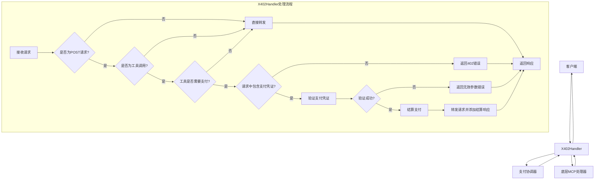
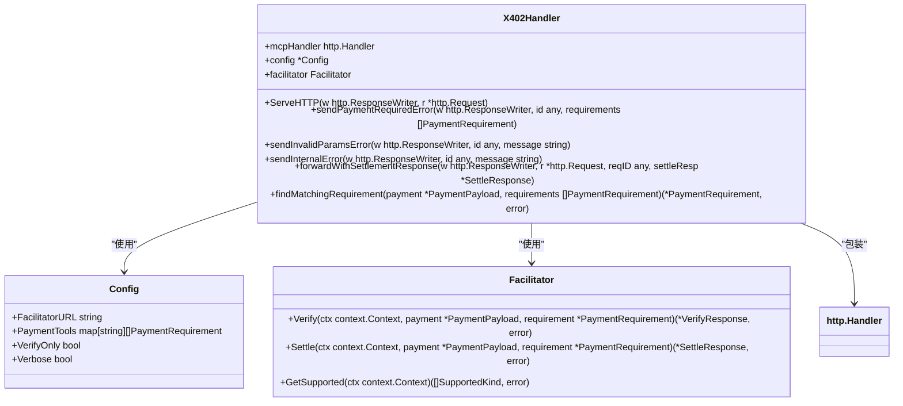
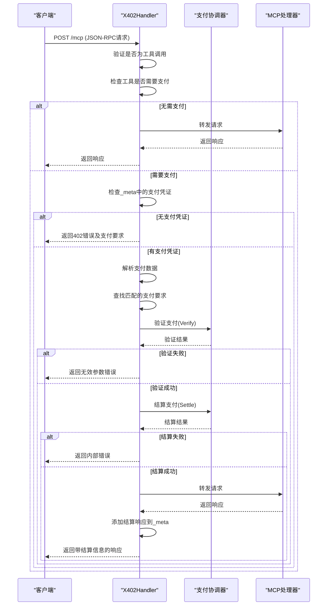
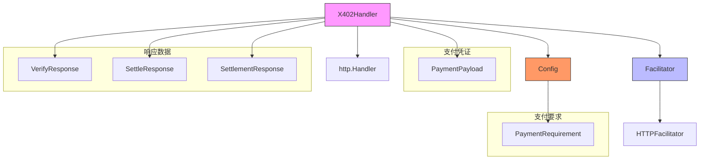

# X402Handler处理程序

<cite>
**Referenced Files in This Document**   
- [server/handler.go](file://server/handler.go)
- [server/server.go](file://server/server.go)
- [server/facilitator.go](file://server/facilitator.go)
- [server/types.go](file://server/types.go)
- [server/requirements.go](file://server/requirements.go)
- [server/handler_test.go](file://server/handler_test.go)
</cite>

## 目录
1. [简介](#简介)
2. [核心组件](#核心组件)
3. [架构概述](#架构概述)
4. [详细组件分析](#详细组件分析)
5. [依赖分析](#依赖分析)
6. [性能考虑](#性能考虑)
7. [故障排除指南](#故障排除指南)
8. [结论](#结论)

## 简介
X402Handler是MCP（Model Context Protocol）服务器中的核心中间件组件，负责在工具调用前实施支付验证机制。它遵循x402规范，通过拦截客户端请求、检查支付要求、验证支付凭证并最终允许或拒绝访问付费工具来实现支付保护。该处理程序作为HTTP中间件工作，无缝集成到现有的MCP服务器架构中，为工具提供者提供了一种标准化的货币化方式。

## 核心组件
X402Handler结构体是支付验证系统的核心，包含三个关键字段：mcpHandler（底层HTTP处理器）、config（服务器配置）和facilitator（支付协调器）。这些组件协同工作，实现了从请求拦截到支付结算的完整流程。

**Section sources**
- [server/handler.go](file://server/handler.go#L15-L19)
- [server/types.go](file://server/types.go#L4-L16)

## 架构概述
X402Handler作为中间件层，位于客户端和底层MCP处理器之间。当客户端请求调用工具时，X402Handler首先拦截请求，检查目标工具是否需要支付。如果需要支付，它会检查请求中是否包含有效的支付凭证；如果没有，它会返回402状态码和支付要求。如果支付凭证存在，它会通过facilitator服务验证支付的有效性，并在验证成功后将请求转发给底层MCP处理器。

**Diagram sources**
- [server/handler.go](file://server/handler.go#L32-L214)
- [server/facilitator.go](file://server/facilitator.go#L49-L156)

## 详细组件分析

### X402Handler结构体分析
X402Handler结构体是支付验证系统的核心，其三个字段各司其职，共同完成支付验证的完整流程。

#### 结构体定义

**Diagram sources**
- [server/handler.go](file://server/handler.go#L15-L19)
- [server/types.go](file://server/types.go#L77-L104)

#### 字段职责
- **mcpHandler**: 这是被包装的底层HTTP处理器，通常是MCP服务器的HTTP处理程序。X402Handler在完成支付验证后，会将请求转发给此处理器进行实际的工具调用处理。
- **config**: 包含服务器的配置信息，特别是`PaymentTools`映射，该映射定义了哪些工具需要支付以及相应的支付要求。配置还包含facilitator服务的URL和其他运行时选项。
- **facilitator**: 这是一个接口，用于与外部支付协调器服务通信，执行支付验证和结算操作。它抽象了与支付后端的交互，使得系统可以灵活地集成不同的支付服务。

**Section sources**
- [server/handler.go](file://server/handler.go#L15-L19)
- [server/types.go](file://server/types.go#L77-L104)

### 处理流程分析
X402Handler的`ServeHTTP`方法实现了完整的请求处理流程，从拦截到最终响应。

#### 请求处理序列图

**Diagram sources**
- [server/handler.go](file://server/handler.go#L32-L214)
- [server/facilitator.go](file://server/facilitator.go#L49-L156)

#### 关键方法说明
- **ServeHTTP**: 主处理方法，负责整个请求的拦截、验证和转发流程。
- **sendPaymentRequiredError**: 当请求的工具需要支付但未提供支付凭证时，此方法生成并发送402 JSON-RPC错误响应，其中包含`PaymentRequirements402Response`数据，指导客户端如何支付。
- **findMatchingRequirement**: 根据提供的支付凭证（网络和方案）在多个支付要求中查找匹配项，支持为同一工具提供多种支付选项。
- **forwardWithSettlementResponse**: 在支付验证和结算成功后，此方法将请求转发给底层处理器，并在最终响应中注入结算信息（`SettlementResponse`），使客户端能够确认支付已成功处理。

**Section sources**
- [server/handler.go](file://server/handler.go#L32-L337)

## 依赖分析
X402Handler与系统中的多个组件紧密协作，形成了一个完整的支付验证生态系统。

**Diagram sources**
- [server/handler.go](file://server/handler.go#L15-L19)
- [server/facilitator.go](file://server/facilitator.go#L14-L18)
- [server/types.go](file://server/types.go#L4-L104)

## 性能考虑
虽然当前实现没有明确的缓存机制，但可以通过以下方式优化性能：
- **支付要求缓存**: 对于频繁访问的工具，可以缓存其支付要求，避免每次请求都从配置中查找。
- **连接池**: `HTTPFacilitator`使用`http.Client`，可以通过配置连接池来重用TCP连接，减少建立连接的开销。
- **异步处理**: 在高并发场景下，可以考虑将支付验证和结算操作异步化，以提高请求处理速度，但这需要权衡一致性和用户体验。

## 故障排除指南
- **402错误但未提供支付凭证**: 确保客户端在请求的`_meta`字段中正确包含了`x402/payment`数据。
- **支付验证失败**: 检查支付凭证的签名、金额、收款地址和时间窗口是否符合要求。查看facilitator服务的日志以获取详细错误信息。
- **结算失败**: 可能是由于链上交易失败或gas费用不足。检查facilitator服务的错误响应以确定具体原因。
- **工具调用被跳过**: 确认工具是否正确地通过`X402Server.AddPayableTool`方法注册，并且配置了正确的支付要求。

**Section sources**
- [server/handler.go](file://server/handler.go#L217-L267)
- [server/facilitator.go](file://server/facilitator.go#L82-L156)

## 结论
X402Handler是一个功能完整且设计良好的支付验证中间件，它通过拦截、验证和结算三个阶段，为MCP工具提供了安全可靠的货币化机制。其模块化设计使得配置和集成变得简单，而清晰的错误处理和响应机制确保了客户端能够获得明确的反馈。通过与X402Server的集成，开发者可以轻松地为他们的工具添加支付功能，从而构建一个可持续的AI工具生态系统。