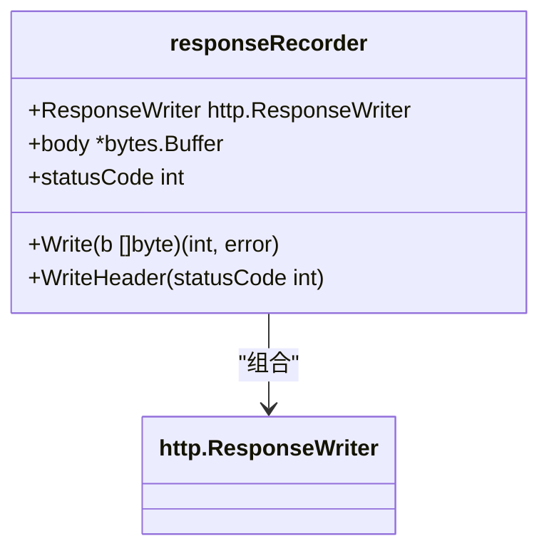
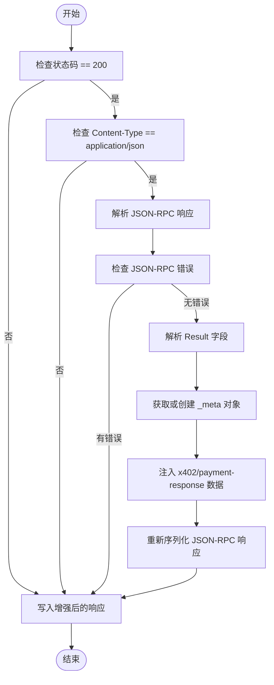
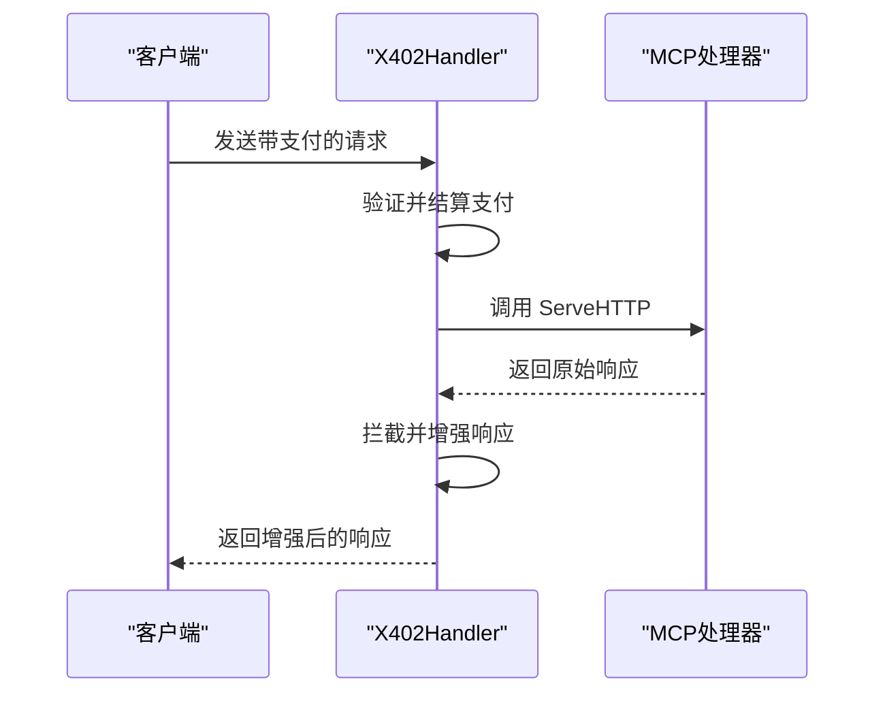
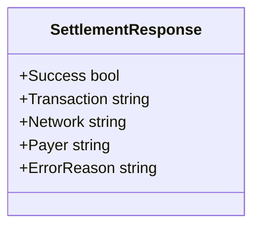
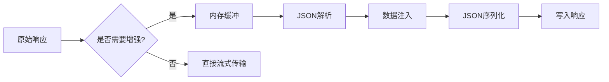
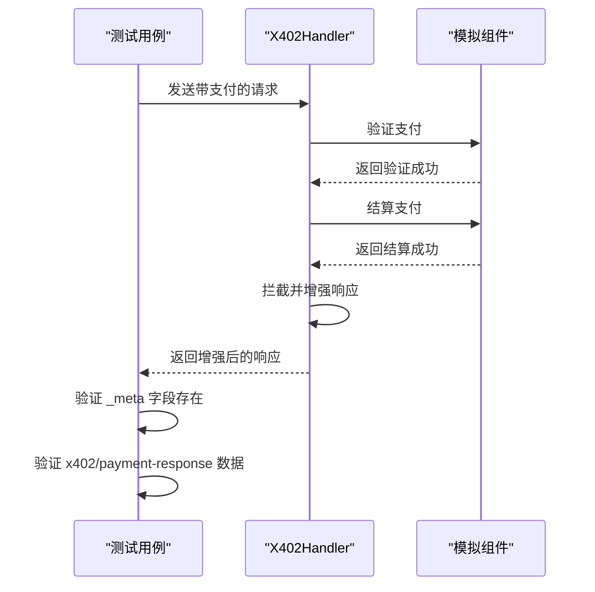

# 响应增强机制

<cite>
**Referenced Files in This Document**   
- [server/handler.go](file://server/handler.go)
- [server/types.go](file://server/types.go)
- [types.go](file://types.go)
- [server/handler_test.go](file://server/handler_test.go)
- [transport.go](file://transport.go)
</cite>

## 目录
1. [引言](#引言)
2. [核心拦截机制](#核心拦截机制)
3. [响应记录器实现](#响应记录器实现)
4. [数据注入流程](#数据注入流程)
5. [协议兼容性分析](#协议兼容性分析)
6. [数据注入示例](#数据注入示例)
7. [性能考量与优化](#性能考量与优化)
8. [测试验证](#测试验证)
9. [结论](#结论)

## 引言
本文档详细阐述了 `forwardWithSettlementResponse` 方法如何拦截并修改 MCP 处理器的原始响应。该机制通过非侵入式拦截技术，在保持与 MCP 协议兼容性的同时，扩展了支付上下文信息。文档将深入分析 `responseRecorder` 如何捕获响应体、状态码和头部信息，解析 JSON-RPC 响应结果，并在 `_result` 的 `_meta` 字段中注入 `x402/payment-response` 数据，包含交易成功状态、哈希、网络和支付方地址等关键信息。

## 核心拦截机制

`forwardWithSettlementResponse` 方法实现了对 MCP 处理器响应的拦截与增强。该方法作为 `X402Handler` 的核心组件，负责在支付验证和结算完成后，对原始响应进行修改，注入支付结果元数据。

该方法通过创建一个 `responseRecorder` 实例来包装原始的 `http.ResponseWriter`，从而实现对响应流的完全控制。在调用 `h.mcpHandler.ServeHTTP(recorder, r)` 后，原始响应被完全捕获而非直接发送给客户端。随后，方法对捕获的响应进行解析和修改，最后将增强后的响应写回客户端。

**Section sources**
- [server/handler.go](file://server/handler.go#L270-L317)

## 响应记录器实现

`responseRecorder` 结构体是实现非侵入式拦截的关键。它通过组合 `http.ResponseWriter` 并重写其核心方法，实现了对 HTTP 响应的完全捕获。



**Diagram sources**
- [server/handler.go](file://server/handler.go#L340-L344)

`responseRecorder` 通过以下机制工作：
1. **WriteHeader 重写**：当 `WriteHeader` 被调用时，状态码被存储在 `statusCode` 字段中，而不是立即发送到客户端。
2. **Write 重写**：所有写入响应体的数据首先被写入内存中的 `bytes.Buffer`，而不是直接输出到网络。
3. **头部管理**：原始响应头可以通过 `Header()` 方法访问和修改。

这种设计模式确保了对原始响应的完全控制，同时保持了与标准 `http.ResponseWriter` 接口的兼容性，实现了真正的非侵入式拦截。

**Section sources**
- [server/handler.go](file://server/handler.go#L340-L344)

## 数据注入流程

数据注入流程是一个多步骤的处理过程，确保在正确的条件下对 JSON-RPC 响应进行修改。



**Diagram sources**
- [server/handler.go](file://server/handler.go#L270-L317)

具体流程如下：
1. **条件检查**：只有当响应状态码为 `200` 且内容类型为 `application/json` 时，才会进行处理。
2. **JSON-RPC 解析**：将捕获的响应体反序列化为 `transport.JSONRPCResponse` 结构。
3. **错误检查**：如果 JSON-RPC 响应包含错误，则跳过数据注入，直接返回原始响应。
4. **结果解析**：将 `Result` 字段反序列化为 `map[string]any`，以便访问和修改。
5. **元数据注入**：获取或创建 `_meta` 字段，并在其中注入 `x402/payment-response` 数据。
6. **重新序列化**：将修改后的响应结构重新序列化为 JSON 格式。
7. **响应写入**：将所有响应头、状态码和修改后的响应体写回客户端。

**Section sources**
- [server/handler.go](file://server/handler.go#L270-L317)

## 协议兼容性分析

该机制通过精心设计的架构保持了与 MCP 协议的完全兼容性，同时实现了功能扩展。



**Diagram sources**
- [server/handler.go](file://server/handler.go#L32-L214)

兼容性保障措施包括：
- **透明拦截**：MCP 处理器完全不知道拦截机制的存在，它只是向 `responseRecorder` 写入响应，就像写入标准的 `http.ResponseWriter` 一样。
- **标准响应格式**：最终返回的响应仍然是标准的 JSON-RPC 2.0 格式，确保客户端能够正确解析。
- **条件性增强**：只有在成功支付且响应为 JSON 格式时才进行增强，对于错误响应或非 JSON 响应保持原样。
- **向后兼容**：`_meta` 字段是可选的扩展字段，不支持该字段的客户端可以安全地忽略它。

**Section sources**
- [server/handler.go](file://server/handler.go#L270-L317)

## 数据注入示例

以下是数据注入前后的对比示例，展示了 `x402/payment-response` 数据的结构和位置。

### 注入前的响应
```json
{
  "jsonrpc": "2.0",
  "id": 1,
  "result": {
    "content": [
      {
        "type": "text",
        "text": "success"
      }
    ]
  }
}
```

### 注入后的响应
```json
{
  "jsonrpc": "2.0",
  "id": 1,
  "result": {
    "content": [
      {
        "type": "text",
        "text": "success"
      }
    ],
    "_meta": {
      "x402/payment-response": {
        "success": true,
        "transaction": "0x123456789abcdef",
        "network": "base-sepolia",
        "payer": "0xPayerAddress"
      }
    }
  }
}
```

注入的数据结构由 `SettlementResponse` 定义，包含以下关键字段：
- **success**：布尔值，表示支付结算是否成功
- **transaction**：字符串，表示链上交易哈希
- **network**：字符串，表示交易发生的网络
- **payer**：字符串，表示支付方地址



**Diagram sources**
- [server/types.go](file://server/types.go#L46-L52)
- [types.go](file://types.go#L61-L67)

**Section sources**
- [server/types.go](file://server/types.go#L46-L52)
- [types.go](file://types.go#L61-L67)

## 性能考量与优化

该拦截机制引入了额外的处理开销，主要体现在以下几个方面：

### 性能开销分析
1. **内存开销**：整个响应体被缓冲在内存中，对于大响应体可能消耗较多内存。
2. **CPU 开销**：需要进行两次 JSON 序列化/反序列化操作（解析和重新序列化）。
3. **延迟开销**：额外的处理步骤增加了响应延迟。

### 优化建议
1. **条件性处理**：通过严格的条件检查（状态码、内容类型、JSON-RPC 错误），避免对不需要增强的响应进行处理。
2. **缓冲区重用**：可以考虑重用 `bytes.Buffer` 实例，减少内存分配。
3. **流式处理**：对于大响应体，可以考虑实现流式处理，避免将整个响应加载到内存中。
4. **缓存机制**：对于可缓存的响应，可以在增强后进行缓存，避免重复处理。



**Diagram sources**
- [server/handler.go](file://server/handler.go#L270-L317)

**Section sources**
- [server/handler.go](file://server/handler.go#L270-L317)

## 测试验证

该机制通过全面的测试用例进行验证，确保其正确性和可靠性。



**Diagram sources**
- [server/handler_test.go](file://server/handler_test.go#L187-L233)

测试用例覆盖了以下场景：
- 无需支付的工具调用
- 需要支付但未提供支付信息的请求
- 提供有效支付信息的请求
- 多种支付选项的匹配
- 支付验证和结算的模拟

测试代码验证了增强后的响应中包含正确的 `x402/payment-response` 数据，确保了机制的正确实现。

**Section sources**
- [server/handler_test.go](file://server/handler_test.go#L187-L233)

## 结论

`forwardWithSettlementResponse` 方法通过 `responseRecorder` 实现了对 MCP 处理器响应的非侵入式拦截。该机制在保持与 MCP 协议完全兼容的同时，通过在 `_meta` 字段中注入 `x402/payment-response` 数据，扩展了支付上下文信息。数据注入流程经过精心设计，确保只在适当的条件下进行处理，避免了对错误响应或非 JSON 响应的不必要修改。尽管引入了额外的性能开销，但通过条件性处理和潜在的优化措施，可以将其影响降到最低。全面的测试用例验证了该机制的正确性和可靠性，使其成为 MCP 支付系统中一个关键的增强组件。