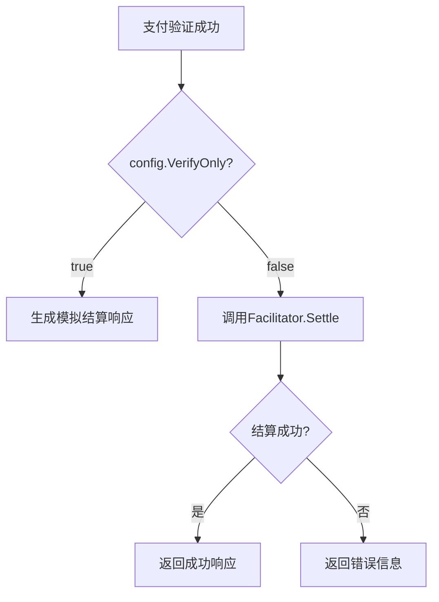
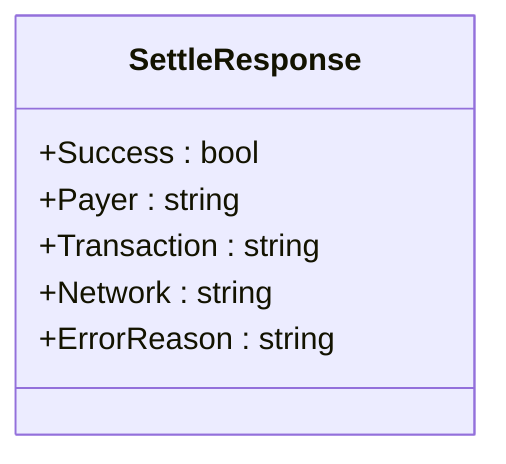
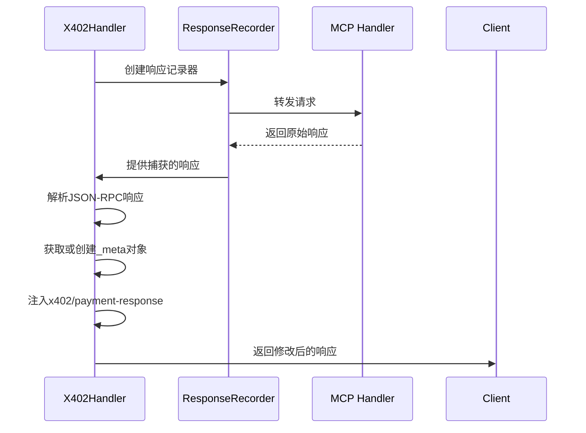

# 支付结算机制

<cite>
**本文档引用的文件**  
- [handler.go](file://server/handler.go)
- [types.go](file://server/types.go)
- [facilitator.go](file://server/facilitator.go)
- [handler_test.go](file://server/handler_test.go)
- [server.go](file://server/server.go)
</cite>

## 目录
1. [引言](#引言)
2. [核心组件](#核心组件)
3. [结算触发机制](#结算触发机制)
4. [SettleResponse结构分析](#settleresponse结构分析)
5. [验证模式下的模拟响应](#验证模式下的模拟响应)
6. [响应元数据注入流程](#响应元数据注入流程)
7. [性能与重试策略](#性能与重试策略)

## 引言
本文档全面阐述了X402Handler在链上支付系统中的结算行为。重点解析了在不同配置条件下（特别是`config.VerifyOnly`为`false`时）的实际交易结算逻辑，详细说明了结算响应的结构化封装方式，以及在验证模式下如何生成模拟响应以支持测试场景。通过代码级分析，揭示了结算成功后结果注入响应元数据字段的完整流程，并探讨了相关的性能影响及异常处理机制。

## 核心组件

X402Handler的核心功能围绕支付验证与结算展开，主要由以下几个关键组件构成：`X402Handler`结构体负责拦截和处理HTTP请求，`Facilitator`接口定义了支付验证和结算的标准方法，`Config`结构体包含了系统配置参数如`VerifyOnly`模式开关，`PaymentPayload`和`PaymentRequirement`分别表示支付载荷和支付要求，而`SettleResponse`则封装了结算操作的结果信息。

**Section sources**
- [handler.go](file://server/handler.go#L15-L19)
- [types.go](file://server/types.go#L4-L42)
- [facilitator.go](file://server/facilitator.go#L16-L18)

## 结算触发机制

`Settle`调用的触发条件严格依赖于配置项`config.VerifyOnly`的布尔值。当该配置为`false`时，系统将执行实际的链上交易结算。具体流程如下：在支付通过验证后，系统会检查`config.VerifyOnly`标志位。若为`false`，则调用`h.facilitator.Settle`方法发起结算请求；若为`true`，则跳过实际结算，直接生成模拟的结算响应。这一机制允许系统在生产环境执行真实交易，而在测试或调试环境中仅进行验证而不产生实际链上操作。

**Diagram sources**
- [handler.go](file://server/handler.go#L170-L216)

**Section sources**
- [handler.go](file://server/handler.go#L170-L216)
- [types.go](file://server/types.go#L100-L104)

## SettleResponse结构分析

`SettleResponse`结构体用于封装结算操作的最终结果，其字段设计兼顾了成功与失败两种情况的信息表达。

### 成功情况
当结算成功时，`SettleResponse`包含以下关键信息：
- `Success`: 布尔值，恒为`true`
- `Payer`: 字符串，标识付款方地址
- `Transaction`: 字符串，包含链上交易哈希
- `Network`: 字符串，标识交易所在的区块链网络

### 失败情况
当结算失败时，`SettleResponse`通过以下字段提供诊断信息：
- `Success`: 布尔值，为`false`
- `ErrorReason`: 字符串，详细描述失败原因（使用`omitempty`标签，仅在存在错误时序列化）

该结构体的设计确保了无论成功与否，调用方都能获得完整且一致的响应格式，便于后续处理。

**Diagram sources**
- [types.go](file://server/types.go#L82-L88)

**Section sources**
- [types.go](file://server/types.go#L82-L88)
- [handler.go](file://server/handler.go#L170-L216)

## 验证模式下的模拟响应

在`verify-only`模式下（即`config.VerifyOnly`为`true`），系统不会执行实际的链上结算，而是模拟生成一个结算响应以支持测试场景。此时，系统会构造一个`SettleResponse`实例，其`Success`字段设为`true`，`Transaction`字段设为固定字符串`"verify-only-mode"`，`Network`字段继承自支付载荷，`Payer`字段则取自验证响应中的付款方信息。这种设计使得测试环境能够完整模拟整个支付流程，包括响应处理逻辑，而无需消耗真实的链上资源。

**Section sources**
- [handler.go](file://server/handler.go#L200-L214)

## 响应元数据注入流程

结算成功后，系统会将结算结果注入到最终响应的`_meta`字段中。这一过程通过`forwardWithSettlementResponse`方法实现：首先捕获MCP处理器的原始响应，然后解析JSON-RPC响应体，获取或创建`_meta`对象，将`SettleResponse`转换为`SettlementResponse`并存入`_meta["x402/payment-response"]`，最后重新序列化响应体并返回。该机制确保了结算结果能够透明地传递给客户端，而无需修改核心业务逻辑的响应格式。

**Diagram sources**
- [handler.go](file://server/handler.go#L270-L317)

**Section sources**
- [handler.go](file://server/handler.go#L270-L317)
- [types.go](file://server/types.go#L64-L73)

## 性能与重试策略

系统的性能受到链上结算操作的显著影响，因为`Settle`调用涉及外部HTTP请求和潜在的区块链确认延迟。在异常处理方面，当前实现主要依赖于`facilitator.Settle`方法的错误返回，若结算失败（返回错误或`settleResp.Success`为`false`），系统会立即向客户端返回内部错误。值得注意的是，文档中未体现显式的重试策略，所有错误均导致流程终止。建议在生产环境中引入基于指数退避的重试机制，并结合熔断器模式来提高系统的容错能力和稳定性。

**Section sources**
- [handler.go](file://server/handler.go#L190-L198)
- [facilitator.go](file://server/facilitator.go#L120-L156)