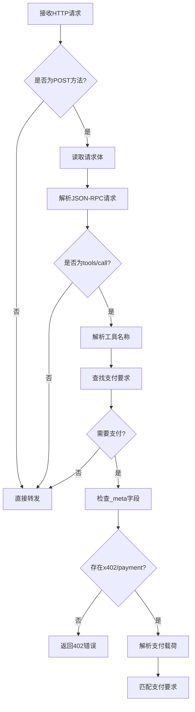
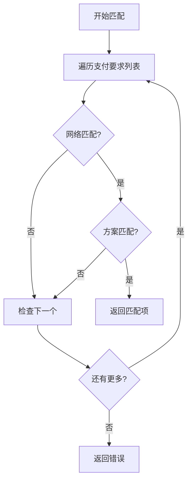
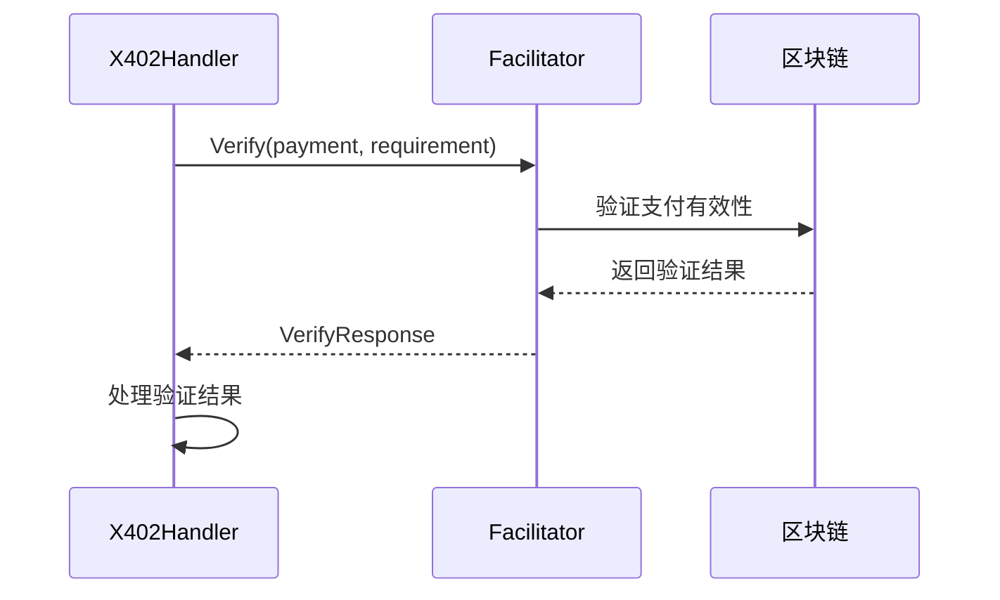
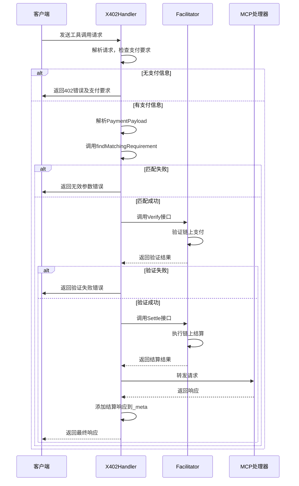

# 支付验证流程

<cite>
**Referenced Files in This Document**   
- [server/handler.go](file://server/handler.go)
- [server/types.go](file://server/types.go)
- [server/facilitator.go](file://server/facilitator.go)
- [types.go](file://types.go)
</cite>

## 目录
1. [引言](#引言)
2. [核心数据结构](#核心数据结构)
3. [支付验证核心流程](#支付验证核心流程)
4. [匹配支付要求](#匹配支付要求)
5. [与Facilitator组件交互](#与facilitator组件交互)
6. [错误处理机制](#错误处理机制)
7. [完整流程时序图](#完整流程时序图)

## 引言
本文档深入解析X402Handler中支付验证的核心流程。该流程实现了x402协议的支付验证机制，通过拦截MCP工具调用请求，检查并验证支付信息，确保资源访问的安全性和合规性。文档将详细说明从请求中提取支付数据、匹配支付要求、与Facilitator组件交互验证以及错误处理的完整链条。

## 核心数据结构

### PaymentPayload结构体
`PaymentPayload`结构体定义了支付载荷的格式，包含网络、支付方案和授权信息等关键字段。

**Section sources**
- [server/types.go](file://server/types.go#L27-L42)
- [types.go](file://types.go#L31-L36)

### PaymentRequirement结构体
`PaymentRequirement`结构体定义了服务端对支付的要求，包括网络、资产、金额等约束条件。

**Section sources**
- [server/types.go](file://server/types.go#L4-L16)
- [types.go](file://types.go#L9-L21)

### 验证与结算响应
`VerifyResponse`和`SettleResponse`结构体分别定义了验证和结算操作的响应格式。

**Section sources**
- [server/types.go](file://server/types.go#L65-L69)
- [server/types.go](file://server/types.go#L82-L88)

## 支付验证核心流程

### 请求拦截与支付提取
`X402Handler.ServeHTTP`方法拦截POST请求，解析JSON-RPC格式的工具调用。当检测到需要支付的工具时，从请求参数的`_meta`字段中提取`x402/payment`数据。

**Diagram sources**
- [server/handler.go](file://server/handler.go#L32-L214)

**Section sources**
- [server/handler.go](file://server/handler.go#L32-L214)

## 匹配支付要求

### findMatchingRequirement函数
`findMatchingRequirement`函数根据支付载荷中的网络和支付方案，与预设的支付要求进行匹配。

**Diagram sources**
- [server/handler.go](file://server/handler.go#L320-L337)

**Section sources**
- [server/handler.go](file://server/handler.go#L320-L337)

## 与Facilitator组件交互

### Verify接口调用
当支付载荷成功匹配要求后，`X402Handler`调用`Facilitator.Verify`接口进行链上验证。

**Diagram sources**
- [server/handler.go](file://server/handler.go#L32-L214)
- [server/facilitator.go](file://server/facilitator.go#L15-L15)

**Section sources**
- [server/handler.go](file://server/handler.go#L32-L214)
- [server/facilitator.go](file://server/facilitator.go#L15-L15)

### 上下文传递
验证过程中，请求上下文`ctx`、支付载荷`payment`和匹配的支付要求`requirement`被完整传递给Facilitator。

**Section sources**
- [server/handler.go](file://server/handler.go#L32-L214)

### 验证结果处理
根据`VerifyResponse`的结果，处理器决定后续流程：
- `IsValid`为`true`：继续结算流程
- `IsValid`为`false`：返回验证失败错误

**Section sources**
- [server/handler.go](file://server/handler.go#L32-L214)

## 错误处理机制

### 错误反馈类型
系统定义了多种错误反馈机制：

| 错误类型 | HTTP状态码 | JSON-RPC错误码 | 触发条件 |
|--------|----------|-------------|--------|
| 支付要求 | 200 | 402 | 未提供支付信息 |
| 参数无效 | 200 | -32602 | 支付数据解析失败 |
| 内部错误 | 200 | -32603 | 验证服务调用失败 |

**Section sources**
- [server/handler.go](file://server/handler.go#L217-L267)

### InvalidReason传递
当验证失败时，`InvalidReason`字段从`VerifyResponse`传递到客户端，提供具体的失败原因。

**Section sources**
- [server/handler.go](file://server/handler.go#L32-L214)

### 日志记录
在`Verbose`模式下，系统会详细记录验证过程中的关键步骤和错误信息。

**Section sources**
- [server/handler.go](file://server/handler.go#L32-L214)
- [server/facilitator.go](file://server/facilitator.go#L15-L15)

## 完整流程时序图

**Diagram sources**
- [server/handler.go](file://server/handler.go#L32-L214)
- [server/facilitator.go](file://server/facilitator.go#L15-L15)

**Section sources**
- [server/handler.go](file://server/handler.go#L32-L214)
- [server/facilitator.go](file://server/facilitator.go#L15-L15)