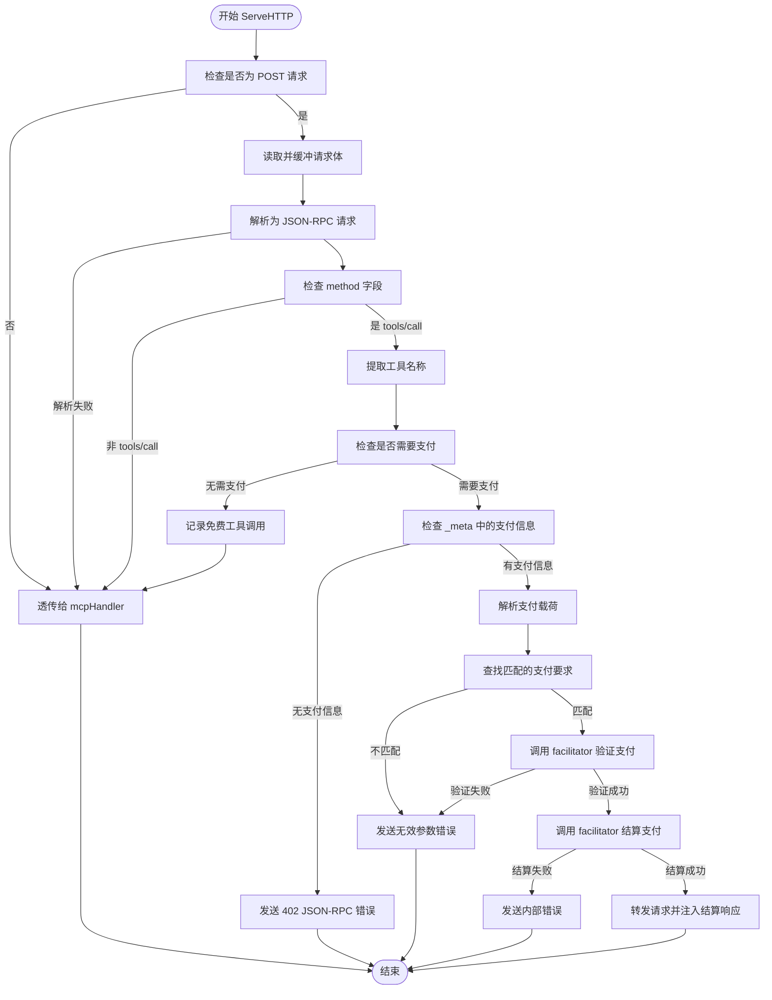
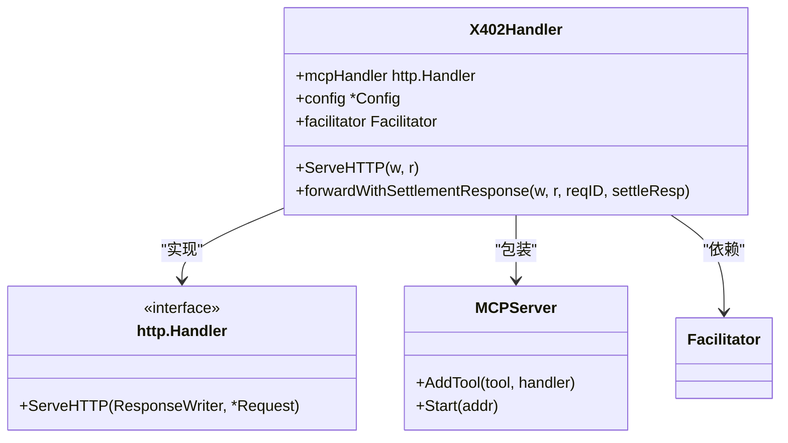
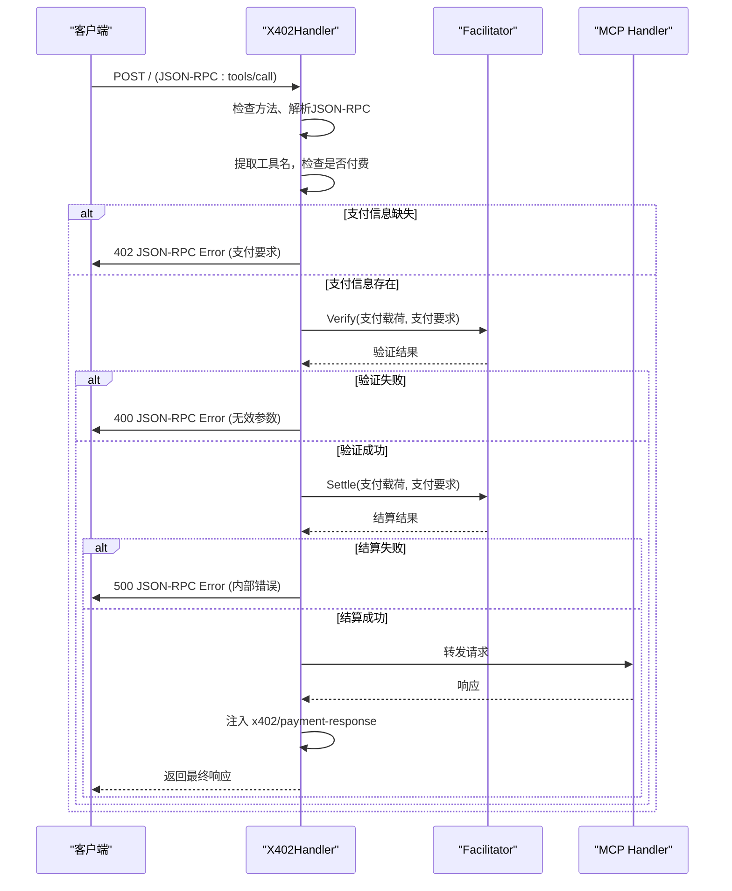

# 请求拦截机制

<cite>
**Referenced Files in This Document**   
- [server/handler.go](file://server/handler.go)
- [server/types.go](file://server/types.go)
- [server/facilitator.go](file://server/facilitator.go)
- [server/server.go](file://server/server.go)
</cite>

## 目录
1. [简介](#简介)
2. [请求拦截流程](#请求拦截流程)
3. [核心组件分析](#核心组件分析)
4. [协作机制](#协作机制)
5. [调试与日志](#调试与日志)
6. [结论](#结论)

## 简介
本文档详细说明了 `X402Handler` 如何通过 `ServeHTTP` 方法实现对 MCP 工具调用的请求拦截。该机制基于 X402 支付协议，实现了对特定工具调用的支付控制，确保只有在满足支付要求的情况下，请求才会被转发至底层的 MCP 处理器。文档将阐述其拦截逻辑、数据处理方式、透传规则以及与相关组件的协作模式。

## 请求拦截流程

`X402Handler` 的 `ServeHTTP` 方法是整个请求拦截机制的核心。它遵循一个清晰的决策流程，对每一个传入的 HTTP 请求进行检查和处理。

**Diagram sources**
- [server/handler.go](file://server/handler.go#L32-L214)

**Section sources**
- [server/handler.go](file://server/handler.go#L32-L214)

## 核心组件分析

### X402Handler 结构与 ServeHTTP 方法

`X402Handler` 是一个包装器，它封装了底层的 `mcpHandler`，并注入了支付处理逻辑。其 `ServeHTTP` 方法是拦截逻辑的入口。

**关键判断流程：**
1.  **方法过滤**：首先检查请求方法是否为 `POST`。如果不是，则直接将请求透传给 `mcpHandler`，不进行任何拦截。
2.  **JSON-RPC 解析**：读取请求体并尝试将其解析为 `JSONRPCRequest` 结构。如果解析失败（非 JSON 或格式错误），同样透传给 `mcpHandler`。
3.  **工具调用识别**：检查解析后的 `jsonrpcReq.Method` 是否等于 `"tools/call"`。只有符合此条件的请求才会被视为需要支付的工具调用，进入后续的支付检查流程。

**请求体读取与重封装：**
为了进行上述检查，`ServeHTTP` 方法必须读取请求体。这会消耗 `r.Body`，导致后续的处理器无法再次读取。为了解决此问题，代码在读取后立即通过 `r.Body = io.NopCloser(bytes.NewReader(body))` 将请求体重新设置为一个可重复读取的 `io.Reader`。这确保了原始的 MCP 处理器的行为完全不受影响，实现了无侵入式的拦截。

**Section sources**
- [server/handler.go](file://server/handler.go#L32-L214)

### 透传逻辑与日志调试

当请求不涉及付费工具时，`X402Handler` 会执行透传逻辑，确保系统对免费工具的调用完全透明。

**透传逻辑：**
-   **非 POST 请求**：直接透传。
-   **非 JSON-RPC 请求**：直接透传。
-   **非 `tools/call` 方法**：直接透传。
-   **免费工具调用**：通过 `h.config.PaymentTools[toolName]` 查询工具的支付要求，如果 `needsPayment` 为 `false`，则直接透传。

**日志调试：**
`X402Handler` 通过 `log` 包提供了详细的日志输出，极大地辅助了调试过程。当配置 `config.Verbose` 为 `true` 时，日志会记录：
-   每个请求的进入。
-   免费工具的调用。
-   需要支付的工具调用。
-   支付要求的详细信息。
-   支付验证和结算的全过程。

这些日志信息对于开发者理解系统行为、排查支付失败原因至关重要。

**Section sources**
- [server/handler.go](file://server/handler.go#L32-L214)

## 协作机制

`X402Handler` 并非独立工作，它与多个组件紧密协作，共同完成支付拦截和处理。

### 与底层 mcpHandler 的协作

`X402Handler` 的核心设计原则是**包装**（Wrapper）。它实现了 `http.Handler` 接口，并在 `ServeHTTP` 方法中，根据支付检查的结果，决定是直接透传请求，还是在完成支付验证后，再将请求转发给 `mcpHandler`。

**Diagram sources**
- [server/handler.go](file://server/handler.go#L15-L19)
- [server/server.go](file://server/server.go#L11-L14)

### 与 Facilitator 的协作

`Facilitator` 是一个外部服务，负责验证和结算支付。`X402Handler` 通过 `facilitator` 字段与之交互。

1.  **验证**：调用 `facilitator.Verify()` 方法，传入支付载荷和支付要求，以确认支付的有效性。
2.  **结算**：在验证通过后，调用 `facilitator.Settle()` 方法，将支付最终结算到链上。

### 与 X402Server 的协作

`X402Server` 是更高层的封装，它简化了 `X402Handler` 的创建和配置。通过 `AddPayableTool` 方法，开发者可以方便地为工具添加支付要求，这些要求会被自动注册到 `X402Handler` 的配置中。

**Diagram sources**
- [server/handler.go](file://server/handler.go#L32-L214)
- [server/facilitator.go](file://server/facilitator.go#L15-L16)

## 调试与日志

如前所述，`X402Handler` 的日志功能是调试的核心。通过启用 `Verbose` 模式，开发者可以清晰地看到请求的处理路径，从进入、检查、支付验证到最终的响应。这对于理解复杂的支付流程和快速定位问题（如支付要求不匹配、验证失败等）非常有帮助。

## 结论

`X402Handler` 通过 `ServeHTTP` 方法实现了一个高效且非侵入式的请求拦截机制。它通过精确的条件判断（POST、JSON-RPC、`tools/call`）来过滤请求，并利用请求体重封装技术确保了与底层 `mcpHandler` 的兼容性。对于免费工具，它实现了无缝透传；对于付费工具，它通过与 `Facilitator` 服务的协作，完成了支付的验证与结算。整个流程清晰、健壮，并通过详细的日志支持，为开发者提供了强大的调试能力。