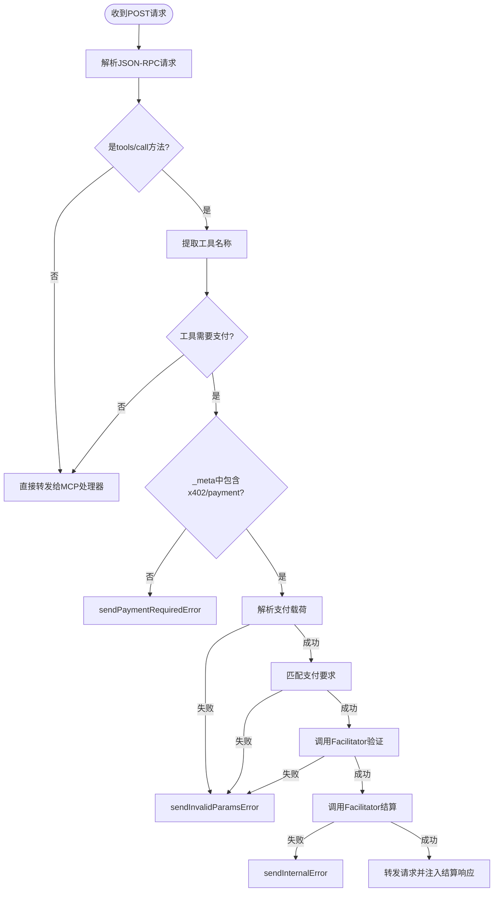
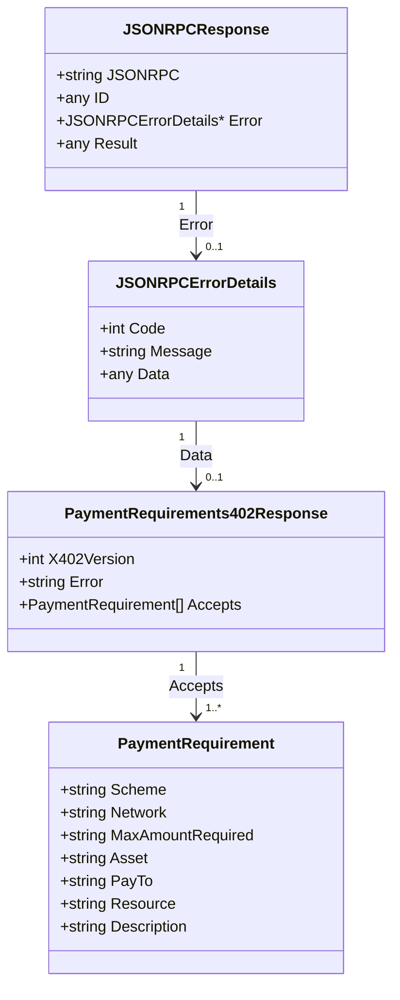

# 错误响应处理

<cite>
**Referenced Files in This Document**   
- [server/handler.go](file://server/handler.go)
- [server/types.go](file://server/types.go)
- [types.go](file://types.go)
- [errors.go](file://errors.go)
- [server/handler_test.go](file://server/handler_test.go)
</cite>

## 目录
1. [引言](#引言)
2. [错误响应机制概述](#错误响应机制概述)
3. [402支付要求错误](#402支付要求错误)
4. [400参数无效错误](#400参数无效错误)
5. [500内部错误](#500内部错误)
6. [错误响应数据结构](#错误响应数据结构)
7. [客户端错误解析指南](#客户端错误解析指南)
8. [总结](#总结)

## 引言
本文档系统化说明 `X402Handler` 中三种 JSON-RPC 错误响应的生成机制：`sendPaymentRequiredError`、`sendInvalidParamsError` 和 `sendInternalError`。这些错误响应遵循 X402 规范，用于在 MCP（Model Context Protocol）工具调用中处理支付相关的业务逻辑。尽管 HTTP 状态码始终为 200，但具体的错误信息通过 JSON-RPC 响应体中的 `error` 字段进行传达，确保了与标准 JSON-RPC 2.0 协议的兼容性。

## 错误响应机制概述
`X402Handler` 是一个中间件，它包装了标准的 MCP HTTP 处理器，以支持 X402 支付协议。当客户端发起一个工具调用请求时，`X402Handler.ServeHTTP` 方法会拦截该请求，并根据工具的配置和请求中是否包含有效的支付信息，决定是直接转发请求还是返回特定的 JSON-RPC 错误。



**Diagram sources**
- [server/handler.go](file://server/handler.go#L32-L214)

**Section sources**
- [server/handler.go](file://server/handler.go#L32-L214)

## 402支付要求错误
当客户端请求一个需要支付的工具，但其请求的 `_meta` 字段中未包含 `x402/payment` 时，`X402Handler` 会调用 `sendPaymentRequiredError` 方法生成并返回一个特殊的 JSON-RPC 错误。

### 业务场景
此错误对应于 HTTP 状态码 402 Payment Required 的语义，但遵循 JSON-RPC 规范将其封装在响应体中。它明确告知客户端，访问该资源（工具）需要先进行支付，并提供了具体的支付要求列表。

### 响应示例
```json
{
  "jsonrpc": "2.0",
  "id": 1,
  "error": {
    "code": 402,
    "message": "Payment required",
    "data": {
      "x402Version": 1,
      "error": "Payment required to access this resource",
      "accepts": [
        {
          "scheme": "exact",
          "network": "ethereum-mainnet",
          "maxAmountRequired": "1000000",
          "asset": "0xA0b86991c6218b36c1d19D4a2e9Eb0cE3606eB48",
          "payTo": "0xrecipient",
          "resource": "mcp://tools/paid-tool",
          "description": "Pay with USDC on Ethereum"
        },
        {
          "scheme": "exact",
          "network": "polygon-mainnet",
          "maxAmountRequired": "1000000",
          "asset": "0x3c499c542cEF5E3811e1192ce70d8cC03d5c3359",
          "payTo": "0xrecipient",
          "resource": "mcp://tools/paid-tool",
          "description": "Pay with USDC on Polygon"
        }
      ]
    }
  }
}
```

### Accepts 字段详解
`data.accepts` 是一个 `PaymentRequirement` 对象数组，每个对象定义了一种可接受的支付方式。关键字段包括：
- **`scheme`**: 支付方案，如 `exact`（精确金额）。
- **`network`**: 区块链网络，如 `ethereum-mainnet`。
- **`maxAmountRequired`**: 所需支付的最大金额（以最小单位表示，如 USDC 的 wei）。
- **`asset`**: 支付资产的合约地址。
- **`payTo`**: 收款方钱包地址。
- **`resource`**: 资源标识符，由处理器自动填充。

**Section sources**
- [server/handler.go](file://server/handler.go#L217-L235)
- [server/types.go](file://server/types.go#L4-L16)
- [server/types.go](file://server/types.go#L19-L23)

## 400参数无效错误
当客户端提供了支付信息，但该信息格式不正确或不符合服务器的支付要求时，`X402Handler` 会调用 `sendInvalidParamsError` 方法返回此错误。

### 业务场景
此错误对应于 JSON-RPC 标准的 `INVALID_PARAMS` 错误码（-32602）。它用于处理以下情况：
1.  `_meta.x402/payment` 字段存在，但其内容无法被解析为有效的 `PaymentPayload`。
2.  提供的支付信息（如网络、方案）与服务器配置的 `PaymentRequirement` 不匹配。
3.  支付凭证（如签名）被 `Facilitator` 服务验证为无效。

### 响应示例
```json
{
  "jsonrpc": "2.0",
  "id": 1,
  "error": {
    "code": -32602,
    "message": "Payment does not match requirements: no matching payment requirement found for network=unknown-network, scheme=exact"
  }
}
```

**Section sources**
- [server/handler.go](file://server/handler.go#L238-L251)
- [errors.go](file://errors.go#L6-L12)

## 500内部错误
当服务器在处理支付流程中遇到意外的内部错误时，会调用 `sendInternalError` 方法返回此错误。

### 业务场景
此错误对应于 JSON-RPC 标准的 `INTERNAL_ERROR` 错误码（-32603）。它表示服务器端发生了非预期的故障，例如：
- 与 `Facilitator` 服务通信失败（网络超时、服务宕机）。
-  `Facilitator` 服务返回了无法处理的错误。
- 服务器内部逻辑出现 panic 或未捕获的异常。

### 响应示例
```json
{
  "jsonrpc": "2.0",
  "id": 1,
  "error": {
    "code": -32603,
    "message": "Payment verification failed"
  }
}
```

**Section sources**
- [server/handler.go](file://server/handler.go#L254-L267)
- [errors.go](file://errors.go#L6-L12)

## 错误响应数据结构
所有错误响应都遵循统一的 JSON-RPC 2.0 响应结构，其核心是 `transport.JSONRPCResponse` 类型。



**Diagram sources**
- [server/handler.go](file://server/handler.go#L217-L267)
- [server/types.go](file://server/types.go#L4-L23)

**Section sources**
- [server/types.go](file://server/types.go#L4-L23)
- [types.go](file://types.go#L9-L21)

## 客户端错误解析指南
开发者在客户端处理这些错误时，应遵循以下步骤：

1.  **检查 HTTP 状态码**：虽然 X402 规范要求使用 200，但客户端仍应首先检查 HTTP 状态码。非 200 状态码可能表示更严重的网络或服务器问题。
2.  **解析 JSON-RPC 响应**：将响应体解析为 `JSONRPCResponse` 对象。
3.  **检查 `error` 字段**：如果 `error` 字段不为 `null`，则表明发生了业务逻辑错误。
4.  **根据 `code` 字段处理**：
    -   **`402`**: 提取 `error.data.accepts` 数组，向用户展示可用的支付选项，并引导用户完成支付流程。
    -   **`-32602`**: 向用户显示 `error.message` 中的错误信息，这通常意味着用户提供的支付信息有误，需要重新检查或生成。
    -   **`-32603`**: 向用户显示一个通用的“服务暂时不可用”或“内部错误”消息，并建议稍后重试。避免向用户暴露过多技术细节。
5.  **重试逻辑**：对于 `402` 错误，客户端应在获取有效支付后重试请求。对于 `500` 错误，应实现指数退避重试策略。

**Section sources**
- [server/handler_test.go](file://server/handler_test.go#L100-L150)
- [server/handler_test.go](file://server/handler_test.go#L200-L250)

## 总结
`X402Handler` 通过精心设计的三种 JSON-RPC 错误响应，实现了清晰的支付流程控制。`sendPaymentRequiredError` 用于发起支付挑战，`sendInvalidParamsError` 用于处理客户端错误，而 `sendInternalError` 则用于报告服务器端故障。这种设计将支付逻辑与标准的 MCP 工具调用无缝集成，同时保持了协议的兼容性和可扩展性。理解这些错误的生成机制和数据结构，对于开发健壮的客户端应用至关重要。