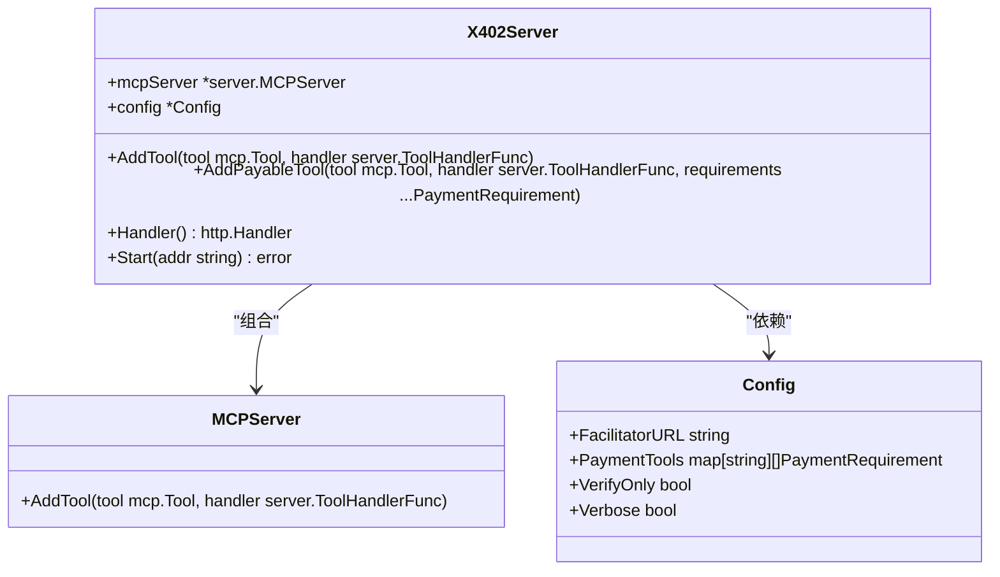
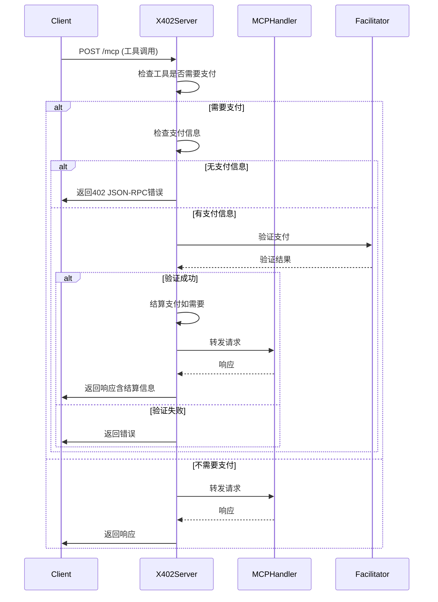
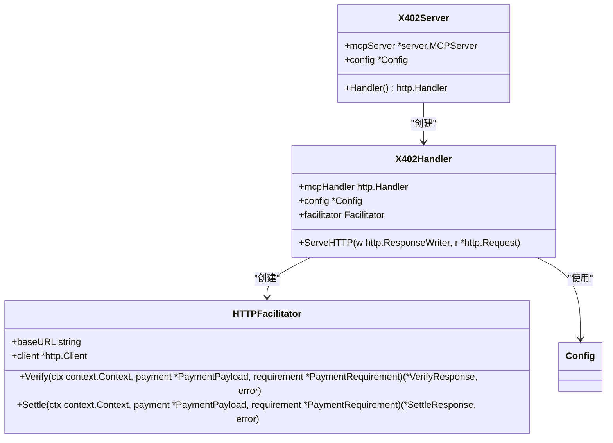

# X402Server服务器包装器

<cite>
**本文档引用的文件**   
- [server.go](file://server/server.go)
- [types.go](file://server/types.go)
- [handler.go](file://server/handler.go)
- [main.go](file://examples/server/main.go)
</cite>

## 目录
1. [简介](#简介)
2. [X402Server结构体与核心功能](#x402server结构体与核心功能)
3. [NewX402Server工厂函数实现机制](#newx402server工厂函数实现机制)
4. [配置对象与支付工具映射](#配置对象与支付工具映射)
5. [组合模式扩展与支付感知能力](#组合模式扩展与支付感知能力)
6. [X402Server初始化与集成示例](#x402server初始化与集成示例)
7. [请求处理链与生命周期管理](#请求处理链与生命周期管理)
8. [与X402Handler的协作关系](#与x402handler的协作关系)
9. [常见配置错误与初始化陷阱排查](#常见配置错误与初始化陷阱排查)

## 简介
X402Server是MCP（Model Context Protocol）服务器的增强型包装器，旨在为MCP服务器实例添加支付感知能力。该包装器通过封装底层MCP服务器实例和配置对象，实现了对工具调用的支付控制功能。X402Server利用组合模式扩展了原始服务器的功能，允许开发者为特定工具设置支付要求，并通过x402协议处理支付验证和结算。本文档详细描述了X402Server的结构、核心功能、初始化机制以及与其他组件的协作关系，为开发者提供全面的使用指南和最佳实践。

## X402Server结构体与核心功能

X402Server结构体是MCP服务器的增强包装器，通过组合模式封装了底层MCP服务器实例和配置对象。该结构体定义了两个核心字段：`mcpServer`和`config`，分别指向底层MCP服务器实例和配置对象。通过这种设计，X402Server能够扩展原始服务器的功能，实现支付感知能力。

X402Server提供了多个核心方法来管理工具和处理请求。`AddTool`方法用于添加常规（非付费）工具到服务器，直接委托给底层MCP服务器处理。`AddPayableTool`方法则用于添加需要支付的工具，除了将工具添加到MCP服务器外，还会注册支付要求到配置对象中。`Handler`方法返回HTTP处理器，该处理器包装了MCP HTTP服务器并添加了x402支付处理功能。最后，`Start`方法用于启动服务器，监听指定地址并处理请求。

这种设计模式使得X402Server能够在不修改底层MCP服务器代码的情况下，为其添加复杂的支付功能。通过组合而非继承的方式，X402Server保持了与原始MCP服务器的兼容性，同时提供了扩展功能所需的灵活性。

**Section sources**
- [server.go](file://server/server.go#L11-L14)
- [server.go](file://server/server.go#L30-L32)
- [server.go](file://server/server.go#L35-L53)
- [server.go](file://server/server.go#L56-L60)
- [server.go](file://server/server.go#L63-L68)

## NewX402Server工厂函数实现机制

NewX402Server工厂函数是创建X402Server实例的入口点，它接收name、version参数和config配置对象作为输入。该函数的实现机制首先创建一个基础的MCP服务器实例，然后使用该实例和提供的配置对象初始化X402Server结构体。

工厂函数的实现遵循了以下步骤：首先调用`server.NewMCPServer(name, version)`创建底层MCP服务器实例，其中name和version参数直接传递给基础MCP服务器，用于标识服务器实例。然后，创建X402Server结构体实例，将新创建的MCP服务器实例赋值给`mcpServer`字段，将传入的配置对象赋值给`config`字段。最后，返回新创建的X402Server实例。

这种实现机制确保了X402Server能够正确继承和扩展基础MCP服务器的功能，同时通过配置对象注入支付相关的设置。工厂函数的设计使得X402Server的创建过程简洁明了，开发者只需提供必要的参数即可获得一个功能完整的增强型服务器实例。

**Diagram sources**
- [server.go](file://server/server.go#L11-L14)
- [types.go](file://server/types.go#L91-L104)

## 配置对象与支付工具映射

配置对象（Config）是X402Server的核心组成部分，它包含了服务器运行所需的各种设置。配置对象定义了四个主要字段：`FacilitatorURL`、`PaymentTools`、`VerifyOnly`和`Verbose`。`FacilitatorURL`指定了x402服务协调器的基础URL，用于支付验证和结算。`PaymentTools`是一个映射，将工具名称映射到其支付要求，每个工具可以有多个支付选项。`VerifyOnly`是一个布尔值，如果为true，则只验证支付但不进行链上结算。`Verbose`如果为true，则会记录详细的请求和支付信息。

支付工具映射（PaymentTools）是配置对象的关键特性，它允许为每个工具定义具体的支付要求。支付要求（PaymentRequirement）结构体包含了支付方案、网络、最大所需金额、资产、收款地址、资源、描述、MIME类型、输出模式、最大超时秒数和额外信息等字段。这种设计使得服务器能够灵活地支持多种支付选项，为不同的工具设置不同的支付条件。

配置对象的默认行为是当`PaymentTools`为nil时，在首次添加付费工具时自动创建一个空的映射。这种延迟初始化策略优化了内存使用，确保只有在需要时才分配资源。同时，配置对象的设计允许在运行时动态修改支付要求，为服务器提供了高度的灵活性和可配置性。

**Section sources**
- [types.go](file://server/types.go#L91-L104)
- [server.go](file://server/server.go#L35-L53)

## 组合模式扩展与支付感知能力

X402Server通过组合模式扩展了原始MCP服务器的功能，实现了支付感知能力。这种设计模式的核心思想是通过包含（has-a）关系而不是继承（is-a）关系来扩展功能，从而保持了代码的灵活性和可维护性。X402Server包含一个MCP服务器实例和一个配置对象，通过委托调用和功能增强的方式，为底层服务器添加了支付处理能力。

支付感知能力的实现主要体现在`AddPayableTool`方法和`Handler`方法中。`AddPayableTool`方法不仅将工具添加到MCP服务器，还注册了支付要求到配置对象中，建立了工具与支付条件的映射关系。`Handler`方法返回的HTTP处理器包装了MCP HTTP服务器，并添加了x402支付处理逻辑。当收到工具调用请求时，处理器会检查工具是否需要支付，如果需要，则验证支付信息并处理支付流程。

这种组合模式的设计带来了多个优势：首先，它保持了与原始MCP服务器的兼容性，X402Server可以无缝替换MCP服务器；其次，它提供了高度的模块化，支付功能可以独立开发和测试；最后，它支持灵活的配置和扩展，开发者可以根据需要定制支付逻辑。通过这种设计，X402Server成功地将支付功能集成到MCP服务器中，而不会影响其核心功能。

**Diagram sources**
- [server.go](file://server/server.go#L35-L53)
- [handler.go](file://server/handler.go#L32-L214)

## X402Server初始化与集成示例

以下代码示例展示了如何初始化X402Server实例并将其集成到现有的MCP应用中。示例来自`examples/server/main.go`文件，展示了完整的服务器设置过程。

首先，定义命令行标志来配置服务器参数，包括端口、协调器URL、收款钱包地址、是否仅验证模式、是否启用测试网支付选项以及是否启用详细输出。然后，检查必需的标志，确保提供了收款钱包地址。接下来，创建配置对象，设置协调器URL、仅验证模式和详细输出选项。

使用`NewX402Server`工厂函数创建X402Server实例，传入服务器名称、版本和配置对象。然后，使用`AddPayableTool`方法添加一个需要支付的搜索工具，指定支付要求为在Base网络上支付0.01 USDC。同时，使用`AddTool`方法添加一个免费的回显工具。如果启用了测试网选项，还可以添加一个测试功能工具。

最后，调用`Start`方法启动服务器，监听指定端口。服务器启动后，会输出连接信息，客户端可以使用提供的命令连接到服务器。这个示例展示了X402Server的完整初始化流程，从配置到启动，为开发者提供了清晰的使用指南。

**Section sources**
- [main.go](file://examples/server/main.go#L12-L95)

## 请求处理链与生命周期管理

X402Server的请求处理链始于`Start`方法，该方法启动服务器并开始监听指定地址。当收到HTTP请求时，`Handler`方法返回的HTTP处理器开始处理请求。处理器首先检查请求方法，只拦截POST请求（MCP工具调用）。然后，解析JSON-RPC请求，检查是否为工具调用方法。

对于需要支付的工具，处理器会检查请求参数中的`_meta`字段是否包含支付信息。如果没有支付信息，处理器会发送一个402 JSON-RPC错误，包含可用的支付选项。如果有支付信息，处理器会解析支付载荷，验证支付是否符合要求，并通过协调器验证支付的有效性。

如果支付验证成功，处理器会根据配置决定是否进行链上结算。在验证仅模式下，跳过结算步骤；否则，调用协调器进行结算。处理完支付后，请求被转发给底层MCP处理器，响应被拦截并添加结算信息，然后返回给客户端。

X402Server的生命周期管理相对简单：通过`Start`方法启动服务器，服务器会持续运行直到发生错误或程序终止。服务器没有显式的停止方法，但可以通过关闭监听套接字来停止。这种设计符合Go语言中HTTP服务器的常见模式，保持了API的简洁性。

**Section sources**
- [server.go](file://server/server.go#L56-L60)
- [server.go](file://server/server.go#L63-L68)
- [handler.go](file://server/handler.go#L32-L214)

## 与X402Handler的协作关系

X402Server与X402Handler之间存在紧密的协作关系。X402Handler是X402Server的核心组件，负责处理HTTP请求中的支付逻辑。当X402Server的`Handler`方法被调用时，它会创建并返回一个X402Handler实例，该实例包装了MCP HTTP服务器并添加了x402支付处理功能。

X402Handler的构造函数接收MCP HTTP处理器和配置对象作为参数。它使用配置对象中的协调器URL创建一个HTTP协调器实例，并将详细输出设置传递给协调器。X402Handler实现了`ServeHTTP`方法，该方法拦截POST请求，检查工具调用是否需要支付，并处理支付验证和结算流程。

X402Server通过`Handler`方法将请求处理委托给X402Handler，实现了关注点分离。X402Server负责服务器的高层配置和生命周期管理，而X402Handler专注于请求级别的支付处理。这种协作关系使得代码结构清晰，职责分明，便于维护和扩展。

**Diagram sources**
- [server.go](file://server/server.go#L56-L60)
- [handler.go](file://server/handler.go#L15-L19)
- [handler.go](file://server/handler.go#L22-L30)
- [facilitator.go](file://server/facilitator.go#L35-L42)

## 常见配置错误与初始化陷阱排查

在使用X402Server时，可能会遇到一些常见的配置错误和初始化陷阱。以下是一些常见问题及其排查方法：

1. **缺少必需的配置参数**：最常见的错误是未提供收款钱包地址。在初始化时，必须确保`payTo`参数不为空。可以通过在`main`函数中检查该参数来避免此问题。

2. **无效的协调器URL**：如果`FacilitatorURL`配置不正确，支付验证和结算将失败。确保URL格式正确且服务可访问。可以使用`http.Get`测试URL的可达性。

3. **支付要求配置错误**：为工具配置支付要求时，必须确保至少有一个支付选项。`AddPayableTool`方法会在没有提供支付要求时触发panic。确保传递了有效的`PaymentRequirement`参数。

4. **网络和资产不匹配**：支付要求中的网络和资产必须与客户端支持的选项匹配。检查客户端的支付签名器是否配置了正确的网络和资产选项。

5. **仅验证模式配置错误**：在仅验证模式下，支付不会进行链上结算。如果期望实际结算支付，确保`VerifyOnly`配置为false。

6. **详细输出配置**：如果遇到问题但没有足够的调试信息，可以启用`Verbose`模式来获取详细的请求和支付日志。

通过仔细检查这些常见问题，可以有效避免X402Server的配置和初始化错误，确保服务器正常运行。

**Section sources**
- [main.go](file://examples/server/main.go#L12-L95)
- [server.go](file://server/server.go#L35-L53)
- [types.go](file://server/types.go#L91-L104)