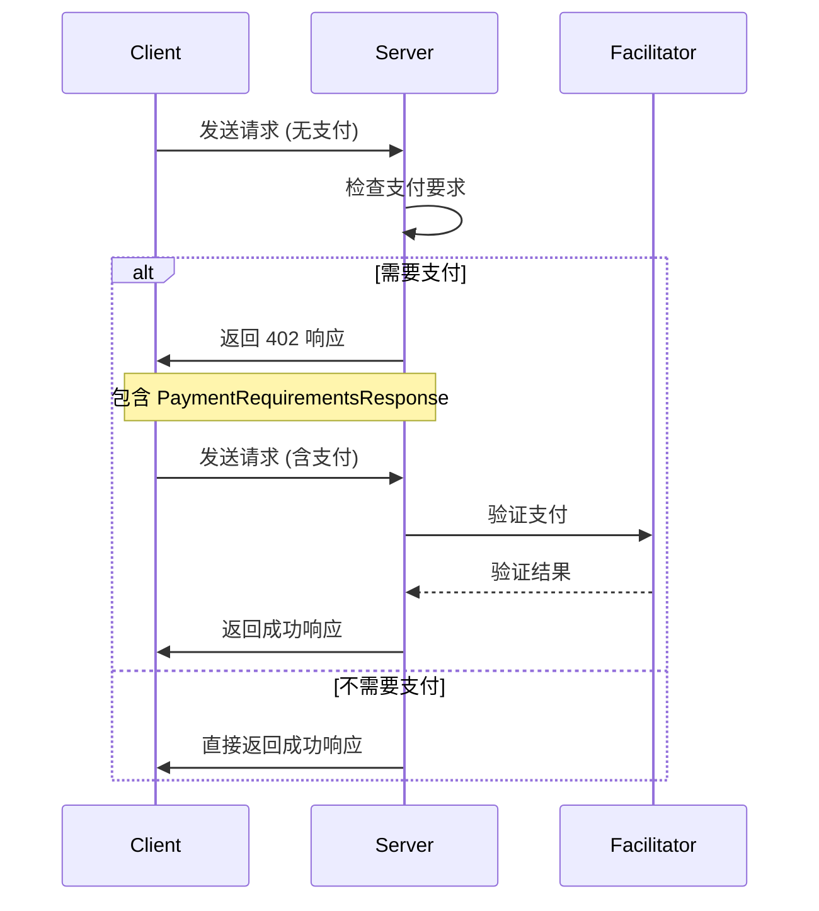

# 支付要求与响应

<cite>
**Referenced Files in This Document**   
- [server/types.go](file://server/types.go)
- [server/requirements.go](file://server/requirements.go)
- [server/handler.go](file://server/handler.go)
- [transport.go](file://transport.go)
- [types.go](file://types.go)
</cite>

## 目录
1. [介绍](#介绍)
2. [核心数据结构](#核心数据结构)
3. [支付要求响应](#支付要求响应)
4. [支付要求结构](#支付要求结构)
5. [结算响应](#结算响应)
6. [JSON示例](#json示例)

## 介绍
本文档详细说明了x402支付协议中的核心数据结构，包括`PaymentRequirementsResponse`、`PaymentRequirement`和`SettlementResponse`。这些结构体定义了服务器如何向客户端传达支付要求，以及客户端如何响应和确认支付。文档基于`types.go`和`requirements.go`文件中的实现，解释了各字段的语义和用途。

**Section sources**
- [server/types.go](file://server/types.go#L4-L52)
- [types.go](file://types.go#L9-L67)

## 核心数据结构
本节详细分析支付协议中的核心数据结构，包括支付要求、支付要求响应和结算响应。

```mermaid
classDiagram
class PaymentRequirement {
+string Scheme
+string Network
+string MaxAmountRequired
+string Asset
+string PayTo
+string Resource
+string Description
+string MimeType
+interface{} OutputSchema
+int MaxTimeoutSeconds
+map[string]string Extra
}
class PaymentRequirementsResponse {
+int X402Version
+string Error
+[]PaymentRequirement Accepts
}
class SettlementResponse {
+bool Success
+string Transaction
+string Network
+string Payer
+string ErrorReason
}
PaymentRequirementsResponse --> PaymentRequirement : "contains"
```

**Diagram sources**
- [server/types.go](file://server/types.go#L4-L22)
- [types.go](file://types.go#L9-L67)

## 支付要求响应
`PaymentRequirementsResponse`结构体用于在HTTP 402响应中向客户端传递支付要求。服务器在收到未支付的请求时，会构造此响应体。

### 字段说明
- **x402Version**: 表示协议版本，用于确保客户端和服务器使用兼容的协议版本。
- **error**: 传递错误信息，解释为什么需要支付或支付失败的原因。
- **accepts**: 数组，列出服务器接受的所有支付方式。每个支付方式由一个`PaymentRequirement`对象表示。

服务器根据请求的工具动态构造`PaymentRequirementsResponse`。在`server/handler.go`中，`sendPaymentRequiredError`方法负责创建此响应。当服务器检测到请求缺少支付信息时，会从配置中获取该工具的支付要求，并将其包含在`accepts`数组中返回给客户端。



**Diagram sources**
- [server/handler.go](file://server/handler.go#L217-L235)
- [server/types.go](file://server/types.go#L17-L22)

**Section sources**
- [server/types.go](file://server/types.go#L17-L22)
- [server/handler.go](file://server/handler.go#L217-L235)

## 支付要求结构
`PaymentRequirement`结构体定义了单个支付方式的具体要求。它包含了执行支付所需的所有必要信息。

### 字段说明
- **scheme**: 支付方案，如"exact"表示精确金额支付。
- **network**: 支付网络，如"base"或"ethereum-mainnet"。
- **maxAmountRequired**: 所需的最大金额，以字符串形式表示。
- **asset**: 资产合约地址，如USDC的合约地址。
- **payTo**: 收款方地址。
- **resource**: 资源标识符，通常为工具的URI。
- **description**: 支付描述，用于向用户解释支付目的。
- **mimeType**: 响应的MIME类型。
- **outputSchema**: 可选的输出模式。
- **maxTimeoutSeconds**: 支付授权的最大有效期（秒）。
- **extra**: 额外的元数据，如资产名称和版本。

在`server/requirements.go`中，提供了两个辅助函数`RequireUSDCBase`和`RequireUSDCBaseSepolia`，用于快速创建针对Base主网和Sepolia测试网的USDC支付要求。这些函数预设了常见的字段值，简化了支付要求的创建过程。

**Section sources**
- [server/types.go](file://server/types.go#L4-L16)
- [server/requirements.go](file://server/requirements.go#L5-L38)

## 结算响应
`SettlementResponse`结构体用于在链上结算成功后向客户端反馈交易信息。

### 字段说明
- **success**: 布尔值，表示结算是否成功。
- **transaction**: 交易哈希，用于在区块链上查询交易详情。
- **network**: 交易所在的网络。
- **payer**: 付款方地址。
- **errorReason**: 如果结算失败，此字段包含失败原因。

在`server/handler.go`中，`forwardWithSettlementResponse`方法负责在成功处理支付后，将`SettlementResponse`添加到响应的`_meta`字段中。这使得客户端能够确认支付已成功结算，并获取交易哈希等信息。

**Section sources**
- [server/types.go](file://server/types.go#L46-L52)
- [server/handler.go](file://server/handler.go#L270-L317)

## JSON示例
以下示例展示了典型的402响应和结算响应格式。

### 402响应示例
```json
{
  "jsonrpc": "2.0",
  "id": 1,
  "error": {
    "code": 402,
    "message": "Payment required",
    "data": {
      "x402Version": 1,
      "error": "Payment required to access this resource",
      "accepts": [
        {
          "scheme": "exact",
          "network": "base-sepolia",
          "maxAmountRequired": "1000",
          "asset": "0x036CbD53842c5426634e7929541eC2318f3dCF7e",
          "payTo": "0x209693Bc6afc0C5328bA36FaF03C514EF312287C",
          "resource": "https://api.example.com/data",
          "description": "Test HTTP 402 payment",
          "maxTimeoutSeconds": 60,
          "extra": {
            "name": "USDC",
            "version": "2"
          }
        }
      ]
    }
  }
}
```

### 结算响应示例
```json
{
  "jsonrpc": "2.0",
  "id": 1,
  "result": {
    "data": "response_data",
    "_meta": {
      "x402/payment-response": {
        "success": true,
        "transaction": "0x123",
        "network": "base-sepolia",
        "payer": "0xTestWallet"
      }
    }
  }
}
```

**Section sources**
- [transport_test.go](file://transport_test.go#L501-L578)
- [server/handler_test.go](file://server/handler_test.go#L301-L342)