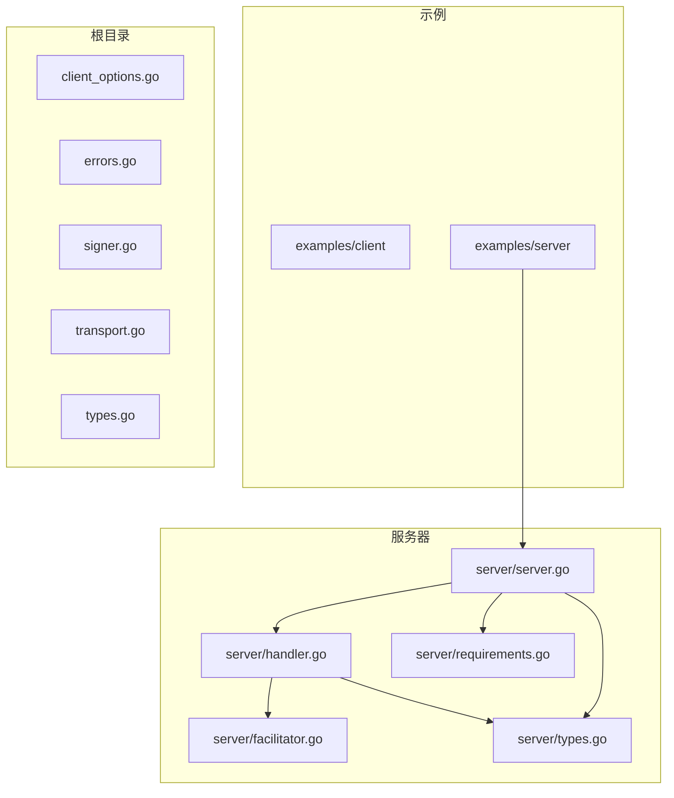
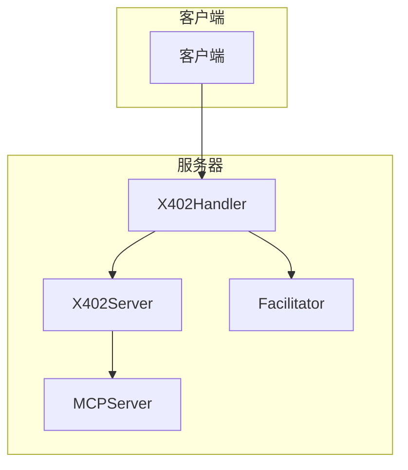
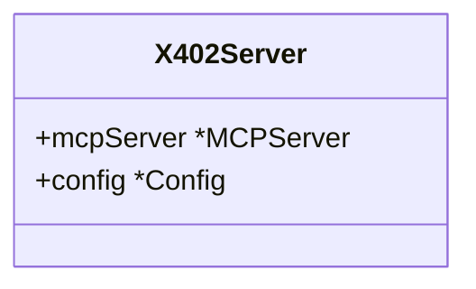
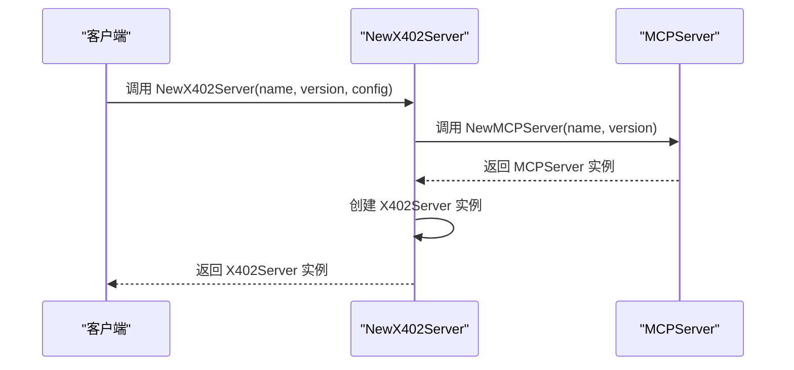
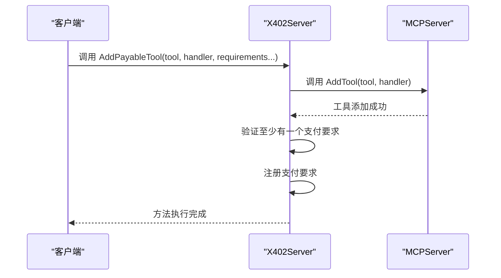
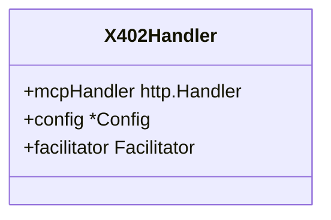
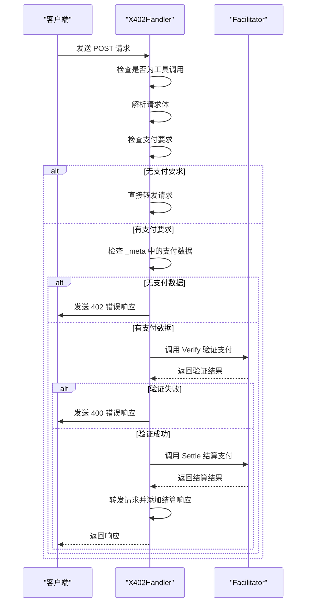
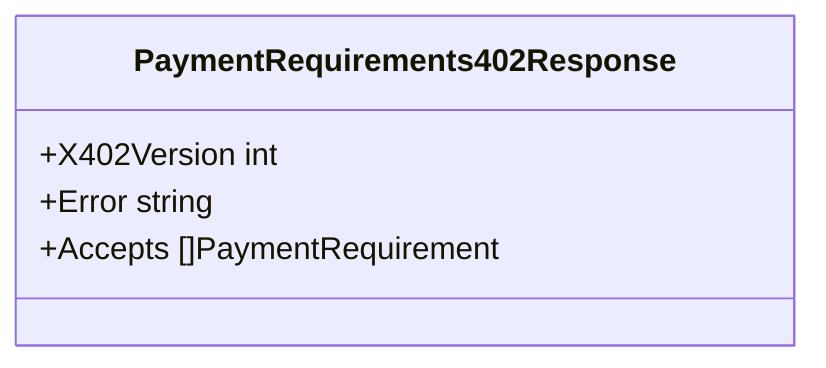
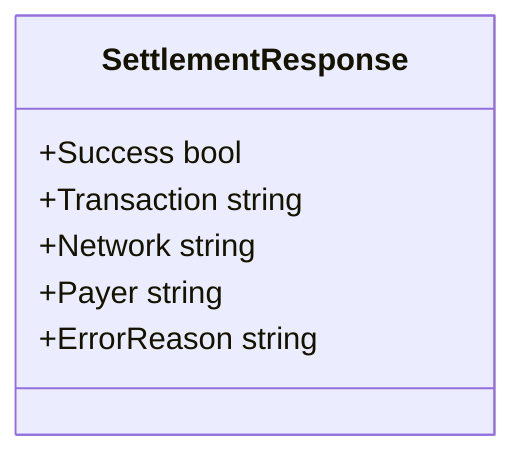
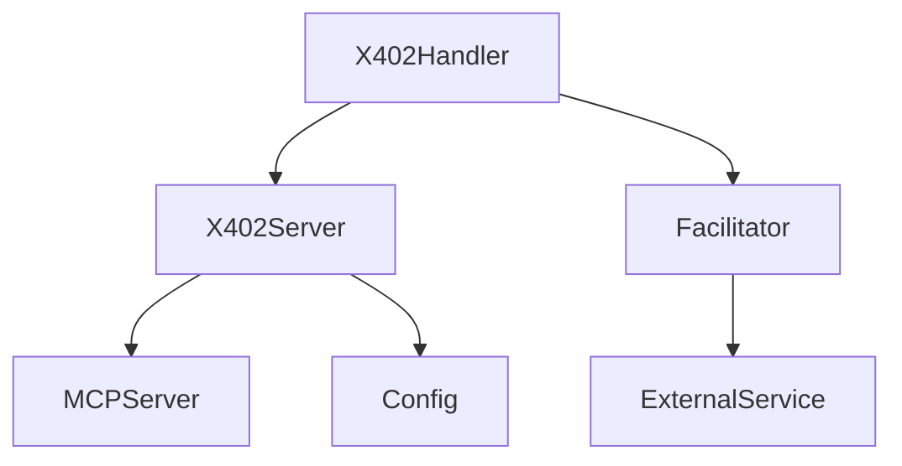

# 服务器端API

<cite>
**本文档引用的文件**   
- [server.go](file://server/server.go)
- [handler.go](file://server/handler.go)
- [types.go](file://server/types.go)
- [requirements.go](file://server/requirements.go)
- [facilitator.go](file://server/facilitator.go)
- [examples/server/main.go](file://examples/server/main.go)
</cite>

## 目录
1. [简介](#简介)
2. [项目结构](#项目结构)
3. [核心组件](#核心组件)
4. [架构概览](#架构概览)
5. [详细组件分析](#详细组件分析)
6. [依赖分析](#依赖分析)
7. [性能考虑](#性能考虑)
8. [故障排除指南](#故障排除指南)
9. [结论](#结论)

## 简介
本文档系统性地文档化了 `mcp-go-x402` 服务器端的公共API接口，重点描述了 `X402Server` 结构体的功能、`AddPayableTool` 方法的使用方式、`X402Handler` 在请求拦截和支付验证中的核心作用，以及 `PaymentRequirementsResponse` 和 `SettlementResponse` 的构造逻辑和字段语义。文档还涵盖了支付验证流程、错误处理策略和安全考虑，帮助开发者正确部署和扩展服务器功能。

## 项目结构
`mcp-go-x402` 项目结构清晰，主要分为 `examples`、`server` 和根目录下的核心文件。`examples` 目录包含客户端和服务器的示例代码，`server` 目录包含服务器端的核心实现，包括 `facilitator.go`、`handler.go`、`requirements.go`、`server.go` 和 `types.go`。根目录下的文件如 `client_options.go`、`errors.go`、`signer.go`、`transport.go` 和 `types.go` 提供了客户端和通用功能。

**Diagram sources**
- [server/server.go](file://server/server.go#L1-L70)
- [server/handler.go](file://server/handler.go#L1-L354)
- [server/types.go](file://server/types.go#L1-L106)

**Section sources**
- [server/server.go](file://server/server.go#L1-L70)
- [server/handler.go](file://server/handler.go#L1-L354)
- [server/types.go](file://server/types.go#L1-L106)

## 核心组件
`mcp-go-x402` 的核心组件包括 `X402Server`、`X402Handler`、`Facilitator` 和 `Config`。`X402Server` 是服务器的主要结构体，封装了 `MCPServer` 并添加了支付支持。`X402Handler` 是HTTP处理器，负责拦截请求并进行支付验证。`Facilitator` 是支付验证和结算的接口，`Config` 是服务器的配置结构体。

**Section sources**
- [server/server.go](file://server/server.go#L11-L14)
- [server/handler.go](file://server/handler.go#L15-L19)
- [server/types.go](file://server/types.go#L100-L105)

## 架构概览
`mcp-go-x402` 的架构基于 `MCPServer`，通过 `X402Server` 和 `X402Handler` 添加了支付支持。`X402Server` 创建并配置 `MCPServer`，并通过 `X402Handler` 拦截和处理支付请求。`Facilitator` 负责与外部支付服务进行交互，验证和结算支付。

**Diagram sources**
- [server/server.go](file://server/server.go#L17-L27)
- [server/handler.go](file://server/handler.go#L15-L19)
- [server/facilitator.go](file://server/facilitator.go#L15-L18)

## 详细组件分析

### X402Server 分析
`X402Server` 是 `mcp-go-x402` 服务器的核心结构体，封装了 `MCPServer` 并添加了支付支持。它通过 `NewX402Server` 工厂函数创建，配置选项包括服务器名称、版本和 `Config`。

#### X402Server 结构体

**Diagram sources**
- [server/server.go](file://server/server.go#L11-L14)

#### NewX402Server 工厂函数

**Diagram sources**
- [server/server.go](file://server/server.go#L17-L27)

**Section sources**
- [server/server.go](file://server/server.go#L17-L27)

### AddPayableTool 方法分析
`AddPayableTool` 方法用于将普通MCP工具转换为支持x402支付的付费工具。它首先将工具添加到 `MCPServer`，然后注册支付要求。

#### AddPayableTool 方法

**Diagram sources**
- [server/server.go](file://server/server.go#L35-L53)

**Section sources**
- [server/server.go](file://server/server.go#L35-L53)

### X402Handler 分析
`X402Handler` 是HTTP处理器，负责拦截请求并进行支付验证。它通过 `NewX402Handler` 创建，与 `X402Server` 集成，处理支付验证和结算。

#### X402Handler 结构体

**Diagram sources**
- [server/handler.go](file://server/handler.go#L15-L19)

#### X402Handler 请求处理流程

**Diagram sources**
- [server/handler.go](file://server/handler.go#L21-L353)

**Section sources**
- [server/handler.go](file://server/handler.go#L21-L353)

### PaymentRequirementsResponse 分析
`PaymentRequirementsResponse` 是服务器通过402响应告知客户端支付要求的结构体。它包含 `X402Version`、`Error` 和 `Accepts` 字段。

#### PaymentRequirementsResponse 结构体

**Diagram sources**
- [server/types.go](file://server/types.go#L19-L23)

**Section sources**
- [server/types.go](file://server/types.go#L19-L23)

### SettlementResponse 分析
`SettlementResponse` 是链上结算后的反馈机制说明。它包含 `Success`、`Transaction`、`Network`、`Payer` 和 `ErrorReason` 字段。

#### SettlementResponse 结构体

**Diagram sources**
- [server/types.go](file://server/types.go#L46-L52)

**Section sources**
- [server/types.go](file://server/types.go#L46-L52)

## 依赖分析
`mcp-go-x402` 的依赖关系清晰，`X402Server` 依赖 `MCPServer` 和 `Config`，`X402Handler` 依赖 `X402Server` 和 `Facilitator`，`Facilitator` 依赖外部支付服务。

**Diagram sources**
- [server/server.go](file://server/server.go#L11-L14)
- [server/handler.go](file://server/handler.go#L15-L19)
- [server/facilitator.go](file://server/facilitator.go#L15-L18)

**Section sources**
- [server/server.go](file://server/server.go#L11-L14)
- [server/handler.go](file://server/handler.go#L15-L19)
- [server/facilitator.go](file://server/facilitator.go#L15-L18)

## 性能考虑
`mcp-go-x402` 的性能主要受支付验证和结算的影响。`Facilitator` 的HTTP请求可能会成为瓶颈，建议使用缓存和异步处理来优化性能。

## 故障排除指南
常见问题包括支付验证失败、结算失败和配置错误。建议启用 `Verbose` 模式以获取详细的日志信息，帮助诊断问题。

**Section sources**
- [server/handler.go](file://server/handler.go#L21-L353)
- [server/facilitator.go](file://server/facilitator.go#L15-L18)

## 结论
`mcp-go-x402` 提供了一个完整的服务器端API，支持x402支付。通过 `X402Server`、`X402Handler` 和 `Facilitator`，开发者可以轻松地将支付功能集成到MCP工具中。文档详细描述了各个组件的功能和使用方法，帮助开发者正确部署和扩展服务器功能。