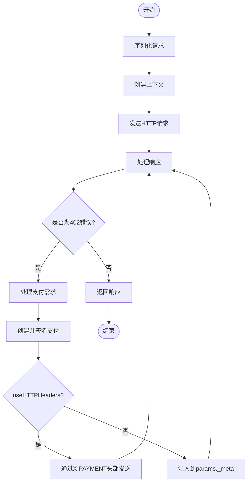

# 传输层

<cite>
**本文档中引用的文件**   
- [transport.go](file://transport.go)
- [types.go](file://types.go)
- [handler.go](file://handler.go)
- [signer.go](file://signer.go)
- [transport_test.go](file://transport_test.go)
</cite>

## 目录
1. [简介](#简介)
2. [X402Transport 结构体分析](#x402transport-结构体分析)
3. [核心方法实现机制](#核心方法实现机制)
4. [支付凭证注入方式](#支付凭证注入方式)
5. [辅助方法实现细节](#辅助方法实现细节)
6. [会话管理与超时控制](#会话管理与超时控制)
7. [异常处理策略](#异常处理策略)
8. [测试用例分析](#测试用例分析)

## 简介
`X402Transport` 是一个实现了 `transport.Interface` 接口的传输层组件，专门用于支持 X402 支付协议。该组件基于 StreamableHTTP 实现，并增加了对 X402 支付的处理能力。其主要功能是作为装饰器包装基础 MCP 传输层，能够拦截 402 响应并自动注入支付凭证。当客户端发起请求时，如果服务器返回 402 Payment Required 错误，`X402Transport` 会自动创建并签名支付凭证，然后重试请求。

**Section sources**
- [transport.go](file://transport.go#L33-L63)

## X402Transport 结构体分析
`X402Transport` 结构体包含了实现 X402 支付所需的各种字段。其中，`serverURL` 和 `httpClient` 用于与服务器通信，`handler` 是 `*PaymentHandler` 类型，负责处理支付相关操作。会话管理方面使用了 `atomic.Value` 类型的 `sessionID` 和 `protocolVersion` 来保证线程安全。此外，还包含了一些事件回调函数，如 `onPaymentAttempt`、`onPaymentSuccess` 和 `onPaymentFailure`，用于在支付过程中触发相应的事件。

```mermaid
classDiagram
class X402Transport {
+serverURL *url.URL
+httpClient *http.Client
+handler *PaymentHandler
+sessionID atomic.Value
+protocolVersion atomic.Value
+initialized chan struct{}
+initializedOnce sync.Once
+notificationHandler func(mcp.JSONRPCNotification)
+notifyMu sync.RWMutex
+requestHandler transport.RequestHandler
+requestMu sync.RWMutex
+onPaymentAttempt func(PaymentEvent)
+onPaymentSuccess func(PaymentEvent)
+onPaymentFailure func(PaymentEvent, error)
+closed chan struct{}
+wg sync.WaitGroup
+paymentRecorder *PaymentRecorder
}
```

**Diagram sources **
- [transport.go](file://transport.go#L33-L63)

**Section sources**
- [transport.go](file://transport.go#L33-L63)

## 核心方法实现机制
`SendRequest` 方法是 `X402Transport` 的核心，它实现了从请求发起、402 错误捕获、支付处理到重试的完整流程。首先，该方法会尝试发送请求而不带支付凭证。如果服务器返回 402 错误，它会调用 `handlePaymentRequired` 方法来处理支付需求。`handlePaymentRequired` 方法会解析支付要求，创建并签名支付凭证，然后根据 `useHTTPHeaders` 标志选择适当的支付凭证提交方式。



**Diagram sources **
- [transport.go](file://transport.go#L175-L208)
- [transport.go](file://transport.go#L213-L309)

**Section sources**
- [transport.go](file://transport.go#L175-L309)

## 支付凭证注入方式
`handlePaymentRequired` 函数根据 `useHTTPHeaders` 标志选择两种方式提交支付凭证：X-PAYMENT 头部或 JSON-RPC _meta 字段。当 `useHTTPHeaders` 为 true 时，支付凭证会被序列化为 JSON 并编码为 base64，然后通过 X-PAYMENT 头部发送。这种方式适用于 HTTP 402 传输。当 `useHTTPHeaders` 为 false 时，支付凭证会被注入到请求的 `params._meta` 字段中，这种方式适用于 JSON-RPC 402 传输。

**Section sources**
- [transport.go](file://transport.go#L213-L309)

## 辅助方法实现细节
`injectPaymentIntoRequest` 方法负责将支付凭证注入到请求的 `params._meta` 字段中。它首先将请求参数序列化为 JSON，然后反序列化为 map 类型，以便可以轻松地操作 `_meta` 字段。如果 `_meta` 字段不存在，则会创建一个新的 map。最后，将支付凭证添加到 `_meta` 字段中，并更新请求。

`processResponse` 方法负责处理 HTTP 响应。它会检查响应状态码，如果是 402，则会解析支付要求并返回一个合成的 JSON-RPC 错误响应。对于其他非成功状态码，它会尝试解析为 JSON-RPC 错误。对于成功响应，它会根据内容类型处理单个响应或服务器发送事件（SSE）流。

**Section sources**
- [transport.go](file://transport.go#L312-L344)
- [transport.go](file://transport.go#L410-L503)

## 会话管理与超时控制
`X402Transport` 实现了会话管理和超时控制。会话 ID 存储在 `atomic.Value` 类型的 `sessionID` 字段中，以确保线程安全。当调用 `Close` 方法时，如果存在会话 ID，它会发送一个 DELETE 请求来关闭会话。超时控制通过 `context.WithTimeout` 实现，例如在关闭会话时使用 `sessionCloseTimeout`，在处理请求时使用 `requestHandlingTimeout`。

**Section sources**
- [transport.go](file://transport.go#L123-L164)
- [transport.go](file://transport.go#L511-L564)

## 异常处理策略
`X402Transport` 有一套完整的异常处理策略。对于网络错误，它会在 `sendHTTPWithHeaders` 方法中捕获并返回错误。对于会话终止（404），它会返回 `ErrSessionTerminated` 错误。在支付过程中，如果支付被拒绝或签名失败，它会记录相应的错误事件并通过 `onPaymentFailure` 回调通知。此外，它还会处理各种 HTTP 状态码，如 401、403、429 等，并返回相应的错误信息。

**Section sources**
- [transport.go](file://transport.go#L511-L564)
- [transport.go](file://transport.go#L790-L821)

## 测试用例分析
通过分析 `transport_test.go` 中的测试用例，我们可以更好地理解 `X402Transport` 的行为。`TestX402Transport_Basic` 测试了基本的支付流程，验证了在收到 402 响应后能够正确地注入支付凭证并重试请求。`TestX402Transport_HTTP402Flow` 测试了通过 X-PAYMENT 头部提交支付凭证的流程。`TestX402Transport_JSONRPC402FlowBackwardCompatibility` 测试了向后兼容的 JSON-RPC 402 流程。这些测试用例确保了 `X402Transport` 在各种情况下的正确性和稳定性。

**Section sources**
- [transport_test.go](file://transport_test.go#L66-L156)
- [transport_test.go](file://transport_test.go#L501-L578)
- [transport_test.go](file://transport_test.go#L580-L661)