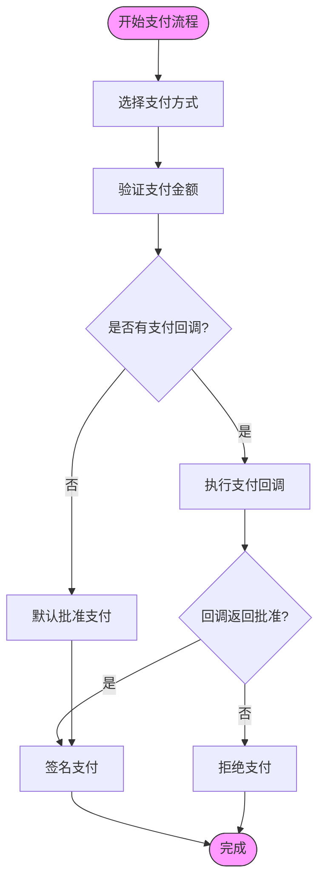
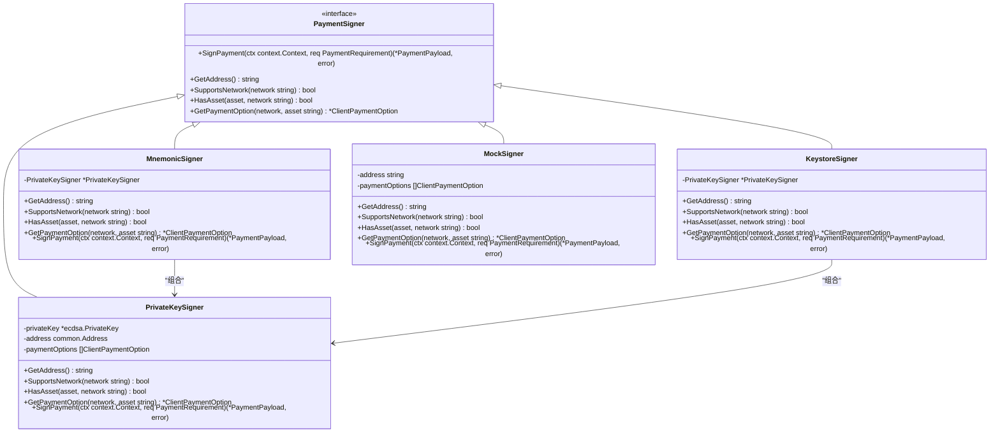
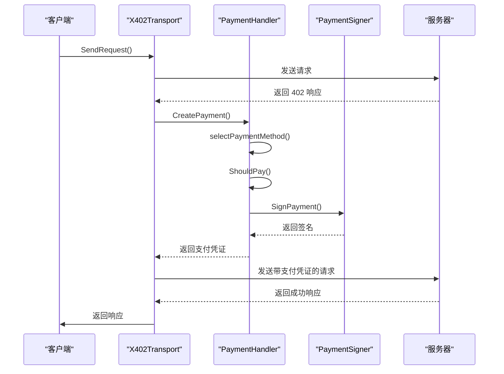
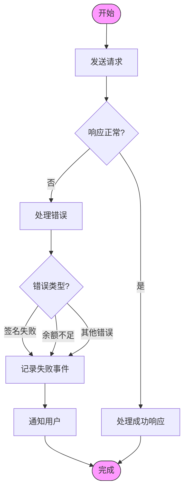

# 客户端实现

<cite>
**本文档中引用的文件**  
- [transport.go](file://transport.go)
- [handler.go](file://handler.go)
- [signer.go](file://signer.go)
- [client_options.go](file://client_options.go)
- [types.go](file://types.go)
</cite>

## 目录
1. [简介](#简介)
2. [X402Transport 装饰器机制](#x402transport-装饰器机制)
3. [PaymentHandler 决策逻辑](#paymenthandler-决策逻辑)
4. [支付签名器实现](#支付签名器实现)
5. [客户端配置选项](#客户端配置选项)
6. [完整支付流程](#完整支付流程)
7. [异常处理策略](#异常处理策略)

## 简介
mcp-go-x402 客户端实现了一套基于 JSON-RPC 的支付拦截与自动支付机制，用于处理服务器返回的 402 支付要求。该系统通过装饰器模式包装基础传输层，实现了对支付流程的透明处理。核心组件包括 X402Transport 传输层、PaymentHandler 支付处理器和多种 PaymentSigner 签名器实现。客户端能够根据服务器返回的支付要求，自动选择合适的支付方式，生成签名并完成支付，同时提供了灵活的配置选项和事件回调机制。

## X402Transport 装饰器机制

X402Transport 作为基础 MCP 传输层的装饰器，实现了对 402 响应的拦截和自动支付功能。它通过包装 StreamableHTTP 传输层，添加了支付处理逻辑，实现了对支付流程的透明处理。

```mermaid
classDiagram
class X402Transport {
-serverURL *url.URL
-httpClient *http.Client
-handler *PaymentHandler
-sessionID atomic.Value
-protocolVersion atomic.Value
-initialized chan struct{}
-notificationHandler func(mcp.JSONRPCNotification)
-requestHandler transport.RequestHandler
-onPaymentAttempt func(PaymentEvent)
-onPaymentSuccess func(PaymentEvent)
-onPaymentFailure func(PaymentEvent, error)
-closed chan struct{}
-wg sync.WaitGroup
-paymentRecorder *PaymentRecorder
+Start(ctx context.Context) error
+Close() error
+SetProtocolVersion(version string)
+SendRequest(ctx context.Context, request transport.JSONRPCRequest) (*transport.JSONRPCResponse, error)
+SendNotification(ctx context.Context, notification mcp.JSONRPCNotification) error
+SetNotificationHandler(handler func(mcp.JSONRPCNotification))
+SetRequestHandler(handler transport.RequestHandler)
+GetSessionId() string
-handlePaymentRequired(ctx context.Context, rpcError *mcp.JSONRPCErrorDetails, originalRequest transport.JSONRPCRequest, useHTTPHeaders bool) (*transport.JSONRPCResponse, error)
-injectPaymentIntoRequest(request transport.JSONRPCRequest, payment *PaymentPayload) (transport.JSONRPCRequest, error)
-processResponse(ctx context.Context, resp *http.Response, request transport.JSONRPCRequest) (*transport.JSONRPCResponse, bool, error)
-sendHTTP(ctx context.Context, method string, body io.Reader, acceptType string) (*http.Response, error)
-sendHTTPWithHeaders(ctx context.Context, method string, body io.Reader, acceptType string, extraHeaders map[string]string) (*http.Response, error)
-handleSSEResponse(ctx context.Context, reader io.ReadCloser, ignoreResponse bool) (*transport.JSONRPCResponse, bool, error)
-readSSE(ctx context.Context, reader io.ReadCloser, handler func(event, data string))
-extractAndRecordSettlement(response *transport.JSONRPCResponse, method string, reqs PaymentRequirementsResponse)
-extractAndRecordHTTPSettlement(paymentRespHeader string, method string, reqs PaymentRequirementsResponse)
-recordPaymentEvent(eventType PaymentEventType, method string, reqs PaymentRequirementsResponse)
-recordPaymentError(eventType PaymentEventType, method string, reqs PaymentRequirementsResponse, err error)
-contextAwareOfClientClose(ctx context.Context) (context.Context, context.CancelFunc)
-handleIncomingRequest(ctx context.Context, request transport.JSONRPCRequest)
-sendResponseToServer(ctx context.Context, response *transport.JSONRPCResponse)
}
class Config {
+ServerURL string
+Signer PaymentSigner
+PaymentCallback func(amount *big.Int, resource string) bool
+HTTPClient *http.Client
+OnPaymentAttempt func(PaymentEvent)
+OnPaymentSuccess func(PaymentEvent)
+OnPaymentFailure func(PaymentEvent, error)
}
X402Transport --> Config : "使用"
X402Transport --> PaymentHandler : "包含"
X402Transport --> PaymentRecorder : "可选包含"
```

**图示来源**  
- [transport.go](file://transport.go#L33-L63)

**本节来源**  
- [transport.go](file://transport.go#L33-L63)

## PaymentHandler 决策逻辑

PaymentHandler 负责处理支付操作，包括选择支付方式、验证支付要求和创建支付签名。它根据服务器返回的支付要求，结合客户端配置，做出支付决策。



**图示来源**  
- [handler.go](file://handler.go#L37-L55)

**本节来源**  
- [handler.go](file://handler.go#L37-L55)

## 支付签名器实现

mcp-go-x402 支持多种签名器类型，包括 PrivateKeySigner、MnemonicSigner 和 KeystoreSigner，每种签名器都实现了 PaymentSigner 接口，提供了统一的签名方法。



**图示来源**  
- [signer.go](file://signer.go#L23-L38)

**本节来源**  
- [signer.go](file://signer.go#L23-L38)

## 客户端配置选项

client_options.go 提供了客户端配置选项，包括自定义支付回调、Gas Price 设置等高级功能。通过这些选项，客户端可以灵活地配置支付行为。

```mermaid
classDiagram
class ClientPaymentOption {
+PaymentRequirement PaymentRequirement
+Priority int
+MaxAmount string
+MinBalance string
+ChainID *big.Int
+WithPriority(p int) ClientPaymentOption
+WithMaxAmount(amount string) ClientPaymentOption
+WithMinBalance(amount string) ClientPaymentOption
}
class PaymentRequirement {
+Scheme string
+Network string
+MaxAmountRequired string
+Asset string
+PayTo string
+Resource string
+Description string
+MimeType string
+OutputSchema interface{}
+MaxTimeoutSeconds int
+Extra map[string]string
}
ClientPaymentOption --> PaymentRequirement : "包含"
```

**图示来源**  
- [client_options.go](file://client_options.go#L11-L59)

**本节来源**  
- [client_options.go](file://client_options.go#L11-L59)

## 完整支付流程

从请求发起、402 捕获、签名生成到支付提交的完整数据流如下：



**图示来源**  
- [transport.go](file://transport.go#L213-L309)
- [handler.go](file://handler.go#L58-L82)
- [signer.go](file://signer.go#L25-L25)

**本节来源**  
- [transport.go](file://transport.go#L213-L309)
- [handler.go](file://handler.go#L58-L82)
- [signer.go](file://signer.go#L25-L25)

## 异常处理策略

系统提供了完善的异常处理机制，包括签名失败、余额不足等情况的处理。通过事件回调，客户端可以获得详细的错误信息。



**图示来源**  
- [transport.go](file://transport.go#L790-L821)
- [errors.go](file://errors.go#L11-L59)

**本节来源**  
- [transport.go](file://transport.go#L790-L821)
- [errors.go](file://errors.go#L11-L59)