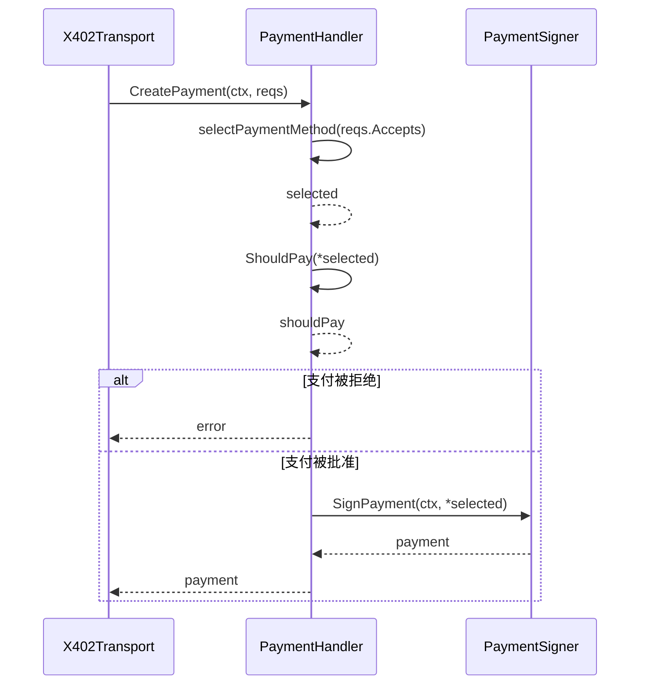
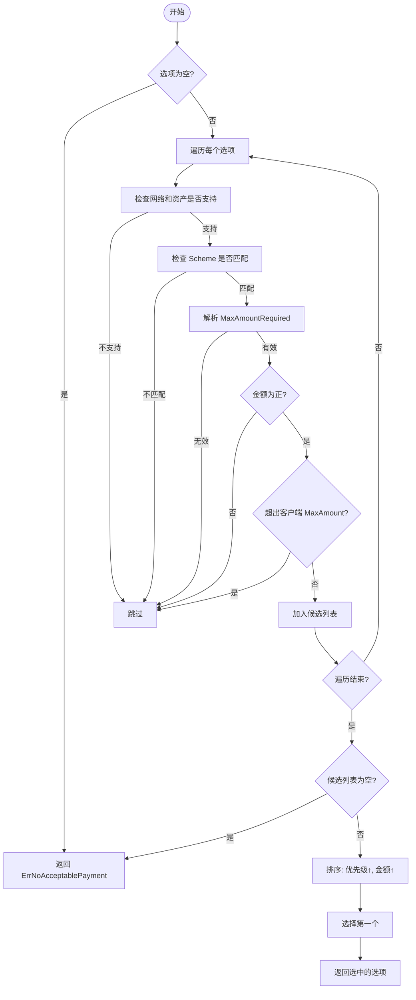
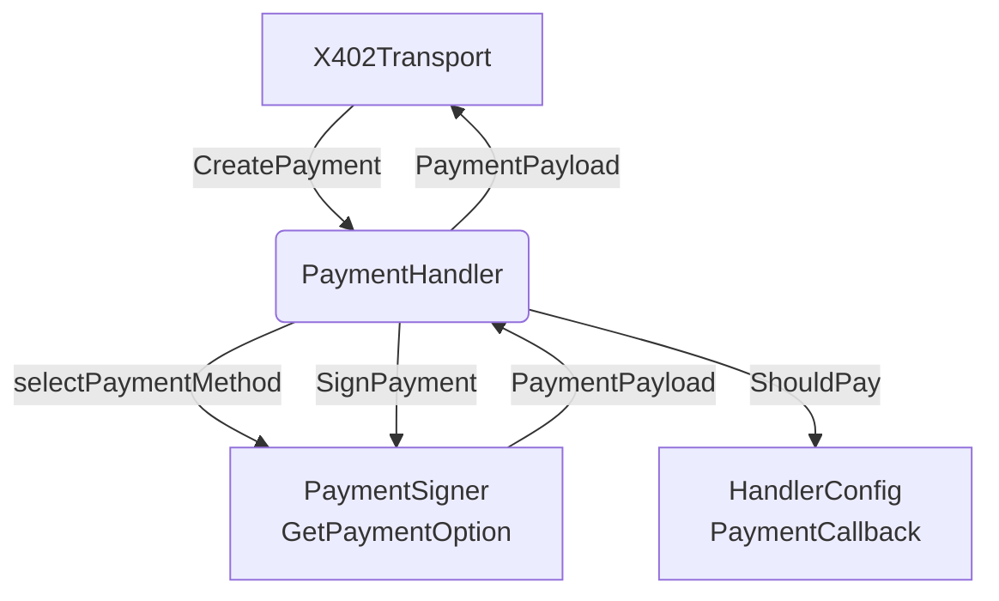

# 支付处理器

<cite>
**Referenced Files in This Document**   
- [server/handler.go](file://server/handler.go)
- [signer.go](file://signer.go)
- [transport.go](file://transport.go)
- [types.go](file://types.go)
- [server/types.go](file://server/types.go)
</cite>

## 目录
1. [引言](#引言)
2. [核心职责与实现](#核心职责与实现)
3. [支付决策与签名协调](#支付决策与签名协调)
4. [择优算法分析](#择优算法分析)
5. [支付策略控制](#支付策略控制)
6. [工厂函数与配置机制](#工厂函数与配置机制)
7. [组件协调流程](#组件协调流程)
8. [错误处理机制](#错误处理机制)

## 引言
`PaymentHandler` 是 x402 支付协议中的核心组件，负责协调客户端的支付决策与签名流程。它作为 `X402Transport` 与 `PaymentSigner` 之间的协调者，实现了从支付需求到签名凭证的完整转换过程。本文档将深入分析其职责、实现细节及与其他组件的交互机制。

## 核心职责与实现
`PaymentHandler` 的主要职责是根据服务器返回的支付要求，选择合适的支付方式，执行支付策略检查，并最终生成签名的支付凭证。其核心实现围绕 `CreatePayment` 方法展开，该方法协调了支付方法选择、策略验证和签名生成三个关键步骤。

**Section sources**
- [server/handler.go](file://server/handler.go#L10-L13)
- [server/handler.go](file://server/handler.go#L58-L82)

## 支付决策与签名协调
`CreatePayment` 方法是 `PaymentHandler` 的核心入口，它协调了整个支付流程：

1.  **支付方法选择**：调用 `selectPaymentMethod` 方法，从服务器提供的多个支付选项中选择最优方案。
2.  **支付策略验证**：调用 `ShouldPay` 方法，根据配置的策略（如 `PaymentCallback`）决定是否执行支付。
3.  **签名凭证生成**：在通过策略验证后，调用注入的 `PaymentSigner` 的 `SignPayment` 方法，生成最终的 `PaymentPayload`。

此方法通过严格的顺序执行，确保了支付流程的安全性和可控性。

**Diagram sources**
- [server/handler.go](file://server/handler.go#L58-L82)
- [signer.go](file://signer.go#L25-L25)

**Section sources**
- [server/handler.go](file://server/handler.go#L58-L82)

## 择优算法分析
`selectPaymentMethod` 方法实现了一套复杂的择优算法，用于从多个支付选项中筛选出最佳方案。其筛选逻辑遵循以下优先级：

1.  **网络与资产匹配**：首先检查 `PaymentSigner` 是否支持该支付选项的网络和资产。
2.  **方案匹配**：验证支付选项的 `Scheme` 是否与要求一致。
3.  **金额验证**：
    *   确保 `MaxAmountRequired` 是有效的正数。
    *   检查所需金额是否超出客户端为此选项配置的 `MaxAmount` 上限。
4.  **优先级排序**：将所有符合条件的选项按 `priority` 字段升序排列（数值越小，优先级越高）。
5.  **金额排序**：在优先级相同的情况下，按所需金额升序排列，选择最便宜的选项。

该算法确保了在满足所有技术要求的前提下，优先选择客户端配置的高优先级且成本最低的支付方式。

**Diagram sources**
- [server/handler.go](file://server/handler.go#L85-L152)
- [signer.go](file://signer.go#L37-L37)

**Section sources**
- [server/handler.go](file://server/handler.go#L85-L152)

## 支付策略控制
`ShouldPay` 方法通过 `PaymentCallback` 实现了灵活的支付策略控制。其工作流程如下：

1.  **金额解析与验证**：将 `MaxAmountRequired` 字符串解析为 `*big.Int`，并验证其为正数。
2.  **回调执行**：如果 `HandlerConfig` 中配置了 `PaymentCallback` 函数，则调用此回调，传入解析后的金额和资源标识符。
3.  **默认策略**：若未配置回调，则默认返回 `true`，表示批准支付。

这种设计允许客户端在运行时动态决定是否支付，例如根据金额大小、资源类型或用户偏好进行决策。

**Section sources**
- [server/handler.go](file://server/handler.go#L37-L55)

## 工厂函数与配置机制
`NewPaymentHandler` 是一个工厂函数，用于创建 `PaymentHandler` 实例。它接收一个 `PaymentSigner` 和一个 `HandlerConfig` 配置对象。

`HandlerConfig` 结构体的核心是 `PaymentCallback` 字段，其使用场景如下：
*   **策略注入**：允许外部代码注入自定义的支付决策逻辑。
*   **动态控制**：在 `ShouldPay` 方法中被调用，实现运行时的支付策略控制。
*   **可选配置**：如果未提供 `config`，则使用默认配置（`PaymentCallback` 为 `nil`），此时支付将被无条件批准。

**Section sources**
- [server/handler.go](file://server/handler.go#L21-L34)

## 组件协调流程
`PaymentHandler` 作为 `X402Transport` 与 `PaymentSigner` 之间的协调者，完成从支付需求到签名凭证的转换：

1.  **接收需求**：`X402Transport` 在收到服务器的 402 错误后，调用 `handler.CreatePayment`，传入 `PaymentRequirementsResponse`。
2.  **决策与验证**：`PaymentHandler` 执行 `selectPaymentMethod` 和 `ShouldPay` 完成决策和验证。
3.  **请求签名**：调用 `PaymentSigner.SignPayment`，传入选中的 `PaymentRequirement`。
4.  **返回凭证**：将 `PaymentSigner` 返回的 `PaymentPayload` 传回给 `X402Transport`，由其注入到后续请求中。

**Diagram sources**
- [transport.go](file://transport.go#L36-L36)
- [transport.go](file://transport.go#L213-L309)
- [server/handler.go](file://server/handler.go#L58-L82)
- [signer.go](file://signer.go#L25-L25)

**Section sources**
- [transport.go](file://transport.go#L213-L309)

## 错误处理机制
`PaymentHandler` 实现了完善的错误处理机制：

*   **无可用支付方式**：当 `selectPaymentMethod` 无法找到任何符合条件的支付选项时，返回 `ErrNoAcceptablePayment` 错误。
*   **支付被策略拒绝**：当 `ShouldPay` 方法返回 `false` 时，`CreatePayment` 会返回 "payment declined by policy" 错误。
*   **签名失败**：如果 `PaymentSigner.SignPayment` 调用失败，错误会被包装并返回。
*   **金额解析失败**：在 `ShouldPay` 和 `selectPaymentMethod` 中，对无效或非正数的金额会进行验证并返回相应错误。

这些机制确保了支付流程的健壮性，能够清晰地向调用者反馈失败原因。

**Section sources**
- [server/handler.go](file://server/handler.go#L58-L82)
- [server/handler.go](file://server/handler.go#L85-L152)
- [server/handler.go](file://server/handler.go#L37-L55)