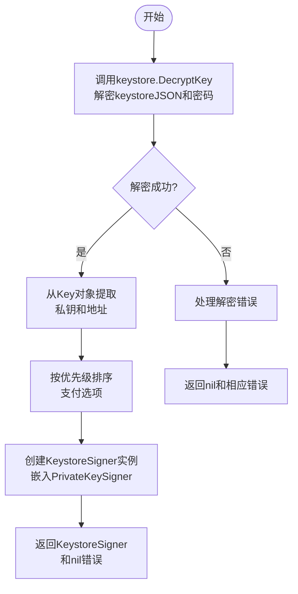
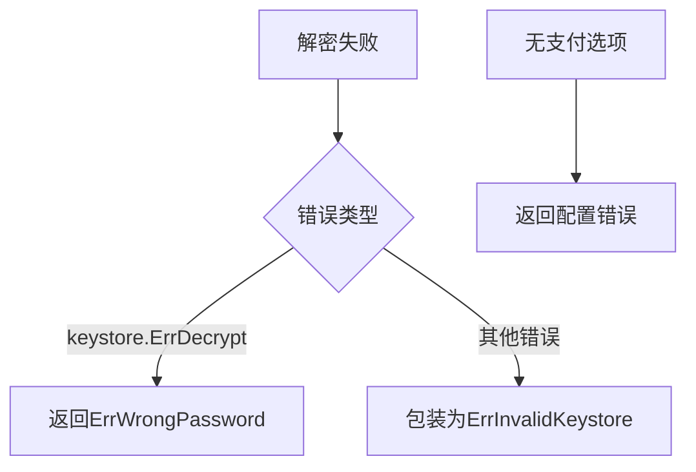
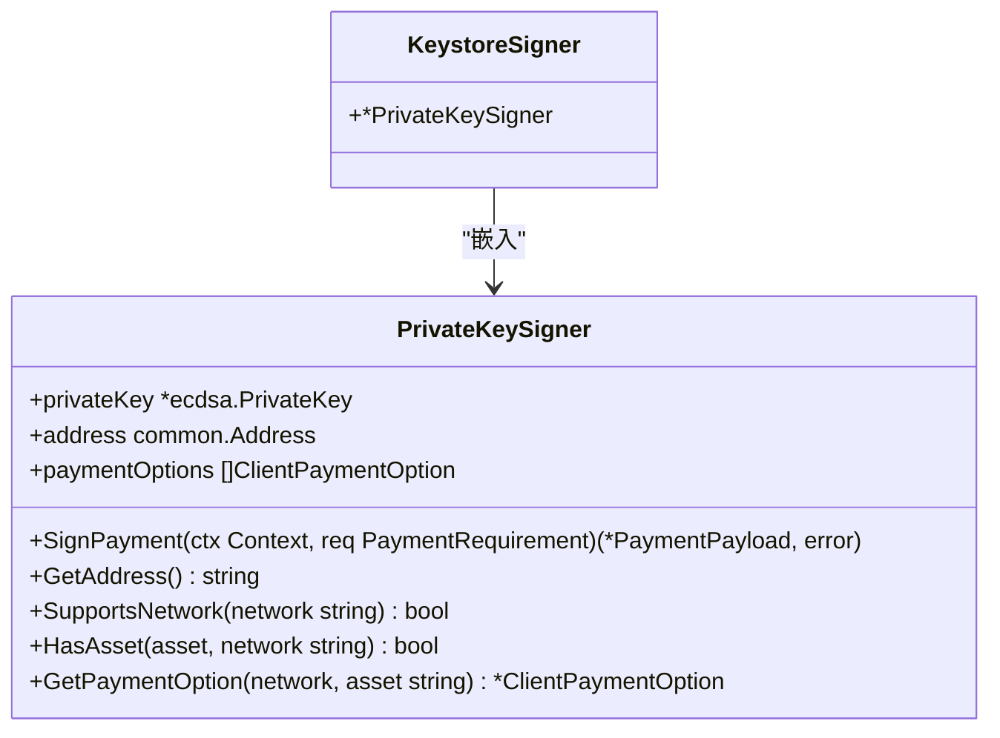

# Keystore签名器

<cite>
**Referenced Files in This Document**   
- [signer.go](file://signer.go)
- [errors.go](file://errors.go)
</cite>

## 目录
1. [简介](#简介)
2. [核心组件](#核心组件)
3. [KeystoreSigner工作原理](#keystoresigner工作原理)
4. [错误处理机制](#错误处理机制)
5. [签名功能复用策略](#签名功能复用策略)
6. [使用示例](#使用示例)
7. [安全与便利性平衡](#安全与便利性平衡)

## 简介
KeystoreSigner是用于从加密的JSON密钥文件中创建签名器的组件，它结合了go-ethereum的keystore包来解密密钥文件，并通过嵌入PrivateKeySigner实现签名功能的复用。该组件在保障私钥安全存储的同时，提供了便捷的访问方式，适用于需要平衡安全性和使用便利性的场景。

## 核心组件

KeystoreSigner的核心组件包括`NewKeystoreSigner`函数、`KeystoreSigner`结构体以及其嵌入的`PrivateKeySigner`。这些组件共同实现了从加密keystore文件中解密并提取私钥和地址的功能。

**Section sources**
- [signer.go](file://signer.go#L300-L330)

## KeystoreSigner工作原理

`NewKeystoreSigner`函数通过调用go-ethereum的`keystore.DecryptKey`方法来解密JSON格式的加密密钥文件。该函数接收keystore的JSON字节流和密码作为参数，成功解密后会从返回的`Key`对象中提取私钥和地址信息。



**Diagram sources**
- [signer.go](file://signer.go#L305-L330)

**Section sources**
- [signer.go](file://signer.go#L305-L330)

## 错误处理机制

当解密失败时，KeystoreSigner具有精细的错误处理机制。如果错误类型为`keystore.ErrDecrypt`，则返回`ErrWrongPassword`错误；对于其他解密错误，则包装为`ErrInvalidKeystore`错误返回。此外，还会验证是否配置了至少一个支付选项，否则返回相应错误。



**Diagram sources**
- [signer.go](file://signer.go#L305-L330)
- [errors.go](file://errors.go#L15-L18)

**Section sources**
- [signer.go](file://signer.go#L305-L330)
- [errors.go](file://errors.go#L15-L18)

## 签名功能复用策略

KeystoreSigner通过结构体嵌入的方式复用PrivateKeySigner的签名功能。KeystoreSigner结构体包含一个指向PrivateKeySigner的指针，从而继承了PrivateKeySigner的所有方法，包括`SignPayment`、`GetAddress`等。这种设计实现了代码复用，避免了功能重复实现。



**Diagram sources**
- [signer.go](file://signer.go#L300-L302)
- [signer.go](file://signer.go#L41-L45)

**Section sources**
- [signer.go](file://signer.go#L300-L302)
- [signer.go](file://signer.go#L41-L45)

## 使用示例

以下代码示例展示了如何使用加密的keystore文件和密码创建KeystoreSigner实例：

```go
// 读取keystore文件内容
keystoreJSON, err := ioutil.ReadFile("path/to/keystore.json")
if err != nil {
    log.Fatal(err)
}

// 使用keystore文件和密码创建签名器
signer, err := NewKeystoreSigner(keystoreJSON, "your-password", paymentOptions...)
if err != nil {
    log.Fatal(err)
}

// 使用签名器进行支付签名
paymentPayload, err := signer.SignPayment(ctx, paymentRequirement)
if err != nil {
    log.Fatal(err)
}
```

**Section sources**
- [signer.go](file://signer.go#L305-L330)

## 安全与便利性平衡

KeystoreSigner在安全性和便利性之间取得了良好平衡。通过加密存储私钥，即使keystore文件被泄露，攻击者也需要密码才能解密，这提供了第一层安全保障。同时，用户只需记住密码即可访问账户，避免了直接管理私钥的复杂性。这种设计特别适用于需要频繁访问钱包但又要求较高安全性的应用场景。

**Section sources**
- [signer.go](file://signer.go#L305-L330)
- [errors.go](file://errors.go#L15-L18)