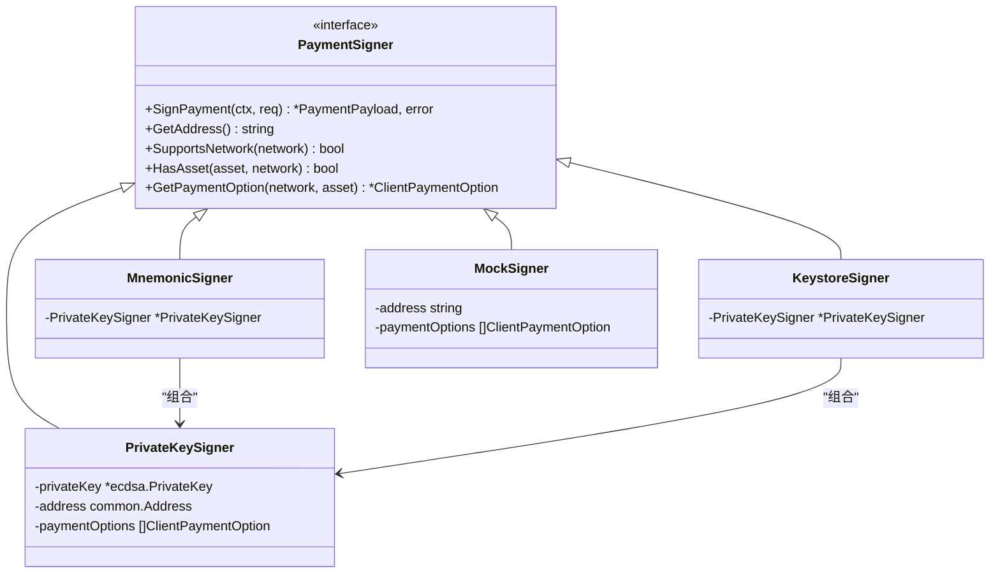
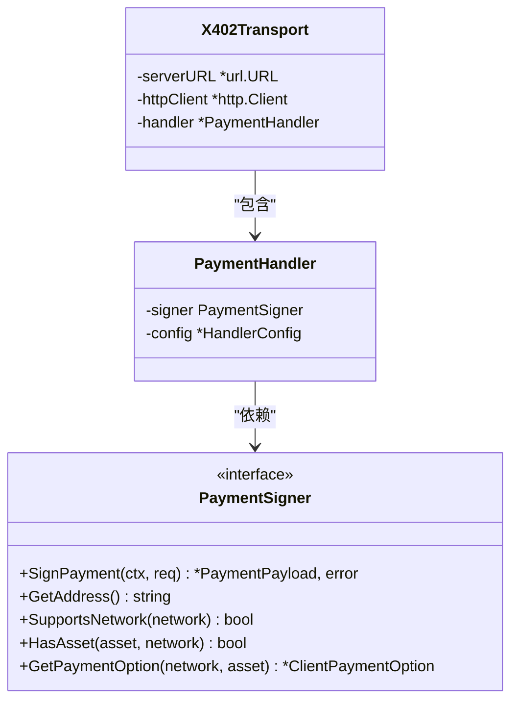

# PaymentSigner接口

<cite>
**Referenced Files in This Document**   
- [signer.go](file://signer.go)
- [transport.go](file://transport.go)
- [types.go](file://types.go)
- [handler.go](file://handler.go)
</cite>

## Table of Contents
1. [接口抽象设计与核心作用](#接口抽象设计与核心作用)
2. [方法契约与语义分析](#方法契约与语义分析)
3. [统一抽象与后端屏蔽](#统一抽象与后端屏蔽)
4. [依赖关系与策略模式](#依赖关系与策略模式)
5. [代码解耦与可扩展性](#代码解耦与可扩展性)
6. [新签名器类型实现指导](#新签名器类型实现指导)

## 接口抽象设计与核心作用

`PaymentSigner`接口是项目支付签名功能的核心抽象，定义了所有签名器必须实现的统一契约。该接口通过抽象化签名操作，将上层业务逻辑与底层密钥管理细节解耦，使得系统能够灵活支持多种密钥管理后端（如私钥、助记词、keystore文件等）而无需修改调用方代码。

该接口在项目架构中扮演着关键角色，作为`X402Transport`和`PaymentHandler`等上层组件与具体签名实现之间的桥梁。通过依赖于`PaymentSigner`接口而非具体实现，系统实现了依赖倒置原则，增强了代码的可测试性和可维护性。

**Section sources**
- [signer.go](file://signer.go#L23-L38)

## 方法契约与语义分析

### SignPayment方法

`SignPayment`方法负责对给定的支付需求进行签名。该方法接收一个`PaymentRequirement`对象和上下文，返回一个包含签名数据的`PaymentPayload`对象或错误。其主要职责是使用EIP-712标准创建结构化数据签名，确保支付授权的安全性和不可否认性。

该方法的实现需要处理时间窗口、nonce生成、金额验证等关键安全要素，并确保签名符合以太坊标准（V值调整）。

**Section sources**
- [signer.go](file://signer.go#L25-L25)
- [signer.go](file://signer.go#L112-L221)

### GetAddress方法

`GetAddress`方法返回签名器关联的以太坊地址。该地址用于标识支付的发起方（from字段），在支付授权和后续的交易验证中起着关键作用。

该方法的实现通常基于底层私钥或助记词推导出的公钥生成地址。

**Section sources**
- [signer.go](file://signer.go#L28-L28)
- [signer.go](file://signer.go#L80-L82)

### SupportsNetwork方法

`SupportsNetwork`方法检查签名器是否支持指定的网络。该方法通过检查配置的支付选项列表来确定支持性，允许客户端声明其愿意在哪些网络上进行支付。

该方法为支付选择逻辑提供了基础支持，确保只在支持的网络上尝试支付。

**Section sources**
- [signer.go](file://signer.go#L31-L31)
- [signer.go](file://signer.go#L84-L91)

### HasAsset方法

`HasAsset`方法检查签名器是否在指定网络上拥有给定资产。该方法不仅检查网络和资产匹配，还要求支付方案为"exact"，提供了更精确的资产支持判断。

该方法可用于预检查，避免在不支持的资产上进行无效的支付尝试。

**Section sources**
- [signer.go](file://signer.go#L34-L34)
- [signer.go](file://signer.go#L93-L100)

### GetPaymentOption方法

`GetPaymentOption`方法返回与指定网络和资产匹配的客户端支付选项。该方法返回一个`ClientPaymentOption`对象的副本，包含链ID、优先级等内部配置信息。

该方法是连接通用支付需求与具体实现配置的关键，为签名过程提供必要的上下文信息。

**Section sources**
- [signer.go](file://signer.go#L37-L37)
- [signer.go](file://signer.go#L102-L110)

## 统一抽象与后端屏蔽

`PaymentSigner`接口通过统一的抽象有效地屏蔽了不同密钥管理后端的差异。系统实现了多种具体签名器，包括`PrivateKeySigner`、`MnemonicSigner`、`KeystoreSigner`和`MockSigner`，它们都实现了相同的接口但使用不同的密钥管理机制。

这种设计模式允许上层组件（如`X402Transport`）以完全相同的方式与任何类型的签名器交互，无需关心底层是使用原始私钥、BIP-39助记词还是加密的keystore文件。接口的统一契约确保了行为的一致性，而具体的密钥派生和管理逻辑被封装在各自的实现中。

**Diagram sources**
- [signer.go](file://signer.go#L23-L38)
- [signer.go](file://signer.go#L41-L45)
- [signer.go](file://signer.go#L250-L252)
- [signer.go](file://signer.go#L300-L302)
- [signer.go](file://signer.go#L333-L336)

**Section sources**
- [signer.go](file://signer.go#L41-L45)
- [signer.go](file://signer.go#L250-L252)
- [signer.go](file://signer.go#L300-L302)
- [signer.go](file://signer.go#L333-L336)

## 依赖关系与策略模式

`PaymentSigner`接口的实现体现了经典的策略模式。`PaymentHandler`结构体包含一个`PaymentSigner`接口类型的字段，使其能够根据运行时配置使用不同的签名策略。

**Diagram sources**
- [transport.go](file://transport.go#L33-L63)
- [handler.go](file://handler.go#L10-L13)
- [signer.go](file://signer.go#L23-L38)

**Section sources**
- [transport.go](file://transport.go#L33-L63)
- [handler.go](file://handler.go#L10-L13)

## 代码解耦与可扩展性

通过`PaymentSigner`接口，系统实现了高度的代码解耦。`X402Transport`的`SendRequest`方法在遇到402支付要求时，通过`PaymentHandler`委托签名操作，而`PaymentHandler`又通过`PaymentSigner`接口调用具体的签名实现。

这种分层依赖关系确保了各组件的职责单一且松耦合。添加新的签名器类型不会影响现有代码，只需实现`PaymentSigner`接口并正确配置即可。同时，测试时可以轻松使用`MockSigner`进行单元测试，无需依赖真实的密钥材料。

该设计还支持运行时策略选择，客户端可以根据安全需求、用户体验或环境限制选择最适合的签名器实现。

## 新签名器类型实现指导

实现新的签名器类型（如硬件钱包）应遵循以下指导原则：

1. 创建一个新结构体，实现`PaymentSigner`接口的所有方法
2. 在`SignPayment`方法中，使用硬件钱包的API进行安全签名
3. 在`GetAddress`方法中，从硬件钱包获取并返回地址
4. 在`SupportsNetwork`、`HasAsset`和`GetPaymentOption`方法中，基于硬件钱包的配置和能力返回相应信息
5. 提供一个工厂函数（如`NewHardwareWalletSigner`）来创建和初始化签名器实例

新实现应保持与现有签名器相同的行为契约，确保无缝集成到现有系统中。特别需要注意的是，`SignPayment`方法必须严格遵循EIP-712签名标准，并正确处理时间窗口和nonce等安全要素。

**Section sources**
- [signer.go](file://signer.go#L23-L38)
- [handler.go](file://handler.go#L10-L13)