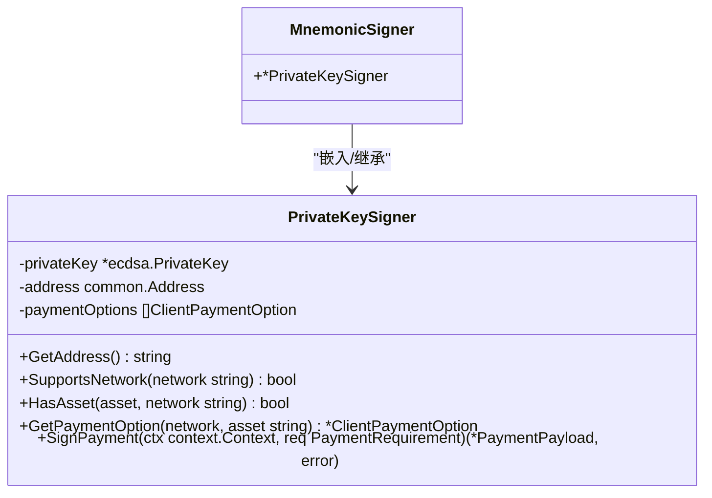
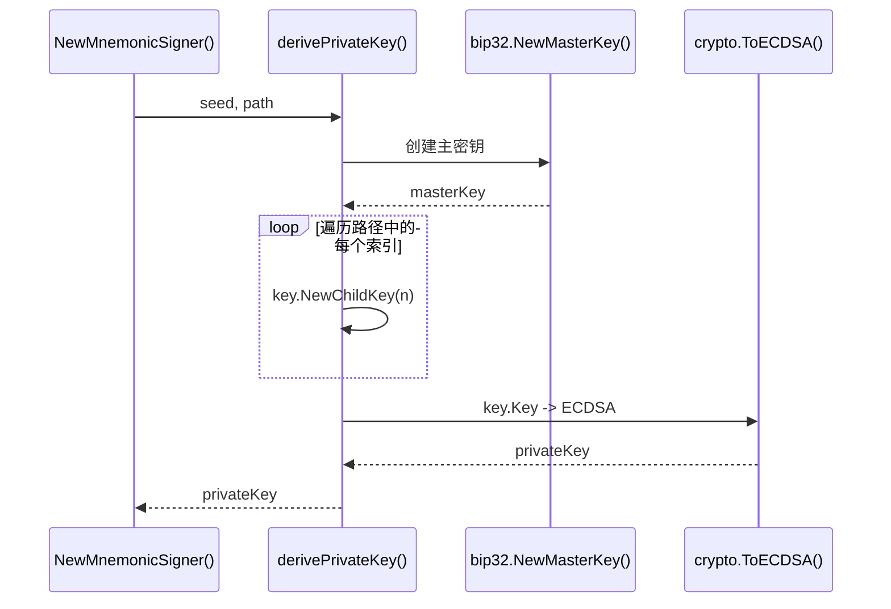
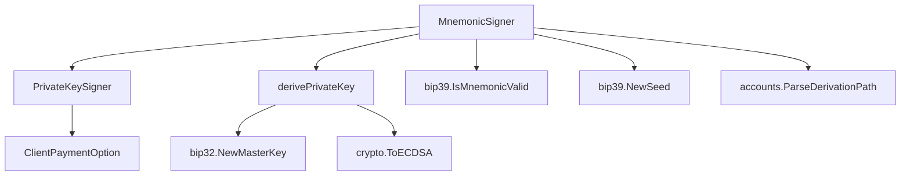

# 助记词签名器

<cite>
**本文档引用的文件**
- [signer.go](file://signer.go)
- [client_options.go](file://client_options.go)
</cite>

## 目录
1. [简介](#简介)
2. [核心组件](#核心组件)
3. [架构概述](#架构概述)
4. [详细组件分析](#详细组件分析)
5. [依赖分析](#依赖分析)
6. [性能考虑](#性能考虑)
7. [故障排除指南](#故障排除指南)
8. [结论](#结论)

## 简介
`MnemonicSigner` 是一种基于 BIP-39 助记词和 BIP-32 分层确定性（HD）路径派生私钥的签名器实现。它为用户提供了一种更安全、更友好的方式来管理加密货币钱包，相比直接使用原始私钥，用户只需记忆一组易于记录和备份的助记词即可。本技术文档将深入分析其设计与实现，详细解释 `NewMnemonicSigner` 函数如何验证助记词、解析派生路径，并通过 `derivePrivateKey` 辅助函数完成密钥派生。同时，文档将阐述其如何继承 `PrivateKeySigner` 以复用签名逻辑，并强调其在用户友好性和安全性方面的优势。

## 核心组件
`MnemonicSigner` 的核心在于其能够将人类可读的助记词安全地转换为可用于数字签名的加密私钥。该过程严格遵循 BIP-39 和 BIP-32 标准，确保了与主流加密货币钱包的兼容性。其主要功能由 `NewMnemonicSigner` 构造函数和 `derivePrivateKey` 辅助函数实现，通过组合外部加密库（如 `go-bip39` 和 `go-ethereum`）来完成复杂的密码学操作。

**Section sources**
- [signer.go](file://signer.go#L250-L297)

## 架构概述
`MnemonicSigner` 采用组合模式，通过嵌入 `PrivateKeySigner` 结构体来复用其签名逻辑，实现了代码的高效复用和职责分离。整个密钥派生和初始化流程是一个线性的、可验证的过程，从输入助记词开始，经过验证、种子生成、路径解析和密钥派生，最终构建出一个功能完整的签名器实例。

```mermaid
graph TD
A[输入助记词<br/>和派生路径] --> B{验证助记词<br/>有效性}
B --> |无效| C[返回错误<br/>ErrInvalidMnemonic]
B --> |有效| D[生成种子<br/>(bip39.NewSeed)]
D --> E[解析派生路径<br/>(accounts.ParseDerivationPath)]
E --> F[派生私钥<br/>(derivePrivateKey)]
F --> G{派生成功?}
G --> |失败| H[返回错误]
G --> |成功| I[创建<br/>PrivateKeySigner]
I --> J[构建并返回<br/>MnemonicSigner]
```

**Diagram sources**
- [signer.go](file://signer.go#L255-L297)
- [signer.go](file://signer.go#L224-L247)

## 详细组件分析

### MnemonicSigner 结构与 NewMnemonicSigner 函数分析
`MnemonicSigner` 本身是一个非常简洁的结构体，它不包含任何自己的字段，而是直接嵌入了一个指向 `PrivateKeySigner` 的指针。这种设计模式使得 `MnemonicSigner` 自动继承了 `PrivateKeySigner` 的所有方法（如 `SignPayment`, `GetAddress` 等），从而无需重新实现复杂的签名逻辑。

`NewMnemonicSigner` 函数是创建 `MnemonicSigner` 实例的入口点，其执行流程如下：
1.  **助记词验证**：首先调用 `bip39.IsMnemonicValid` 函数检查输入的助记词是否符合 BIP-39 标准（例如，是否为有效的单词列表，校验和是否正确）。
2.  **派生路径处理**：如果用户未提供自定义的派生路径，则使用以太坊默认的路径 `m/44'/60'/0'/0/0`。随后，使用 `accounts.ParseDerivationPath` 将字符串路径解析为程序可操作的 `DerivationPath` 对象。
3.  **种子生成**：使用 `bip39.NewSeed` 函数将有效的助记词（和可选的密码）转换为一个加密安全的种子（seed）。
4.  **私钥派生**：将生成的种子和解析后的路径传递给 `derivePrivateKey` 函数，执行 BIP-32 HD 钱包的派生算法，最终得到一个 `ecdsa.PrivateKey`。
5.  **实例构建**：使用派生出的私钥、计算出的地址以及用户提供的支付选项，创建一个 `PrivateKeySigner` 实例，并将其作为嵌入字段，最终返回一个完整的 `MnemonicSigner`。



**Diagram sources**
- [signer.go](file://signer.go#L250-L252)
- [signer.go](file://signer.go#L41-L45)

#### 密钥派生流程分析
`derivePrivateKey` 函数是 BIP-32 HD 钱包派生算法的核心实现。它接收一个种子和一个派生路径，然后按顺序执行子密钥派生。



**Diagram sources**
- [signer.go](file://signer.go#L224-L247)

**Section sources**
- [signer.go](file://signer.go#L255-L297)
- [signer.go](file://signer.go#L224-L247)

### 概念概述
`MnemonicSigner` 的设计体现了现代加密钱包的安全理念。通过使用助记词，用户可以避免直接接触和存储高风险的原始私钥，极大地降低了因私钥泄露而导致资产损失的风险。同时，HD 钱包的特性允许从同一个助记词派生出多个不同的地址，方便用户管理多个账户。然而，这也意味着助记词本身成为了最高权限的“万能钥匙”，一旦泄露，所有派生出的账户都将面临风险，因此安全地保管助记词至关重要。

## 依赖分析
`MnemonicSigner` 的实现依赖于多个关键的外部库和内部组件，形成了一个清晰的依赖链。



**Diagram sources**
- [signer.go](file://signer.go)
- [client_options.go](file://client_options.go)

**Section sources**
- [signer.go](file://signer.go)
- [client_options.go](file://client_options.go)

## 性能考虑
`MnemonicSigner` 的性能主要消耗在初始化阶段，即调用 `NewMnemonicSigner` 时。该过程涉及多次密码学运算，包括哈希计算（生成种子）和椭圆曲线运算（派生子密钥）。这些操作虽然计算量相对较大，但通常只在应用启动或用户登录时执行一次。一旦 `MnemonicSigner` 实例创建完成，其后续的签名操作（`SignPayment`）性能与 `PrivateKeySigner` 完全相同，因为它们复用了相同的底层逻辑。因此，该设计在保证安全性和用户友好性的同时，对运行时性能的影响是可接受的。

## 故障排除指南
在使用 `MnemonicSigner` 时，可能会遇到以下常见问题：
- **`ErrInvalidMnemonic` 错误**：这表示提供的助记词无效。请检查助记词的拼写、单词顺序以及是否包含正确的单词数量（通常是12或24个）。
- **“invalid derivation path” 错误**：这表示提供的派生路径格式不正确。请确保路径遵循 `m/44'/60'/0'/0/0` 这样的标准格式，其中 `x'` 表示硬派生。
- **“failed to derive private key” 错误**：这通常发生在派生路径过长或包含无效索引时。应检查路径的每个部分是否在有效范围内。

**Section sources**
- [signer.go](file://signer.go#L255-L297)

## 结论
`MnemonicSigner` 是一个设计精良的组件，它成功地将复杂的密码学标准（BIP-39/BIP-32）封装在一个简单易用的接口背后。通过继承 `PrivateKeySigner`，它实现了代码的高效复用，避免了逻辑重复。其核心优势在于提升了用户体验和安全性，让用户可以通过记忆一组助记词来安全地管理其数字资产。开发者在使用时应充分理解其工作原理，并始终强调助记词保密的重要性，以确保整个系统的安全。