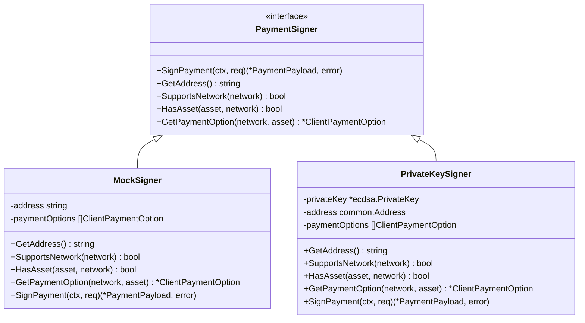
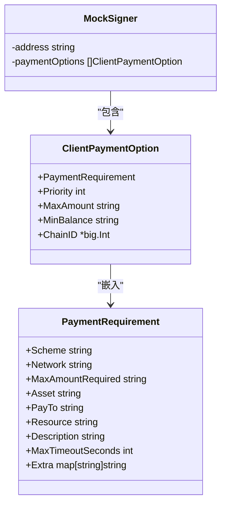
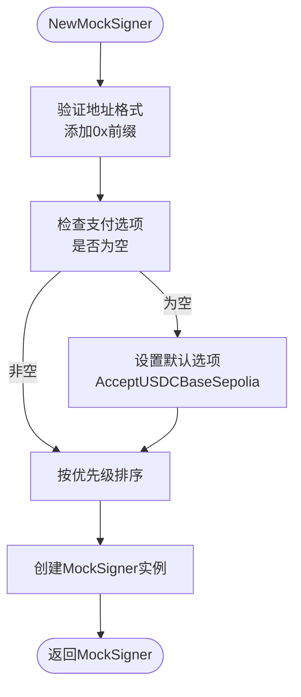
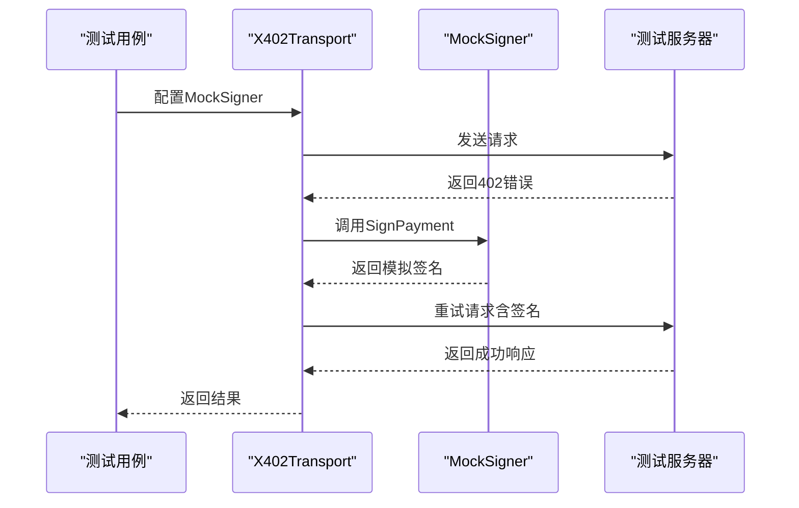

# 模拟签名器

<cite>
**Referenced Files in This Document**  
- [signer.go](file://signer.go)
- [transport_test.go](file://transport_test.go)
- [test_utils.go](file://test_utils.go)
- [client_options.go](file://client_options.go)
</cite>

## 目录
1. [简介](#简介)
2. [核心设计与实现](#核心设计与实现)
3. [MockSigner 结构分析](#mocksigner-结构分析)
4. [NewMockSigner 函数详解](#newmocksigner-函数详解)
5. [测试环境中的应用](#测试环境中的应用)
6. [测试用例分析](#测试用例分析)
7. [结论](#结论)

## 简介
`MockSigner` 是专为测试环境设计的模拟签名器实现，用于替代真实签名器进行支付流程的隔离测试。它通过生成确定性的假签名和nonce，同时保留真实签名器的时间窗口逻辑，确保测试的真实性与可重复性。该组件在单元测试和集成测试中发挥关键作用，显著加速开发和验证过程。

## 核心设计与实现
`MockSigner` 的设计目标是提供一个轻量级、可预测的签名器实现，用于在测试环境中验证支付逻辑。它实现了 `PaymentSigner` 接口，确保与真实签名器具有相同的调用契约。



**Diagram sources**  
- [signer.go](file://signer.go#L23-L38)
- [signer.go](file://signer.go#L333-L358)

**Section sources**  
- [signer.go](file://signer.go#L23-L358)

## MockSigner 结构分析
`MockSigner` 结构体包含两个核心字段：`address` 和 `paymentOptions`，分别用于存储模拟钱包地址和支付选项配置。



**Diagram sources**  
- [signer.go](file://signer.go#L333-L336)
- [types.go](file://types.go#L93-L101)

**Section sources**  
- [signer.go](file://signer.go#L333-L336)

## NewMockSigner 函数详解
`NewMockSigner` 函数负责创建和初始化 `MockSigner` 实例，为测试提供默认配置。



**Diagram sources**  
- [signer.go](file://signer.go#L339-L358)
- [client_options.go](file://client_options.go#L24-L38)

**Section sources**  
- [signer.go](file://signer.go#L339-L358)

### 默认配置机制
当调用者未提供支付选项时，`NewMockSigner` 会自动配置为支持 Base Sepolia 网络上的 USDC 支付，这是最常见的测试场景。

```go
if len(options) == 0 {
    // 默认为测试配置 Base Sepolia USDC
    options = []ClientPaymentOption{AcceptUSDCBaseSepolia()}
}
```

此设计简化了测试代码的编写，开发者无需每次都手动配置常见的测试参数。

### 优先级排序
所有支付选项都会按照优先级字段进行排序，确保高优先级的选项在匹配时被优先考虑。

```go
sort.Slice(options, func(i, j int) bool {
    return options[i].Priority < options[j].Priority
})
```

## 测试环境中的应用
`MockSigner` 在测试中扮演着关键角色，通过 `transport_test.go` 中的测试用例展示了其在不同场景下的应用。



**Diagram sources**  
- [transport_test.go](file://transport_test.go#L66-L156)
- [signer.go](file://signer.go#L359-L388)

**Section sources**  
- [transport_test.go](file://transport_test.go#L66-L156)

## 测试用例分析
通过分析 `transport_test.go` 中的测试用例，可以深入了解 `MockSigner` 的实际应用。

### 基本支付流程测试
`TestX402Transport_Basic` 测试用例验证了基本的支付流程：

1. 首次请求返回 402 错误，包含支付要求
2. `MockSigner` 生成确定性签名
3. 重试请求包含支付信息
4. 服务器验证签名并返回成功响应

```go
signer := NewMockSigner("0xTestWallet", AcceptUSDCBaseSepolia())
```

### 支付回调测试
`TestX402Transport_PaymentCallback` 测试用例验证了支付回调机制：

```go
PaymentCallback: func(amount *big.Int, resource string) bool {
    callbackCalled = true
    assert.Equal(t, "10000", amount.String())
    return true // 批准支付
}
```

这展示了如何在测试中验证支付决策逻辑。

### 多请求并发测试
`TestX402Transport_MultipleRequests` 测试用例验证了 `MockSigner` 在并发环境下的行为：

```go
for i := 0; i < numRequests; i++ {
    go func(idx int) {
        resp, err := trans.SendRequest(ctx, request)
        // 验证响应
    }(i)
}
```

证明了 `MockSigner` 是线程安全的，适合在高并发测试场景中使用。

## 结论
`MockSigner` 作为专为测试环境设计的模拟实现，成功实现了以下目标：

1. **确定性行为**：生成可预测的假签名和nonce，确保测试的可重复性
2. **真实时间窗口**：保留了与真实签名器一致的时间窗口逻辑，确保测试的真实性
3. **简化测试配置**：通过默认配置机制，减少了测试代码的复杂性
4. **完整接口实现**：实现了 `PaymentSigner` 接口的所有方法，确保与生产代码的兼容性

通过在 `transport_test.go` 中的广泛应用，`MockSigner` 证明了其在加速开发和验证过程中的价值，是项目测试基础设施的重要组成部分。