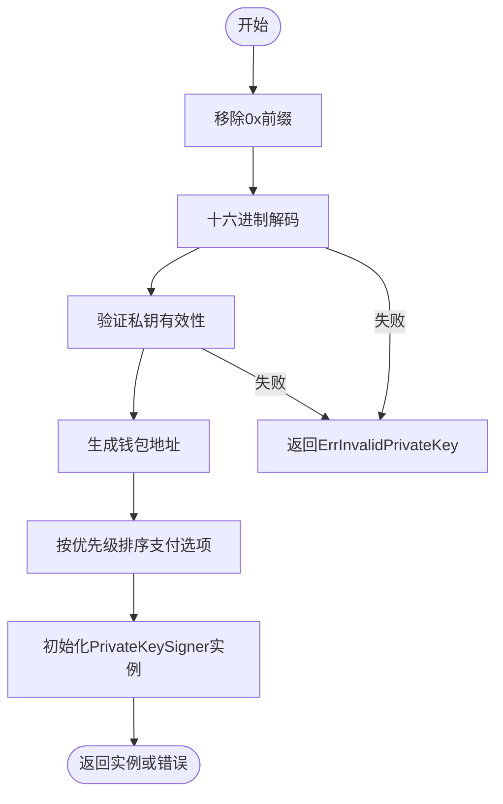
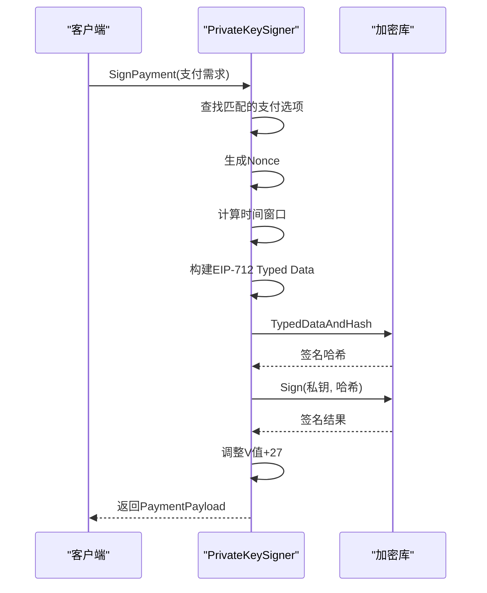
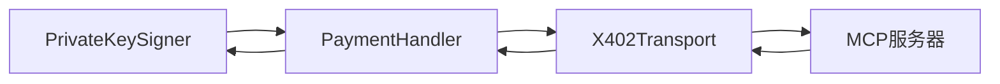

# 私钥签名器

<cite>
**本文档中引用的文件**  
- [signer.go](file://signer.go)
- [types.go](file://types.go)
- [handler.go](file://handler.go)
- [client_options.go](file://client_options.go)
- [errors.go](file://errors.go)
</cite>

## 目录
1. [简介](#简介)
2. [核心组件](#核心组件)
3. [PrivateKeySigner初始化机制](#privatekeysigner初始化机制)
4. [SignPayment方法实现细节](#signpayment方法实现细节)
5. [客户端使用示例](#客户端使用示例)
6. [安全风险与最佳实践](#安全风险与最佳实践)
7. [结论](#结论)

## 简介
PrivateKeySigner是x402支付协议中的核心签名组件，负责使用原始私钥对支付授权进行数字签名。该签名器实现了PaymentSigner接口，支持通过十六进制私钥字符串创建签名实例，并使用EIP-712标准的Typed Data结构进行签名。签名器通过配置的支付选项支持多网络、多资产的支付场景，确保了在不同区块链网络上的兼容性和灵活性。

## 核心组件

PrivateKeySigner的核心功能围绕三个主要字段展开：privateKey、address和paymentOptions。这些字段在NewPrivateKeySigner函数中被初始化，并在整个生命周期中保持不变。签名器通过实现PaymentSigner接口提供统一的支付签名服务，支持网络和资产的查询与验证。

**Section sources**
- [signer.go](file://signer.go#L41-L45)

## PrivateKeySigner初始化机制

### NewPrivateKeySigner函数分析
NewPrivateKeySigner函数是PrivateKeySigner的构造函数，负责从十六进制私钥字符串创建签名器实例。该函数首先移除私钥字符串可能包含的"0x"前缀，然后使用hex.DecodeString将其解码为字节序列。解码后的字节序列通过crypto.ToECDSA转换为ECDSA私钥对象。如果私钥格式无效，函数将返回ErrInvalidPrivateKey错误。

**Diagram sources**
- [signer.go](file://signer.go#L48-L78)

**Section sources**
- [signer.go](file://signer.go#L48-L78)

### 内部字段初始化过程
PrivateKeySigner的三个内部字段在构造函数中被初始化：

1. **privateKey**: 通过crypto.ToECDSA从十六进制字符串转换而来，是ECDSA椭圆曲线加密算法的私钥对象，用于后续的数字签名操作。

2. **address**: 使用crypto.PubkeyToAddress从私钥的公钥部分生成以太坊地址。该地址是公开的，用于标识签名者的身份。

3. **paymentOptions**: 接收可变参数形式的ClientPaymentOption切片，这些选项定义了签名器支持的支付网络、资产类型、优先级等信息。选项按优先级排序，确保在多个可用选项中选择最优方案。

## SignPayment方法实现细节

### EIP-712 Typed Data结构构建
SignPayment方法首先查找与支付需求匹配的支付选项，以获取链ID。然后生成随机nonce，使用当前时间戳、资源标识和地址的哈希值确保唯一性。时间窗口的计算包括validAfter和validBefore两个时间戳，其中validAfter设置为当前时间减去30秒的时钟偏移缓冲，validBefore则根据请求的超时秒数确定，最小为60秒，最大为3600秒。

**Diagram sources**
- [signer.go](file://signer.go#L112-L221)

**Section sources**
- [signer.go](file://signer.go#L112-L221)

### 签名流程与V值调整
签名流程使用apitypes.TypedDataAndHash生成EIP-712标准的签名哈希，然后通过crypto.Sign使用原始私钥进行签名。签名结果是一个65字节的数组，其中最后一个字节（V值）需要调整为以太坊标准兼容的值。通过将V值增加27，确保签名符合以太坊的签名标准，这在区块链交易验证中至关重要。

## 客户端使用示例

在客户端中，PrivateKeySigner通常与PaymentHandler和X402Transport结合使用。首先通过NewPrivateKeySigner创建签名器实例，配置相应的支付选项。然后创建PaymentHandler处理支付逻辑，最后通过X402Transport与MCP服务器通信。示例代码展示了如何配置主网和测试网的不同支付选项，并处理支付回调。

**Diagram sources**
- [handler.go](file://handler.go#L21-L34)
- [transport.go](file://transport.go#L77-L114)

**Section sources**
- [examples/client/main.go](file://examples/client/main.go#L1-L178)

## 安全风险与最佳实践

### 私钥存储与保护
私钥的安全存储是PrivateKeySigner使用中的关键问题。直接在代码或配置文件中硬编码私钥存在重大安全风险。最佳实践包括使用环境变量、密钥管理服务或硬件安全模块（HSM）来保护私钥。此外，应限制私钥的访问权限，仅在必要时加载到内存中，并在使用后及时清除。

### 风险防范措施
1. **输入验证**: 始终验证私钥字符串的有效性，防止无效输入导致的安全漏洞。
2. **权限控制**: 限制签名器的使用权限，确保只有授权的组件可以访问。
3. **监控与日志**: 实现详细的日志记录和监控，及时发现异常签名行为。
4. **定期轮换**: 定期轮换私钥，减少长期使用同一私钥的风险。

## 结论
PrivateKeySigner通过NewPrivateKeySigner函数实现了从十六进制私钥字符串到签名器实例的安全转换，其内部字段的初始化过程确保了签名器的完整性和一致性。SignPayment方法遵循EIP-712标准，通过精确的nonce生成、时间窗口计算和V值调整，实现了符合以太坊标准的数字签名。在实际应用中，应严格遵循安全最佳实践，保护私钥安全，确保支付系统的整体安全性。