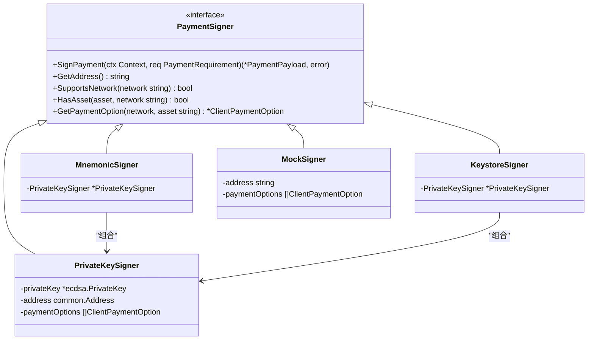
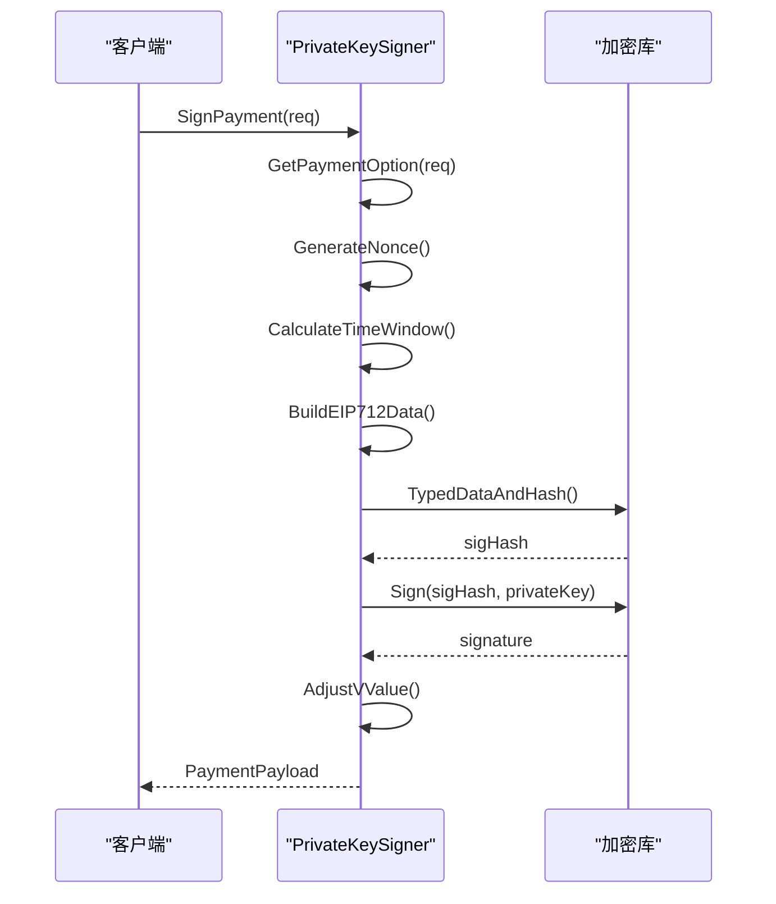
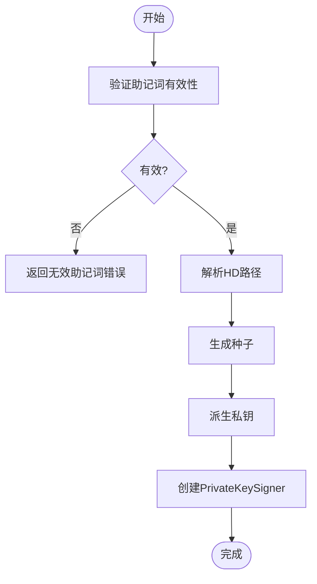
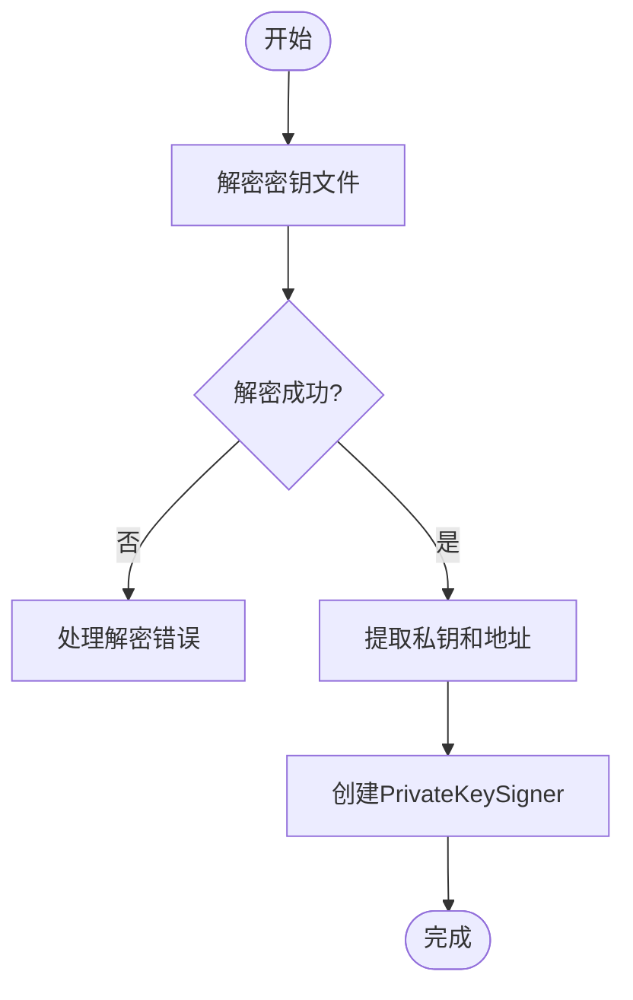
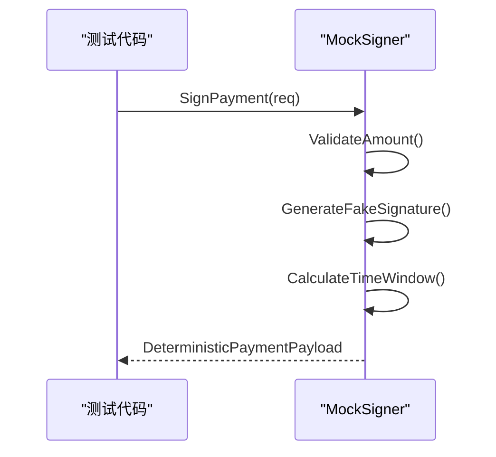

# 签名器

<cite>
**Referenced Files in This Document**   
- [signer.go](file://signer.go)
- [types.go](file://types.go)
- [signer_test.go](file://signer_test.go)
</cite>

## 目录
1. [简介](#简介)
2. [核心签名器类型](#核心签名器类型)
3. [PaymentSigner接口抽象](#paymentsigner接口抽象)
4. [PrivateKeySigner实现细节](#privatekeysigner实现细节)
5. [MnemonicSigner密钥派生](#mnemonicSigner密钥派生)
6. [KeystoreSigner加密解密](#keystoresigner加密解密)
7. [MockSigner测试应用](#mocksigner测试应用)
8. [安全考量与适用场景](#安全考量与适用场景)

## 简介
本文档全面介绍`signer.go`中实现的多种签名器类型及其安全机制。重点分析基于EIP-712标准的签名流程、不同密钥管理方案的实现方式以及统一的接口抽象设计。文档详细说明了各种签名器的创建、使用和安全特性，为开发者提供完整的参考指南。

## 核心签名器类型
系统实现了四种主要的签名器类型，每种类型针对不同的密钥管理和使用场景：

- **PrivateKeySigner**: 使用原始私钥进行签名，适用于简单的密钥管理场景
- **MnemonicSigner**: 基于BIP-39助记词和BIP-32 HD路径的密钥派生，提供分层确定性钱包功能
- **KeystoreSigner**: 使用加密的keystore文件进行签名，符合以太坊标准的密钥存储格式
- **MockSigner**: 用于测试环境的模拟签名器，生成可预测的假签名

这些签名器通过统一的`PaymentSigner`接口进行抽象，使得上层应用可以无缝切换不同的密钥管理方案。

**Section sources**
- [signer.go](file://signer.go#L23-L38)
- [signer.go](file://signer.go#L41-L45)
- [signer.go](file://signer.go#L250-L252)
- [signer.go](file://signer.go#L300-L302)
- [signer.go](file://signer.go#L333-L336)

## PaymentSigner接口抽象
`PaymentSigner`接口定义了所有签名器必须实现的核心功能，提供了统一的抽象层来支持不同的密钥管理方案：

**Diagram sources**
- [signer.go](file://signer.go#L23-L38)
- [signer.go](file://signer.go#L41-L45)
- [signer.go](file://signer.go#L250-L252)
- [signer.go](file://signer.go#L300-L302)
- [signer.go](file://signer.go#L333-L336)

该接口的关键方法包括：
- `SignPayment`: 对支付授权进行签名
- `GetAddress`: 获取签名器的地址
- `SupportsNetwork`: 检查是否支持指定网络
- `HasAsset`: 检查是否拥有指定资产
- `GetPaymentOption`: 获取匹配的支付选项

这种设计模式允许系统灵活地支持多种密钥管理方案，同时保持上层应用代码的简洁性和一致性。

**Section sources**
- [signer.go](file://signer.go#L23-L38)

## PrivateKeySigner实现细节
`PrivateKeySigner`是基础的签名器实现，使用原始私钥进行EIP-712标准签名。其核心流程包括nonce生成、时间窗口计算和签名格式化。

### 签名流程分析

**Diagram sources**
- [signer.go](file://signer.go#L112-L221)

### 核心实现机制
1. **Nonce生成**: 使用当前时间戳、资源标识和地址的哈希值生成唯一nonce
2. **时间窗口计算**: 设置合理的有效时间范围，考虑时钟偏差
3. **EIP-712数据构建**: 创建符合以太坊标准的结构化数据
4. **签名生成**: 使用私钥对数据哈希进行签名
5. **V值调整**: 符合以太坊签名标准的V值调整

**Section sources**
- [signer.go](file://signer.go#L112-L221)

## MnemonicSigner密钥派生
`MnemonicSigner`基于BIP-39助记词和BIP-32 HD路径实现密钥派生，提供分层确定性钱包功能。

### 密钥派生流程

**Diagram sources**
- [signer.go](file://signer.go#L255-L297)
- [signer.go](file://signer.go#L224-L247)

### 实现要点
- 使用`bip39`库验证助记词有效性
- 支持自定义HD路径，默认使用以太坊标准路径`m/44'/60'/0'/0/0`
- 通过`bip32`库实现BIP-32 HD密钥派生
- 复用`PrivateKeySigner`的核心功能，实现代码复用

**Section sources**
- [signer.go](file://signer.go#L255-L297)

## KeystoreSigner加密解密
`KeystoreSigner`处理加密的keystore文件，符合以太坊标准的密钥存储格式。

### 解密流程

**Diagram sources**
- [signer.go](file://signer.go#L305-L330)

### 安全特性
- 使用标准的keystore解密流程
- 区分密码错误和无效keystore文件
- 复用`PrivateKeySigner`的核心功能
- 支持多种支付选项配置

**Section sources**
- [signer.go](file://signer.go#L305-L330)

## MockSigner测试应用
`MockSigner`是专为测试环境设计的模拟签名器，生成可预测的假签名。

### 测试签名流程

**Diagram sources**
- [signer.go](file://signer.go#L392-L432)

### 测试优势
- 生成确定性的假签名，便于测试验证
- 复用真实签名器的时间窗口逻辑
- 提供默认测试配置
- 支持自定义支付选项
- 简化测试环境的密钥管理

**Section sources**
- [signer.go](file://signer.go#L392-L432)

## 安全考量与适用场景
不同签名器类型适用于不同的安全需求和使用场景：

### 安全对比
| 签名器类型 | 安全级别 | 适用场景 | 主要风险 |
|-----------|---------|---------|---------|
| PrivateKeySigner | 中等 | 开发测试、简单应用 | 私钥暴露风险 |
| MnemonicSigner | 高 | 生产环境、钱包应用 | 助记词泄露风险 |
| KeystoreSigner | 高 | 生产环境、标准钱包 | 密码猜测风险 |
| MockSigner | 无 | 单元测试、集成测试 | 仅限测试环境 |

### 选择建议
- **开发测试**: 使用`PrivateKeySigner`或`MockSigner`
- **生产环境**: 推荐使用`MnemonicSigner`或`KeystoreSigner`
- **高安全性要求**: 优先选择`MnemonicSigner`，支持硬件钱包集成
- **兼容性要求**: 使用`KeystoreSigner`，符合以太坊标准

每种签名器都实现了完整的错误处理和输入验证，确保系统的安全性和可靠性。

**Section sources**
- [signer.go](file://signer.go)
- [types.go](file://types.go)
- [signer_test.go](file://signer_test.go)