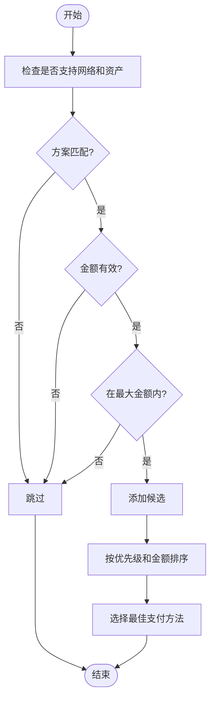

# 配置选项

<cite>
**本文档中引用的文件**   
- [client_options.go](file://client_options.go)
- [handler.go](file://handler.go)
- [types.go](file://types.go)
- [signer.go](file://signer.go)
- [client_options_test.go](file://client_options_test.go)
</cite>

## 目录
1. [简介](#简介)
2. [预设支付选项](#预设支付选项)
3. [ClientPaymentOption 结构体](#clientpaymentoption-结构体)
4. [Fluent API 设计模式](#fluent-api-设计模式)
5. [支付决策流程](#支付决策流程)
6. [配置组合与使用场景](#配置组合与使用场景)
7. [开发者体验与灵活性](#开发者体验与灵活性)

## 简介
本文档系统梳理了 `client_options.go` 文件中提供的客户端配置功能。详细说明了 `AcceptUSDCBase` 和 `AcceptUSDCBaseSepolia` 等预设支付选项的用途与配置参数。深入解析了 `ClientPaymentOption` 结构体的 Fluent API 设计模式，包括 `WithPriority`、`WithMaxAmount` 和 `WithMinBalance` 等链式调用方法的实现机制与使用场景。阐述了这些配置选项如何影响 `PaymentHandler` 的支付决策过程。结合代码实例展示了如何通过组合不同的配置选项来定制客户端的支付行为，例如设置支付优先级、最大支付限额和最低余额保护。讨论了这些辅助函数如何提升开发者体验和配置灵活性。

## 预设支付选项
`client_options.go` 文件提供了两个预设的支付选项函数：`AcceptUSDCBase` 和 `AcceptUSDCBaseSepolia`。这两个函数分别用于创建在 Base 主网和 Base Sepolia 测试网上的 USDC 支付选项。

**Section sources**
- [client_options.go](file://client_options.go#L7-L38)

### AcceptUSDCBase
`AcceptUSDCBase` 函数创建一个用于 Base 主网 USDC 支付的客户端支付选项。该函数返回一个 `ClientPaymentOption` 结构体，其中包含了支付所需的网络、资产、优先级和链 ID 等信息。

```mermaid
classDiagram
class ClientPaymentOption {
+PaymentRequirement PaymentRequirement
+Priority int
+MaxAmount string
+MinBalance string
+ChainID *big.Int
}
class PaymentRequirement {
+Scheme string
+Network string
+MaxAmountRequired string
+Asset string
+PayTo string
+Resource string
+Description string
+MimeType string
+OutputSchema interface{}
+MaxTimeoutSeconds int
+Extra map[string]string
}
ClientPaymentOption --> PaymentRequirement : "嵌入"
```

**Diagram sources**
- [client_options.go](file://client_options.go#L7-L21)
- [types.go](file://types.go#L9-L21)

### AcceptUSDCBaseSepolia
`AcceptUSDCBaseSepolia` 函数创建一个用于 Base Sepolia 测试网 USDC 支付的客户端支付选项。该函数返回一个 `ClientPaymentOption` 结构体，其中包含了支付所需的网络、资产、优先级和链 ID 等信息。

```mermaid
classDiagram
class ClientPaymentOption {
+PaymentRequirement PaymentRequirement
+Priority int
+MaxAmount string
+MinBalance string
+ChainID *big.Int
}
class PaymentRequirement {
+Scheme string
+Network string
+MaxAmountRequired string
+Asset string
+PayTo string
+Resource string
+Description string
+MimeType string
+OutputSchema interface{}
+MaxTimeoutSeconds int
+Extra map[string]string
}
ClientPaymentOption --> PaymentRequirement : "嵌入"
```

**Diagram sources**
- [client_options.go](file://client_options.go#L24-L38)
- [types.go](file://types.go#L9-L21)

## ClientPaymentOption 结构体
`ClientPaymentOption` 结构体是客户端支付选项的核心数据结构。它继承了 `PaymentRequirement` 结构体，并添加了客户端特定的字段，如优先级、最大支付金额、最低余额和链 ID。

```mermaid
classDiagram
class ClientPaymentOption {
+PaymentRequirement PaymentRequirement
+Priority int
+MaxAmount string
+MinBalance string
+ChainID *big.Int
}
class PaymentRequirement {
+Scheme string
+Network string
+MaxAmountRequired string
+Asset string
+PayTo string
+Resource string
+Description string
+MimeType string
+OutputSchema interface{}
+MaxTimeoutSeconds int
+Extra map[string]string
}
ClientPaymentOption --> PaymentRequirement : "嵌入"
```

**Diagram sources**
- [types.go](file://types.go#L93-L101)
- [types.go](file://types.go#L9-L21)

### 结构体字段
- **PaymentRequirement**: 继承自 `PaymentRequirement` 结构体，包含支付的基本要求。
- **Priority**: 客户端支付选项的优先级，数值越小优先级越高。
- **MaxAmount**: 客户端愿意为此支付选项支付的最大金额。
- **MinBalance**: 客户端在支付后希望保持的最低余额。
- **ChainID**: 用于签名的链 ID，内部使用。

**Section sources**
- [types.go](file://types.go#L93-L101)

## Fluent API 设计模式
`ClientPaymentOption` 结构体实现了 Fluent API 设计模式，通过链式调用方法来配置支付选项。这种设计模式使得配置过程更加直观和灵活。

### WithPriority
`WithPriority` 方法用于设置支付选项的优先级。该方法返回一个修改后的 `ClientPaymentOption` 实例，允许链式调用。

```mermaid
sequenceDiagram
participant Client as "客户端"
participant Option as "ClientPaymentOption"
Client->>Option : AcceptUSDCBase()
Option-->>Client : 返回 ClientPaymentOption 实例
Client->>Option : WithPriority(2)
Option-->>Client : 返回修改后的 ClientPaymentOption 实例
```

**Diagram sources**
- [client_options.go](file://client_options.go#L43-L46)

### WithMaxAmount
`WithMaxAmount` 方法用于设置客户端愿意为此支付选项支付的最大金额。该方法返回一个修改后的 `ClientPaymentOption` 实例，允许链式调用。

```mermaid
sequenceDiagram
participant Client as "客户端"
participant Option as "ClientPaymentOption"
Client->>Option : AcceptUSDCBase()
Option-->>Client : 返回 ClientPaymentOption 实例
Client->>Option : WithMaxAmount("100000")
Option-->>Client : 返回修改后的 ClientPaymentOption 实例
```

**Diagram sources**
- [client_options.go](file://client_options.go#L49-L52)

### WithMinBalance
`WithMinBalance` 方法用于设置客户端在支付后希望保持的最低余额。该方法返回一个修改后的 `ClientPaymentOption` 实例，允许链式调用。

```mermaid
sequenceDiagram
participant Client as "客户端"
participant Option as "ClientPaymentOption"
Client->>Option : AcceptUSDCBase()
Option-->>Client : 返回 ClientPaymentOption 实例
Client->>Option : WithMinBalance("50000")
Option-->>Client : 返回修改后的 ClientPaymentOption 实例
```

**Diagram sources**
- [client_options.go](file://client_options.go#L55-L58)

## 支付决策流程
`PaymentHandler` 的支付决策过程依赖于 `ClientPaymentOption` 的配置。当服务器返回支付要求时，`PaymentHandler` 会根据客户端的支付选项选择最佳的支付方法。



**Diagram sources**
- [handler.go](file://handler.go#L85-L152)

### 选择最佳支付方法
`selectPaymentMethod` 方法遍历所有可用的支付要求，检查客户端是否支持这些要求，并根据优先级和金额选择最佳的支付方法。

**Section sources**
- [handler.go](file://handler.go#L85-L152)

## 配置组合与使用场景
通过组合不同的配置选项，可以定制客户端的支付行为。以下是一些常见的使用场景。

### 设置支付优先级
通过 `WithPriority` 方法可以设置支付选项的优先级，确保在多个支付选项中选择最合适的。

```go
option := AcceptUSDCBase().WithPriority(2)
```

### 设置最大支付限额
通过 `WithMaxAmount` 方法可以设置客户端愿意为此支付选项支付的最大金额，防止意外的高额支付。

```go
option := AcceptUSDCBase().WithMaxAmount("100000")
```

### 设置最低余额保护
通过 `WithMinBalance` 方法可以设置客户端在支付后希望保持的最低余额，确保账户有足够的资金进行后续操作。

```go
option := AcceptUSDCBase().WithMinBalance("50000")
```

**Section sources**
- [client_options_test.go](file://client_options_test.go#L116-L212)

## 开发者体验与灵活性
这些辅助函数和 Fluent API 设计模式极大地提升了开发者的体验和配置灵活性。通过链式调用，开发者可以轻松地组合不同的配置选项，快速定制客户端的支付行为。

**Section sources**
- [client_options_test.go](file://client_options_test.go#L11-L114)
- [examples/client/main.go](file://examples/client/main.go#L13-L176)