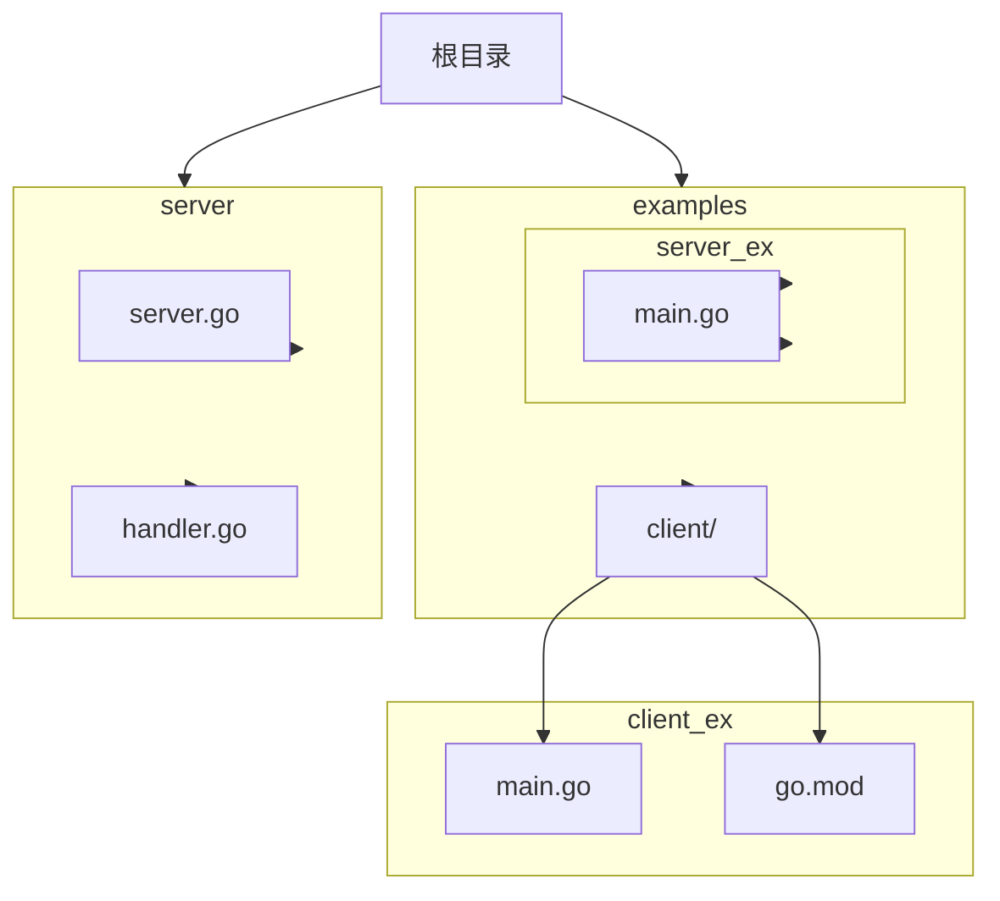
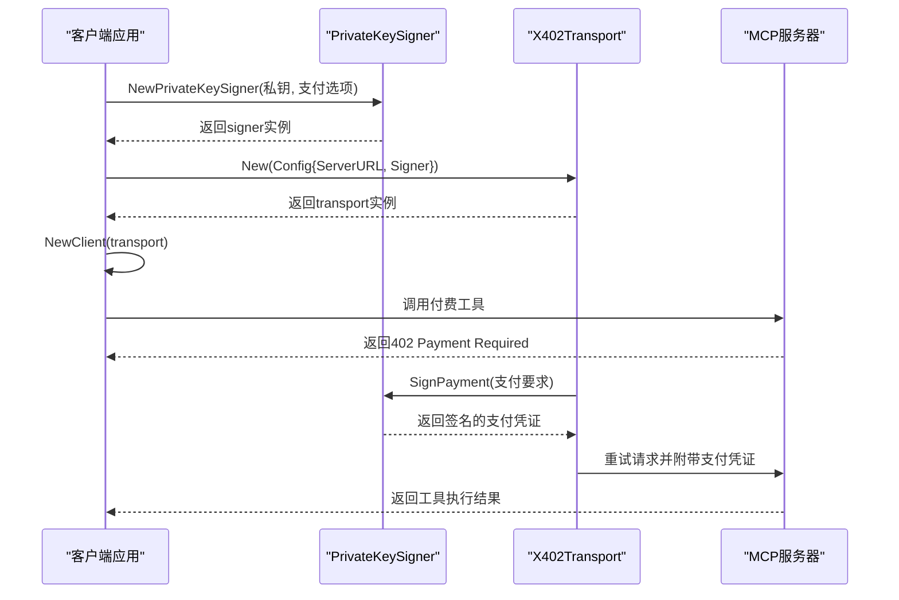
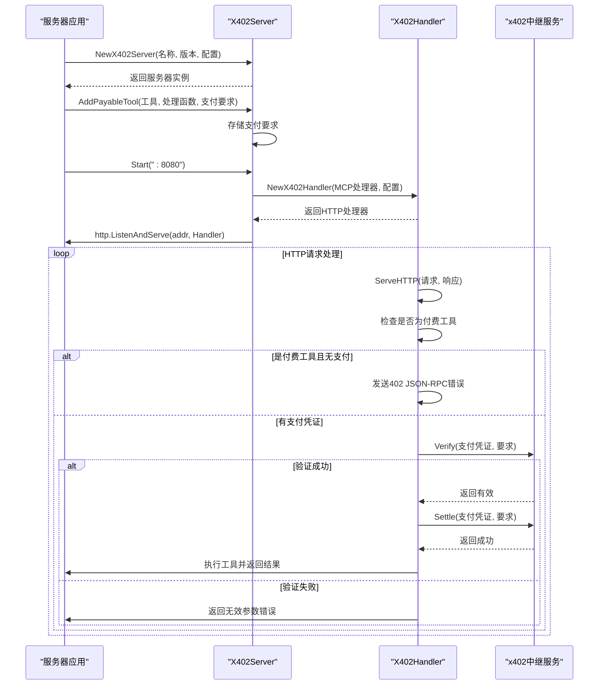

# 快速开始

<cite>
**Referenced Files in This Document**   
- [README.md](file://README.md)
- [examples/client/main.go](file://examples/client/main.go)
- [examples/server/main.go](file://examples/server/main.go)
- [signer.go](file://signer.go)
- [transport.go](file://transport.go)
- [server/server.go](file://server/server.go)
- [server/handler.go](file://server/handler.go)
- [errors.go](file://errors.go)
- [go.mod](file://go.mod)
</cite>

## 目录
1. [简介](#简介)
2. [项目结构](#项目结构)
3. [客户端集成](#客户端集成)
4. [服务器端配置](#服务器端配置)
5. [关键配置参数说明](#关键配置参数说明)
6. [常见问题排查](#常见问题排查)
7. [总结](#总结)

## 简介
本文档旨在为开发者提供一份面向新手的快速入门指南，指导如何在5分钟内完成mcp-go-x402库的集成。该库为MCP-Go客户端和服务器提供了x402支付协议支持，允许在调用MCP工具时进行自动支付处理。文档将基于README.md中的安装说明和examples目录下的实际代码，提供分步操作流程，确保内容对Go语言初学者友好，同时为有经验的开发者提供快速参考。

**Section sources**
- [README.md](file://README.md#L1-L50)

## 项目结构
mcp-go-x402项目的目录结构清晰，主要分为以下几个部分：
- `examples/`：包含客户端和服务器端的示例代码，是学习集成过程的最佳起点。
- `server/`：包含服务器端的核心实现，如X402Server和处理HTTP请求的handler。
- 根目录：包含客户端核心逻辑、签名处理、传输层以及主模块文件。

这种结构将客户端和服务器端的示例与核心实现分离，便于开发者理解和使用。



**Diagram sources**
- [README.md](file://README.md#L1-L50)

**Section sources**
- [README.md](file://README.md#L1-L50)

## 客户端集成
本节将详细介绍如何在客户端集成mcp-go-x402库，实现自动支付功能。

### 引入依赖
首先，通过`go mod`命令引入mcp-go-x402库作为依赖。在您的Go项目中执行以下命令：
```bash
go get github.com/mark3labs/mcp-go-x402
```
此命令会将库添加到`go.mod`文件中，并下载所有必要的依赖项。

**Section sources**
- [README.md](file://README.md#L55-L60)

### 创建PrivateKeySigner并构建X402Transport实例
客户端集成的核心是创建一个`PrivateKeySigner`并使用它来构建`X402Transport`实例。以下是详细步骤：

1.  **创建PrivateKeySigner**：使用您的私钥和指定的支付选项（如接受Base主网上的USDC）来创建一个`PrivateKeySigner`。这是支付的签名者，负责生成支付授权。
2.  **构建X402Transport**：使用上一步创建的`signer`和服务器URL来创建`X402Transport`实例。这个传输层会自动处理402支付请求。
3.  **创建MCP客户端**：最后，使用这个`X402Transport`来创建一个标准的MCP客户端，之后的工具调用将自动处理支付。



**Diagram sources**
- [examples/client/main.go](file://examples/client/main.go#L48-L177)
- [signer.go](file://signer.go#L41-L45)
- [transport.go](file://transport.go#L33-L63)

**Section sources**
- [examples/client/main.go](file://examples/client/main.go#L48-L177)
- [signer.go](file://signer.go#L41-L45)
- [transport.go](file://transport.go#L33-L63)

## 服务器端配置
本节将展示如何在服务器端配置X402Server并添加付费工具。

### 配置X402Server
服务器端的配置同样简单明了：

1.  **创建X402Server**：通过`NewX402Server`函数创建一个服务器实例，需要提供服务器名称、版本和配置（如x402中继服务URL）。
2.  **添加免费工具**：使用`AddTool`方法添加不需要支付的工具。
3.  **添加付费工具**：使用`AddPayableTool`方法添加需要支付的工具，并指定支付要求（如支付金额、接收钱包地址等）。
4.  **启动服务器**：调用`Start`方法在指定端口上启动服务器。



**Diagram sources**
- [examples/server/main.go](file://examples/server/main.go#L12-L95)
- [server/server.go](file://server/server.go#L11-L14)
- [server/handler.go](file://server/handler.go#L11-L14)

**Section sources**
- [examples/server/main.go](file://examples/server/main.go#L12-L95)
- [server/server.go](file://server/server.go#L11-L14)
- [server/handler.go](file://server/handler.go#L11-L14)

## 关键配置参数说明
理解以下关键配置参数对于正确集成至关重要：

-   **私钥格式**：`NewPrivateKeySigner`接受十六进制编码的私钥字符串，可以带有或不带`0x`前缀。
-   **网络链ID**：通过`AcceptUSDCBase()`或`AcceptUSDCBaseSepolia()`等函数指定支付网络。这些函数内部已配置好正确的链ID。
-   **支付金额**：在`AddPayableTool`中，金额以最小单位（如wei）的字符串形式指定。例如，"10000"代表0.01 USDC。
-   **PaymentCallback**：客户端可配置此回调函数，在每次支付前进行审批，可用于控制预算或提示用户。
-   **VerifyOnly模式**：服务器端的`VerifyOnly`配置项，设为`true`时仅验证支付但不上链结算，适用于测试环境。

**Section sources**
- [README.md](file://README.md#L150-L350)
- [examples/client/main.go](file://examples/client/main.go#L48-L177)
- [examples/server/main.go](file://examples/server/main.go#L12-L95)

## 常见问题排查
在集成过程中可能会遇到以下问题：

-   **402响应未正确处理**：如果客户端在收到402响应后没有自动重试，检查`X402Transport`是否正确创建，并且`signer`配置了与服务器要求匹配的支付选项（如网络和资产）。
-   **签名验证失败**：这通常由以下原因导致：
    -   私钥不正确或与用于接收支付的钱包地址不匹配。
    -   `PaymentCallback`回调函数拒绝了支付。
    -   支付要求中的`MaxAmountRequired`超出了`signer`配置的`WithMaxAmount`限制。
-   **连接或初始化失败**：确保服务器URL正确，并且服务器正在运行。检查`go.mod`文件中的依赖版本是否兼容。

**Section sources**
- [errors.go](file://errors.go#L1-L60)
- [transport.go](file://transport.go#L33-L63)
- [server/handler.go](file://server/handler.go#L11-L14)

## 总结
通过遵循本指南，开发者可以快速完成mcp-go-x402的集成。核心流程是：客户端通过`go mod`引入依赖，创建`PrivateKeySigner`和`X402Transport`；服务器端创建`X402Server`并使用`AddPayableTool`添加付费工具。整个过程由examples目录下的代码示例支持，确保了每一步都有可运行的代码作为参考。

**Section sources**
- [README.md](file://README.md#L1-L50)
- [examples/client/main.go](file://examples/client/main.go#L13-L177)
- [examples/server/main.go](file://examples/server/main.go#L12-L95)