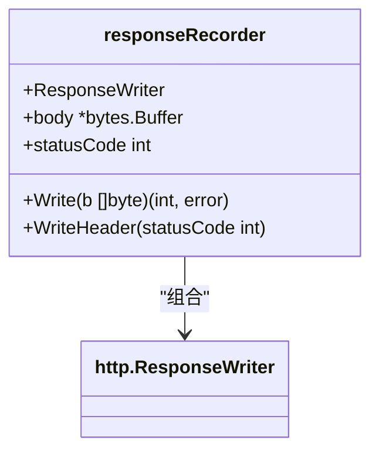
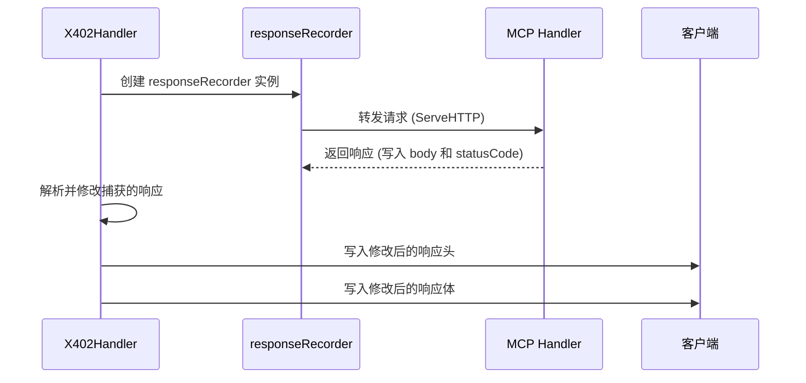
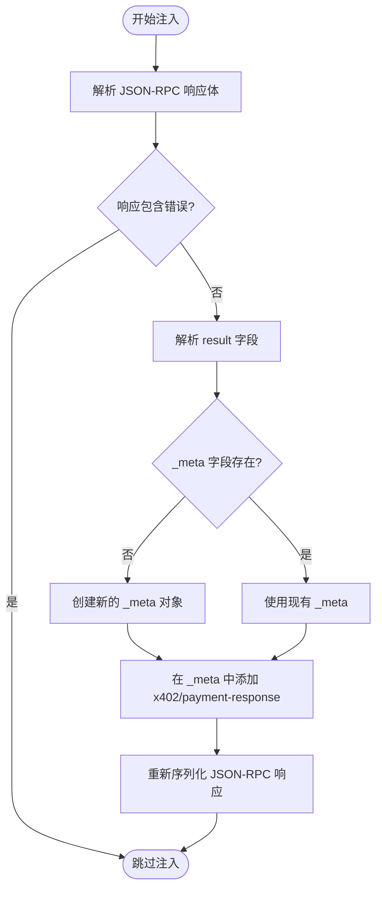

# 响应拦截与修改

<cite>
**Referenced Files in This Document**   
- [server/handler.go](file://server/handler.go)
- [server/types.go](file://server/types.go)
</cite>

## 目录
1. [简介](#简介)
2. [核心组件](#核心组件)
3. [响应拦截机制](#响应拦截机制)
4. [响应修改流程](#响应修改流程)
5. [结算结果注入](#结算结果注入)
6. [状态码与内容类型保留](#状态码与内容类型保留)
7. [验证模式下的行为](#验证模式下的行为)

## 简介
本文档全面阐述了 `responseRecorder` 如何实现 HTTP 响应的拦截与修改。该机制作为 `http.ResponseWriter` 的包装器，通过重写 `Write` 和 `WriteHeader` 方法来捕获响应体和状态码。文档详细解释了 `forwardWithSettlementResponse` 方法如何将原始请求转发给 MCP 处理器并使用 `responseRecorder` 捕获响应，以及如何解析 JSON-RPC 响应体并在 `_result` 的 `_meta` 字段中注入 x402 支付结算结果。

## 核心组件

本文档的核心组件包括 `responseRecorder` 结构体、`X402Handler` 结构体及其 `forwardWithSettlementResponse` 方法。这些组件共同实现了对 HTTP 响应的拦截、修改和结算信息注入功能。

**Section sources**
- [server/handler.go](file://server/handler.go#L340-L344)
- [server/handler.go](file://server/handler.go#L270-L317)

## 响应拦截机制

`responseRecorder` 是一个实现了 `http.ResponseWriter` 接口的结构体，它通过组合（embedding）的方式包装了原始的 `http.ResponseWriter`。这种设计模式允许它在不改变外部接口的情况下，拦截并记录所有对响应的写入操作。

**Diagram sources**
- [server/handler.go](file://server/handler.go#L340-L344)

`responseRecorder` 包含三个关键字段：
- `ResponseWriter`：嵌入的原始响应写入器，用于访问和调用底层的 HTTP 响应方法。
- `body`：一个 `*bytes.Buffer` 类型的字段，用于捕获所有写入响应体的数据。
- `statusCode`：一个整数字段，用于存储通过 `WriteHeader` 方法设置的 HTTP 状态码。

`responseRecorder` 通过重写两个关键方法来实现拦截：
- `Write` 方法：该方法不直接将数据写入客户端，而是将其写入内部的 `body` 缓冲区。这使得系统可以在最终发送响应之前，完全访问和修改响应体内容。
- `WriteHeader` 方法：该方法不立即发送状态码，而是将其存储在 `statusCode` 字段中。这允许后续逻辑根据需要修改状态码，或者在最终写入前进行检查。

**Section sources**
- [server/handler.go](file://server/handler.go#L346-L352)

## 响应修改流程

`forwardWithSettlementResponse` 方法是整个响应拦截与修改流程的核心。它负责协调请求转发、响应捕获和最终的响应处理。

**Diagram sources**
- [server/handler.go](file://server/handler.go#L270-L317)

该流程的详细步骤如下：
1.  **创建记录器**：方法首先创建一个 `responseRecorder` 实例，并将其包装在原始的 `http.ResponseWriter` 之上。同时，它初始化一个 `bytes.Buffer` 来捕获响应体，并将初始状态码设为 `http.StatusOK`。
2.  **转发请求**：`X402Handler` 将原始的 HTTP 请求和这个 `responseRecorder` 实例一起转发给底层的 MCP 处理器 (`h.mcpHandler.ServeHTTP`)。此时，MCP 处理器认为它正在向一个正常的响应写入器写入数据。
3.  **捕获响应**：当 MCP 处理器调用 `Write` 和 `WriteHeader` 时，这些调用被 `responseRecorder` 拦截。响应体被写入 `body` 缓冲区，状态码被存储在 `statusCode` 字段中，而不会立即发送给客户端。
4.  **处理捕获的响应**：在请求被处理后，`forwardWithSettlementResponse` 方法可以安全地访问 `responseRecorder` 中捕获的完整响应，包括状态码和响应体。

**Section sources**
- [server/handler.go](file://server/handler.go#L270-L278)

## 结算结果注入

在成功捕获响应后，`forwardWithSettlementResponse` 方法会检查响应是否为成功的 JSON-RPC 响应（状态码为 200 且 `Content-Type` 为 `application/json`）。如果是，则会执行结算结果的注入逻辑。

**Diagram sources**
- [server/handler.go](file://server/handler.go#L282-L309)

注入过程的具体步骤为：
1.  **解析响应体**：从 `responseRecorder` 的 `body` 缓冲区中读取字节，并反序列化为 `transport.JSONRPCResponse` 结构体。
2.  **检查错误**：如果 JSON-RPC 响应中包含错误（`jsonrpcResp.Error != nil`），则跳过注入过程，保留原始错误响应。
3.  **解析结果**：如果响应成功，则进一步解析 `Result` 字段，通常是一个 `map[string]any` 类型的 JSON 对象。
4.  **获取或创建 _meta**：检查结果对象中是否存在 `_meta` 字段。如果不存在，则创建一个新的 `map[string]any` 对象。
5.  **注入结算响应**：创建一个 `SettlementResponse` 对象，其字段值来自 `settleResp` 参数（`Success`, `Transaction`, `Network`, `Payer`），并将其作为 `x402/payment-response` 字段添加到 `_meta` 对象中。
6.  **重新序列化**：将修改后的结果对象重新序列化为 JSON 字节，并更新 `jsonrpcResp.Result` 字段。最后，将整个修改后的 `jsonrpcResp` 对象编码回 `responseRecorder` 的 `body` 缓冲区。

**Section sources**
- [server/handler.go](file://server/handler.go#L282-L309)

## 状态码与内容类型保留

为了确保修改后的响应与原始响应在 HTTP 层面上保持一致，`forwardWithSettlementResponse` 方法在最后阶段会将所有原始的响应头（包括 `Content-Type`）复制到原始的 `http.ResponseWriter` 上。然后，它使用 `WriteHeader` 方法写入之前捕获的 `statusCode`，并使用 `Write` 方法将修改后的 `body` 内容发送给客户端。

这一机制确保了：
- **状态码保留**：无论响应体内容如何被修改，HTTP 状态码都保持与 MCP 处理器最初设置的一致。
- **内容类型保留**：`Content-Type` 等关键响应头被完整保留，保证了客户端能够正确解析响应。

**Section sources**
- [server/handler.go](file://server/handler.go#L311-L317)

## 验证模式下的行为

在 `verify-only` 模式下（由 `h.config.VerifyOnly` 控制），系统会跳过实际的链上结算步骤。此时，`settleResp` 对象会被模拟创建，其 `Success` 字段为 `true`，`Transaction` 字段为 `"verify-only-mode"`，`Network` 和 `Payer` 字段则从验证结果中获取。

这种模式允许系统在不产生实际交易费用的情况下，测试和验证整个支付流程的正确性，同时仍然向客户端返回一个包含结算信息的完整响应。

**Section sources**
- [server/handler.go](file://server/handler.go#L205-L212)