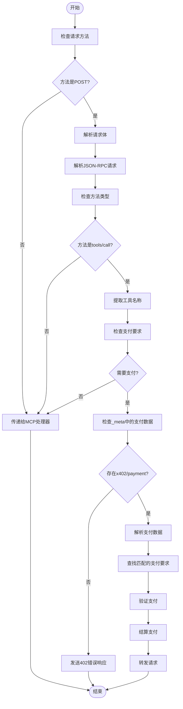
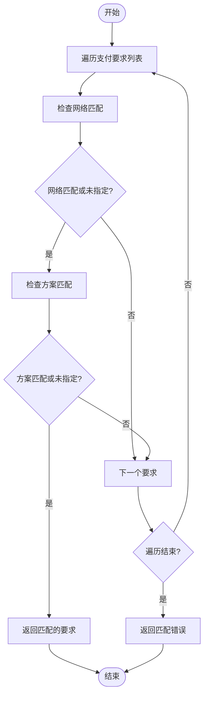
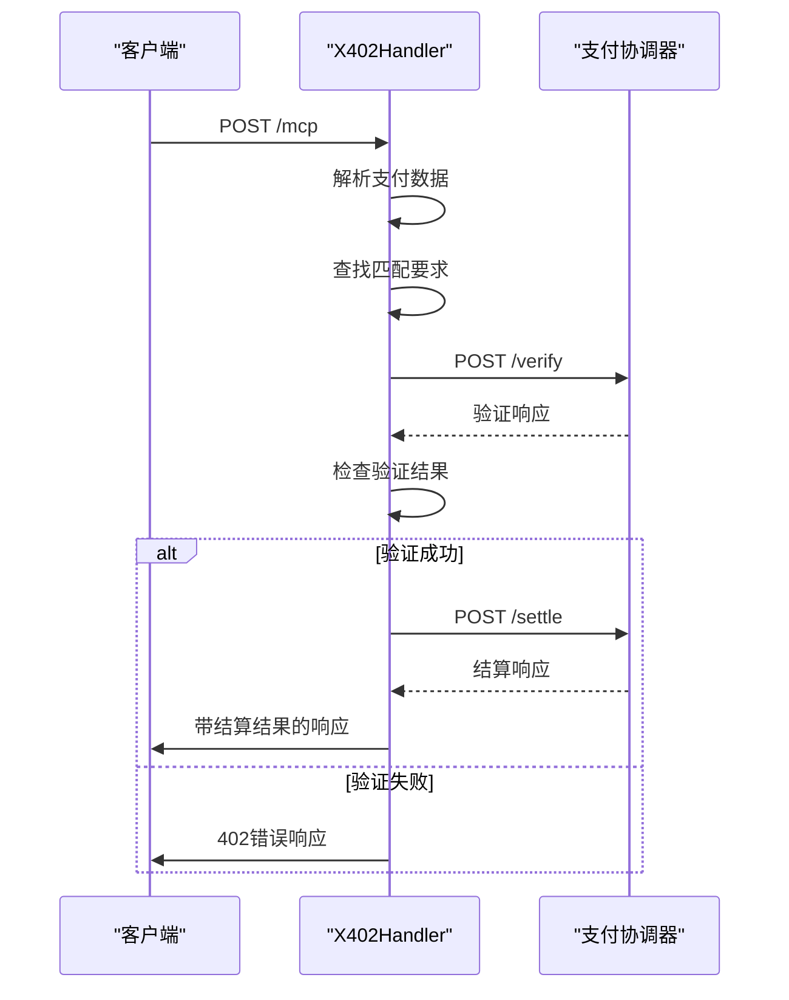
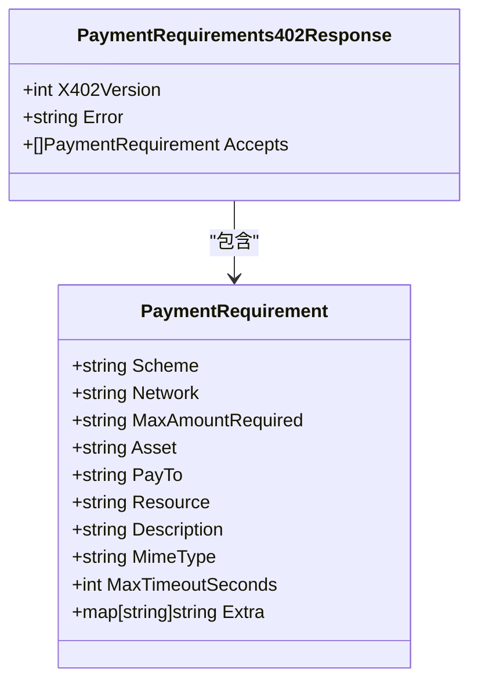
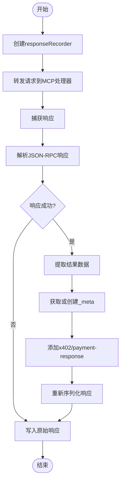
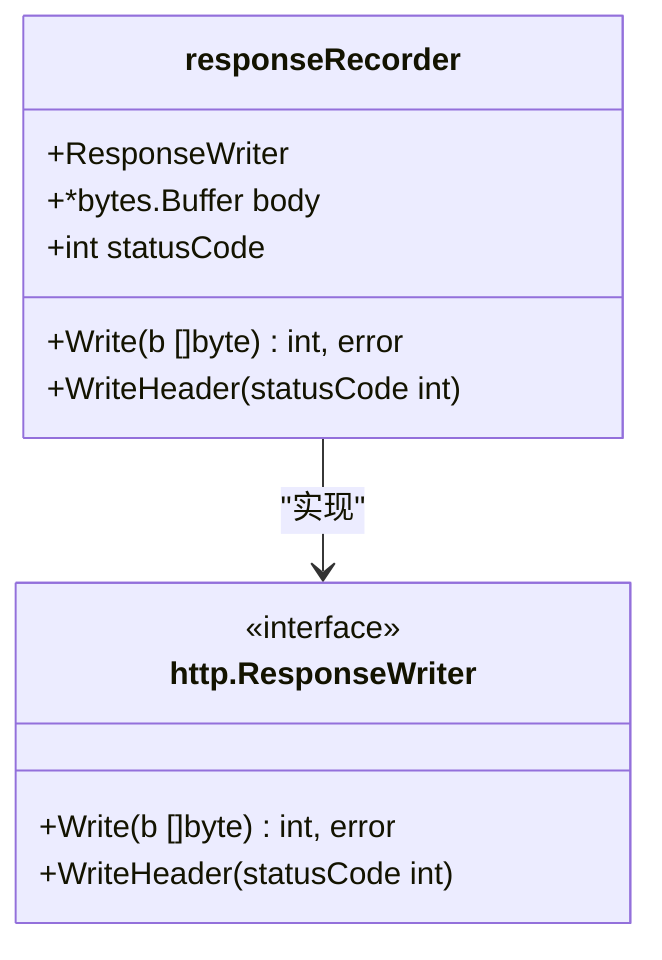

# 支付处理程序

<cite>
**Referenced Files in This Document**   
- [server/handler.go](file://server/handler.go)
- [server/facilitator.go](file://server/facilitator.go)
- [server/types.go](file://server/types.go)
- [server/requirements.go](file://server/requirements.go)
</cite>

## 目录
1. [简介](#简介)
2. [核心组件](#核心组件)
3. [请求拦截与支付验证流程](#请求拦截与支付验证流程)
4. [支付要求匹配算法](#支付要求匹配算法)
5. [支付验证与结算机制](#支付验证与结算机制)
6. [错误响应构造](#错误响应构造)
7. [响应拦截与结算注入](#响应拦截与结算注入)
8. [HTTP交互示例](#http交互示例)
9. [响应记录器实现](#响应记录器实现)
10. [验证模式行为差异](#验证模式行为差异)

## 简介
本文档全面阐述了X402Handler的支付处理机制，重点分析其如何拦截MCP工具调用并执行x402支付验证。该处理器实现了基于JSON-RPC的支付协议，通过拦截POST请求、解析支付数据、验证支付凭证并注入结算结果，为API调用提供链上支付保障。系统设计遵循模块化原则，将支付验证与结算逻辑分离，支持灵活的支付要求配置和可扩展的支付方案。

## 核心组件

X402Handler是支付处理的核心结构，封装了MCP处理器、配置和支付协调器。它通过ServeHTTP方法拦截HTTP请求，实现支付验证逻辑。支付协调器(Facilitator)负责与外部支付服务通信，执行验证和结算操作。PaymentRequirement定义了支付要求，包括网络、资产、金额等关键属性。responseRecorder用于捕获和修改HTTP响应，实现结算结果的注入。

**Section sources**
- [server/handler.go](file://server/handler.go#L15-L19)
- [server/types.go](file://server/types.go#L4-L16)
- [server/handler.go](file://server/handler.go#L340-L344)

## 请求拦截与支付验证流程

X402Handler的ServeHTTP方法首先识别POST请求，这是MCP工具调用的标准方法。系统解析JSON-RPC格式的请求体，提取方法名和参数。当方法名为"tools/call"时，处理器检查_callToolParams的_name字段以确定调用的工具。通过配置中的PaymentTools映射，系统判断该工具是否需要支付。

**Diagram sources**
- [server/handler.go](file://server/handler.go#L32-L214)

**Section sources**
- [server/handler.go](file://server/handler.go#L32-L214)

## 支付要求匹配算法

findMatchingRequirement算法负责根据支付数据匹配合适的PaymentRequirement。该算法遍历所有可用的支付选项，通过比较network和scheme字段进行匹配。匹配过程采用短路逻辑，一旦找到符合条件的要求即返回。算法首先检查网络匹配，只有当网络匹配或要求未指定网络时才继续检查方案匹配。

**Diagram sources**
- [server/handler.go](file://server/handler.go#L320-L337)

**Section sources**
- [server/handler.go](file://server/handler.go#L320-L337)

## 支付验证与结算机制

facilitator.Verify和facilitator.Settle构成了支付处理的核心验证与结算机制。Verify方法执行链下验证，检查支付凭证的有效性而不实际转移资金。它通过HTTP POST请求将支付数据发送到协调器的/verify端点，接收验证结果。Settle方法负责链上结算，在验证通过后实际执行资金转移。在verify-only模式下，系统跳过结算步骤，返回模拟的结算响应。

**Diagram sources**
- [server/facilitator.go](file://server/facilitator.go#L49-L118)
- [server/facilitator.go](file://server/facilitator.go#L120-L156)

**Section sources**
- [server/facilitator.go](file://server/facilitator.go#L49-L156)

## 错误响应构造

sendPaymentRequiredError方法负责构造符合规范的402 JSON-RPC错误响应。该响应包含x402Version、错误消息和Accepts支付选项列表。系统将HTTP状态码设置为200，因为错误信息包含在JSON-RPC响应体中。Accepts列表包含所有可用的支付要求，为客户端提供支付选项。响应头设置Content-Type为application/json，确保正确的MIME类型。

**Diagram sources**
- [server/types.go](file://server/types.go#L17-L26)
- [server/types.go](file://server/types.go#L4-L16)

**Section sources**
- [server/handler.go](file://server/handler.go#L217-L235)

## 响应拦截与结算注入

forwardWithSettlementResponse方法捕获原始响应并在_result的_meta中注入x402/payment-response结算结果。系统使用responseRecorder包装原始响应写入器，捕获响应体。在收到MCP处理器的响应后，系统解析JSON-RPC响应，提取结果数据。如果响应成功，系统在_result的_meta字段中添加结算响应，包含成功状态、交易哈希、网络和支付方信息。

**Diagram sources**
- [server/handler.go](file://server/handler.go#L270-L317)

**Section sources**
- [server/handler.go](file://server/handler.go#L270-L317)

## HTTP交互示例

完整的支付验证流程通过HTTP交互示例展示：客户端发送包含x402/payment的JSON-RPC请求，服务器验证支付凭证，执行链上结算，并在响应中返回x402/payment-response。当支付缺失时，服务器返回402错误响应，包含Accepts支付选项列表。客户端根据这些选项准备支付凭证并重试请求。整个流程确保了支付的安全性和可靠性。

**Section sources**
- [server/handler_test.go](file://server/handler_test.go#L126-L224)
- [server/handler_test.go](file://server/handler_test.go#L342-L427)

## 响应记录器实现

responseRecorder实现了响应拦截与修改功能。它包装了http.ResponseWriter，重写了Write和WriteHeader方法。Write方法将数据写入内部缓冲区而非直接发送，允许后续修改。WriteHeader方法记录状态码而不立即发送。这种设计使处理器能够在发送响应前完全控制响应内容，实现结算结果的注入。

**Diagram sources**
- [server/handler.go](file://server/handler.go#L340-L352)

**Section sources**
- [server/handler.go](file://server/handler.go#L340-L352)

## 验证模式行为差异

在verify-only模式下，系统跳过链上结算步骤。当config.VerifyOnly为true时，处理器在验证支付成功后直接返回模拟的结算响应，包含成功状态和"verify-only-mode"作为交易哈希。这种模式适用于测试环境或需要快速验证支付凭证但不实际结算的场景。系统仍执行完整的支付验证，确保支付凭证的有效性。

**Section sources**
- [server/handler.go](file://server/handler.go#L184-L198)
- [server/types.go](file://server/types.go#L91-L104)