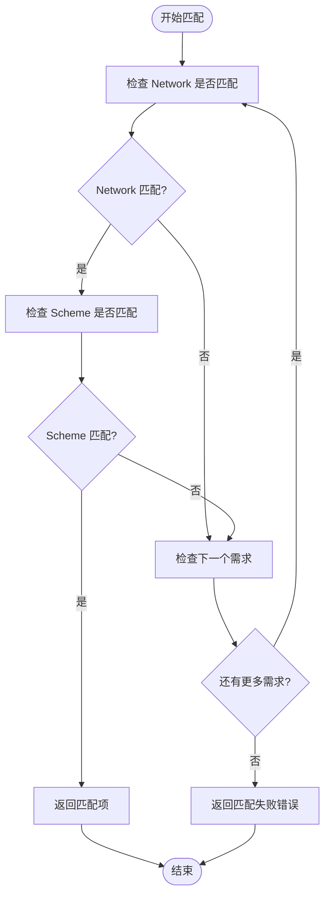

# 支付匹配算法

<cite>
**Referenced Files in This Document**   
- [server/handler.go](file://server/handler.go#L320-L337)
- [server/types.go](file://server/types.go#L4-L16)
- [server/types.go](file://server/types.go#L27-L42)
- [types.go](file://types.go#L9-L21)
- [types.go](file://types.go#L31-L36)
</cite>

## 目录
1. [简介](#简介)
2. [核心匹配逻辑](#核心匹配逻辑)
3. [匹配优先级策略](#匹配优先级策略)
4. [错误处理与信息构造](#错误处理与信息构造)
5. [配置与使用示例](#配置与使用示例)
6. [性能优化建议](#性能优化建议)
7. [结论](#结论)

## 简介
`findMatchingRequirement` 函数是支付系统中的核心匹配组件，负责验证支付请求是否符合预设的支付需求。该函数通过检查支付请求中的网络（Network）和方案（Scheme）字段与配置的支付需求是否匹配，实现灵活的支付控制机制。空值在匹配中被视为通配符，允许部分匹配。本文档将深入解析其实现逻辑、匹配策略、错误处理机制，并提供优化建议。

## 核心匹配逻辑
`findMatchingRequirement` 函数遍历 `PaymentRequirement` 数组，逐一检查每个需求项的 `Network` 和 `Scheme` 字段是否与支付请求中的对应字段匹配。匹配规则如下：
- 如果需求项的 `Network` 字段非空，则必须与支付请求的 `Network` 完全相等。
- 如果需求项的 `Scheme` 字段非空，则必须与支付请求的 `Scheme` 完全相等。
- 任一字段为空（""）时，视为通配符，不参与匹配检查。

该逻辑确保了配置的灵活性，允许系统支持多种支付网络和方案，同时保持匹配的精确性。

**Section sources**
- [server/handler.go](file://server/handler.go#L320-L337)

## 匹配优先级策略
匹配过程遵循“首个匹配即返回”的原则。函数按数组顺序遍历 `PaymentRequirement` 列表，一旦找到满足条件的需求项，立即返回该匹配项，不再检查后续项。因此，配置数组的顺序直接影响匹配结果。优先级较高的支付需求应放置在数组的前面，以确保在多选项情况下优先被选中。

此策略简化了匹配逻辑，避免了复杂的优先级计算，但要求配置时需谨慎安排顺序，以防止低优先级的配置意外覆盖高优先级的配置。

**Section sources**
- [server/handler.go](file://server/handler.go#L320-L337)

## 错误处理与信息构造
当遍历完所有支付需求项均未找到匹配时，函数返回 `nil` 和一个格式化的错误信息。错误信息通过 `fmt.Errorf` 构造，包含支付请求的实际 `Network` 和 `Scheme` 值，例如：“no matching payment requirement found for network=sepolia, scheme=exact”。此信息有助于调试和日志记录，明确指出匹配失败的原因。

在调用上下文中，此错误会被进一步处理，通常转换为 JSON-RPC 的 `INVALID_PARAMS` 错误，返回给客户端，提示支付信息不符合要求。

**Diagram sources**
- [server/handler.go](file://server/handler.go#L320-L337)

## 配置与使用示例
考虑一个支付需求列表，其中仅配置了 `ethereum` 网络。当支付请求的网络为 `sepolia` 时，匹配过程如下：
1. 函数获取支付请求，其 `Network` 为 `sepolia`，`Scheme` 为 `exact`。
2. 遍历需求列表，检查第一个需求项。
3. 由于需求项的 `Network` 为 `ethereum` 且非空，与 `sepolia` 不匹配，跳过该需求项。
4. 列表中无其他需求项，遍历结束。
5. 函数返回 `nil` 和错误信息，指示无匹配项。

此场景展示了严格匹配的行为，强调了配置准确性的重要性。

**Section sources**
- [server/types.go](file://server/types.go#L4-L16)
- [server/types.go](file://server/types.go#L27-L42)

## 性能优化建议
为提升性能，建议在系统初始化时预编译匹配规则。例如，可以将 `PaymentRequirement` 数组转换为基于 `Network` 和 `Scheme` 的哈希表（map），实现 O(1) 时间复杂度的查找。此外，在支持多网络的场景下，应避免配置歧义，如同时存在 `ethereum` 和 `sepolia` 的通用配置，这可能导致意外的匹配结果。通过明确的配置设计和预处理，可以显著提高匹配效率和系统的可预测性。

**Section sources**
- [server/handler.go](file://server/handler.go#L320-L337)

## 结论
`findMatchingRequirement` 函数通过简洁的遍历和条件检查，实现了灵活的支付需求匹配。其“首个匹配”策略和通配符支持，为系统提供了良好的扩展性和配置自由度。通过理解其匹配逻辑和错误处理机制，开发者可以更有效地配置和调试支付系统。未来可通过预编译规则等方式进一步优化性能，确保在高并发场景下的响应速度。