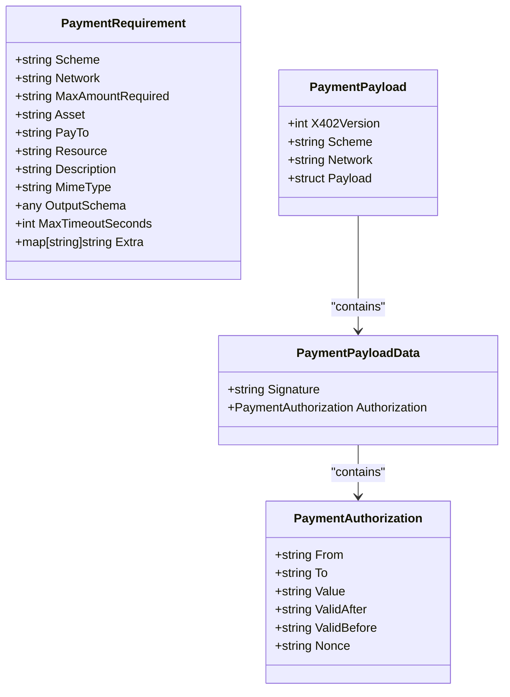
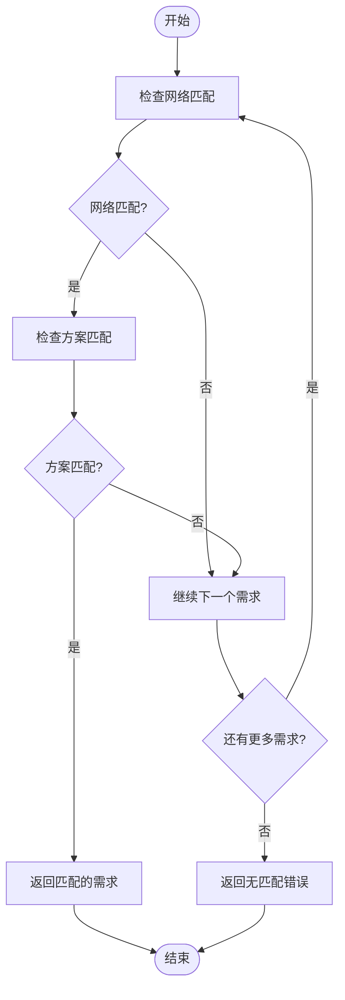
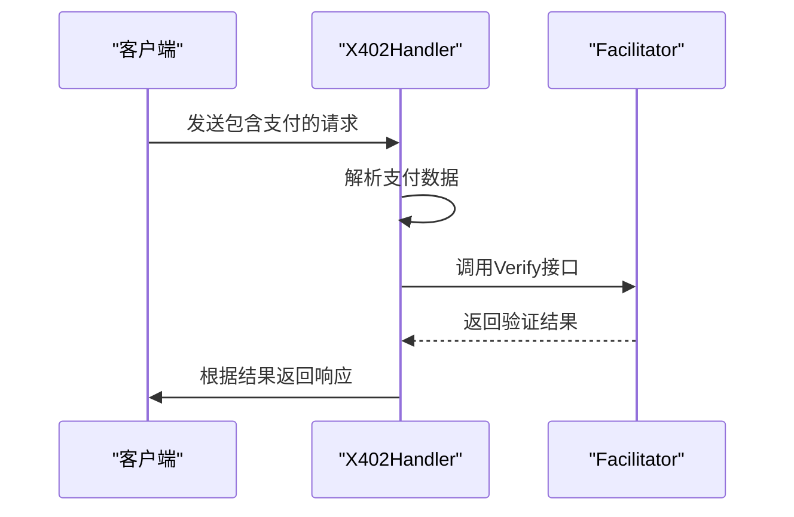
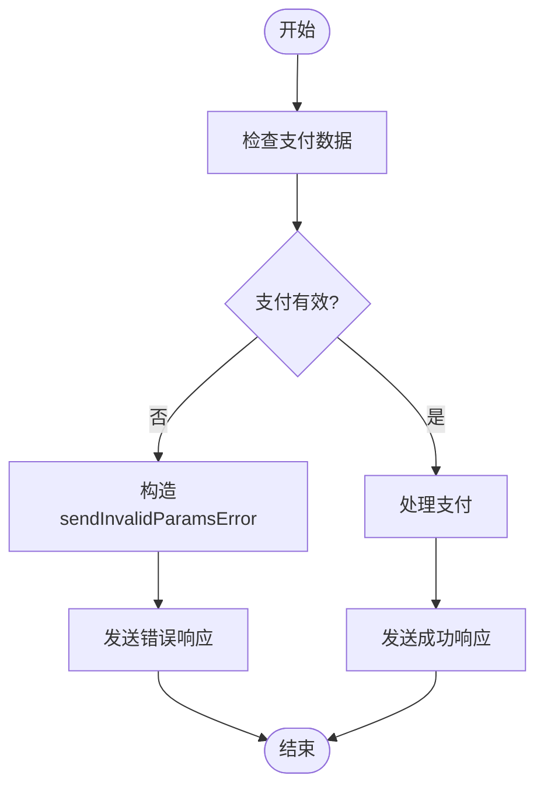
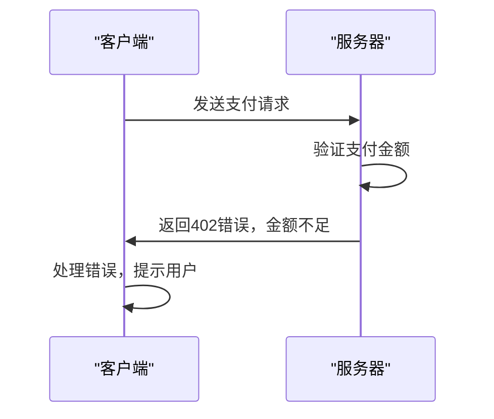

# 支付验证

<cite>
**Referenced Files in This Document**   
- [server/handler.go](file://server/handler.go)
- [server/types.go](file://server/types.go)
- [server/requirements.go](file://server/requirements.go)
- [server/facilitator.go](file://server/facilitator.go)
</cite>

## 目录
1. [支付验证核心流程](#支付验证核心流程)
2. [数据结构与类型转换](#数据结构与类型转换)
3. [支付需求匹配算法](#支付需求匹配算法)
4. [链下验证机制](#链下验证机制)
5. [错误处理与传播](#错误处理与传播)
6. [HTTP交互示例](#http交互示例)

## 支付验证核心流程

支付验证流程始于对 `_callToolParams` 的 `_meta` 字段进行解析，提取 `x402/payment` 数据。该流程通过 `json.Marshal` 和 `json.Unmarshal` 实现类型转换与结构化解析，确保支付数据的正确性和完整性。整个流程在 `X402Handler.ServeHTTP` 方法中实现，拦截 POST 请求并检查是否为工具调用。

**Section sources**
- [server/handler.go](file://server/handler.go#L32-L214)

## 数据结构与类型转换

系统定义了关键的数据结构 `PaymentPayload` 和 `PaymentRequirement`，用于表示支付载荷和支付需求。`PaymentPayload` 包含版本、方案、网络和授权信息，而 `PaymentRequirement` 定义了支付所需的方案、网络、最大金额等属性。类型转换通过 `json.Marshal` 将任意数据转换为字节流，再通过 `json.Unmarshal` 解析为具体结构体。

**Diagram sources**
- [server/types.go](file://server/types.go#L4-L16)
- [server/types.go](file://server/types.go#L27-L42)

## 支付需求匹配算法

`findMatchingRequirement` 算法根据 `payment.Network` 和 `payment.Scheme` 匹配对应的 `PaymentRequirement`。该算法支持通配符匹配与精确匹配策略，优先匹配网络和方案都符合的支付需求。如果未找到匹配项，则返回错误。

**Diagram sources**
- [server/handler.go](file://server/handler.go#L320-L337)

## 链下验证机制

`facilitator.Verify` 接口在链下验证中起关键作用，包括上下文传递、签名验证和授权检查。验证过程通过 HTTP 请求发送到指定的 `facilitatorURL`，确保支付的合法性和有效性。验证成功后，系统会继续处理支付结算。

**Diagram sources**
- [server/facilitator.go](file://server/facilitator.go#L49-L118)
- [server/handler.go](file://server/handler.go#L32-L214)

## 错误处理与传播

当验证失败时，如金额不足或网络不匹配，系统会构造 `sendInvalidParamsError` 并传播错误。错误信息通过 JSON-RPC 错误响应返回，确保客户端能够正确处理异常情况。

**Diagram sources**
- [server/handler.go](file://server/handler.go#L238-L251)

## HTTP交互示例

结合实际 HTTP 交互示例，展示验证失败时的错误传播路径。例如，当支付金额不足时，系统会返回 402 错误，并附带详细的错误信息，帮助客户端理解失败原因。

**Diagram sources**
- [server/handler.go](file://server/handler.go#L217-L235)
- [server/handler.go](file://server/handler.go#L238-L251)