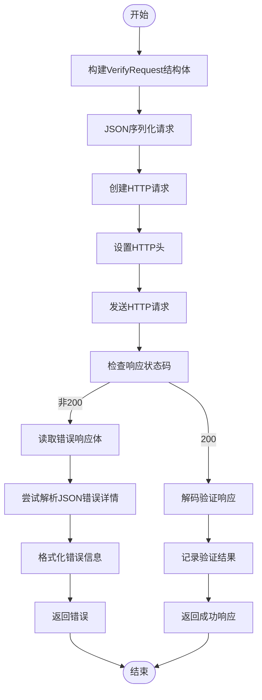
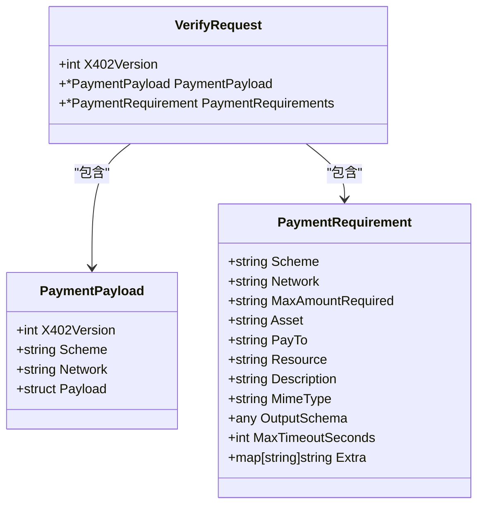
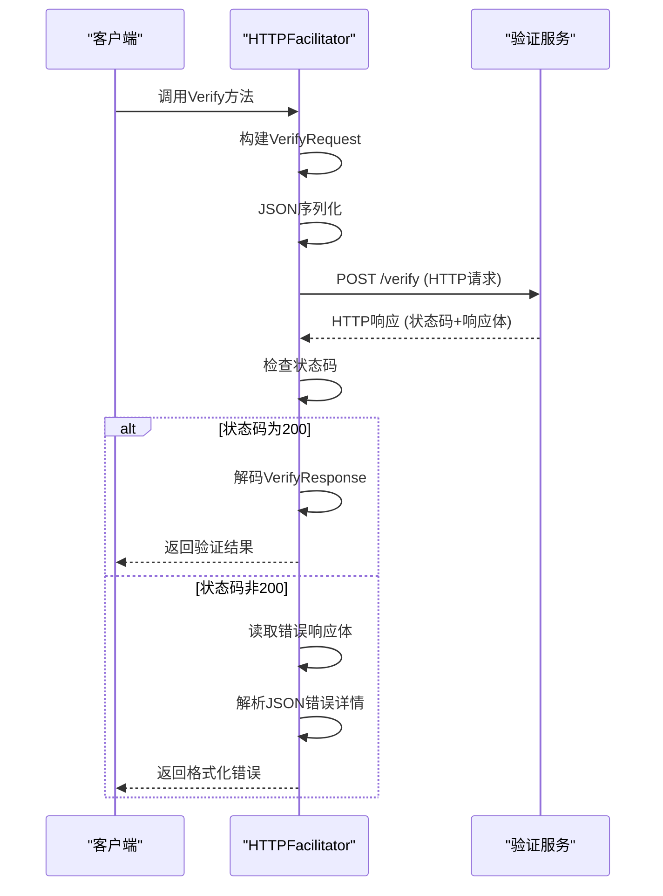
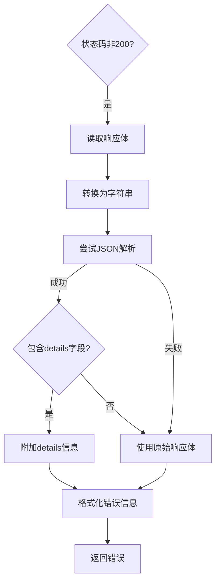

# 链下验证流程

<cite>
**本文档引用的文件**  
- [facilitator.go](file://server/facilitator.go)
- [types.go](file://server/types.go)
</cite>

## 目录
1. [链下验证流程概述](#链下验证流程概述)
2. [HTTPFacilitator.Verify方法执行流程](#httpfacilitatorverify方法执行流程)
3. [上下文传递与请求构建](#上下文传递与请求构建)
4. [HTTP请求发送与响应处理](#http请求发送与响应处理)
5. [错误响应解析机制](#错误响应解析机制)
6. [日志输出与调试信息](#日志输出与调试信息)
7. [超时设置对系统稳定性的影响](#超时设置对系统稳定性的影响)
8. [常见故障排查指南](#常见故障排查指南)

## 链下验证流程概述

链下验证流程是x402支付协议中的关键环节，用于在不直接与区块链交互的情况下验证支付凭证的有效性。该流程通过HTTPFacilitator.Verify方法实现，该方法作为Facilitator接口的一部分，负责与外部验证服务通信，验证支付凭证的合法性。整个流程从构建VerifyRequest结构体开始，通过HTTP POST请求发送至外部验证服务的/verify端点，最终返回验证结果。

**Section sources**
- [facilitator.go](file://server/facilitator.go#L14-L18)

## HTTPFacilitator.Verify方法执行流程

HTTPFacilitator.Verify方法是链下验证的核心实现，其执行流程包括请求构建、HTTP通信、响应处理和错误解析等关键步骤。该方法接收上下文、支付凭证和支付要求作为输入参数，返回验证响应和可能的错误信息。

**Diagram sources**
- [facilitator.go](file://server/facilitator.go#L49-L118)

**Section sources**
- [facilitator.go](file://server/facilitator.go#L49-L118)

## 上下文传递与请求构建

验证流程始于VerifyRequest结构体的构建，该结构体包含x402版本号、支付凭证和支付要求。上下文（context.Context）用于控制请求的生命周期，包括超时和取消。构建请求时，将传入的PaymentPayload和PaymentRequirement参数封装到VerifyRequest结构体中，同时设置x402Version为1。

**Diagram sources**
- [types.go](file://server/types.go#L57-L61)
- [types.go](file://server/types.go#L27-L42)
- [types.go](file://server/types.go#L4-L16)

**Section sources**
- [facilitator.go](file://server/facilitator.go#L49-L55)

## HTTP请求发送与响应处理

构建完请求后，系统将其JSON序列化并通过HTTP POST请求发送至外部验证服务的/verify端点。请求头中设置了Content-Type为application/json。HTTP客户端使用30秒的超时设置，确保请求不会无限期挂起。响应处理包括检查状态码、读取响应体和解码验证结果。

**Diagram sources**
- [facilitator.go](file://server/facilitator.go#L65-L100)

**Section sources**
- [facilitator.go](file://server/facilitator.go#L65-L100)

## 错误响应解析机制

当验证服务返回非200状态码时，系统会尝试读取响应体并解析错误详情。首先读取原始响应体，然后尝试将其解析为JSON格式，以提取更详细的错误信息。如果JSON解析成功且包含details字段，则将details信息附加到错误消息中，提供更丰富的错误上下文。

**Diagram sources**
- [facilitator.go](file://server/facilitator.go#L102-L114)

**Section sources**
- [facilitator.go](file://server/facilitator.go#L102-L114)

## 日志输出与调试信息

在verbose模式下，系统会输出详细的调试日志，帮助开发者诊断问题。日志信息包括请求发送、请求失败、验证成功和验证失败等关键事件。这些日志提供了验证流程的完整视图，有助于快速定位和解决问题。

**Section sources**
- [facilitator.go](file://server/facilitator.go#L57-L63)
- [facilitator.go](file://server/facilitator.go#L90-L94)
- [facilitator.go](file://server/facilitator.go#L116-L118)

## 超时设置对系统稳定性的影响

HTTP客户端的超时设置为30秒，这一设置对系统稳定性有重要影响。适当的超时可以防止请求无限期挂起，避免资源耗尽。然而，过短的超时可能导致合法请求被中断，而过长的超时则可能影响系统响应性。30秒的设置在响应性和可靠性之间取得了平衡。

**Section sources**
- [facilitator.go](file://server/facilitator.go#L35-L42)

## 常见故障排查指南

### 网络连接失败
当出现网络连接失败时，应检查网络配置、防火墙设置和目标服务的可达性。确保客户端能够访问验证服务的URL。

### 服务不可达
服务不可达可能是由于服务未启动、端口被占用或DNS解析失败。应检查服务状态、端口监听情况和DNS配置。

### 签名验证拒绝
签名验证被拒绝通常由于签名无效、过期或与支付要求不匹配。应检查签名生成逻辑、时间窗口设置和支付要求匹配规则。

**Section sources**
- [facilitator.go](file://server/facilitator.go#L96-L100)
- [facilitator.go](file://server/facilitator.go#L110-L114)
- [facilitator.go](file://server/facilitator.go#L116-L118)