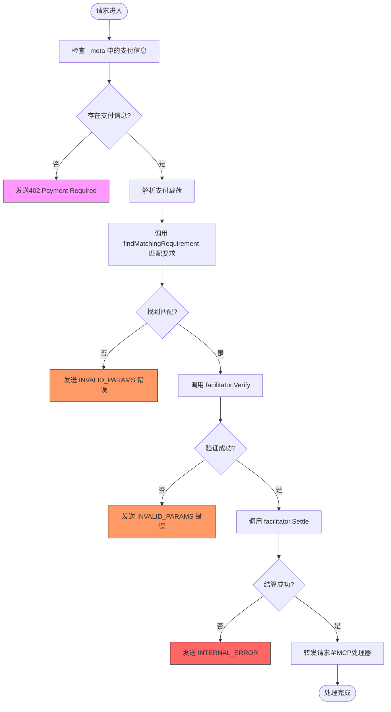
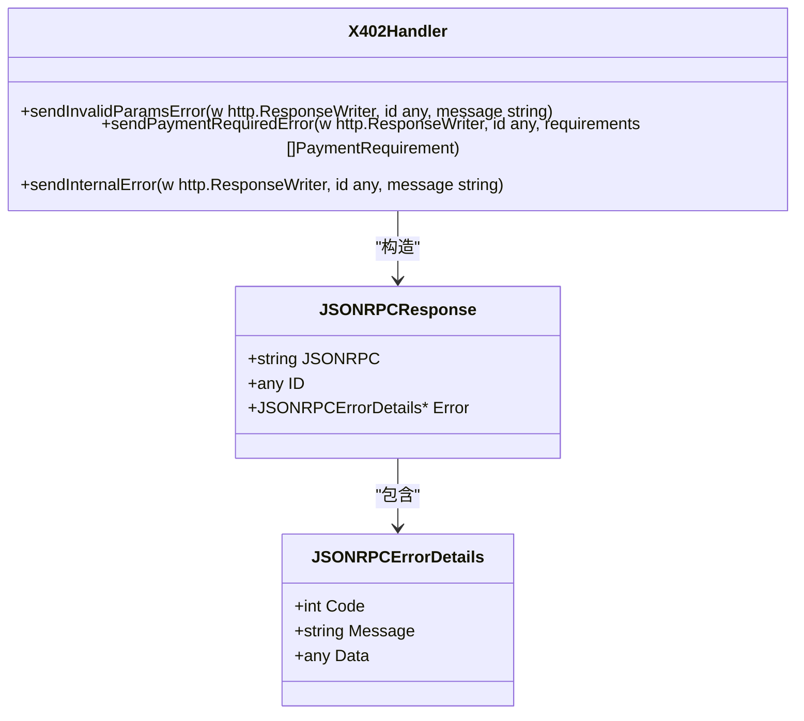

# 验证错误处理机制

<cite>
**Referenced Files in This Document**   
- [server/handler.go](file://server/handler.go)
- [errors.go](file://errors.go)
- [server/facilitator.go](file://server/facilitator.go)
- [server/types.go](file://server/types.go)
- [transport.go](file://transport.go)
- [types.go](file://types.go)
</cite>

## 目录
1. [引言](#引言)
2. [错误传播路径分析](#错误传播路径分析)
3. [错误响应构造机制](#错误响应构造机制)
4. [错误分类与处理策略](#错误分类与处理策略)
5. [日志识别与调试建议](#日志识别与调试建议)
6. [结论](#结论)

## 引言
本文档系统梳理了支付验证过程中各阶段的错误传播路径，重点分析从`findMatchingRequirement`未找到匹配规则，到`facilitator.Verify`调用失败或返回无效结果的完整错误处理流程。详细说明了不同错误类型如何被转换为对应的JSON-RPC错误响应，特别是`sendInvalidParamsError`在参数无效时的构造逻辑。文档还解释了错误消息的封装方式及其对客户端调试的意义，并提供了全面的错误分类表，涵盖配置错误、网络错误、签名无效、金额不足等情况，以及相应的日志识别特征与修复建议。

## 错误传播路径分析

在支付验证流程中，错误传播遵循严格的顺序和条件判断。当客户端发起请求时，系统首先检查请求中是否包含支付信息。如果未找到支付信息，则直接返回HTTP 402状态码对应的JSON-RPC错误。如果存在支付信息，则进入匹配和验证阶段。

匹配阶段的核心是`findMatchingRequirement`方法，该方法遍历配置的支付要求列表，根据网络和方案进行匹配。如果未找到匹配项，将返回"no matching payment requirement found"错误。此错误随后被转换为`sendInvalidParamsError`响应，告知客户端其支付参数不符合要求。

**Diagram sources**
- [server/handler.go](file://server/handler.go#L320-L337)
- [server/handler.go](file://server/handler.go#L217-L235)

**Section sources**
- [server/handler.go](file://server/handler.go#L217-L337)

## 错误响应构造机制

### sendInvalidParamsError 构造逻辑

`sendInvalidParamsError`方法负责构造参数无效时的JSON-RPC错误响应。该方法接收响应写入器、请求ID和错误消息作为参数，创建一个符合JSON-RPC 2.0规范的错误响应对象。

**Diagram sources**
- [server/handler.go](file://server/handler.go#L238-L251)
- [transport.go](file://transport.go)

**Section sources**
- [server/handler.go](file://server/handler.go#L238-L251)
- [errors.go](file://errors.go)

### 402与INVALID_PARAMS的使用场景区分

在系统中，错误码402和`INVALID_PARAMS`的使用场景有明确区分：

- **错误码402**：用于表示"支付要求"（Payment Required）场景。当客户端尚未提供任何支付信息时，服务器返回402错误码，同时在响应的`Data`字段中包含可接受的支付要求列表。这符合HTTP 402状态码的语义，即"需要付款"。

- **INVALID_PARAMS**：用于表示"参数无效"（Invalid Parameters）场景。当客户端提供了支付信息，但该信息不符合服务器要求时（如网络不匹配、方案不匹配、签名无效等），服务器返回`INVALID_PARAMS`错误码。这表示客户端提供的参数存在问题，需要修正后重新提交。

这种区分确保了客户端能够准确理解错误性质：402表示需要添加支付信息，而`INVALID_PARAMS`表示已有的支付信息需要修改。

## 错误分类与处理策略

### 错误分类表

| 错误类型 | 错误码/常量 | 触发条件 | 响应构造方法 | 日志特征 | 修复建议 |
|---------|-----------|---------|------------|---------|---------|
| 配置错误 | `ErrInvalidPaymentReqs` | 支付要求配置无效 | `sendInternalError` | "invalid payment requirements" | 检查服务器配置中的支付要求定义 |
| 网络错误 | `ErrUnsupportedNetwork` | 请求的网络不被支持 | `sendInvalidParamsError` | "unsupported network" | 确保客户端使用支持的网络（如Base、Sepolia） |
| 签名无效 | `INVALID_PARAMS` | 支付签名验证失败 | `sendInvalidParamsError` | "Payment verification failed" | 检查私钥和签名逻辑，确保使用正确的签名算法 |
| 金额不足 | `INVALID_PARAMS` | 支付金额低于要求 | `sendInvalidParamsError` | "Payment does not match requirements" | 确保支付金额满足`MaxAmountRequired`要求 |
| 找不到匹配要求 | `INVALID_PARAMS` | 无匹配的PaymentRequirement | `sendInvalidParamsError` | "no matching payment requirement found" | 检查客户端请求的network和scheme参数 |
| 验证器调用失败 | `INTERNAL_ERROR` | 调用facilitator服务失败 | `sendInternalError` | "Facilitator verification error" | 检查facilitator服务URL和网络连接 |
| 结算失败 | `INTERNAL_ERROR` | 支付结算失败 | `sendInternalError` | "Payment settlement failed" | 检查区块链网络状态和gas费用 |

### 错误封装方式

系统采用分层的错误封装方式，确保错误信息既包含用户友好的消息，又包含详细的调试信息。核心是`PaymentError`结构体，它包含以下字段：

- **Code**：错误代码，用于程序化处理
- **Message**：用户可读的错误消息
- **Resource**：关联的资源标识
- **Amount**：涉及的金额
- **Network**：涉及的网络
- **Wrapped**：包装的底层错误

这种封装方式使得上层代码可以轻松地提取关键信息进行处理，同时保留完整的错误上下文用于日志记录和调试。

## 日志识别与调试建议

### 日志识别特征

系统在`Verbose`模式下会输出详细的日志信息，这些日志对于调试至关重要。关键的日志识别特征包括：

- **[X402]前缀**：所有与x402相关的日志都带有此前缀，便于过滤和搜索
- **状态转换日志**：如"Tool '%s' requires payment, checking for payment in _meta"，显示处理流程的进展
- **错误详情日志**：如"Payment matching failed: %v"，提供具体的失败原因
- **网络交互日志**：如"Sending verify request to %s/verify"，显示与facilitator服务的交互

### 调试建议

1. **启用Verbose模式**：在开发和调试阶段，应启用`Verbose`模式以获取完整的日志输出
2. **检查请求流程**：按照"检查支付→匹配要求→验证→结算"的顺序逐步排查
3. **验证支付载荷**：使用`PaymentPayload`结构体验证客户端发送的支付信息格式
4. **测试匹配逻辑**：确保`findMatchingRequirement`方法能正确匹配网络和方案
5. **模拟facilitator响应**：在测试环境中使用mock facilitator来验证各种错误场景的处理

## 结论

本系统通过清晰的错误传播路径和规范的错误响应构造，实现了健壮的支付验证错误处理机制。通过区分402和`INVALID_PARAMS`的使用场景，系统能够向客户端提供准确的错误指导。详细的错误分类表和日志识别特征为开发人员提供了强大的调试工具，确保支付验证流程的可靠性和可维护性。