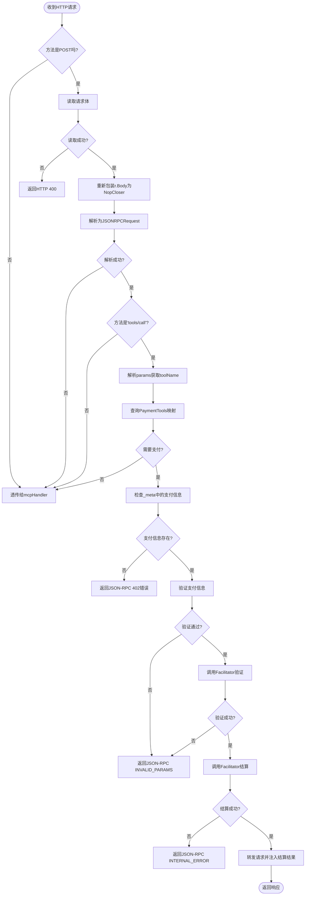

# 请求解析

<cite>
**Referenced Files in This Document**   
- [server/handler.go](file://server/handler.go)
- [server/types.go](file://server/types.go)
- [server/facilitator.go](file://server/facilitator.go)
</cite>

## 目录
1. [请求拦截与方法验证](#请求拦截与方法验证)
2. [请求体读取与重放支持](#请求体读取与重放支持)
3. [JSON-RPC请求解析与工具调用验证](#json-rpc请求解析与工具调用验证)
4. [工具名称提取与支付需求判断](#工具名称提取与支付需求判断)
5. [错误处理机制](#错误处理机制)
6. [完整请求处理流程图](#完整请求处理流程图)

## 请求拦截与方法验证

`X402Handler.ServeHTTP` 方法首先对传入的 HTTP 请求进行拦截，仅处理 POST 方法的请求。该设计基于 MCP 工具调用通常通过 POST 请求发起的约定。对于非 POST 请求，处理器会直接将其透传给底层的 `mcpHandler` 进行处理，确保非工具调用的请求不受影响。

**Section sources**
- [server/handler.go](file://server/handler.go#L32-L36)

## 请求体读取与重放支持

为了能够多次读取请求体内容（例如，先解析以判断是否需要支付，再转发给原始处理器），该方法使用 `io.ReadAll(r.Body)` 一次性读取整个请求体到内存中。随后，通过 `io.NopCloser(bytes.NewReader(body))` 将读取到的字节切片重新包装成一个 `io.ReadCloser` 接口，并将其赋值回 `r.Body`。

这一操作的关键在于 `io.NopCloser`，它提供了一个不会对底层 `io.Reader` 执行任何关闭操作的包装器，使得被包装的 `bytes.Reader` 可以被安全地重复读取。这解决了 HTTP 请求体在被读取一次后就无法再次读取的问题，为后续的 JSON 解析和可能的请求转发提供了基础。

**Section sources**
- [server/handler.go](file://server/handler.go#L41-L46)

## JSON-RPC请求解析与工具调用验证

在成功读取并缓冲请求体后，方法尝试使用 `json.Unmarshal` 将其反序列化为 `transport.JSONRPCRequest` 结构体。如果反序列化失败（例如，请求体不是有效的 JSON 格式），则认为该请求不符合 JSON-RPC 规范，同样将其透传给 `mcpHandler` 处理。

解析成功后，方法会检查 `JSONRPCRequest.Method` 字段。只有当该字段的值为 `"tools/call"` 时，才认定这是一个需要处理的工具调用。任何其他方法（如 `initialize` 或 `shutdown`）都会被直接透传，因为它们不属于需要支付的工具调用范畴。

**Section sources**
- [server/handler.go](file://server/handler.go#L48-L58)

## 工具名称提取与支付需求判断

对于确认为 `"tools/call"` 的请求，需要进一步解析其参数以获取被调用的工具名称。参数 `jsonrpcReq.Params` 的类型是 `any`，因此需要先将其序列化为 JSON 字节，再反序列化到 `mcp.CallToolParams` 结构体中。

提取出 `params.Name` 后，方法会查询 `h.config.PaymentTools` 映射。该映射的键是工具名称，值是该工具所需支付要求的列表。通过 `h.config.PaymentTools[toolName]` 可以判断该工具是否需要支付。如果 `needsPayment` 为 `false`，则说明该工具是免费的，请求将被直接透传。

**Section sources**
- [server/handler.go](file://server/handler.go#L60-L76)
- [server/types.go](file://server/types.go#L97)

## 错误处理机制

该方法实现了分层的错误处理机制：
1.  **请求体读取失败**：如果 `io.ReadAll` 返回错误，会立即向客户端返回 HTTP 400 错误，表示请求无效。
2.  **JSON 解析失败或非工具调用**：这两种情况都采用“透传”策略，即不进行任何支付处理，而是让原始的 `mcpHandler` 来决定如何响应。这保证了系统的兼容性和健壮性。
3.  **支付验证失败**：当请求需要支付但未提供有效支付信息，或支付信息不匹配要求时，会调用 `sendInvalidParamsError` 方法，返回一个 JSON-RPC 错误响应（错误码 `INVALID_PARAMS`），告知客户端支付信息有误。
4.  **内部处理失败**：在与支付中介（Facilitator）通信时发生错误，会调用 `sendInternalError` 方法，返回一个 JSON-RPC 内部错误，提示支付验证失败。

这些错误处理逻辑确保了在各种异常情况下，系统都能给出明确且符合规范的响应。

**Section sources**
- [server/handler.go](file://server/handler.go#L42-L44)
- [server/handler.go](file://server/handler.go#L50-L56)
- [server/handler.go](file://server/handler.go#L146-L155)
- [server/handler.go](file://server/handler.go#L157-L166)

## 完整请求处理流程图

**Diagram sources **
- [server/handler.go](file://server/handler.go#L32-L214)
- [server/handler.go](file://server/handler.go#L217-L235)
- [server/handler.go](file://server/handler.go#L254-L267)
- [server/facilitator.go](file://server/facilitator.go#L15-L16)