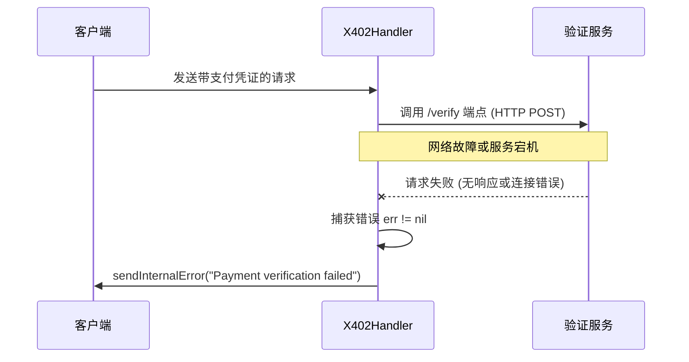
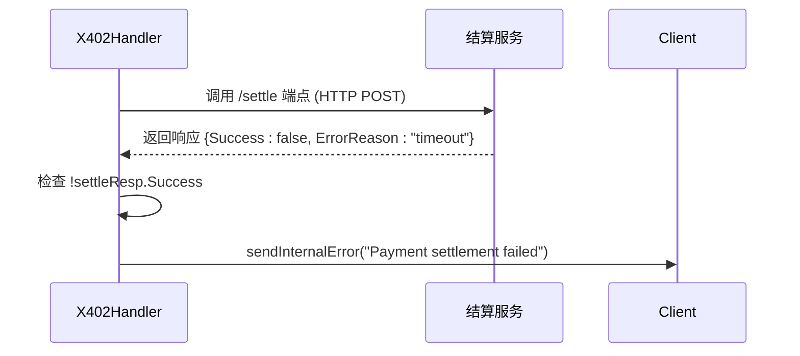

# INTERNAL_ERROR 错误

<cite>
**Referenced Files in This Document**   
- [server/handler.go](file://server/handler.go)
- [server/facilitator.go](file://server/facilitator.go)
- [server/types.go](file://server/types.go)
- [errors.go](file://errors.go)
</cite>

## 目录
1. [引言](#引言)
2. [INTERNAL_ERROR 的定义与语义](#internal_error-的定义与语义)
3. [调用上下文与触发场景](#调用上下文与触发场景)
4. [错误响应格式](#错误响应格式)
5. [与 INVALID_PARAMS 的关键区别](#与-invalid_params-的关键区别)
6. [容错与恢复建议](#容错与恢复建议)
7. [监控与日志建议](#监控与日志建议)
8. [结论](#结论)

## 引言
本文档旨在深入分析 `sendInternalError` 函数的使用场景和上下文，明确 `INTERNAL_ERROR` 错误在服务端异常情况下的应用。该错误用于指示服务器内部发生故障，而非客户端请求错误。文档将详细说明其在支付验证和链上结算失败时的触发机制，并提供与 `INVALID_PARAMS` 错误的对比，以帮助开发者和运维人员正确理解和处理此类系统级故障。

## INTERNAL_ERROR 的定义与语义
`INTERNAL_ERROR` 是一个 JSON-RPC 标准错误码，用于表示服务器在处理请求时遇到了意外的内部问题。它明确区分于客户端错误（如参数无效），属于服务端系统故障。

该错误码的具体定义和使用依赖于 `mcp` 包中的 `JSONRPCErrorDetails` 结构体，其 `Code` 字段被设置为 `mcp.INTERNAL_ERROR` 常量。

**Section sources**
- [server/handler.go](file://server/handler.go#L254-L267)

## 调用上下文与触发场景
`sendInternalError` 函数是 `X402Handler` 结构体的一个方法，专门用于在发生服务器内部错误时向客户端发送标准化的 JSON-RPC 错误响应。其调用上下文主要集中在与外部服务交互失败的场景。

### Facilitator 验证服务调用失败
当服务器需要验证客户端提供的支付凭证时，会通过 `facilitator.Verify` 方法调用外部的验证服务。如果此 HTTP 调用本身失败（例如，网络连接超时、DNS 解析失败、目标服务完全不可达），则会触发 `INTERNAL_ERROR`。



**Diagram sources**
- [server/handler.go](file://server/handler.go#L189-L195)
- [server/facilitator.go](file://server/facilitator.go#L75-L100)

### 链上结算异常
在验证通过后，服务器会尝试进行链上结算（除非处于 `VerifyOnly` 模式）。结算过程通过 `facilitator.Settle` 方法调用外部服务。如果结算请求失败，或者服务返回的响应中 `Success` 字段为 `false`，则会触发 `INTERNAL_ERROR`。



**Diagram sources**
- [server/handler.go](file://server/handler.go#L208-L212)
- [server/types.go](file://server/types.go#L90-L105)

## 错误响应格式
当 `sendInternalError` 被调用时，服务器会返回一个符合 JSON-RPC 2.0 规范的错误响应。HTTP 状态码为 `200 OK`，但响应体中的 `error` 字段包含了具体的错误信息。

### JSON-RPC 错误响应示例
```json
{
  "jsonrpc": "2.0",
  "id": "req-123",
  "error": {
    "code": -32603,
    "message": "Payment verification failed"
  }
}
```

**Section sources**
- [server/handler.go](file://server/handler.go#L254-L267)

## 与 INVALID_PARAMS 的关键区别
正确区分 `INTERNAL_ERROR` 和 `INVALID_PARAMS` 对于故障排查至关重要。

| 特性 | INTERNAL_ERROR | INVALID_PARAMS |
| :--- | :--- | :--- |
| **错误类型** | 服务器内部故障 | 客户端请求数据无效 |
| **责任方** | 服务提供方 | 服务调用方 |
| **可恢复性** | 通常需服务端修复 | 客户端需修正请求后重试 |
| **触发原因** | 外部服务调用失败、内部逻辑崩溃 | 支付凭证格式错误、不匹配支付要求 |
| **HTTP 状态码** | 200 OK (JSON-RPC 内部错误) | 200 OK (JSON-RPC 内部错误) |
| **错误码** | -32603 | -32602 |

**Section sources**
- [server/handler.go](file://server/handler.go#L254-L267)
- [server/handler.go](file://server/handler.go#L237-L253)

## 容错与恢复建议
### 对于开发者
- **幂等性设计**：确保客户端在收到 `INTERNAL_ERROR` 后可以安全地重试请求，因为服务端可能已部分执行了操作（如已验证支付）。
- **退避重试**：实现指数退避算法进行重试，避免在服务端故障时造成雪崩效应。
- **错误分类**：在客户端逻辑中明确区分 `INTERNAL_ERROR` 和 `INVALID_PARAMS`，对前者进行重试，对后者应修正请求数据。

### 对于服务端
- **服务降级**：当 `facilitator` 服务持续不可用时，考虑临时进入 `VerifyOnly` 模式，仅验证支付但不进行结算，以保证核心功能可用。
- **熔断机制**：集成熔断器（如 Hystrix），在 `facilitator` 服务连续失败达到阈值时，快速失败并返回 `INTERNAL_ERROR`，避免资源耗尽。

## 监控与日志建议
### 日志记录
`sendInternalError` 的调用通常伴随着 `Verbose` 日志的输出，这对于定位问题根源至关重要。

- **关键日志**：`[X402] Facilitator verification error: %v` 和 `[X402] Settlement failed: %s` 提供了最直接的故障信息。
- **上下文信息**：日志中包含了 `network`、`scheme`、`from`、`to` 等支付上下文，有助于复现问题。

**Section sources**
- [server/handler.go](file://server/handler.go#L190)
- [server/handler.go](file://server/handler.go#L210)

### 监控指标
建议建立以下监控告警：
- **错误率监控**：实时监控 `INTERNAL_ERROR` 的发生频率。偶发性错误可能是网络抖动，而持续性高错误率则表明 `facilitator` 服务或网络链路存在严重问题。
- **外部服务健康度**：直接监控 `facilitator` 服务的 `/health` 或 `/ping` 端点的可用性和响应延迟。
- **HTTP 客户端指标**：监控 `HTTPFacilitator` 的 HTTP 客户端指标，如连接超时、读取超时、连接池耗尽等。

## 结论
`INTERNAL_ERROR` 是一个关键的系统级错误码，用于标识服务端在处理支付流程时发生的内部故障。它主要由与 `facilitator` 服务的通信失败（验证或结算）所触发。开发者必须理解其与 `INVALID_PARAMS` 的本质区别，并据此设计客户端的重试逻辑。运维人员应通过详细的 `Verbose` 日志和健全的监控体系，及时发现并解决导致 `INTERNAL_ERROR` 的底层服务问题，确保系统的稳定性和可靠性。