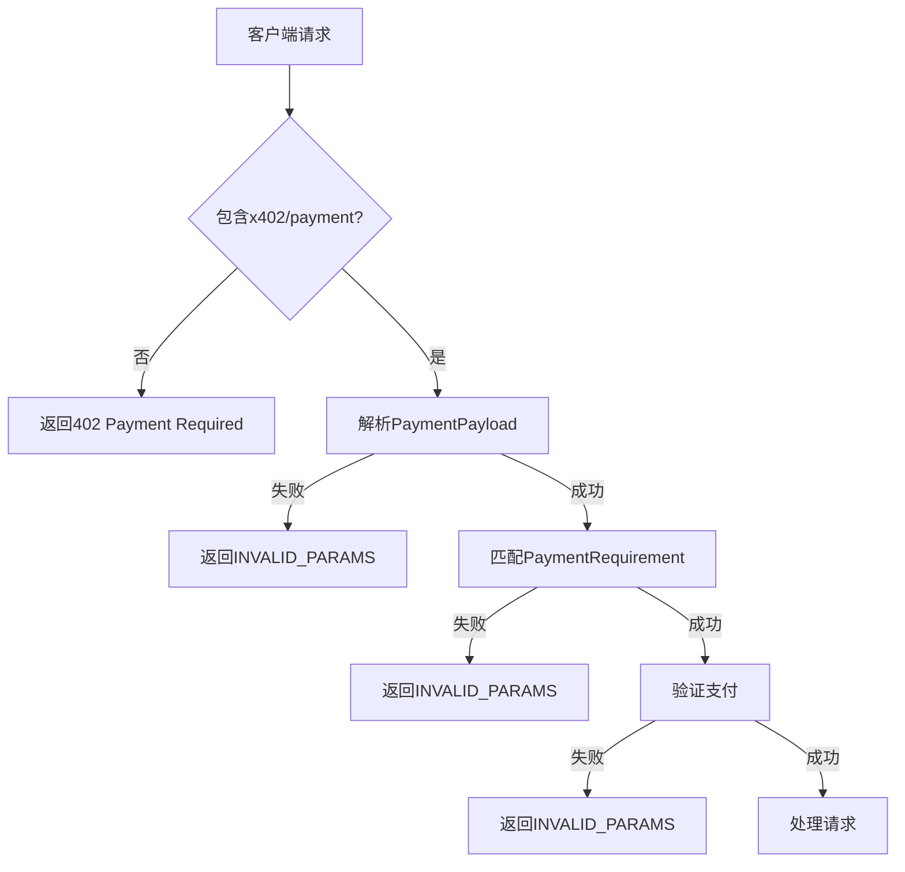

# INVALID_PARAMS 错误

<cite>
**Referenced Files in This Document**  
- [server/handler.go](file://server/handler.go#L238-L251)
- [errors.go](file://errors.go#L0-L59)
- [server/types.go](file://server/types.go#L27-L42)
- [server/handler.go](file://server/handler.go#L320-L337)
- [server/handler.go](file://server/handler.go#L217-L235)
- [server/handler.go](file://server/handler.go#L254-L267)
</cite>

## 目录
1. [INVALID_PARAMS 错误行为逻辑](#invalid_params-错误行为逻辑)
2. [触发条件分析](#触发条件分析)
3. [错误码语义对比](#错误码语义对比)
4. [JSON-RPC 响应结构](#json-rpc-响应结构)
5. [错误传递机制](#错误传递机制)
6. [用户友好错误信息策略](#用户友好错误信息策略)

## INVALID_PARAMS 错误行为逻辑

`sendInvalidParamsError` 函数是 X402 支付验证系统中的关键错误处理组件，负责在支付参数验证失败时向客户端返回标准化的错误响应。该函数封装了 JSON-RPC 2.0 错误响应的构造逻辑，确保所有与支付参数相关的错误都以一致的格式返回。

该函数接收 HTTP 响应写入器、请求 ID 和错误消息作为参数，构建一个符合 JSON-RPC 规范的响应对象。响应的 HTTP 状态码始终为 200 OK，而实际的错误信息则通过 JSON-RPC 的错误字段传达，这符合 x402 规范中使用 JSON-RPC 错误进行支付相关通信的要求。

**Section sources**
- [server/handler.go](file://server/handler.go#L238-L251)

## 触发条件分析

`sendInvalidParamsError` 函数在支付验证流程中会在多种情况下被触发，主要集中在 `_meta` 字段中支付数据的验证阶段。

首先，当 `_meta` 字段中的 `x402/payment` 数据存在格式错误，无法被正确序列化为 JSON 时，系统会立即调用此函数。其次，如果支付数据虽然格式正确，但无法被解析为有效的 `PaymentPayload` 结构体，也会触发该错误。`PaymentPayload` 的结构在 `server/types.go` 中明确定义，包含 `x402Version`、`scheme`、`network` 等关键字段，任何缺失或类型错误都会导致解析失败。

最常见的情况是支付参数与服务器配置的 `PaymentRequirement` 不匹配。`findMatchingRequirement` 函数负责此匹配过程，它会检查支付请求中的 `network` 和 `scheme` 字段是否与预设的任一支付要求完全一致。如果没有任何一个 `PaymentRequirement` 能满足这些条件，`findMatchingRequirement` 将返回一个错误，该错误随后被 `sendInvalidParamsError` 捕获并返回给客户端。

**Section sources**
- [server/handler.go](file://server/handler.go#L32-L214)
- [server/types.go](file://server/types.go#L27-L42)
- [server/handler.go](file://server/handler.go#L320-L337)

## 错误码语义对比

`sendInvalidParamsError` 使用 `mcp.INVALID_PARAMS` 标准错误码，其语义与 `402` 和 `mcp.INTERNAL_ERROR` 有明确区分。

`mcp.INVALID_PARAMS` (通常映射为 -32602) 用于表示客户端提供的参数存在错误，但问题出在参数本身，而非支付的必要性。这包括支付数据格式错误、无法解析或与要求不匹配等情况。它指导客户端修正其请求参数。

`402` 错误码则完全不同，它表示“支付要求”（Payment Required），意味着该资源或工具调用需要付费才能访问。当请求中完全缺失 `x402/payment` 数据时，系统会调用 `sendPaymentRequiredError` 函数返回此错误，同时在响应的 `Data` 字段中附带可用的支付选项列表，引导客户端进行支付。

`mcp.INTERNAL_ERROR` (通常映射为 -32603) 表示服务器内部发生了意外错误，例如与支付中介（facilitator）通信失败或结算过程出错。这类错误通常不是客户端可以修正的，表明服务端存在问题。



**Diagram sources**
- [server/handler.go](file://server/handler.go#L217-L235)
- [server/handler.go](file://server/handler.go#L238-L251)
- [server/handler.go](file://server/handler.go#L254-L267)

**Section sources**
- [server/handler.go](file://server/handler.go#L217-L235)
- [server/handler.go](file://server/handler.go#L238-L251)
- [server/handler.go](file://server/handler.go#L254-L267)

## JSON-RPC 响应结构

当 `sendInvalidParamsError` 被调用时，它会生成一个标准的 JSON-RPC 2.0 错误响应。该响应的结构如下：

```json
{
  "jsonrpc": "2.0",
  "id": "request-id",
  "error": {
    "code": -32602,
    "message": "具体的错误描述信息"
  }
}
```

其中，`code` 字段的值为 `mcp.INVALID_PARAMS` 的常量值，`message` 字段包含了具体的、用户可读的错误原因，例如 "Failed to parse payment data" 或 "Payment does not match requirements: no matching payment requirement found for network=..."。这个结构确保了客户端可以程序化地识别错误类型，并根据 `message` 内容采取相应的修正措施。

**Section sources**
- [server/handler.go](file://server/handler.go#L238-L251)

## 错误传递机制

错误传递机制是该系统健壮性的关键。在 `ServeHTTP` 方法中，对支付数据的处理是一个链式调用过程。从检查 `_meta` 字段开始，到解析 `PaymentPayload`，再到调用 `findMatchingRequirement` 进行匹配，每一步都可能产生错误。

这些错误被逐层捕获并转化为 `sendInvalidParamsError` 调用。例如，`findMatchingRequirement` 函数在找不到匹配项时会返回一个 `fmt.Errorf` 错误，这个错误被 `ServeHTTP` 中的 `err` 变量捕获，然后通过 `fmt.Sprintf` 将其错误信息嵌入到 `sendInvalidParamsError` 的 `message` 参数中。这种机制确保了底层的错误原因能够清晰地传递给最终用户，而不仅仅是返回一个模糊的“无效参数”提示。

**Section sources**
- [server/handler.go](file://server/handler.go#L32-L214)
- [server/handler.go](file://server/handler.go#L320-L337)

## 用户友好错误信息策略

该系统采用了渐进式的用户友好错误信息策略。最基础的错误信息（如 "Failed to parse payment data"）直接由 `sendInvalidParamsError` 的调用点提供。更高级的策略体现在对底层错误的包装和格式化上。

例如，在处理 `findMatchingRequirement` 的失败时，系统没有简单地返回一个通用错误，而是将底层的 `fmt.Errorf` 错误信息通过 `fmt.Sprintf` 动态地嵌入到一个更具上下文的错误消息中："Payment does not match requirements: %v"。这使得返回给客户端的错误信息不仅指出了问题（支付不匹配），还包含了具体的原因（如网络或方案不匹配），极大地帮助了客户端开发者进行调试和修正。

此外，当支付被中介（facilitator）验证失败时，系统会优先使用 `verifyResp.InvalidReason` 作为错误消息，这允许中介服务返回更精确、更具体的业务逻辑错误，从而实现了错误信息的分层和细化。

**Section sources**
- [server/handler.go](file://server/handler.go#L32-L214)
- [server/handler.go](file://server/handler.go#L238-L251)