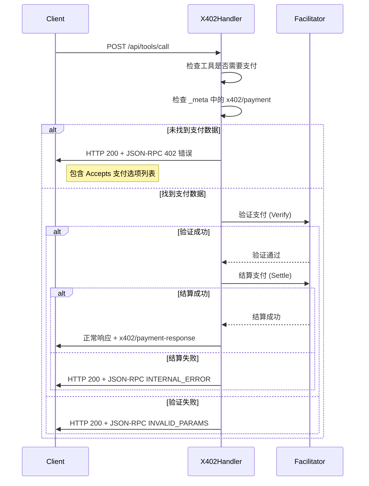
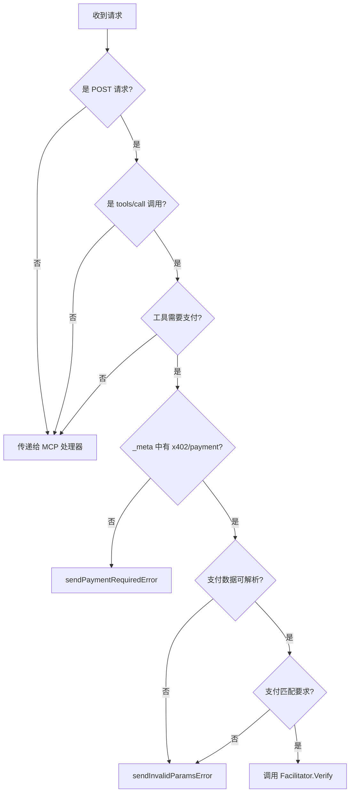

# 错误处理机制

<cite>
**Referenced Files in This Document**   
- [server/handler.go](file://server/handler.go)
- [errors.go](file://errors.go)
- [server/types.go](file://server/types.go)
- [transport.go](file://transport.go)
- [types.go](file://types.go)
</cite>

## 目录
1. [引言](#引言)
2. [核心错误处理策略](#核心错误处理策略)
3. [402 Payment Required 错误](#402-payment-required-错误)
4. [INVALID_PARAMS 错误](#invalid_params-错误)
5. [INTERNAL_ERROR 错误](#internal_error-错误)
6. [错误响应结构对比](#错误响应结构对比)
7. [日志与调试](#日志与调试)

## 引言
本文档系统化地阐述了 `X402Handler` 中的错误处理机制。该机制基于 JSON-RPC 2.0 规范，通过特定的错误码来管理客户端与服务器之间的支付交互。核心在于区分三种关键的错误类型：`sendPaymentRequiredError`、`sendInvalidParamsError` 和 `sendInternalError`。这些错误类型分别对应不同的业务场景和语义，确保了支付流程的清晰与健壮。文档将详细说明每种错误的触发条件、响应结构及其在 HTTP 和 JSON-RPC 协议栈中的特殊处理方式。

## 核心错误处理策略
`X402Handler` 的核心职责是拦截对需要付费工具的调用，并在不同阶段返回相应的错误。其处理流程是一个典型的决策树：
1.  **检查支付需求**：当客户端调用一个被配置为需要支付的工具时，服务器首先检查请求的 `_meta` 字段中是否包含 `x402/payment` 数据。
2.  **无支付数据**：如果未找到支付数据，则触发 `sendPaymentRequiredError`，返回 402 错误，告知客户端需要支付，并附带可接受的支付选项列表。
3.  **支付数据存在但无效**：如果支付数据存在，但格式错误或与服务器要求不匹配，则触发 `sendInvalidParamsError`。
4.  **服务端处理失败**：如果在验证或结算支付时，服务端（如 `facilitator`）发生内部错误，则触发 `sendInternalError`。

这种分层的错误处理策略使得客户端能够根据不同的错误码采取精确的应对措施，例如请求支付、修正支付数据或报告服务端问题。

**Section sources**
- [server/handler.go](file://server/handler.go#L32-L214)

## 402 Payment Required 错误

### 语义与使用场景
`sendPaymentRequiredError` 方法用于表示“支付是必需的”。当客户端尝试访问一个需要付费的资源（工具）但未在请求中提供任何支付信息时，此错误会被触发。这是支付流程的起点，旨在引导客户端完成支付。

### JSON-RPC 2.0 响应与 HTTP 200 的特殊性
此错误的实现严格遵循 JSON-RPC 2.0 规范，但有一个关键的 HTTP 层面的特殊性：
-   **JSON-RPC 层**：在 JSON-RPC 响应体中，`error` 对象的 `code` 字段被设置为 `402`，`message` 为 `"Payment required"`。更重要的是，`data` 字段包含一个 `PaymentRequirements402Response` 结构，其中的 `Accepts` 列表详细说明了服务器接受的所有支付方式。
-   **HTTP 层**：尽管 JSON-RPC 报告了 402 错误，但 HTTP 响应的状态码 (`w.WriteHeader`) 仍被设置为 `http.StatusOK` (200)。这是一种设计模式，它允许服务器在语义上表示“请求已成功处理”，而“错误”是业务逻辑层面的，而非传输层面的。这确保了请求能被正确路由和处理，同时将支付要求作为业务逻辑的一部分返回。

**Diagram sources**
- [server/handler.go](file://server/handler.go#L217-L235)
- [server/types.go](file://server/types.go#L19-L23)

**Section sources**
- [server/handler.go](file://server/handler.go#L217-L235)
- [server/types.go](file://server/types.go#L19-L23)

## INVALID_PARAMS 错误

### 语义与使用场景
`sendInvalidParamsError` 方法用于表示“无效的参数”。在 `X402Handler` 的上下文中，此错误主要在以下两种情况下被触发：
1.  **支付数据格式错误**：客户端在 `_meta` 字段中提供了 `x402/payment` 数据，但该数据的 JSON 结构无法被服务器正确解析。
2.  **支付不匹配**：支付数据虽然格式正确，但其内容（如网络 `network` 或支付方案 `scheme`）与服务器为该工具配置的 `PaymentRequirement` 不匹配。

此错误的语义是客户端需要修正其请求，特别是支付部分，然后重试。

### 响应结构
该方法返回一个标准的 JSON-RPC 错误，其 `code` 字段的值为 `mcp.INVALID_PARAMS`（通常为 -32602），`message` 字段则包含一个描述具体问题的字符串。与 402 错误不同，它不包含 `data` 字段来传递额外的支付选项。

**Diagram sources**
- [server/handler.go](file://server/handler.go#L238-L251)
- [errors.go](file://errors.go#L10-L15)

**Section sources**
- [server/handler.go](file://server/handler.go#L238-L251)

## INTERNAL_ERROR 错误

### 语义与使用场景
`sendInternalError` 方法用于表示“内部错误”。当服务器在处理支付流程时自身发生故障，且该故障不属于客户端参数错误时，会触发此错误。在 `X402Handler` 中，典型场景包括：
-   调用 `facilitator.Verify` 或 `facilitator.Settle` 方法时发生网络错误或系统异常。
-   `facilitator` 服务本身返回了无法处理的错误。

此错误的语义是问题出在服务端，客户端通常应将此视为一个需要报告的严重问题，而不是通过修改请求来解决。

### 响应结构
该方法返回一个 JSON-RPC 错误，其 `code` 字段的值为 `mcp.INTERNAL_ERROR`（通常为 -32603），`message` 字段提供一个通用的错误描述，如 "Payment verification failed"。它同样不包含 `data` 字段。

**Section sources**
- [server/handler.go](file://server/handler.go#L254-L267)

## 错误响应结构对比

下表总结了三种核心错误类型的语义、触发条件和响应结构差异：

| 特性 | `sendPaymentRequiredError` | `sendInvalidParamsError` | `sendInternalError` |
| :--- | :--- | :--- | :--- |
| **语义** | 资源需要支付 | 客户端提供的支付数据无效 | 服务端在处理支付时发生内部错误 |
| **主要触发条件** | `_meta` 中缺少 `x402/payment` 数据 | 支付数据无法解析或与要求不匹配 | `facilitator` 服务调用失败 |
| **JSON-RPC 错误码** | `402` | `mcp.INVALID_PARAMS` (-32602) | `mcp.INTERNAL_ERROR` (-32603) |
| **HTTP 状态码** | `200 OK` | `200 OK` | `200 OK` |
| **响应体 `data` 字段** | 包含 `PaymentRequirements402Response`，其中有 `Accepts` 列表 | 无 | 无 |
| **客户端应对策略** | 发起支付流程 | 修正支付数据并重试 | 记录错误，可能需要报告给服务提供者 |

## 日志与调试
当 `X402Handler` 的配置中 `Verbose` 字段被设置为 `true` 时，详细的日志记录会被启用。这些日志对于调试至关重要，它们会输出：
-   进入的请求和其来源。
-   工具是否需要支付的决策过程。
-   在返回 402 错误前，会打印出所有可接受的支付选项（`Accepts` 列表）。
-   支付数据的解析结果。
-   与 `facilitator` 服务交互的详细过程，包括验证和结算的请求与响应。

这些 `log.Printf` 语句为开发者提供了清晰的执行轨迹，极大地简化了在支付流程中定位问题的过程。

**Section sources**
- [server/handler.go](file://server/handler.go#L32-L214)
- [server/handler.go](file://server/handler.go#L217-L235)
- [server/handler.go](file://server/handler.go#L238-L251)
- [server/handler.go](file://server/handler.go#L254-L267)