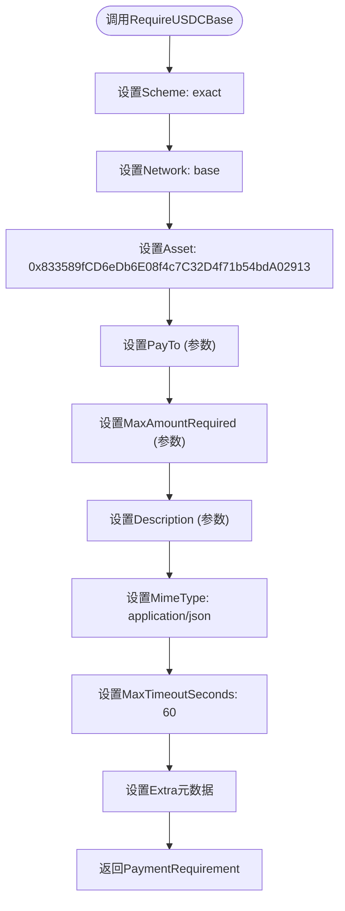
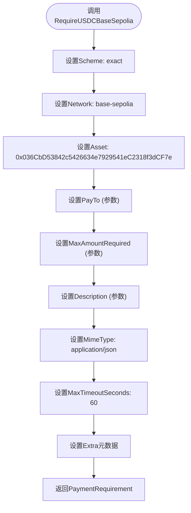
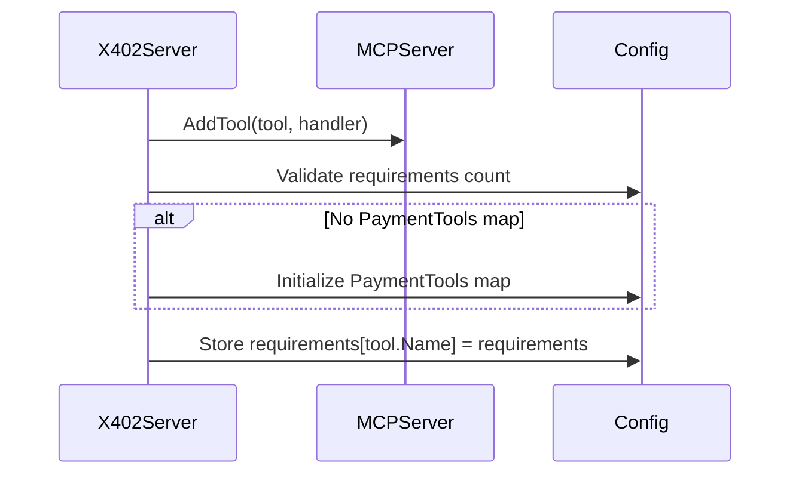
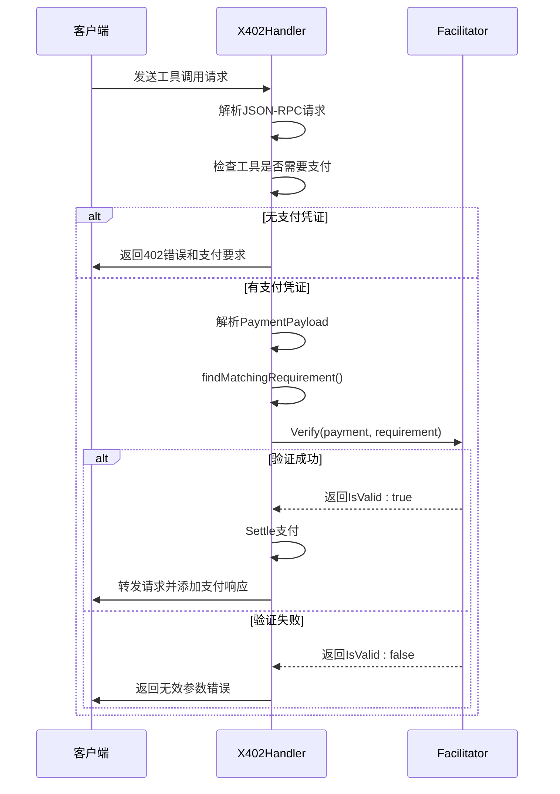
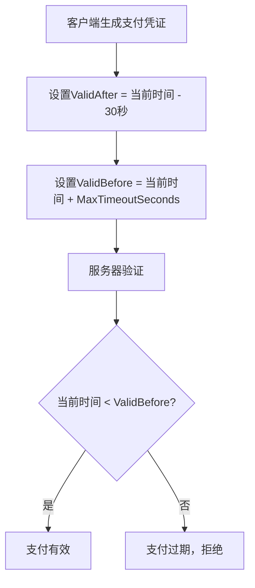

# 支付要求配置

<cite>
**本文档引用的文件**
- [server/requirements.go](file://server/requirements.go)
- [server/types.go](file://server/types.go)
- [server/handler.go](file://server/handler.go)
- [server/server.go](file://server/server.go)
</cite>

## 目录
1. [引言](#引言)
2. [PaymentRequirement数据结构](#paymentrequirement数据结构)
3. [支付要求辅助函数](#支付要求辅助函数)
4. [字段语义详解](#字段语义详解)
5. [支付要求注册与验证](#支付要求注册与验证)
6. [自定义支付要求](#自定义支付要求)
7. [超时与安全机制](#超时与安全机制)

## 引言
本文档深入解析了X402支付协议中的`PaymentRequirement`数据结构及其在动态定价策略中的应用。`PaymentRequirement`定义了访问特定资源或工具所需的支付条件，是实现微支付和访问控制的核心机制。该结构被服务器用于声明支付需求，并由客户端用于生成和验证支付凭证。文档详细阐述了其字段语义、预配置的辅助函数以及在系统中的完整生命周期。

## PaymentRequirement数据结构
`PaymentRequirement`结构体定义了服务器对访问特定资源所要求的支付条件。它遵循X402规范，包含了支付方案、网络、资产、收款地址等关键信息。该结构在服务器端用于声明支付需求，在客户端用于匹配和生成支付。

```mermaid
classDiagram
class PaymentRequirement {
+string Scheme
+string Network
+string MaxAmountRequired
+string Asset
+string PayTo
+string Resource
+string Description
+string MimeType
+interface{} OutputSchema
+int MaxTimeoutSeconds
+map[string]string Extra
}
```

**Diagram sources**
- [server/types.go](file://server/types.go#L4-L16)

**Section sources**
- [server/types.go](file://server/types.go#L4-L16)

## 支付要求辅助函数
为了简化在Base主网和Sepolia测试网上使用USDC代币的支付要求配置，系统提供了两个专用的辅助函数。

### RequireUSDCBase
`RequireUSDCBase`函数用于创建针对Base主网的USDC支付要求。它预配置了Base主网的USDC合约地址、资产符号和标准超时限制，开发者只需提供收款地址、金额和描述即可快速创建支付要求。



**Diagram sources**
- [server/requirements.go](file://server/requirements.go#L5-L20)

**Section sources**
- [server/requirements.go](file://server/requirements.go#L5-L20)

### RequireUSDCBaseSepolia
`RequireUSDCBaseSepolia`函数用于创建针对Base Sepolia测试网的USDC支付要求。与`RequireUSDCBase`类似，它预配置了测试网的USDC合约地址和网络标识，便于在开发和测试环境中快速部署支付功能。



**Diagram sources**
- [server/requirements.go](file://server/requirements.go#L23-L38)

**Section sources**
- [server/requirements.go](file://server/requirements.go#L23-L38)

## 字段语义详解
`PaymentRequirement`结构的每个字段都有明确的语义和用途，共同定义了支付的完整上下文。

| 字段 | 类型 | 必需性 | 语义说明 |
| :--- | :--- | :--- | :--- |
| **Scheme** | string | 是 | 支付方案，如"exact"表示精确金额支付。用于匹配支付凭证的方案。 |
| **Network** | string | 是 | 区块链网络标识，如"base"或"base-sepolia"。指定了交易发生的网络。 |
| **Asset** | string | 是 | 代币合约地址。定义了支付所使用的具体ERC-20代币。 |
| **PayTo** | string | 是 | 收款钱包地址。资金将被授权转移至此地址。 |
| **MaxAmountRequired** | string | 是 | 最大需求数额，以字符串形式表示的整数。客户端支付的金额必须小于或等于此值。 |
| **Resource** | string | 否 | 资源标识符，通常为工具的MCP URI。描述了支付所换取的资源。 |
| **Description** | string | 否 | 人类可读的支付描述，用于向用户解释支付目的。 |
| **MimeType** | string | 否 | 响应数据的MIME类型，如"application/json"。约束了服务器响应的数据格式。 |
| **OutputSchema** | interface{} | 否 | 响应数据的JSON Schema。用于验证服务器返回结果的结构。 |
| **MaxTimeoutSeconds** | int | 是 | 支付凭证的最大有效秒数。用于防止重放攻击。 |
| **Extra** | map[string]string | 否 | 扩展元数据，如代币名称(name)和版本(version)，供签名时使用。 |

**Section sources**
- [server/types.go](file://server/types.go#L4-L16)

## 支付要求注册与验证
支付要求通过`AddPayableTool`方法注册，并在`X402Handler`中用于验证客户端提交的支付凭证。

### 注册流程
`AddPayableTool`方法将一个需要支付的工具及其支付要求注册到服务器。它首先将工具添加到MCP服务器，然后将支付要求存储在配置的`PaymentTools`映射中，以工具名称为键。



**Diagram sources**
- [server/server.go](file://server/server.go#L35-L53)

**Section sources**
- [server/server.go](file://server/server.go#L35-L53)

### 验证流程
`X402Handler.ServeHTTP`方法拦截工具调用请求，检查`_meta`字段中的支付凭证。`findMatchingRequirement`方法根据`Network`和`Scheme`字段匹配相应的支付要求，然后通过`facilitator.Verify`验证支付凭证的有效性。



**Diagram sources**
- [server/handler.go](file://server/handler.go#L32-L214)
- [server/handler.go](file://server/handler.go#L320-L337)

**Section sources**
- [server/handler.go](file://server/handler.go#L32-L214)

## 自定义支付要求
除了使用预定义的辅助函数，开发者可以创建自定义的`PaymentRequirement`来支持其他ERC-20代币或网络。例如，为Polygon网络上的DAI代币创建支付要求：

```go
customRequirement := server.PaymentRequirement{
    Scheme:            "exact",
    Network:           "polygon",
    Asset:             "0x8f3Cf7ad23Cd3CaDbD9735AFf958023239c6A063", // DAI on Polygon
    PayTo:             "0xYourWalletAddress",
    MaxAmountRequired: "500",
    Description:       "Payment for premium service",
    MimeType:          "application/json",
    MaxTimeoutSeconds: 120,
    Extra: map[string]string{
        "name":    "Dai Stablecoin",
        "version": "2",
    },
}
```

此自定义要求可以像`RequireUSDCBase`一样，通过`AddPayableTool`方法注册到任何工具上。

**Section sources**
- [server/types.go](file://server/types.go#L4-L16)

## 超时与安全机制
`MaxTimeoutSeconds`和`MimeType`字段在保障支付安全性和数据一致性方面起着关键作用。

### MaxTimeoutSeconds的作用
`MaxTimeoutSeconds`字段定义了支付凭证的有效时间窗口。在`signer.SignPayment`方法中，它被用来计算`validBefore`时间戳。任何在此时间戳之后提交的支付都将被拒绝，这有效防止了重放攻击（Replay Attack），即攻击者重复使用旧的、有效的支付凭证。



**Diagram sources**
- [signer.go](file://signer.go#L136-L138)
- [server/types.go](file://server/types.go#L14)

**Section sources**
- [signer.go](file://signer.go#L112-L221)

### MimeType的约束
`MimeType`字段约束了服务器响应客户端请求时应返回的数据格式。在`X402Handler.ServeHTTP`中，当服务器准备响应时，会检查并确保`MimeType`被正确设置（默认为`application/json`）。这保证了客户端能够以预期的格式解析响应数据，避免了因数据格式不匹配导致的解析错误。

**Section sources**
- [server/handler.go](file://server/handler.go#L93-L94)
- [server/requirements.go](file://server/requirements.go#L13)