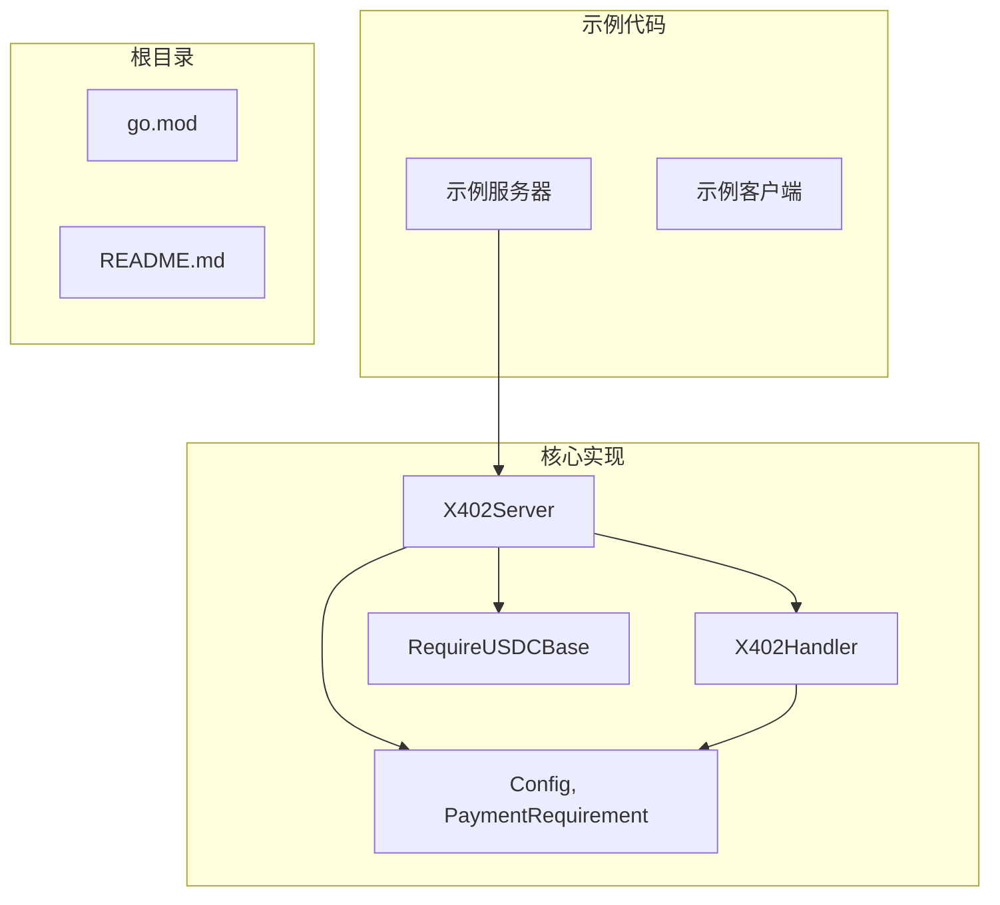
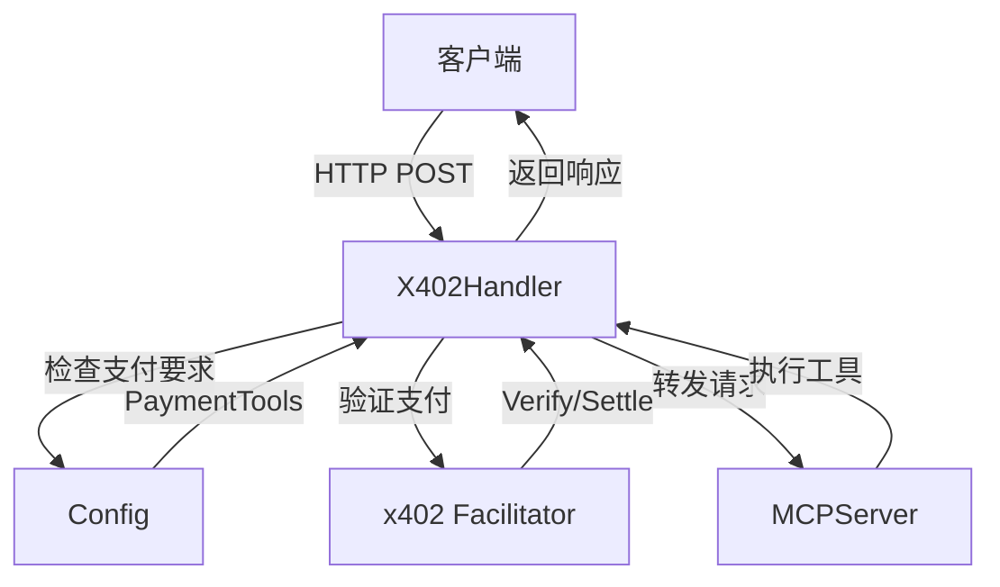
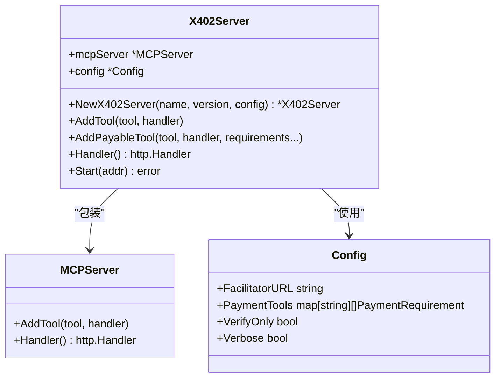
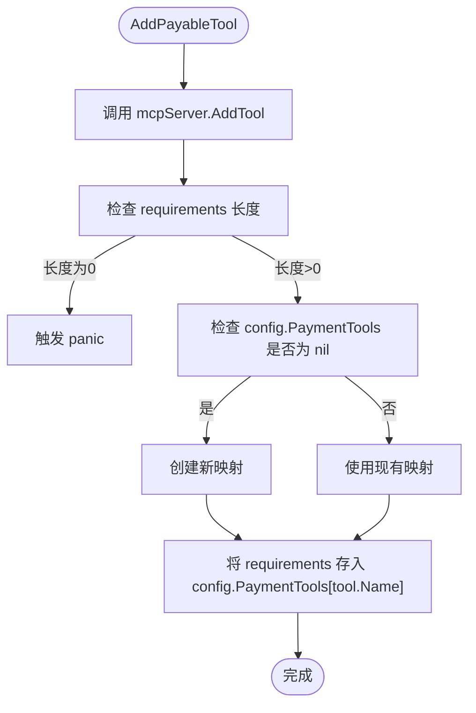
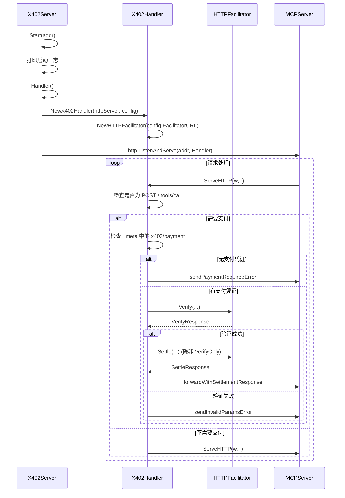
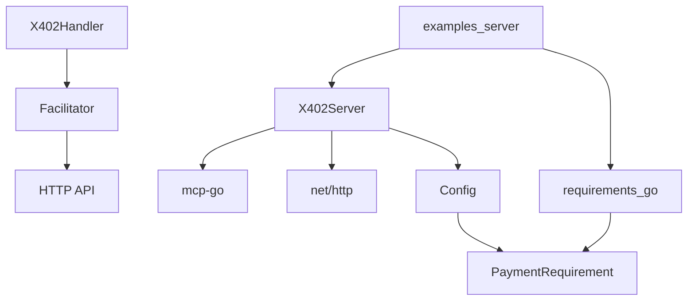

# 服务器包装器

<cite>
**本文档中引用的文件**  
- [server.go](file://server/server.go)
- [handler.go](file://server/handler.go)
- [types.go](file://server/types.go)
- [requirements.go](file://server/requirements.go)
- [examples/server/main.go](file://examples/server/main.go)
</cite>

## 目录
1. [简介](#简介)
2. [项目结构](#项目结构)
3. [核心组件](#核心组件)
4. [架构概述](#架构概述)
5. [详细组件分析](#详细组件分析)
6. [依赖分析](#依赖分析)
7. [性能考虑](#性能考虑)
8. [故障排除指南](#故障排除指南)
9. [结论](#结论)

## 简介
本文档系统性地描述了 `X402Server` 的实现，重点阐述其作为 MCP 服务器包装器的设计模式与职责。详细解释了 `NewX402Server` 工厂函数如何初始化基础 MCP 服务器并注入 x402 支付配置。深入分析了 `AddPayableTool` 方法如何注册需支付的工具及其关联的 `PaymentRequirement` 列表，并说明在无支付要求时触发 panic 的设计意图。阐述了 `AddTool` 方法对免费工具的支持机制。说明了 `Handler` 方法如何将底层 MCP HTTP 处理器与 `X402Handler` 支付中间件集成，以及 `Start` 方法的启动流程与日志输出规范。通过代码示例展示了如何创建服务器实例、注册付费工具并启动服务。讨论了 `X402Server` 与底层 `mcp-go` 库的依赖关系及其在请求处理链中的位置。

## 项目结构
`mcp-go-x402` 项目是一个为 MCP（Model Context Protocol）服务器提供 x402 支付协议支持的 Go 语言库。其核心功能位于 `server` 目录下，通过包装底层的 `mcp-go` 库来实现支付能力。项目结构清晰，分为核心实现、示例代码和配置文件。

**Diagram sources**
- [server.go](file://server/server.go)
- [handler.go](file://server/handler.go)
- [types.go](file://server/types.go)
- [requirements.go](file://server/requirements.go)
- [examples/server/main.go](file://examples/server/main.go)

**Section sources**
- [server.go](file://server/server.go)
- [README.md](file://README.md)

## 核心组件
`X402Server` 的核心组件包括 `X402Server` 结构体、`Config` 配置、`PaymentRequirement` 支付要求以及 `X402Handler` 支付中间件。`X402Server` 通过组合模式包装了底层的 `MCPServer`，并利用 `Config` 来管理支付相关的配置，如支付中介（Facilitator）的 URL 和工具的支付要求列表。`X402Handler` 作为 HTTP 中间件，在请求到达底层 MCP 服务器之前拦截并处理支付逻辑。

**Section sources**
- [server.go](file://server/server.go#L11-L14)
- [types.go](file://server/types.go#L91-L104)
- [types.go](file://server/types.go#L4-L16)
- [handler.go](file://server/handler.go#L17-L21)

## 架构概述
`X402Server` 的架构是一个典型的包装器（Wrapper）模式，它在不修改原始 `MCPServer` 的情况下，为其添加了支付功能。整个请求处理流程形成了一个清晰的链条：HTTP 请求首先被 `X402Handler` 拦截，该处理器根据 `Config` 中定义的 `PaymentTools` 映射来判断请求的工具是否需要支付。如果需要支付，`X402Handler` 会验证请求中是否包含有效的支付凭证；若凭证缺失或无效，则返回 402 状态码及支付要求；若凭证有效，则将请求转发给底层的 `MCPServer` 进行实际的业务处理。

**Diagram sources**
- [server.go](file://server/server.go#L11-L14)
- [handler.go](file://server/handler.go#L17-L21)
- [types.go](file://server/types.go#L91-L104)

## 详细组件分析

### X402Server 结构与初始化
`X402Server` 结构体是整个包装器的核心，它包含一个指向底层 `MCPServer` 的指针和一个指向 `Config` 的指针。`NewX402Server` 工厂函数负责初始化这个结构体。它首先调用 `server.NewMCPServer` 创建一个基础的 MCP 服务器实例，然后将该实例和传入的 `config` 参数一起赋值给新的 `X402Server` 实例。这种设计模式使得 `X402Server` 能够完全继承 `MCPServer` 的所有功能，同时在其之上叠加支付逻辑。

**Diagram sources**
- [server.go](file://server/server.go#L11-L27)

**Section sources**
- [server.go](file://server/server.go#L11-L27)

### 支付工具注册机制
`X402Server` 提供了两种注册工具的方法：`AddTool` 和 `AddPayableTool`。`AddTool` 方法直接将工具和处理器函数委托给底层的 `mcpServer.AddTool`，用于注册免费工具。`AddPayableTool` 方法则更为复杂，它首先同样将工具注册到底层服务器，以确保工具的功能可用。随后，它会验证传入的 `requirements` 参数切片是否为空。如果为空，方法会触发 `panic`，这是为了强制开发者在注册付费工具时必须提供至少一个支付要求，从而避免因配置错误而导致工具免费开放的严重安全问题。最后，它会将这些支付要求存储在 `config.PaymentTools` 映射中，以工具名称为键。

**Diagram sources**
- [server.go](file://server/server.go#L35-L53)

**Section sources**
- [server.go](file://server/server.go#L35-L53)

### 请求处理与支付中间件
`Handler` 方法是连接 `X402Server` 和 HTTP 服务器的关键。它通过 `server.NewStreamableHTTPServer(s.mcpServer)` 创建一个底层的 HTTP 服务器处理器，然后将其作为参数传递给 `NewX402Handler(httpServer, s.config)`。`NewX402Handler` 返回一个实现了 `http.Handler` 接口的 `X402Handler` 实例，该实例内部持有一个 `Facilitator`（通过 `FacilitatorURL` 配置），用于与外部的支付中介服务进行通信。`Start` 方法则负责启动整个服务，它会打印启动日志，包括服务器地址和 MCP 端点，然后调用 `http.ListenAndServe` 开始监听指定地址的请求。

**Diagram sources**
- [server.go](file://server/server.go#L56-L68)
- [handler.go](file://server/handler.go#L25-L285)

**Section sources**
- [server.go](file://server/server.go#L56-L68)
- [handler.go](file://server/handler.go#L25-L285)

## 依赖分析
`X402Server` 的实现依赖于多个外部库和内部模块。其核心依赖是 `github.com/mark3labs/mcp-go` 库，它提供了 `mcp.Tool`、`server.MCPServer` 和 `transport.JSONRPCRequest` 等基础类型和功能。`X402Server` 本身不直接处理 HTTP，而是依赖于 `net/http` 包。支付逻辑的实现则依赖于一个外部的 `x402` 支付中介服务，通过 `HTTPFacilitator` 发送 `Verify` 和 `Settle` 请求。`Config` 结构体中的 `PaymentTools` 字段将 `X402Server` 与具体的支付要求（`PaymentRequirement`）关联起来，而 `requirements.go` 文件中的 `RequireUSDCBase` 等辅助函数则为开发者提供了便捷的、针对特定网络（如 Base）和资产（如 USDC）的支付要求创建方式。

**Diagram sources**
- [server.go](file://server/server.go)
- [types.go](file://server/types.go)
- [handler.go](file://server/handler.go)
- [requirements.go](file://server/requirements.go)

**Section sources**
- [server.go](file://server/server.go)
- [types.go](file://server/types.go)
- [handler.go](file://server/handler.go)
- [requirements.go](file://server/requirements.go)

## 性能考虑
`X402Server` 的性能主要受支付验证和结算过程的影响。每次对付费工具的调用都会引入额外的网络延迟，因为 `X402Handler` 需要与外部的 `Facilitator` 服务进行通信以验证和结算支付。在 `VerifyOnly` 模式下，可以跳过结算步骤，从而减少延迟。`Verbose` 配置选项会启用详细的日志记录，这在调试时非常有用，但在生产环境中应关闭以避免 I/O 开销。`X402Handler` 在处理请求时会读取并缓冲整个请求体，这对于大请求可能会增加内存消耗。此外，`AddPayableTool` 方法中的 `panic` 机制虽然保证了配置的正确性，但也意味着任何配置错误都会导致服务器进程崩溃，因此在部署前必须进行充分测试。

## 故障排除指南
当 `X402Server` 出现问题时，可以按照以下步骤进行排查：
1.  **检查日志输出**：首先查看 `Start` 方法打印的启动日志，确认服务器是否已成功监听指定端口。如果启用了 `Verbose` 模式，可以观察详细的请求和支付处理日志，这有助于定位问题发生在哪个环节。
2.  **验证配置**：确保 `Config` 中的 `FacilitatorURL` 是正确的，并且网络可达。检查 `PaymentTools` 映射是否正确地将工具名称与 `PaymentRequirement` 列表关联。
3.  **分析 402 响应**：如果客户端收到 402 响应，检查响应体中的 `accepts` 字段，确认返回的支付要求是否符合预期。这可以帮助判断是客户端未发送支付凭证，还是服务器配置的支付要求有误。
4.  **检查 Facilitator 服务**：如果支付验证或结算失败，问题可能出在 `Facilitator` 服务端。检查 `Facilitator` 的日志或状态，确认其是否正常运行。
5.  **审查 panic 错误**：如果服务器在启动或注册工具时崩溃，检查 panic 信息。最常见的原因是调用 `AddPayableTool` 时传入了空的 `requirements` 切片。

**Section sources**
- [server.go](file://server/server.go#L63-L68)
- [handler.go](file://server/handler.go#L100-L150)
- [server.go](file://server/server.go#L35-L53)

## 结论
`X402Server` 是一个设计精良的包装器，它成功地将 x402 支付协议无缝集成到了现有的 MCP 服务器架构中。通过组合模式和中间件模式，它在不侵入底层 `MCPServer` 代码的前提下，实现了对工具调用的精细化访问控制。其核心设计，如通过 `Config` 集中管理支付配置、利用 `panic` 强制保证配置完整性、以及通过 `X402Handler` 实现非侵入式的请求拦截，都体现了良好的软件工程实践。结合 `examples/server/main.go` 中的示例代码，开发者可以快速搭建一个支持支付功能的 MCP 服务器，为提供高级服务创造了可能。