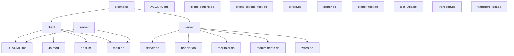
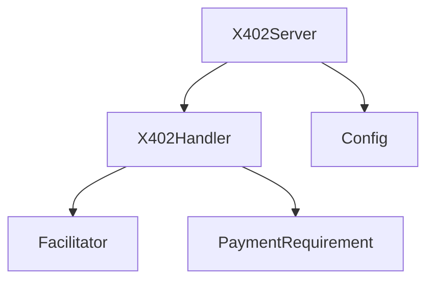
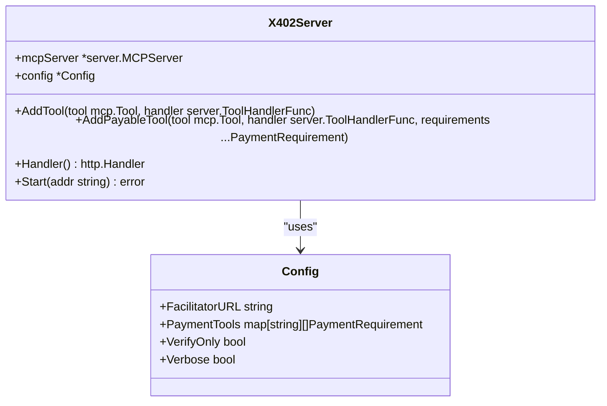
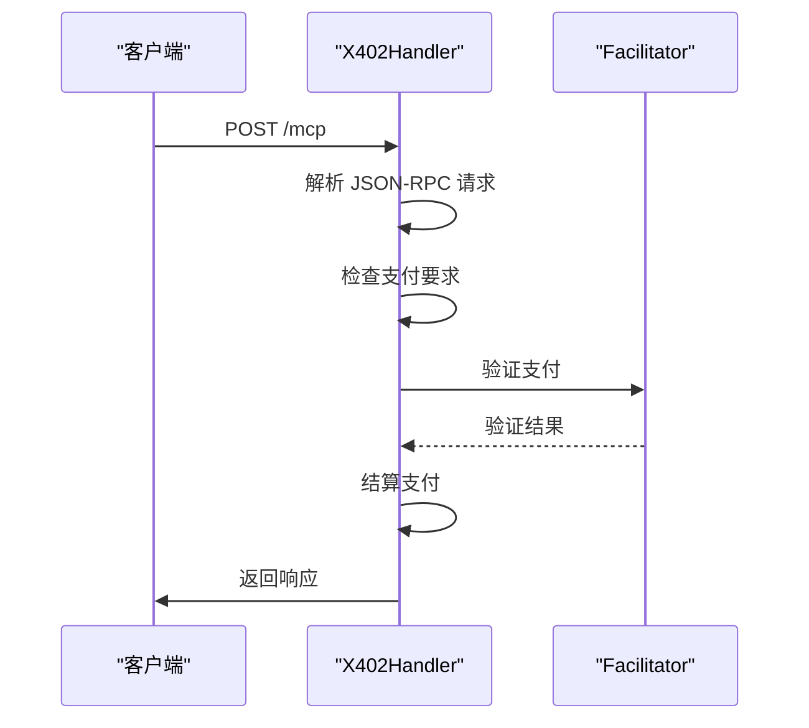
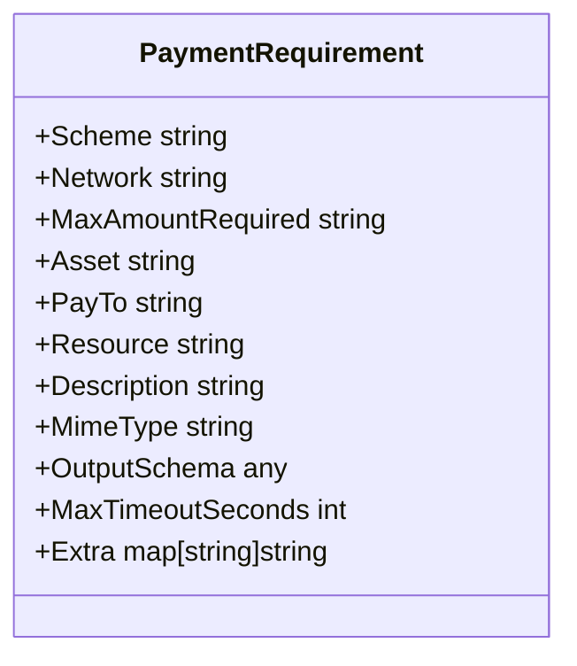
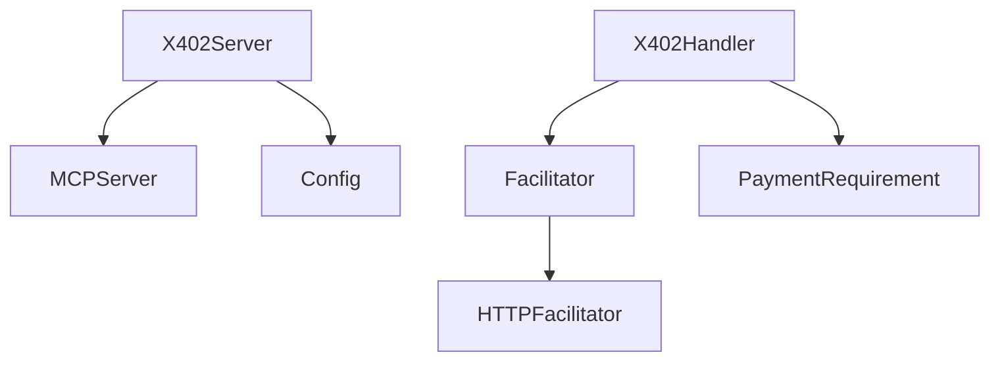

# 服务器端实现

<cite>
**本文档中引用的文件**   
- [server.go](file://server/server.go)
- [handler.go](file://server/handler.go)
- [requirements.go](file://server/requirements.go)
- [facilitator.go](file://server/facilitator.go)
- [types.go](file://server/types.go)
</cite>

## 目录
1. [引言](#引言)
2. [项目结构](#项目结构)
3. [核心组件](#核心组件)
4. [架构概述](#架构概述)
5. [详细组件分析](#详细组件分析)
6. [依赖分析](#依赖分析)
7. [性能考虑](#性能考虑)
8. [故障排除指南](#故障排除指南)
9. [结论](#结论)

## 引言
本文档系统性地文档化了服务器端的架构与实现，重点描述了 `X402Server` 如何作为 MCP 服务器的包装器，管理付费工具的注册与调用。深入分析了 `server/handler.go` 中 `X402Handler` 的验证逻辑，包括如何解析客户端提交的 EIP-712 签名、验证链上余额以及检查 nonce 重放攻击。详细说明了 `server/requirements.go` 中支付要求（PaymentRequirement）的数据结构设计及其在动态定价策略中的应用。阐述了 Facilitator 组件在支付收集与链上结算中的角色。通过代码示例展示了如何配置不同定价模型（固定价格、按使用量计费）以及如何集成自定义的支付验证逻辑。讨论了服务器在高并发场景下的性能优化与安全性保障措施。

## 项目结构
项目结构清晰地分离了服务器端逻辑、客户端示例和核心工具。服务器端逻辑位于 `server` 目录下，包含 `server.go`、`handler.go`、`facilitator.go`、`requirements.go` 和 `types.go` 文件。`server.go` 是服务器的入口点，`handler.go` 处理 HTTP 请求，`facilitator.go` 负责支付验证和结算，`requirements.go` 定义了支付要求，`types.go` 定义了数据结构。`examples` 目录包含客户端和服务器的示例代码，`AGENTS.md` 和 `README.md` 提供了项目文档。

**图源**
- [server.go](file://server/server.go)
- [handler.go](file://server/handler.go)
- [facilitator.go](file://server/facilitator.go)
- [requirements.go](file://server/requirements.go)
- [types.go](file://server/types.go)

**节源**
- [server.go](file://server/server.go)
- [handler.go](file://server/handler.go)
- [facilitator.go](file://server/facilitator.go)
- [requirements.go](file://server/requirements.go)
- [types.go](file://server/types.go)

## 核心组件
核心组件包括 `X402Server`、`X402Handler`、`Facilitator` 和 `PaymentRequirement`。`X402Server` 是 MCP 服务器的包装器，负责管理付费工具的注册与调用。`X402Handler` 处理 HTTP 请求，验证支付并转发请求。`Facilitator` 负责支付验证和结算。`PaymentRequirement` 定义了支付要求的数据结构。

**节源**
- [server.go](file://server/server.go#L11-L14)
- [handler.go](file://server/handler.go#L15-L19)
- [facilitator.go](file://server/facilitator.go#L14-L18)
- [types.go](file://server/types.go#L9-L21)

## 架构概述
系统架构采用分层设计，`X402Server` 作为顶层包装器，`X402Handler` 作为中间层处理 HTTP 请求，`Facilitator` 作为底层服务负责支付验证和结算。`PaymentRequirement` 定义了支付要求的数据结构，`Config` 配置了服务器的参数。

**图源**
- [server.go](file://server/server.go#L11-L14)
- [handler.go](file://server/handler.go#L15-L19)
- [facilitator.go](file://server/facilitator.go#L14-L18)
- [types.go](file://server/types.go#L9-L21)

## 详细组件分析
### X402Server 分析
`X402Server` 是 MCP 服务器的包装器，负责管理付费工具的注册与调用。它通过 `AddPayableTool` 方法注册付费工具，并将支付要求存储在 `config.PaymentTools` 中。

#### 类图

**图源**
- [server.go](file://server/server.go#L11-L14)
- [types.go](file://server/types.go#L91-L104)

### X402Handler 分析
`X402Handler` 处理 HTTP 请求，验证支付并转发请求。它通过 `ServeHTTP` 方法拦截 POST 请求，解析 JSON-RPC 请求，检查支付要求，并调用 `Facilitator` 验证支付。

#### 序列图

**图源**
- [handler.go](file://server/handler.go#L32-L214)
- [facilitator.go](file://server/facilitator.go#L15-L17)

### PaymentRequirement 分析
`PaymentRequirement` 定义了支付要求的数据结构，包括支付方案、网络、最大金额、资产、收款地址、资源、描述、MIME 类型、输出模式、最大超时秒数和额外信息。

#### 类图

**图源**
- [types.go](file://server/types.go#L9-L21)

## 依赖分析
系统依赖于 `mcp-go` 库，`X402Server` 依赖于 `server.MCPServer`，`X402Handler` 依赖于 `Facilitator`，`Facilitator` 依赖于 `HTTPFacilitator`。`PaymentRequirement` 和 `Config` 是数据结构，被多个组件使用。

**图源**
- [server.go](file://server/server.go#L11-L14)
- [handler.go](file://server/handler.go#L15-L19)
- [facilitator.go](file://server/facilitator.go#L28-L32)
- [types.go](file://server/types.go#L9-L21)

**节源**
- [server.go](file://server/server.go#L11-L14)
- [handler.go](file://server/handler.go#L15-L19)
- [facilitator.go](file://server/facilitator.go#L28-L32)
- [types.go](file://server/types.go#L9-L21)

## 性能考虑
服务器在高并发场景下的性能优化与安全性保障措施包括使用 `http.Client` 的超时设置，`Facilitator` 的 `Settle` 方法使用 `context.Context` 进行超时控制，`X402Handler` 的 `ServeHTTP` 方法使用 `io.ReadAll` 读取请求体，避免内存泄漏。

## 故障排除指南
常见问题包括支付验证失败、结算失败、HTTP 402 错误等。可以通过检查 `Facilitator` 的日志、`X402Handler` 的日志、`PaymentRequirement` 的配置来排查问题。

**节源**
- [handler.go](file://server/handler.go#L217-L235)
- [facilitator.go](file://server/facilitator.go#L49-L118)

## 结论
本文档系统性地文档化了服务器端的架构与实现，重点描述了 `X402Server` 如何作为 MCP 服务器的包装器，管理付费工具的注册与调用。深入分析了 `server/handler.go` 中 `X402Handler` 的验证逻辑，包括如何解析客户端提交的 EIP-712 签名、验证链上余额以及检查 nonce 重放攻击。详细说明了 `server/requirements.go` 中支付要求（PaymentRequirement）的数据结构设计及其在动态定价策略中的应用。阐述了 Facilitator 组件在支付收集与链上结算中的角色。通过代码示例展示了如何配置不同定价模型（固定价格、按使用量计费）以及如何集成自定义的支付验证逻辑。讨论了服务器在高并发场景下的性能优化与安全性保障措施。