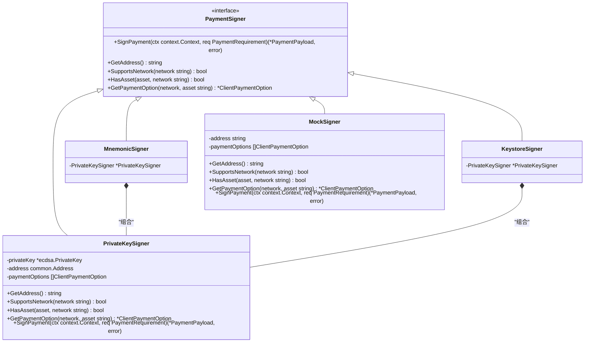
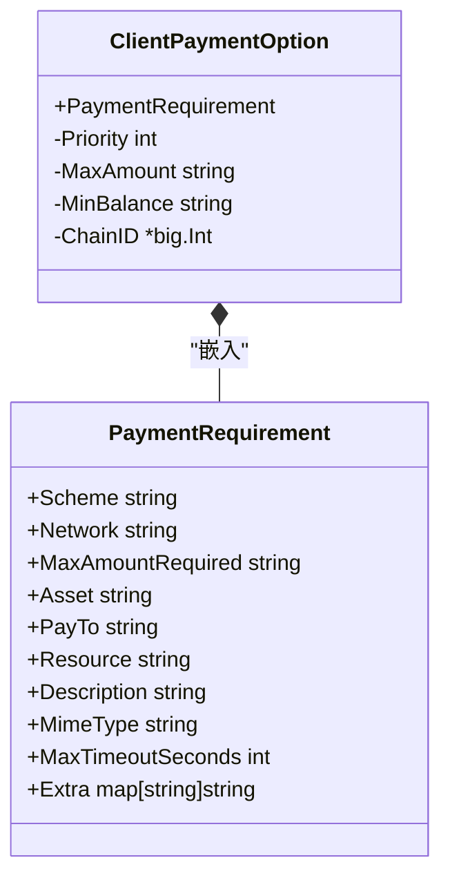
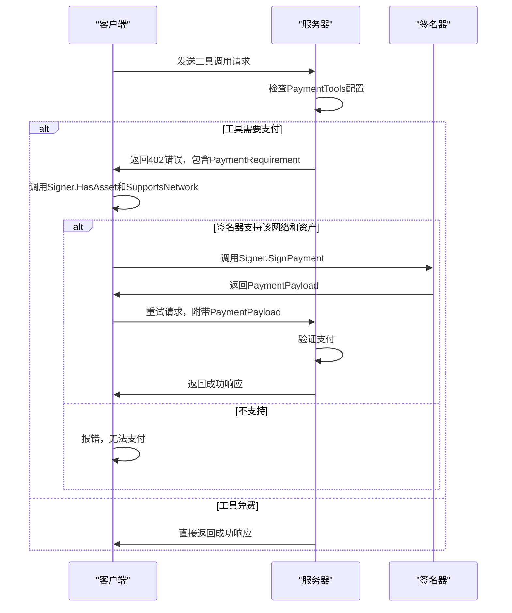

# 多网络支持

<cite>
**本文档引用文件**   
- [signer.go](file://signer.go)
- [client_options.go](file://client_options.go)
- [server/types.go](file://server/types.go)
- [server/requirements.go](file://server/requirements.go)
- [server/handler.go](file://server/handler.go)
- [transport.go](file://transport.go)
- [examples/client/main.go](file://examples/client/main.go)
</cite>

## 目录
1. [引言](#引言)
2. [核心接口与数据结构](#核心接口与数据结构)
3. [签名器实现与多网络支持](#签名器实现与多网络支持)
4. [客户端支付选项与资产管理](#客户端支付选项与资产管理)
5. [服务器端网络配置与声明](#服务器端网络配置与声明)
6. [运行时网络切换与实践指导](#运行时网络切换与实践指导)
7. [网络验证与错误处理最佳实践](#网络验证与错误处理最佳实践)
8. [总结](#总结)

## 引言
mcp-go-x402 库为多区块链网络环境下的支付授权提供了灵活且安全的解决方案。其核心机制围绕 `PaymentSigner` 接口构建，通过 `SupportsNetwork` 和 `HasAsset` 方法，客户端能够动态判断当前签名器是否支持特定的区块链网络（如以太坊主网、Goerli测试网）以及特定的资产类型（如USDC）。本文档将深入解析这一机制，涵盖从签名器的具体实现（如 `PrivateKeySigner`、`MnemonicSigner`）到客户端配置、服务器端声明以及运行时实践的完整流程。

## 核心接口与数据结构

### PaymentSigner 接口
`PaymentSigner` 是整个支付系统的核心接口，定义了签名器必须实现的功能。其中，`SupportsNetwork` 和 `HasAsset` 方法是实现多网络支持的关键。



**Diagram sources**
- [signer.go](file://signer.go#L23-L38)
- [signer.go](file://signer.go#L41-L45)
- [signer.go](file://signer.go#L250-L252)
- [signer.go](file://signer.go#L300-L302)
- [signer.go](file://signer.go#L333-L336)

### ClientPaymentOption 与 PaymentRequirement
`ClientPaymentOption` 和 `PaymentRequirement` 是定义支付能力与需求的核心数据结构。`ClientPaymentOption` 包含了客户端的支付选项，而 `PaymentRequirement` 则是服务器端声明的支付要求。



**Diagram sources**
- [types.go](file://types.go#L93-L101)
- [types.go](file://types.go#L9-L21)
- [server/types.go](file://server/types.go#L4-L16)

**Section sources**
- [types.go](file://types.go#L93-L101)
- [types.go](file://types.go#L9-L21)
- [server/types.go](file://server/types.go#L4-L16)

## 签名器实现与多网络支持

### SupportsNetwork 与 HasAsset 方法实现
`PrivateKeySigner`、`MnemonicSigner` 和 `KeystoreSigner` 都通过组合 `PrivateKeySigner` 来实现 `PaymentSigner` 接口。它们的 `SupportsNetwork` 和 `HasAsset` 方法逻辑一致，都是遍历内部的 `paymentOptions` 切片进行匹配。

```go
func (s *PrivateKeySigner) SupportsNetwork(network string) bool {
	for _, opt := range s.paymentOptions {
		if opt.Network == network {
			return true
		}
	}
	return false
}

func (s *PrivateKeySigner) HasAsset(asset, network string) bool {
	for _, opt := range s.paymentOptions {
		if opt.Network == network && opt.Asset == asset && opt.Scheme == "exact" {
			return true
		}
	}
	return false
}
```

当客户端需要判断是否支持某个网络时，会调用 `SupportsNetwork` 方法。该方法会检查所有配置的 `ClientPaymentOption`，只要有一个选项的 `Network` 字段与传入的网络名称匹配，就返回 `true`。`HasAsset` 方法则更进一步，需要同时匹配网络和资产地址，并且要求支付方案（`Scheme`）为 "exact"。

**Section sources**
- [signer.go](file://signer.go#L84-L91)
- [signer.go](file://signer.go#L93-L100)

### 签名流程中的网络验证
在 `SignPayment` 方法中，会调用 `GetPaymentOption` 来查找与支付需求相匹配的选项。如果找不到匹配项，会返回错误，这确保了签名操作只在支持的网络上进行。

```go
func (s *PrivateKeySigner) SignPayment(ctx context.Context, req PaymentRequirement) (*PaymentPayload, error) {
	// 查找匹配的支付选项以获取链ID
	paymentOption := s.GetPaymentOption(req.Network, req.Asset)
	if paymentOption == nil {
		return nil, fmt.Errorf("no payment option configured for network %s and asset %s", req.Network, req.Asset)
	}
	// ... 使用 paymentOption.ChainID 进行签名
}
```

**Section sources**
- [signer.go](file://signer.go#L112-L221)

## 客户端支付选项与资产管理

### ClientPaymentOption 结构详解
`ClientPaymentOption` 结构体不仅包含了 `PaymentRequirement` 的所有字段，还增加了客户端专用的字段，用于精细化管理支付行为。

| 字段 | 类型 | 描述 | 来源 |
| :--- | :--- | :--- | :--- |
| `PaymentRequirement` | `PaymentRequirement` | 嵌入式字段，定义了支付的基本要求，如网络、资产、方案等。 | [types.go](file://types.go#L93-L101) |
| `Priority` | `int` | 优先级，数值越小优先级越高。在有多个匹配选项时，系统会优先选择优先级高的选项。 | [types.go](file://types.go#L97-L97) |
| `MaxAmount` | `string` | 客户端愿意为此选项支付的最大金额。如果服务器要求的金额超过此值，该选项将被忽略。 | [types.go](file://types.go#L98-L98) |
| `MinBalance` | `string` | 最低余额。如果签名器的余额低于此值，则不会使用此选项进行支付。 | [types.go](file://types.go#L99-L99) |
| `ChainID` | `*big.Int` | 用于签名的链ID。这是一个内部字段，不参与JSON序列化，但在生成EIP-712签名时至关重要。 | [types.go](file://types.go#L100-L100) |

### 使用 Fluent API 进行配置
库提供了 `WithPriority`、`WithMaxAmount` 和 `WithMinBalance` 等方法，允许使用流式API（Fluent API）来链式配置 `ClientPaymentOption`。

```go
option := AcceptUSDCBase().
    WithPriority(2).
    WithMaxAmount("100000").
    WithMinBalance("50000")
```

**Section sources**
- [types.go](file://types.go#L93-L101)
- [client_options.go](file://client_options.go#L43-L58)

## 服务器端网络配置与声明

### PaymentRequirement 中 network 字段的作用
在 `PaymentRequirement` 结构体中，`Network` 字段用于明确指定服务器接受支付的区块链网络。例如，服务器可以声明只接受在 "base" 网络上的支付。

```go
// server/requirements.go
func RequireUSDCBase(payTo, amount, description string) PaymentRequirement {
	return PaymentRequirement{
		Scheme:            "exact",
		Network:           "base",
		Asset:             "0x833589fCD6eDb6E08f4c7C32D4f71b54bdA02913", // Base上的USDC
		PayTo:             payTo,
		MaxAmountRequired: amount,
		Description:       description,
		MimeType:          "application/json",
		MaxTimeoutSeconds: 60,
		Extra: map[string]string{
			"name":    "USD Coin",
			"version": "2",
		},
	}
}
```

### 通过配置声明支持的网络
服务器通过 `Config` 结构体中的 `PaymentTools` 字段来声明其支持的网络。`PaymentTools` 是一个映射，将工具名称映射到一组 `PaymentRequirement`。

```go
// server/types.go
type Config struct {
	FacilitatorURL string
	PaymentTools   map[string][]PaymentRequirement // 为每个工具配置支付要求
	VerifyOnly     bool
	Verbose        bool
}
```

当服务器收到一个工具调用请求时，它会检查 `PaymentTools` 映射中是否存在该工具的支付要求。如果存在，则返回一个包含这些要求的402 JSON-RPC错误，客户端据此进行支付。



**Diagram sources**
- [server/types.go](file://server/types.go#L91-L104)
- [server/handler.go](file://server/handler.go#L32-L214)

**Section sources**
- [server/types.go](file://server/types.go#L91-L104)
- [server/requirements.go](file://server/requirements.go#L5-L38)
- [server/handler.go](file://server/handler.go#L32-L214)

## 运行时网络切换与实践指导

### 配置示例
以下是一个客户端配置示例，展示了如何为不同网络配置支付选项。

```go
// examples/client/main.go
if *network == "mainnet" {
    signer, err = x402.NewPrivateKeySigner(
        privateKey,
        x402.AcceptUSDCBase().
            WithPriority(1).
            WithMaxAmount("500000").
            WithMinBalance("1000000"),
    )
} else {
    signer, err = x402.NewPrivateKeySigner(
        privateKey,
        x402.AcceptUSDCBaseSepolia(),
    )
}
```

### 运行时切换网络
客户端可以通过命令行参数或环境变量来决定使用哪个网络。在启动时，根据 `network` 参数的值，创建包含不同 `ClientPaymentOption` 的签名器。例如，当 `network` 为 "mainnet" 时，配置 `AcceptUSDCBase` 选项；当为 "testnet" 时，配置 `AcceptUSDCBaseSepolia` 选项。

### 选择支付方法的逻辑
当服务器返回多个支付选项时，客户端的 `PaymentHandler` 会根据以下逻辑选择最合适的选项：
1.  **优先级（Priority）**: 优先选择优先级数值更小的选项。
2.  **金额（Amount）**: 在优先级相同的情况下，选择金额更小的选项。
3.  **客户端限制**: 选项的金额必须小于等于客户端配置的 `MaxAmount`。

```go
// handler.go
func (h *PaymentHandler) selectPaymentMethod(accepts []PaymentRequirement) (*PaymentRequirement, error) {
    // ... 过滤出客户端支持的选项
    // 按优先级排序，然后按金额排序
    sort.Slice(candidates, func(i, j int) bool {
        if candidates[i].priority != candidates[j].priority {
            return candidates[i].priority < candidates[j].priority
        }
        return candidates[i].amount.Cmp(candidates[j].amount) < 0
    })
    return &candidates[0].req, nil
}
```

**Section sources**
- [examples/client/main.go](file://examples/client/main.go#L13-L176)
- [handler.go](file://handler.go#L85-L152)

## 网络验证与错误处理最佳实践

### 客户端最佳实践
1.  **主动查询**: 在发起支付前，使用 `SupportsNetwork` 和 `HasAsset` 方法主动检查签名器是否支持服务器要求的网络和资产。
2.  **优雅降级**: 如果首选网络不支持，应尝试备选网络或向用户提示错误。
3.  **处理402错误**: 正确解析服务器返回的402错误中的 `PaymentRequirements`，并据此创建支付。

### 服务器端最佳实践
1.  **明确声明**: 在 `PaymentRequirement` 中清晰地指定 `Network` 和 `Asset`，避免歧义。
2.  **提供多个选项**: 可以为一个工具提供多个支付选项（例如，主网和测试网），增加客户端的灵活性。
3.  **验证支付**: 在 `X402Handler` 中，通过 `findMatchingRequirement` 方法验证客户端提供的 `PaymentPayload` 是否与声明的 `PaymentRequirement` 匹配。

```go
// server/handler.go
func (h *X402Handler) findMatchingRequirement(payment *PaymentPayload, requirements []PaymentRequirement) (*PaymentRequirement, error) {
    for i := range requirements {
        req := &requirements[i]
        if req.Network != "" && req.Network != payment.Network {
            continue
        }
        if req.Scheme != "" && req.Scheme != payment.Scheme {
            continue
        }
        return req, nil
    }
    return nil, fmt.Errorf("no matching payment requirement found for network=%s, scheme=%s", payment.Network, payment.Scheme)
}
```

**Section sources**
- [server/handler.go](file://server/handler.go#L320-L337)

## 总结
mcp-go-x402 通过 `PaymentSigner` 接口的 `SupportsNetwork` 和 `HasAsset` 方法，实现了对多区块链网络的动态支持。客户端通过配置 `ClientPaymentOption` 来声明其支付能力，而服务器端则通过 `PaymentRequirement` 来声明其支付需求。整个流程通过402错误机制进行协调，确保了支付的安全性和灵活性。通过合理配置和遵循最佳实践，开发者可以轻松地在不同网络（如以太坊主网、Goerli测试网、Base主网等）之间进行切换和管理。