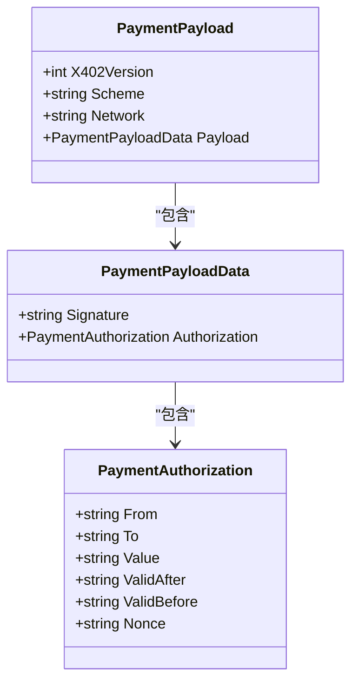
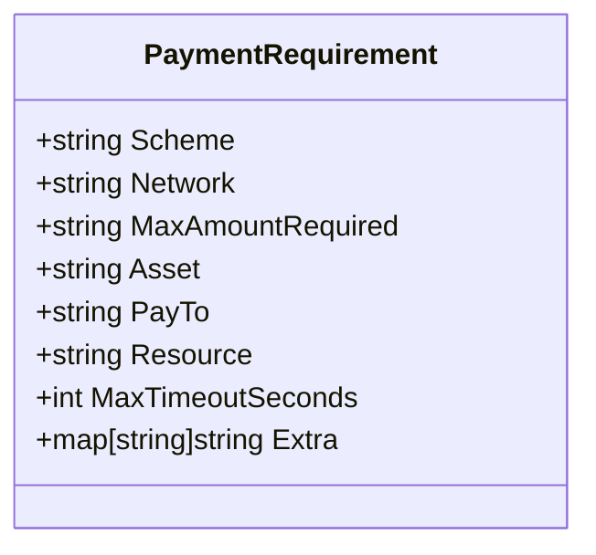
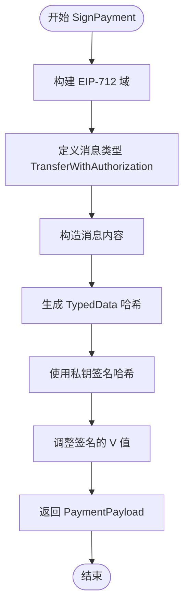
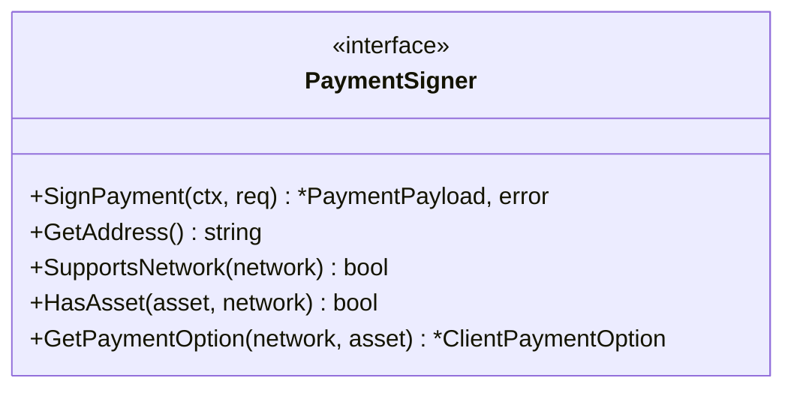
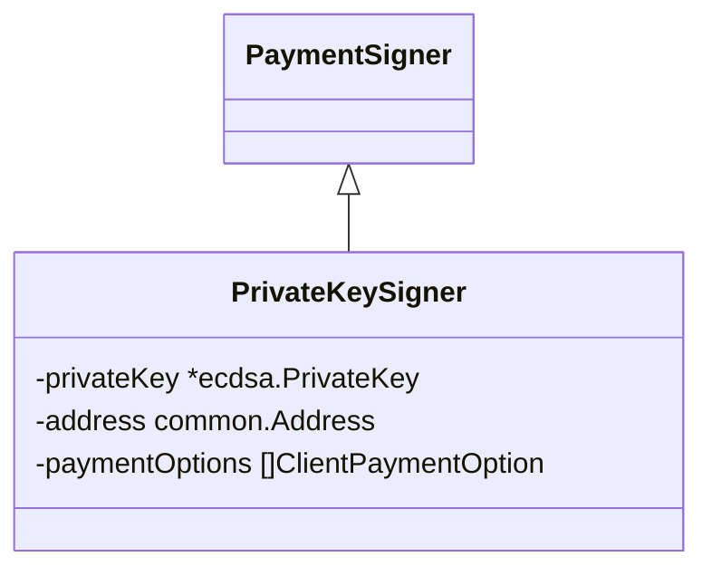
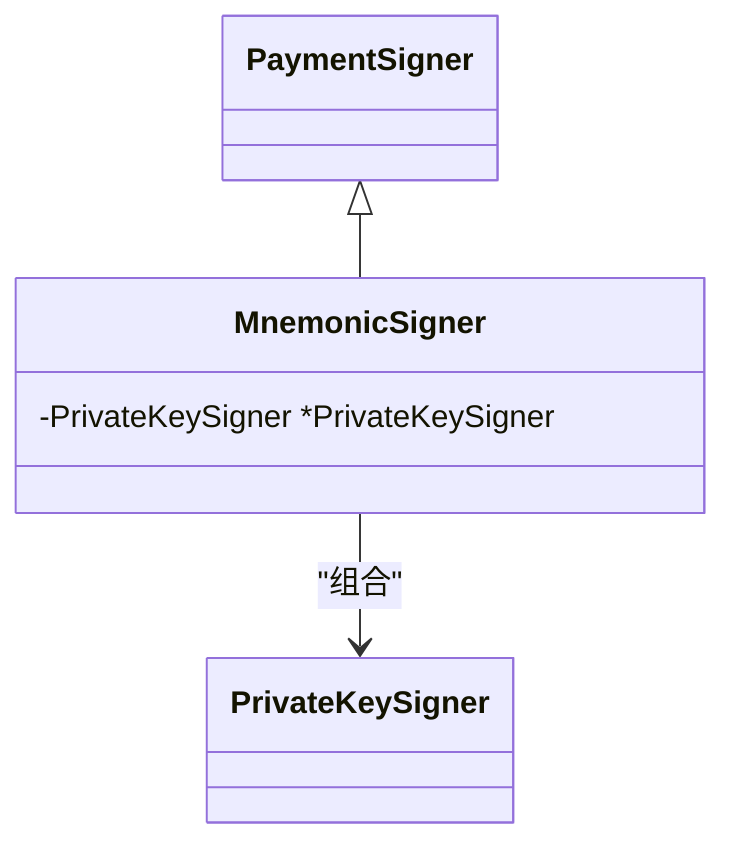
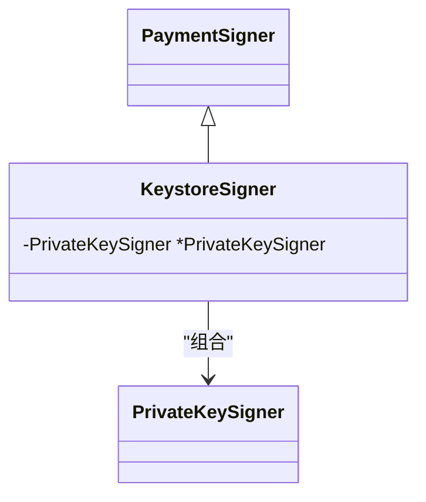
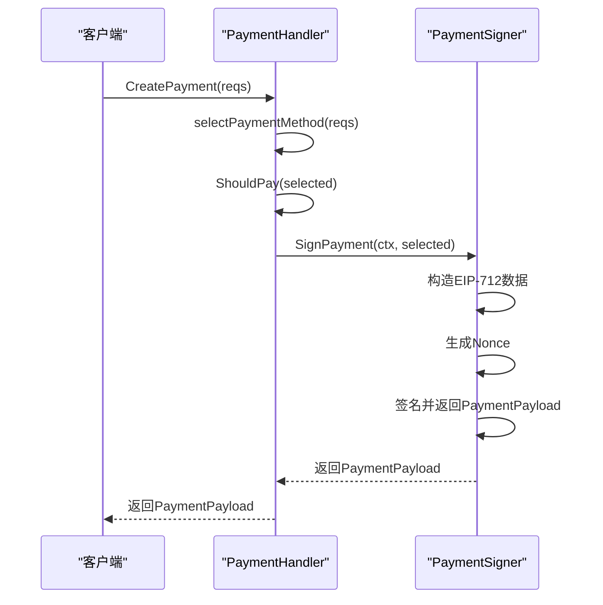
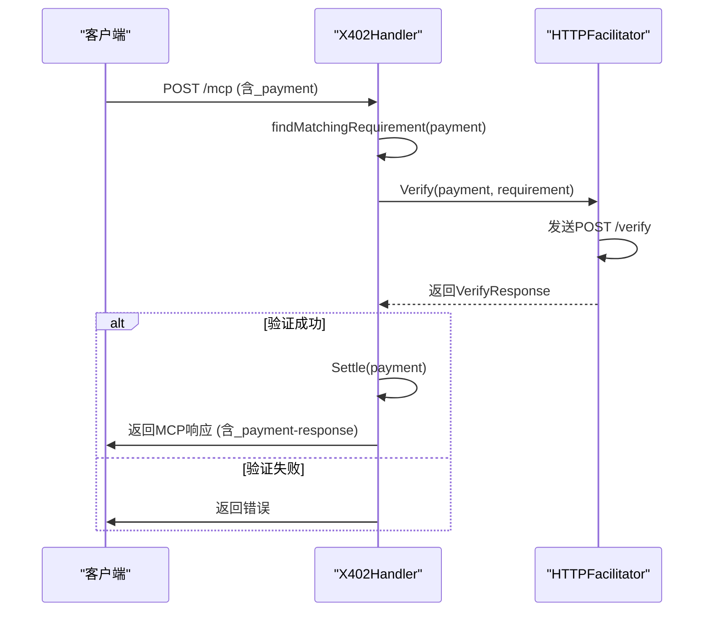

# 安全签名机制

<cite>
**Referenced Files in This Document**   
- [signer.go](file://signer.go)
- [types.go](file://types.go)
- [handler.go](file://handler.go)
- [server/handler.go](file://server/handler.go)
- [server/types.go](file://server/types.go)
- [server/facilitator.go](file://server/facilitator.go)
</cite>

## 目录
1. [引言](#引言)
2. [核心数据结构](#核心数据结构)
3. [EIP-712结构化签名机制](#eip-712结构化签名机制)
4. [PaymentSigner接口与实现](#paymentsigner接口与实现)
5. [防重放攻击与Nonce机制](#防重放攻击与nonce机制)
6. [签名上下文绑定](#签名上下文绑定)
7. [支付流程与验证](#支付流程与验证)
8. [密钥安全管理](#密钥安全管理)
9. [结论](#结论)

## 引言
本文档系统性地阐述了mcp-go-x402项目中的安全签名机制。该机制基于以太坊的EIP-712标准，为支付授权提供完整的抗篡改性和数据完整性保障。文档将深入解析`PaymentPayload`的结构化数据签名过程，剖析`PaymentSigner`接口及其多种实现的安全特性，并详细说明`nonce`机制如何有效防止重放攻击。同时，结合`handler.go`中的`CreatePayment`流程，展示签名数据的构造与验证全过程，并提供密钥安全管理的最佳实践指南。

## 核心数据结构
本节定义了安全签名机制中涉及的核心数据结构。

### PaymentPayload
`PaymentPayload`是支付授权的核心数据结构，它封装了经过EIP-712签名的支付信息。



**Diagram sources**
- [types.go](file://types.go#L31-L36)
- [types.go](file://types.go#L45-L52)

**Section sources**
- [types.go](file://types.go#L31-L58)

### PaymentRequirement
`PaymentRequirement`定义了服务端对支付的要求，是客户端生成`PaymentPayload`的依据。



**Diagram sources**
- [types.go](file://types.go#L1-L15)

**Section sources**
- [types.go](file://types.go#L1-L15)

## EIP-712结构化签名机制
mcp-go-x402采用EIP-712标准进行结构化数据签名，确保支付授权的完整性和可读性。

### EIP-712签名流程
当`PrivateKeySigner`执行`SignPayment`时，会按照以下流程生成签名：

1.  **构建EIP-712域（EIP712Domain）**：根据`PaymentRequirement`中的`Extra`字段（如`name`和`version`）、`chainID`和`asset`（作为`verifyingContract`）来定义签名的上下文。
2.  **定义消息类型（Types）**：声明`TransferWithAuthorization`消息的结构，包括`from`, `to`, `value`, `validAfter`, `validBefore`, 和 `nonce`。
3.  **构造消息（Message）**：将具体的支付信息（如付款人地址、收款人地址、金额、有效期和nonce）填入消息中。
4.  **生成哈希并签名**：使用`apitypes.TypedDataAndHash`函数计算结构化数据的哈希值，然后使用私钥对该哈希值进行签名。



**Diagram sources**
- [signer.go](file://signer.go#L112-L221)

**Section sources**
- [signer.go](file://signer.go#L112-L221)

### 签名数据完整性
EIP-712的优势在于，它不仅对数据进行哈希，还对数据的结构和类型进行哈希。这意味着任何对消息字段的篡改（例如，修改金额或收款地址）都会导致哈希值改变，从而使签名验证失败。这从根本上保证了支付授权的抗篡改性。

## PaymentSigner接口与实现
`PaymentSigner`接口是所有签名器的抽象，定义了生成支付授权所需的核心能力。

### 接口定义


**Diagram sources**
- [signer.go](file://signer.go#L23-L38)

**Section sources**
- [signer.go](file://signer.go#L23-L38)

### 实现类分析
该项目提供了三种`PaymentSigner`的实现，每种都针对不同的私钥存储场景。

#### PrivateKeySigner
`PrivateKeySigner`是最直接的实现，它直接持有ECDSA私钥。



**Diagram sources**
- [signer.go](file://signer.go#L41-L45)

**Section sources**
- [signer.go](file://signer.go#L41-L45)

#### MnemonicSigner
`MnemonicSigner`通过BIP-39助记词和BIP-32 HD派生路径来生成私钥，提高了密钥的可恢复性。



**Diagram sources**
- [signer.go](file://signer.go#L250-L252)

**Section sources**
- [signer.go](file://signer.go#L250-L252)

#### KeystoreSigner
`KeystoreSigner`用于解密以太坊标准的加密密钥库文件（keystore），适合与MetaMask等钱包集成。



**Diagram sources**
- [signer.go](file://signer.go#L300-L302)

**Section sources**
- [signer.go](file://signer.go#L300-L302)

## 防重放攻击与Nonce机制
为了防止攻击者截获有效的支付授权并重复使用（重放攻击），系统引入了`nonce`机制。

### Nonce生成策略
在`PrivateKeySigner.SignPayment`方法中，`nonce`是通过以下方式生成的：
```go
nonceBytes := crypto.Keccak256([]byte(fmt.Sprintf("%d-%s-%s",
    time.Now().UnixNano(), req.Resource, s.address.Hex())))
nonce := "0x" + hex.EncodeToString(nonceBytes)
```
该策略结合了**当前时间戳（纳秒级）**、**资源标识符（Resource）** 和 **付款人地址（Address）** 进行哈希运算。这种组合确保了即使在同一毫秒内，为不同资源或不同地址生成的`nonce`也是唯一的，从而有效防止了重放攻击。

**Section sources**
- [signer.go](file://signer.go#L112-L221)

## 签名上下文绑定
签名的有效性不仅依赖于`nonce`，还通过时间窗口和资源绑定来限制。

### 有效期（ValidAfter/ValidBefore）
`PaymentAuthorization`中的`ValidAfter`和`ValidBefore`字段定义了签名的有效时间窗口。服务器在验证时会检查当前时间是否在此区间内。这确保了签名只能在特定时间段内被使用，进一步增强了安全性。

### 资源绑定（Resource）
`nonce`的生成明确包含了`req.Resource`，这意味着一个为特定工具（如`mcp://tools/translate`）生成的签名，无法被用于支付另一个工具（如`mcp://tools/summarize`）。这实现了支付授权与具体资源的强绑定。

**Section sources**
- [signer.go](file://signer.go#L112-L221)

## 支付流程与验证
本节结合`handler.go`中的代码，展示从创建到验证的完整支付流程。

### 创建支付流程 (CreatePayment)
客户端通过`PaymentHandler.CreatePayment`方法创建支付。



**Diagram sources**
- [handler.go](file://handler.go#L58-L82)
- [signer.go](file://signer.go#L112-L221)

**Section sources**
- [handler.go](file://handler.go#L58-L82)

### 服务端验证流程
服务端（`server/handler.go`）收到带有`PaymentPayload`的请求后，会通过`facilitator`进行验证。



**Diagram sources**
- [server/handler.go](file://server/handler.go#L220-L337)
- [server/facilitator.go](file://server/facilitator.go#L49-L118)

**Section sources**
- [server/handler.go](file://server/handler.go#L220-L337)

## 密钥安全管理
密钥是整个安全体系的核心，其管理至关重要。

### 最佳实践
1.  **避免使用 PrivateKeySigner**：直接在代码或配置中硬编码私钥是极其危险的。`PrivateKeySigner`应仅用于测试环境。
2.  **优先使用 KeystoreSigner**：对于生产环境，应使用加密的keystore文件，并通过安全的密码进行保护。密码不应硬编码，而应通过环境变量等方式注入。
3.  **谨慎使用 MnemonicSigner**：助记词同样需要严格保护。如果使用`MnemonicSigner`，必须确保助记词的存储和传输过程是安全的。
4.  **最小权限原则**：为签名账户配置最小必要的资产和权限，避免使用主钱包地址。

## 结论
mcp-go-x402的安全签名机制通过EIP-712结构化数据签名、`nonce`防重放、时间窗口和资源绑定等多重措施，构建了一个健壮的支付授权体系。`PaymentSigner`接口的多种实现为不同安全需求的场景提供了灵活性。开发者在使用时，应严格遵守密钥安全管理的最佳实践，确保整个支付流程的安全可靠。